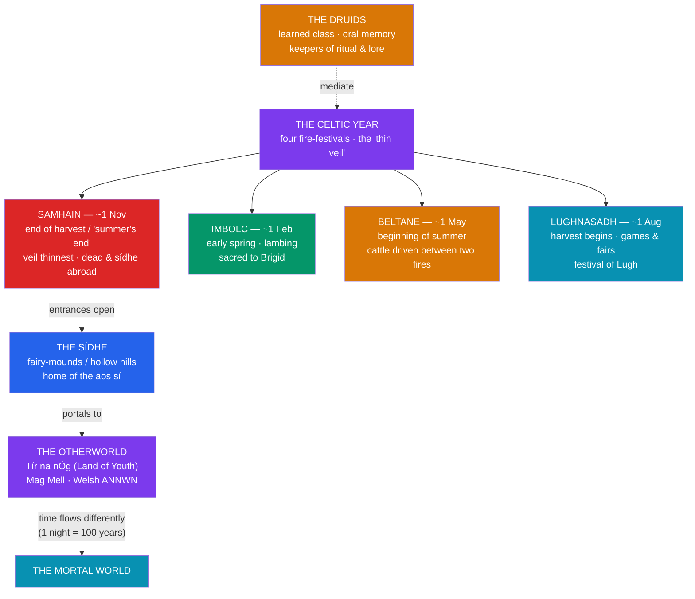

# 🌙 The Celtic Otherworld

> [!abstract] TL;DR
> The **Otherworld** is the supernatural realm that runs parallel to the mortal world throughout Celtic myth — a land of eternal youth, feasting, and beauty, sometimes across the western sea, sometimes just beneath a fairy-mound. The Irish name it **Tír na nÓg** ("the Land of Youth"), among other names (Mag Mell, "the plain of delight"; Tír na mBeo, "the land of the living"); the Welsh call it **Annwn**. Its earthly entrances are the **sídhe** — the ancient burial mounds and hollow hills into which the [[The_Tuatha_De_Danann|Tuatha Dé Danann]] retreated after their defeat. Presiding over Celtic religion was the **druids**, the learned priestly class who kept all knowledge by **oral memory** and whom **Julius Caesar** described (from the outside) in his *Gallic War*. The turning wheel of the year was marked by four fire-festivals — **Samhain**, **Imbolc**, **Beltane**, and **Lughnasadh** — of which **Samhain** (roughly 1 November) was the most charged: the night when the **veil between the worlds grew thin** and the dead and the *aos sí* moved freely among the living. As with the whole tradition, nearly all of this reaches us through **classical ethnographers** and **medieval Christian scribes**, not from the Celts' own pens.

## Intuition — analogy first

The Celtic Otherworld is less like a distant heaven and more like a room **on the other side of a curtain** in the same house — always adjacent, occasionally open.

Where the Greek dead descend to a grim, sunless **Underworld** and the Egyptian dead undertake a perilous judged journey to the **Duat**, the Celtic Otherworld is startlingly close and startlingly pleasant. It is not "down" and mostly not about **judgment**; it is *beside* you — over the next wave, under the next hill, through the mist on the right festival night. A mortal can wander into it by accident (following a white deer, a beautiful woman, a strayed animal) and wander back out to find that **time ran differently** there: a night of feasting was a hundred years, and stepping back onto mortal soil turns the traveler instantly to dust. This is the single most distinctive Celtic idea about the beyond: not a moral accounting after death, but a **permeable, parallel land of youth** whose danger is not damnation but **enchantment** — the risk of never being able to come home. Contrast [[The_Greek_Underworld]] and [[The_Egyptian_Afterlife]].

---

## The Wheel of the Year and the Thin Veil

## Key Concepts

### The Otherworld — Tír na nÓg and Annwn

The Celtic **Otherworld** is a realm of perpetual youth, health, plenty, and pleasure, existing alongside the human world rather than after it. Irish tradition gives it many names and locations: **Tír na nÓg** ("the Land of Youth"), **Mag Mell** ("the Plain of Delight"), **Tír na mBeo** ("the Land of the Living"), **Tír Tairngire** ("the Land of Promise"), and the island **Emain Ablach** ("the isle of apple-trees," a likely source of Arthurian **Avalon**). It is reached across the **western sea** (in the *immram* or "voyage" tales), beneath lakes and wells, or through the **sídhe**. In Wales it is **Annwn** (or *Annwfn*), the realm ruled by **Arawn** and, in the poem *Preiddeu Annwn*, raided by Arthur for its magical cauldron. Its recurring dangers are not torment but **enchantment and distorted time**: the classic case is **Oisín**, who spends what feels like three years in Tír na nÓg with **Niamh**, returns to find three centuries have passed, touches the ground, and instantly ages to a withered old man (see [[The_Irish_Mythological_Cycles]]).

### The Sídhe — fairy-mounds and the aos sí

The **sídhe** (pronounced roughly "shee") are the **fairy-mounds** — in reality the great Neolithic and Bronze-Age **passage tombs and tumuli** that dot the Irish landscape (Newgrange/*Brú na Bóinne*, Knowth, and countless lesser hills). In myth these are the residences into which the [[The_Tuatha_De_Danann|Tuatha Dé Danann]] withdrew after ceding the surface to the mortal Milesians. The dwellers came to be called the **aos sí** ("people of the mounds") or *daoine sídhe* — the "good folk," the **fairy people** of later Irish and Scottish folklore. (The wailing spirit the **bean sídhe** — "**banshee**," "woman of the mound" — is a survival of this belief.) The word *sídhe* thus does double duty: the **mound** itself and the **beings** who live in it, materially anchoring the mythology in real, visible monuments on the land.

### The Druids — the learned class

The **druids** were the learned, priestly, and juridical class of pre-Christian Celtic society — at once priests, judges, teachers, philosophers, and keepers of ritual and lore. Their defining feature was a reliance on **oral memory**: they committed vast bodies of knowledge to memory over as much as twenty years of training and, on principle, **refused to commit their sacred learning to writing**. That choice is precisely why we have almost no druidic teaching in their own words. Our fullest source is **Julius Caesar's** *Commentarii de Bello Gallico* (*The Gallic War*, book VI), an **outsider's ethnography** written by a conqueror: Caesar reports that the druids presided over sacrifice, adjudicated disputes, taught the immortality of the soul (a doctrine he likens to Pythagorean metempsychosis), and — the most sensational and most disputed claim — conducted human sacrifice, including the burning of victims in large wicker figures. Other classical writers (Pliny, Strabo, Tacitus, Diodorus) add further details of varying reliability. The Irish counterparts of the druids, the *druí* and the poet-class *filid*, appear throughout the medieval literature as magicians and loremasters (see [[The_Irish_Mythological_Cycles]]).

### The four fire-festivals

The Celtic (specifically the reconstructed Irish/Gaelic) year turned on four seasonal festivals, traditionally marking the pastoral and agricultural cycle:

| Festival | Approx. date | Meaning / associations |
|---|---|---|
| **Samhain** | ~1 November | "Summer's end"; end of harvest, start of winter; the dead and the *sídhe* abroad; the veil at its thinnest |
| **Imbolc** | ~1 February | Early spring, lambing and lactation; sacred to **Brigid** (later St. Brigid's Day) |
| **Beltane** | ~1 May | Beginning of summer; cattle driven between two bonfires for purification and protection |
| **Lughnasadh** | ~1 August | Start of the harvest; games, fairs, and assemblies; the festival of **Lugh** |

These four "**cross-quarter days**" fall between the solstices and equinoxes. The best medieval attestation is Irish; how uniformly they were observed across all Celtic-speaking peoples is uncertain and partly a modern reconstruction.

### Samhain and the thinning of the veil

**Samhain** was the pivot of the year and the most numinous of the four festivals. As the boundary between the light and dark halves of the year, it was imagined as a moment when the **boundary between this world and the Otherworld dissolved** — the "**thin veil**" — so that the dead, the *aos sí*, and other Otherworldly beings could cross into the human world (and mortals, dangerously, into theirs). Much of Irish myth is set at Samhain: the *sídhe* stand open, hostings and battles occur, and prophecy and fate are decided. Samhain is the direct ancestor of **Halloween**: its Christianization as the eve of **All Saints' / All Souls'** preserved the older festival's association with the returning dead, and folk customs (disguise, lights, offerings to keep wandering spirits at bay) descend from it. This is the Celtic tradition's clearest statement that the Otherworld is not far away but **seasonally adjacent** — a door in the year rather than a place at the end of life.

## Examples Across Cultures

- **Celtic (Irish)** — **Oisín in Tír na nÓg**: the warrior-poet's three centuries that felt like three years, and his fatal aging on touching mortal soil — the definitive "distorted time" Otherworld tale.
- **Celtic (Irish)** — the ***immrama*** (voyage tales), especially the *Voyage of Bran* and the *Voyage of Máel Dúin*, in which sailors reach a chain of Otherworldly islands across the western sea; these feed the Christian *Navigatio Sancti Brendani* (Voyage of St. Brendan).
- **Celtic (Welsh)** — **Annwn**: Pwyll's year ruling it in the First Branch of the *Mabinogion*, and Arthur's raid on it for the magic cauldron in *Preiddeu Annwn* (see [[The_Welsh_Mabinogion]]).
- **Comparative — Greek**: the [[The_Greek_Underworld|Greek Underworld]] is subterranean, sunless, and (in its later moral form) a place of judgment and shades — a **destination of the dead**, quite unlike the pleasurable, parallel, non-judgmental Celtic Otherworld.
- **Comparative — Egyptian**: the [[The_Egyptian_Afterlife|Egyptian afterlife]] centres on a perilous **journey and moral judgment** (the weighing of the heart against Ma'at) — again a fate *after death*, contrasting with the Celtic Otherworld's status as a living, enterable **place** one can visit and (sometimes) leave.

## Common Pitfalls / Misconceptions

- **Equating the Otherworld with "heaven" or a land of the dead.** It is primarily a **parallel realm of the living** (gods, fairies, the *aos sí*) that mortals can enter *while alive*; it is not fundamentally a moralized afterlife and rarely involves judgment.
- **Taking Caesar's druids at face value.** Caesar was a **hostile outside observer** with political motives; his account (especially the wicker-man human sacrifice) is influential but must be read critically, not as neutral reportage.
- **Believing druids "wrote sacred books."** They deliberately transmitted their learning **orally**; the near-total absence of native druidic texts is a direct consequence of that principle, not an accident of survival.
- **Assuming the four festivals were a uniform pan-Celtic calendar.** The clearest evidence is **medieval Irish**; the neat four-festival "Wheel of the Year" is partly a modern (and modern-Pagan) systematization.
- **Reading Samhain/Halloween as unbroken pagan practice.** Modern Halloween is a layered product of the Celtic festival, its Christianization as All Hallows', and much later folk and commercial development — not a pristine survival.

## Related Concepts

- [[The_Tuatha_De_Danann]] — the gods who **became** the dwellers of the *sídhe*; the *aos sí* are the diminished Tuatha Dé
- [[The_Irish_Mythological_Cycles]] — the voyage-tales (*immrama*) and Otherworld visits (Oisín, Bran) that thread through the Irish corpus
- [[The_Welsh_Mabinogion]] — **Annwn**, the Welsh Otherworld ruled by Arawn and raided by Arthur
- [[_MOC_Celtic_Myth|↑ Section MOC]] — the map of the Celtic section
- Cross-vault: [[The_Greek_Underworld]] — a subterranean, judged realm of the dead; the contrasting "afterworld" model
- Cross-vault: [[The_Egyptian_Afterlife]] — the journey-and-judgment afterlife; another comparative afterworld against which the Celtic Otherworld stands out

## Review Questions

1. In what specific ways does the Celtic Otherworld differ from the **Greek Underworld** and the **Egyptian afterlife**? Use the ideas of *location*, *judgment*, and *who dwells there* in your answer.
2. Explain the double meaning of the word **sídhe** and its connection to the [[The_Tuatha_De_Danann|Tuatha Dé Danann]] and to real monuments on the Irish landscape.
3. Why do we know so little about the druids in their own words, and what are the strengths and limitations of **Caesar's** account as a source? Separately, explain what made **Samhain** the most significant of the four festivals.

## Sources

- Caesar, J. *The Gallic War* (*Commentarii de Bello Gallico*), Book VI (trans. e.g. Hammond, 1996, Oxford World's Classics)
- Green, M. J. (1997). *The World of the Druids*. Thames & Hudson
- Hutton, R. (1996). *The Stations of the Sun: A History of the Ritual Year in Britain*. Oxford University Press
- MacKillop, J. (1998). *Dictionary of Celtic Mythology*. Oxford University Press

#mythology #celtic-mythology #otherworld #druids #samhain
