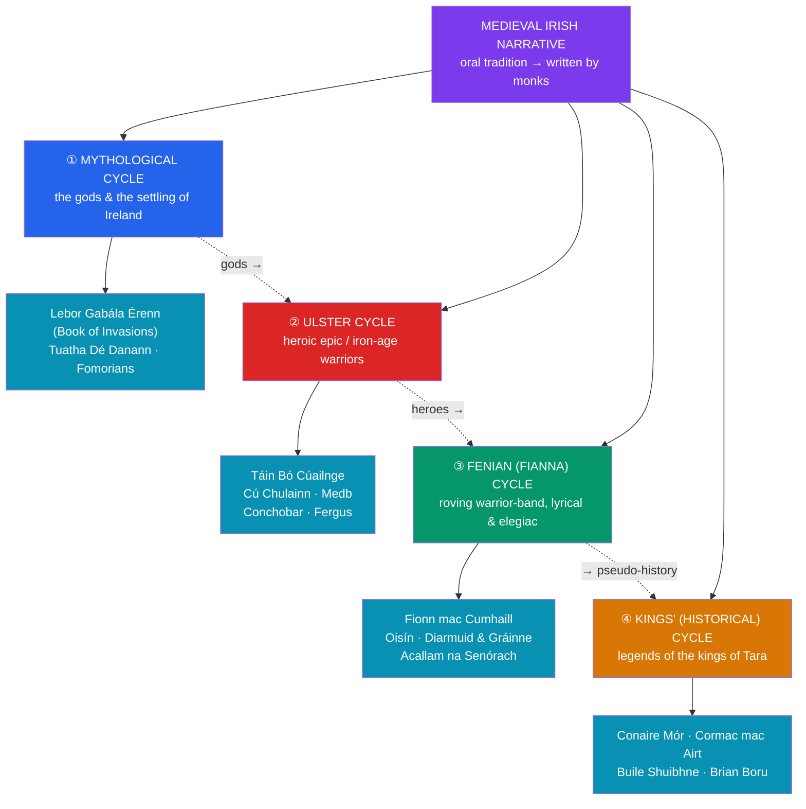

# 📜 The Irish Mythological Cycles

> [!abstract] TL;DR
> The vast body of medieval Irish narrative literature is conventionally sorted by scholars into **four cycles**. The **Mythological Cycle** tells of the gods and the peopling of Ireland — centred on the *Lebor Gabála Érenn* (**Book of Invasions**) and the doings of the [[The_Tuatha_De_Danann|Tuatha Dé Danann]]. The **Ulster Cycle** (*an Rúraíocht*) is Ireland's heroic epic tradition, dominated by the *Táin Bó Cúailnge* ("**The Cattle Raid of Cooley**"), the boy-hero **Cú Chulainn**, and his adversary **Queen Medb** of Connacht. The **Fenian (Fianna) Cycle** (*an Fhiannaíocht*) follows the roving warrior-band of **Fionn mac Cumhaill** and his poet-son **Oisín**, in a more pastoral, lyrical, elegiac register. The **Kings' (Historical) Cycle** attaches legend to the semi-historical high kings of Tara, from Conaire Mór to Brian Boru. This four-fold scheme is a **modern scholarly convenience**, not a native division; the tales were transmitted **orally** across centuries and only written down — and reframed — by **Christian monastic scribes** from roughly the 7th–8th centuries onward, in manuscripts such as the *Lebor na hUidre* and the *Book of Leinster*.

## Intuition — analogy first

Imagine a national library that owns thousands of stories but never filed them — so a **modern librarian** invents four shelves and sorts everything onto them by subject.

That is exactly what the "four cycles" are. No medieval Irish author ever said "I am writing an Ulster Cycle tale." The division into **Mythological / Ulster / Fenian / Kings** was imposed by **19th- and 20th-century scholars** (notably d'Arbois de Jubainville) to bring order to an enormous, tangled corpus. The shelving is useful — it tracks a real drift from **gods → heroes → warrior-outlaws → kings**, roughly from the deep mythic past toward pseudo-history — but the shelves leak. Tales cross over; characters recur in the "wrong" cycle; the same manuscript holds material from several. And every one of these stories passed first through **centuries of oral performance** by professional poets (*filid*), then through the pens of **Christian monks** who copied, combined, and sometimes moralized them. So the cycles are best understood not as four native genres but as a **map drawn after the fact** over an oral ocean. See [[The_Tuatha_De_Danann]].

---

## The Four Cycles at a Glance

## Key Concepts

### The Mythological Cycle

The **Mythological Cycle** contains the oldest and most god-centred layer: the story of how Ireland was successively settled and who its supernatural inhabitants were. Its backbone is the ***Lebor Gabála Érenn*** (the "**Book of the Taking of Ireland**," or Book of Invasions, 11th c.), a pseudo-historical chronicle that recounts **six waves of settlers** — culminating in the [[The_Tuatha_De_Danann|Tuatha Dé Danann]] and then the mortal **Milesians**. Related texts include *Cath Maige Tuired* (the Battles of Mag Tuired) and the poignant *Oidheadh Chlainne Lir* ("**The Children of Lir**," in which children are transformed into swans for 900 years). This cycle is where **gods are recast as ancient kings** — the euhemerizing move that lets Christian scribes preserve the pantheon as legendary history rather than living religion.

### The Ulster Cycle and the *Táin*

The **Ulster Cycle** (*an Rúraíocht*) is Ireland's great **heroic epic** tradition, set in a roughly Iron-Age Ulster ruled by **King Conchobar mac Nessa** and defended by the warriors of the **Red Branch**. Its supreme work is the ***Táin Bó Cúailnge*** — "**The Cattle Raid of Cooley**" — often called the Irish *Iliad*. Its engine is a cattle war: **Medb** (Maeve), the fierce queen of Connacht, invades Ulster to seize the great bull *Donn Cúailnge*, and while a strange debilitating curse lays the Ulster warriors low, the boy-hero **Cú Chulainn** single-handedly holds the frontier through a series of single combats at the ford — including the tragic duel with his foster-brother and dearest friend **Ferdiad**.

Cú Chulainn ("the Hound of Culann") is the archetypal Celtic warrior: born of divine descent (a son of **Lugh**), armed with the barbed spear *Gáe Bolg*, and subject to the *ríastrad* — the monstrous **"warp-spasm" / battle-frenzy** that contorts his body when the fury takes him (a motif comparable to the Norse berserker rage). Bound by *geasa* (sacred taboos) whose contradiction eventually destroys him, he embodies the Celtic ideal of a **short, blazing, glory-crowned life**. Around the *Táin* cluster the *remscéla* ("fore-tales"), including the tragic *Longes mac nUislenn* — the story of **Deirdre** of the Sorrows.

### The Fenian (Fianna) Cycle

The **Fenian Cycle** (*an Fhiannaíocht*) follows the ***fíanna*** — bands of semi-independent hunter-warriors living apart from settled society in the forests and wilds — under their leader **Fionn mac Cumhaill** (anglicized *Finn McCool*). Its tone differs markedly from the Ulster Cycle: more **pastoral, lyrical, and elegiac**, full of hunting, love, and the melancholy of a vanished age. Fionn gains his supernatural wisdom by burning his thumb on the **Salmon of Knowledge** and sucking it; his warrior-poet son is **Oisín**, and his grandson **Oscar**. The cycle's masterworks include the tragic love-triangle ***Tóraigheacht Dhiarmada agus Ghráinne*** ("**The Pursuit of Diarmuid and Gráinne**," a probable ancestor of the Tristan-and-Iseult story) and the great framing dialogue ***Acallam na Senórach*** ("**The Colloquy of the Ancients**"), in which the aged survivors Oisín and Caílte, having outlived the Fianna, recount its glories to **St. Patrick** — a text that stages the very meeting of pagan past and Christian present that produced this whole literature. Oisín himself later journeys to **Tír na nÓg**; see [[The_Celtic_Otherworld]].

### The Kings' (Historical) Cycle

The **Kings' Cycle** (also "Historical Cycle" or Cycle of the Kings) attaches legendary and often supernatural material to the **kings of Tara** and other dynasts, spanning figures from the mythic *Labraid Loingsech* and *Conaire Mór* to the wise **Cormac mac Airt** and the historical **Brian Boru** (d. 1014). Notable works include *Togail Bruidne Da Derga* ("The Destruction of Da Derga's Hostel," in which a king's violation of his *geasa* dooms him) and the strange, beautiful *Buile Shuibhne* ("The Frenzy of Sweeney"), about a king cursed into bird-like madness and exile. This cycle sits closest to the boundary between **myth and pseudo-history** — its kings shade from wholly legendary to genuinely attested.

### Transmission: oral bards to monastic scribes

The single most important fact about all four cycles is **how they reach us**:

| Stage | Who | What happened |
|---|---|---|
| **Oral** | *filid* / bards (pre-Christian → medieval) | Tales composed, memorized, and performed for centuries; professional poets carried genealogy, law, and story |
| **Writing-down** | Christian **monastic scribes**, c. 7th–8th c. onward | Monks recorded the tales in the vernacular — reshaping, combining, and framing pagan material |
| **Great manuscripts** | 11th–12th c. compilers | ***Lebor na hUidre*** ("Book of the Dun Cow," c. 1100) and the ***Book of Leinster*** (c. 1160) preserve the *Táin* and much else |
| **Modern** | 19th–20th c. scholars | Invented the **four-cycle** classification to organize the corpus |

Because Christian clerics were the ones who chose to preserve this material, the texts carry a **layered voice**: genuinely archaic names, meters, and motifs sit beside Christian framing, biblical synchronisms, and occasional clerical disapproval. Disentangling the pagan substrate from its Christian medium is the central problem of Irish philology. See [[The_Tuatha_De_Danann]].

## Primary Sources & Examples

- ***Táin Bó Cúailnge*** — the central Ulster epic; two main recensions survive, the earlier in *Lebor na hUidre* / the *Yellow Book of Lecan* and a fuller one in the *Book of Leinster*.
- ***Lebor Gabála Érenn*** — the Mythological Cycle's pseudo-historical framework of successive invasions.
- ***Acallam na Senórach*** — the Fenian frame-tale of Oisín, Caílte, and St. Patrick; a vast anthology of place-lore and Fianna adventures.
- ***Longes mac nUislenn*** (Deirdre) and ***Tóraigheacht Dhiarmada agus Ghráinne*** — the tradition's two great tragic romances, both centred on a woman betrothed to an older king who flees with a young hero.
- **Comparative note**: the *Táin*'s cattle-raid-as-epic invites comparison with Homeric warfare and with the Indo-European "cattle-raid" mytheme; the pursuit of Diarmuid and Gráinne is a likely cousin of **Tristan and Iseult**; and the *ríastrad* battle-frenzy parallels the Norse **berserker**. See [[The_Comparative_Method]].

## Common Pitfalls / Misconceptions

- **Thinking the "four cycles" are a medieval Irish genre system.** They are a **modern scholarly classification**. Medieval Ireland organized tales differently (e.g., by type: cattle-raids, wooings, destructions, voyages, elopements).
- **Reading the *Táin* as history.** It is heroic saga, not a chronicle of a real Iron-Age war, however much later antiquarians "dated" it.
- **Assuming a single canonical version of any tale.** Most survive in **multiple, divergent recensions**; there is no one authoritative *Táin*.
- **Missing the Christian frame.** The tales were written by monks; ignoring the clerical shaping (synchronisms with biblical history, St. Patrick as interlocutor, moralizing) leads to naive "pure paganism" readings.
- **Conflating Cú Chulainn's and Fionn's worlds.** The Ulster Cycle (fixed royal court, chariots, single combat, tragic glory) and the Fenian Cycle (roving forest bands, hunting, lyric elegy) have distinct tones and probably distinct social origins.

## Related Concepts

- [[The_Tuatha_De_Danann]] — the divine cast of the **Mythological Cycle**; the gods whose deeds the *Lebor Gabála* records
- [[The_Celtic_Otherworld]] — the *sídhe*, Tír na nÓg, and the voyage-tales that thread through every cycle (Oisín, Bran, Cú Chulainn's otherworld visits)
- [[The_Welsh_Mabinogion]] — the Welsh counterpart corpus; a useful contrast in how a neighbouring Celtic tradition preserved its myths
- [[_MOC_Celtic_Myth|↑ Section MOC]] — the map of the Celtic section
- Cross-vault: [[The_Comparative_Method]] — Indo-European cattle-raid, berserker, and Tristan parallels; how comparativists read the *Táin*
- Cross-vault: [[_MOC_Greek_Myth|Greek Mythology]] — the *Táin* as "the Irish *Iliad*"; heroic-epic comparison

## Review Questions

1. Name the four cycles and give the defining text and one leading figure of each. Why is this four-fold scheme better described as a **modern classification** than a native one?
2. Summarize the plot engine of the *Táin Bó Cúailnge* and explain what the figures of **Cú Chulainn** and **Medb** reveal about the Ulster Cycle's heroic values.
3. Contrast the **tone and social setting** of the Ulster Cycle with those of the Fenian Cycle. What does *Acallam na Senórach* tell us about the relationship between the pagan material and the Christian scribes who recorded it?

## Sources

- Kinsella, T. (trans.) (1969). *The Táin: From the Irish Epic Táin Bó Cúailnge*. Oxford University Press
- Carson, C. (trans.) (2007). *The Táin*. Penguin Classics
- Dooley, A. & Roe, H. (trans.) (1999). *Tales of the Elders of Ireland (Acallam na Senórach)*. Oxford University Press
- Ó hÓgáin, D. (1991). *Myth, Legend and Romance: An Encyclopaedia of the Irish Folk Tradition*. Prentice Hall Press

#mythology #celtic-mythology #irish-myth #ulster-cycle #cu-chulainn
