# ✨ The Tuatha Dé Danann

> [!abstract] TL;DR
> The **Tuatha Dé Danann** ("the peoples of the goddess **Danu**") are the divine race of Irish mythology — a supernatural people skilled in magic, poetry, and craft who ruled Ireland in the age before mortals. Their pantheon includes the **Dagda**, the "good god" with his life-giving **cauldron** and immense **club**; **Lugh**, the *Samildánach* or "many-skilled," master of every art and wielder of an unstoppable **spear**; the **Morrígan**, goddess of war, sovereignty, and prophetic fate; **Brigid**, patroness of poetry, smithcraft, and healing; **Nuada** of the Silver Arm, the maimed and restored king; and the physician **Dian Cécht**. They brought from four otherworldly cities the **Four Treasures** — the Stone of Fál, the Spear of Lugh, the Sword of Nuada, and the Dagda's Cauldron. Across the two **Battles of Mag Tuired** they defeated first the Fir Bolg and then the monstrous **Fomorians**. When the mortal **Milesians** finally conquered Ireland, the Tuatha Dé withdrew underground into the fairy-mounds, dwindling in later folklore into the **aos sí** — the fairy folk. Their myths survive only through medieval Christian scribes who half-euhemerized these gods into ancient kings.

## Intuition — analogy first

Think of the Tuatha Dé Danann as a pantheon caught in the act of **becoming folklore** — gods being demoted to fairies in slow motion, on paper, by monks who no longer worshipped them.

The Greek gods were recorded by Greeks who (at least once) took them as gods. But the Irish gods reach us only through **Christian scribes** of the 8th–12th centuries who could not present a rival pantheon as literally divine. So they **euhemerized** them: the Tuatha Dé become an ancient *race of people* who merely happened to be preternaturally skilled in magic — one invasion among several in a pseudo-historical chronicle of Ireland. The divinity leaks through anyway. The Dagda controls the harvest; the Morrígan decides who dies in battle; Lugh gives his name to a great festival. What we are reading, then, is a pantheon photographed at the exact moment it is sliding from **god → legendary king → fairy of the mound**. That downward trajectory is the key to the whole tradition, and it is why the Tuatha Dé end the story not on a throne but under a hill. See [[The_Celtic_Otherworld]].

---

## The Mythic Arc of the Tuatha Dé

```mermaid
graph TD
    Cities["FOUR NORTHERN CITIES\nFalias · Gorias · Findias · Murias"] -->|"bring the"| Treasures["FOUR TREASURES\nStone of Fál · Spear of Lugh\nSword of Nuada · Dagda's Cauldron"]
    Treasures --> Arrive["Tuatha Dé arrive in Ireland\n(hidden in mist)"]

    Arrive --> First["FIRST BATTLE OF MAG TUIRED\nvs. the Fir Bolg — victory\nNuada loses his arm"]
    First --> Bres["Nuada disqualified (a king must be whole)\nBres the Beautiful reigns — but he is half-Fomorian\nand tyrannical, exacting tribute"]
    Bres --> Restore["Dian Cécht & Miach heal Nuada\n(silver arm, then flesh) — Nuada restored"]
    Restore --> Lugh["LUGH arrives — 'the many-skilled'\nmaster of every art; given command"]

    Lugh --> Second["SECOND BATTLE OF MAG TUIRED\nvs. the FOMORIANS\nLugh slays Balor of the Evil Eye"]
    Second --> Rule["Tuatha Dé rule Ireland"]
    Rule --> Mil["MILESIANS (mortal Gaels) invade\nTuatha Dé defeated"]
    Mil --> Sidhe["Retreat below ground into the sídhe\ndwindle into the AOS SÍ (fairy folk)"]

    style Cities fill:#7c3aed,color:#fff
    style Treasures fill:#d97706,color:#fff
    style Arrive fill:#2563eb,color:#fff
    style First fill:#059669,color:#fff
    style Bres fill:#0891b2,color:#fff
    style Restore fill:#0891b2,color:#fff
    style Lugh fill:#dc2626,color:#fff
    style Second fill:#059669,color:#fff
    style Rule fill:#2563eb,color:#fff
    style Mil fill:#0891b2,color:#fff
    style Sidhe fill:#7c3aed,color:#fff
```

## Key Concepts

### The Dagda — the "good god"

The **Dagda** (*An Dagda*, "the good god" — good not morally but in the sense of "good at everything") is the great father-figure of the pantheon, associated with fertility, agriculture, magic, and the seasons. His epithets include *Eochaid Ollathair* ("all-father") and *Ruad Rofhessa* ("lord of great knowledge"). He owns three signature possessions: a **cauldron** (the *coire ansic*) from which no company ever went away unsatisfied — an emblem of abundance and, arguably, the ancestor of the later Grail; an enormous **club** or mace so heavy it had to be dragged on wheels, one end of which killed while the other restored life; and a **harp** (*Uaithne*) that ordered the seasons and could compel its hearers to weep, laugh, or sleep. In the *Cath Maige Tuired* (Second Battle of Mag Tuired) he is also drawn with earthy comedy — gorging on porridge, coupling with the Morrígan at the ford — a reminder that these were living, ribald gods before the scribes tidied them.

### Lugh — the many-skilled

**Lugh** (*Lug Lámfada*, "Lugh of the Long Arm/Long Reach") is the radiant young hero-god of skill and sovereignty. His defining epithet is *Samildánach* — "skilled in many arts together." The famous scene at Nuada's court: the doorkeeper of Tara turns Lugh away because every single craft (wright, smith, champion, harper, poet, physician, sorcerer, cupbearer) is already filled — until Lugh asks whether they have anyone who possesses **all** of them at once. He is admitted, given command, and it is he who leads the Tuatha Dé to victory in the Second Battle, slaying his own grandfather **Balor** of the piercing (evil) eye with a sling-stone (or spear). Lugh is a genuinely pan-Celtic deity — the Gaulish *Lugus* underlies place-names from **Lyon** (*Lugdunum*) to **Carlisle**, and his festival **Lughnasadh** still marks the harvest. Dumézil and others read him as a "third-function-transcending" figure whose mastery of every craft breaks the usual trifunctional slots.

### The Morrígan — war and fate

The **Morrígan** ("phantom queen" or "great queen") is the goddess of war, sovereignty, prophecy, and death. She is frequently a **triple** figure, named alongside **Badb** ("crow") and **Macha** (and sometimes Nemain or Anann), and she manifests as a **crow or raven** wheeling over the battlefield — a bird of carrion and of doom. She does not fight so much as **decide and foretell**: she incites warriors, prophesies the outcome, and washes the arms of the doomed. In the *Táin Bó Cúailnge* she famously confronts **Cú Chulainn**, offering him love; when he refuses, she opposes him in three animal forms and he wounds her, after which she tricks him into healing her. As a **sovereignty goddess** she embodies the land itself, granting or withholding kingship — a recurring Celtic pattern in which the rightful king "marries" the goddess of the territory.

### Brigid, Nuada, and Dian Cécht

**Brigid** (*Brig*), a daughter of the Dagda, presides over **poetry, smithcraft, and healing** — the three "flames" of inspired skill — and over livestock and fertility. Her cult was so entrenched that it was absorbed into Christian Ireland as **St. Brigid of Kildare**, whose feast (1 February) coincides with the pagan festival of **Imbolc**; she is a textbook case of a deity surviving under a saint's name.

**Nuada** (*Nuada Airgetlám*, "Nuada of the Silver Arm/Hand") is the Tuatha Dé's first king. In the First Battle of Mag Tuired he **loses his arm**, and because Irish sacral kingship required a king to be **physically unblemished**, he must abdicate — yielding the throne to the half-Fomorian tyrant **Bres**. The physician **Dian Cécht** fashions him a working **silver arm**, and Dian Cécht's son **Miach** later regenerates a hand of true flesh (an act of surpassing skill for which the jealous Dian Cécht kills him). Nuada, made whole, resumes the kingship — but wisely cedes command to Lugh for the great battle to come.

### The Four Treasures and the four cities

The Tuatha Dé are said to have come from **four cities in the northern isles of the world**, from each of which they brought one great talisman:

| Treasure | Brought from | Function / significance |
|---|---|---|
| **Stone of Fál** (*Lia Fáil*) | Falias | The coronation stone at **Tara**; it cried out under the rightful king of Ireland |
| **Spear of Lugh** (*Gáe Assail*) | Gorias | An invincible spear; no battle was sustained against it, it always found its mark |
| **Sword of Nuada** (*Claíomh Solais*, "sword of light") | Findias | No one escaped it once drawn from its sheath |
| **Dagda's Cauldron** (*coire ansic*) | Murias | The cauldron of plenty; none left it unsatisfied |

Scholars often connect the four treasures to **Dumézil's** comparative framework and, more speculatively, to the four suits of the tarot / the Grail hallows (spear, sword, cup/dish, stone). The number four and the "coming from the north" are almost certainly a scribal-antiquarian schematization rather than an old ritual list.

### The Battles of Mag Tuired and the Fomorians

The Tuatha Dé's story turns on two battles fought at **Mag Tuired** ("the plain of pillars"):

- The **First Battle** is against the **Fir Bolg**, the people occupying Ireland at the Tuatha Dé's arrival; the Tuatha Dé win, but Nuada loses his arm.
- The **Second Battle** (*Cath Maige Tuired*, the great mythological set-piece) is against the **Fomorians** — a chaotic, monstrous, often sea-associated race representing the destructive, blighting forces of nature. Their champion is **Balor** of the deadly eye, whose gaze destroys armies. In a classic mythic pattern, Balor is killed by his own grandson **Lugh**, fulfilling a prophecy Balor tried to forestall. The Fomorians are not simply "evil": the Tuatha Dé are intermarried with them (Bres, Lugh himself descends from Balor), so the conflict reads as the perennial struggle between **order/cultivation and chaos/blight**, not a clean good-versus-evil war.

### Diminishment into the *aos sí*

When the **Milesians** (the *Sons of Míl*, mythic ancestors of the mortal Gaels) invade and defeat the Tuatha Dé, the gods do not perish. By agreement (often credited to a settlement mediated by the Dagda or by Manannán mac Lir), the mortals take the surface of Ireland while the Tuatha Dé take the world **below** — retreating into the **sídhe**, the ancient burial mounds and hollow hills. There they become the **aos sí** ("people of the mounds"), the "good folk," and eventually the **fairies** of later Irish and Scottish folklore. This is one of mythology's clearest documented cases of gods **fading into fairies** — the same figures who fought Balor becoming, centuries on, the fairy host of the *sídhe*. See [[The_Celtic_Otherworld]].

## Primary Sources & Examples

- ***Cath Maige Tuired*** (*The Second Battle of Mag Tuired*), preserved in a 16th-century manuscript from older material, is the central text: it narrates Bres's tyranny, Lugh's arrival, and the defeat of Balor and the Fomorians.
- The ***Lebor Gabála Érenn*** (*Book of Invasions*, 11th c.) frames the Tuatha Dé as the fifth of six successive "takings" of Ireland — the euhemerizing chronicle that turns gods into an invading people. See [[The_Irish_Mythological_Cycles]].
- The ***Metrical Dindshenchas*** (lore of place-names) preserves fragments of Tuatha Dé myth attached to specific landscape features — how the Boyne, Brú na Bóinne (Newgrange), and countless hills got their names and their divine inhabitants.
- **Brú na Bóinne / Newgrange**, the Neolithic passage tomb, is in the literature the *síd* of **Óengus** (the Mac Óc, son of the Dagda) — a real monument reassigned as a god's dwelling, showing how the mythology mapped itself onto the physical land.
- **Comparative note**: the Tuatha Dé's *coire ansic* (cauldron of plenty), the sword of light, and the death of Balor by his prophesied grandson invite comparison with Grail vessels, the Norse Gungnir, and the Greek Cronus/Perseus prophecy patterns respectively.

## Common Pitfalls / Misconceptions

- **"These are pagan texts."** They are not. Every surviving account was written and reshaped by **medieval Christian monks**, who euhemerized the gods into ancient kings and slotted them into a biblical world chronology. We are reading a Christian-era literary refraction of older belief, not a pagan scripture.
- **Treating the Tuatha Dé as a fixed, Olympus-style pantheon.** The relationships, parentages, and even the roster shift between texts. Irish myth has no single authoritative theogony; the "system" is a modern reconstruction from inconsistent sources.
- **Confusing the Fomorians with straightforward demons.** They are forces of chaos and blight, but the Tuatha Dé are **descended from and married into** them. The conflict is about balance (fertility vs. barrenness), not a Manichean good-vs-evil.
- **Assuming the fairies are a "degraded" leftover.** The *god → fairy* trajectory is real and well documented, but the *aos sí* of folklore are a rich tradition in their own right, not merely faded gods — and the diminishment was partly a scribal choice to frame surviving belief as mere superstition.
- **Reading "Danu" as a securely attested mother-goddess.** The name *Danann/Danu* is reconstructed and debated; the tidy "children of the goddess Danu" gloss is more confident than the fragmentary evidence warrants.

## Related Concepts

- [[The_Irish_Mythological_Cycles]] — the Tuatha Dé are the cast of the **Mythological Cycle**; the *Lebor Gabála* and *Cath Maige Tuired* are its core texts
- [[The_Celtic_Otherworld]] — where the Tuatha Dé go after defeat: the *sídhe* and the world of the *aos sí*
- [[The_Welsh_Mabinogion]] — the Welsh divine figures (Rhiannon, Bran, the children of Dôn) offer a parallel, and partly cognate, insular-Celtic pantheon
- [[_MOC_Celtic_Myth|↑ Section MOC]] — the map of the Celtic section
- Cross-vault: [[_MOC_Norse_Myth|Norse & Germanic]] — compare the Æsir–Vanir war and Ragnarök with the Tuatha Dé–Fomorian conflict as Indo-European order-vs-chaos myths
- Cross-vault: [[The_Comparative_Method]] — Dumézil's trifunctional and Indo-European reconstruction directly informs how Lugh, Nuada, and the Dagda are analyzed

## Review Questions

1. Explain how and why the Tuatha Dé Danann were **euhemerized** by medieval Irish scribes. What signs of their original divinity nonetheless survive in the texts?
2. Trace the role of **Nuada's maiming** in the political arc of the Tuatha Dé: why must he abdicate, how is he restored, and what does the episode reveal about Irish ideas of sacral kingship?
3. The Second Battle of Mag Tuired is often read as a struggle between order and chaos rather than good and evil. Using **Lugh, Balor, and Bres**, explain why that reading is more accurate than a simple good-versus-evil framing.

## Sources

- Gray, E. A. (ed. & trans.) (1982). *Cath Maige Tuired: The Second Battle of Mag Tuired*. Irish Texts Society
- Macalister, R. A. S. (ed.) (1938–56). *Lebor Gabála Érenn: The Book of the Taking of Ireland*. Irish Texts Society
- MacKillop, J. (1998). *Dictionary of Celtic Mythology*. Oxford University Press
- Koch, J. T. (ed.) (2006). *Celtic Culture: A Historical Encyclopedia*. ABC-CLIO

#mythology #celtic-mythology #irish-myth #tuatha-de-danann #mag-tuired
