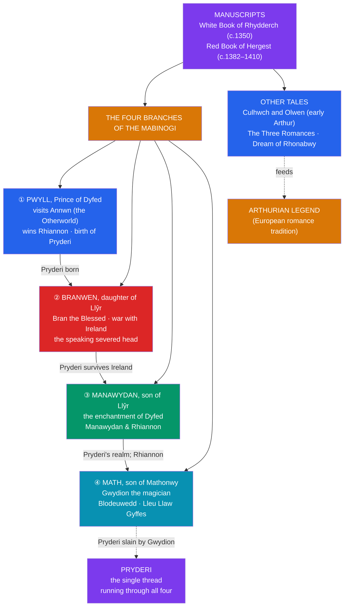

# 📖 The Welsh Mabinogion

> [!abstract] TL;DR
> The **Mabinogion** is the modern collective title for the finest medieval **Welsh** prose tales, preserved in two 14th-century manuscripts — the **White Book of Rhydderch** (*Llyfr Gwyn Rhydderch*, c. 1350) and the **Red Book of Hergest** (*Llyfr Coch Hergest*, c. 1382–1410). At its heart are the **Four Branches of the Mabinogi** — *Pwyll*, *Branwen*, *Manawydan*, and *Math* — a linked sequence of mythic tales featuring **Rhiannon** (the horse-goddess who is unjustly punished), **Pryderi** (the thread who runs through all four), **Bran the Blessed** (*Bendigeidfran*, the giant king whose severed head speaks on), and the shape-shifting magician **Gwydion**. The collection also holds the early Arthurian quest-tale ***Culhwch and Olwen*** — the oldest substantial Arthurian narrative — and other romances. Like their Irish counterparts, these tales were carried **orally** by trained storytellers before being written down and Christianized by medieval scribes; the divine origins of many characters are half-submerged. The *Mabinogion* is also a major tributary of the wider **Arthurian legend** that flowered across medieval Europe.

## Intuition — analogy first

Read the *Mabinogion* the way a geologist reads a cliff face: the myth is still there, but **folded, tilted, and half-eroded** into something that now looks like a courtly adventure story.

The Welsh tales are further from their pagan roots than the Irish ones. Where the Irish scribes at least *labeled* the Tuatha Dé as former gods, the Welsh redactors mostly present their figures as **lords, ladies, and enchanters** in a chivalric-flavoured world — the divinity has to be inferred. **Rhiannon** rides a magical white horse no one can catch and is linked by name and function to a Gaulish horse-goddess (*Rigantona*, "great queen"), but in the text she is simply a beautiful woman wronged by a false accusation. **Bran** is a king so vast he wades the Irish Sea, yet the story treats his gigantism as merely a striking fact. So the interpretive move is always the same: notice the **impossible detail** (a talking severed head, a woman who appears from a fairy mound, a bag that can never be filled), and recognize it as the **fossilized bone of an older myth** poking through a medieval literary surface. What survives is not scripture but a beautifully told story with a god inside it. See [[The_Tuatha_De_Danann]].

---

## The Four Branches and Their Links

## Key Concepts

### What "the Mabinogion" is (and the name problem)

"**Mabinogion**" is a slightly mistaken but now-standard title. It derives from **Lady Charlotte Guest**, whose landmark English translation (1838–45) took the scribal word *mabynogyon* — probably a copyist's error — as a plural title for the whole group of eleven tales she edited. Strictly, only the **Four Branches** are the *Mabinogi*; the word *mabinogi* itself is debated (perhaps "a tale of youth," or "matter concerning the family of the god **Maponos/Mabon**"). The full collection as usually printed gathers: the **Four Branches**; the early Arthurian **Culhwch and Olwen** and the **Dream of Rhonabwy**; the **Three Romances** (*Owain*, *Peredur*, *Geraint* — Welsh cognates of Chrétien de Troyes's romances); and shorter pieces like the **Dream of Macsen Wledig** and **Lludd and Llefelys**.

### The Four Branches — Pwyll, Branwen, Manawydan, Math

The **Four Branches** are the mythological core, four linked tales joined by the recurring figure of **Pryderi**:

- **First Branch — *Pwyll, Prince of Dyfed*.** Pwyll changes places for a year with **Arawn**, king of the Otherworld realm of **Annwn** (see [[The_Celtic_Otherworld]]), then wins the hand of **Rhiannon**, who first appears riding a white horse that no pursuer can overtake. Their son **Pryderi** is mysteriously abducted at birth; Rhiannon is falsely accused of killing him and made to do humiliating penance until he is restored.
- **Second Branch — *Branwen, daughter of Llŷr*.** **Branwen** is married to the king of Ireland but abused; her brother **Bran the Blessed** (*Bendigeidfran*), a giant, leads a catastrophic war of vengeance across the Irish Sea. Almost all are killed. The dying Bran orders his own **severed head cut off**; it remains miraculously alive and companionable for eighty years (the "Assembly of the Wondrous Head") before being buried at the **White Hill** (London) facing the Continent, to ward off invasion.
- **Third Branch — *Manawydan, son of Llŷr*.** Bran's brother **Manawydan** (cognate with the Irish sea-god **Manannán mac Lir**) marries the widowed Rhiannon. A magical enchantment empties the land of Dyfed of all its people; Manawydan breaks the spell through patience and cunning, forcing the enchanter to lift the curse.
- **Fourth Branch — *Math, son of Mathonwy*.** The magician-lord **Math** and his nephew, the trickster-magician **Gwydion**, dominate. It includes the conjuring of the flower-woman **Blodeuwedd** (made from oak, broom, and meadowsweet as a wife for **Lleu Llaw Gyffes**), her betrayal of him, and Lleu's near-death and restoration. Gwydion, notably, **slays Pryderi** in single combat — closing the thread that ran through all four branches.

### Key figures and their divine undertow

| Figure | Role in the tales | Likely mythic/divine origin |
|---|---|---|
| **Rhiannon** | Wronged wife of Pwyll; the white-horse rider | A **horse-goddess**, cognate with Gaulish *Epona* / *Rigantona* ("great queen") |
| **Bran the Blessed** (*Bendigeidfran*) | Giant king; the speaking severed head | An ancient sovereign/protective deity; the head-cult motif |
| **Pryderi** | Son of Pwyll & Rhiannon; the linking thread | Possibly the "divine son" **Mabon/Maponos** figure |
| **Manawydan** | Patient enchantment-breaker | Cognate with the Irish sea-god **Manannán mac Lir** |
| **Lleu Llaw Gyffes** | Hero of the Fourth Branch, with taboo on his death | Cognate with the pan-Celtic **Lugus / Lugh** (see [[The_Tuatha_De_Danann]]) |
| **Gwydion & the children of Dôn** | Magicians and craftsmen | A divine family parallel to the Irish **Tuatha Dé Danann** (Dôn ≈ Danu) |

The parallels are structural, not incidental: the **children of Dôn** function much as the Tuatha Dé, and **Lleu**'s near-invulnerability and elaborate death-taboo echo **Lugh**'s pan-Celtic profile. This is strong evidence for a shared **insular-Celtic** (and ultimately Indo-European) mythological inheritance. See [[The_Comparative_Method]].

### Culhwch and Olwen — the earliest Arthur

***Culhwch and Olwen*** (probably late 11th c., the earliest substantial Arthurian tale) tells how the young **Culhwch**, cursed to marry only **Olwen**, daughter of the giant **Ysbaddaden**, enlists **Arthur** and his warriors to accomplish a long list of impossible tasks (*anoethau*) set by the giant. It preserves a strikingly **archaic, native Arthur** — a heroic war-leader surrounded by a fantastical retinue with names and powers straight out of older myth — before the courtly, romance-era Arthur of the Continental tradition. Its famous rhetorical **catalogue** of Arthur's men and the hunt for the great boar **Twrch Trwyth** are among the tradition's set-pieces.

### Manuscripts and Christian transmission

The tales survive complete in two great vellum codices: the **White Book of Rhydderch** (*Llyfr Gwyn Rhydderch*, c. 1350) and the more famous **Red Book of Hergest** (*Llyfr Coch Hergest*, c. 1382–1410), with earlier fragments elsewhere. As with the Irish cycles, the tales are far older than these books — carried by trained Welsh storytellers (*cyfarwyddiaid*) and only written down, in polished literary prose, by **medieval Christian scribes**. The redactors were interested in a good story and a coherent "matter of Wales," not in preserving a pagan theology; consequently the myth is **submerged**, and the surviving text mixes genuinely archaic mythic material with medieval narrative craft.

### Influence on Arthurian legend

The *Mabinogion* is a crucial early channel for the **Matter of Britain**. It transmits a native Welsh Arthur (in *Culhwch and Olwen* and *The Dream of Rhonabwy*) that predates the international romance boom, and its **Three Romances** (*Owain / The Lady of the Fountain*, *Peredur*, *Geraint and Enid*) run closely parallel to the French verse romances of **Chrétien de Troyes** — feeding a long scholarly debate over whether the Welsh and French versions descend from a common source or borrowed from one another. Figures, motifs, and place-names from this Welsh substratum (including **Bran** and the wounded-king / protective-vessel motifs) also stand behind later developments of the **Grail** legend. See the cross-vault note on Christian legend below.

## Primary Sources & Examples

- **The Four Branches of the Mabinogi** — *Pwyll*, *Branwen*, *Manawydan*, *Math* — the mythological core, best read as a linked whole via the Pryderi thread.
- ***Culhwch and Olwen*** — the earliest major Arthurian narrative; the giant's tasks and the hunt for Twrch Trwyth.
- **The Three Romances** — *Owain*, *Peredur*, *Geraint* — Welsh analogues of Chrétien de Troyes; central to the Welsh-vs-French source debate.
- **Manuscripts** — the *White Book of Rhydderch* (National Library of Wales) and the *Red Book of Hergest* (Bodleian, Oxford).
- **Comparative note**: **Rhiannon ≈ Epona/Rigantona** (horse-goddess), **Lleu ≈ Lugh/Lugus**, **Manawydan ≈ Manannán mac Lir**, and the **children of Dôn ≈ Tuatha Dé Danann** — a matrix of Welsh–Irish–Gaulish cognates that anchors comparative Celtic study.

## Common Pitfalls / Misconceptions

- **Thinking "Mabinogion" is an authentic medieval title.** It is a modern label popularized by **Lady Charlotte Guest**, based on a probable scribal error; only the **Four Branches** are properly the *Mabinogi*.
- **Reading the tales as straightforward pagan mythology.** The divinity is **submerged**; these are literary prose tales in which older gods survive as lords and enchanters. Their mythic identity must be reconstructed, not simply read off the page.
- **Assuming the Welsh Arthur equals the "King Arthur" of later romance.** The *Culhwch* Arthur is an archaic native war-leader, quite unlike the courtly monarch of Malory and the Continental cycles.
- **Over-reading the Irish–Welsh parallels as identity.** Rhiannon, Lleu, and the children of Dôn are **cognate with** Irish figures, not the same characters; the two traditions diverged long before either was written down.
- **Settling the Chrétien question in one direction.** Whether the **Three Romances** or Chrétien's poems came first is genuinely unresolved; confident claims either way overstate the evidence.

## Related Concepts

- [[The_Tuatha_De_Danann]] — the Irish divine race; the **children of Dôn** and figures like **Lleu** and **Manawydan** are Welsh cognates of this pantheon
- [[The_Irish_Mythological_Cycles]] — the Irish counterpart corpus; a direct comparison of how two Celtic traditions preserved (and disguised) their myths
- [[The_Celtic_Otherworld]] — **Annwn**, the Welsh Otherworld visited by Pwyll, and the wider Celtic Otherworld the tales assume
- [[_MOC_Celtic_Myth|↑ Section MOC]] — the map of the Celtic section
- Cross-vault: [[Christian_Legend_and_Hagiography]] — the Grail and the Arthurian legend the *Mabinogion* helped seed
- Cross-vault: [[The_Comparative_Method]] — the Welsh–Irish–Gaulish cognates (Rhiannon/Epona, Lleu/Lugh) as evidence of shared Indo-European inheritance

## Review Questions

1. Explain the origin and imprecision of the name "**Mabinogion**." Which tales strictly constitute the *Four Branches of the Mabinogi*, and what single character links all four?
2. Using **Rhiannon, Bran, Lleu, and Manawydan**, explain what is meant by saying the *Mabinogion*'s divine figures are "submerged." How do scholars reconstruct their mythic identities?
3. Why is ***Culhwch and Olwen*** important for the history of Arthurian legend, and how does its Arthur differ from the later romance king? Summarize the Welsh-versus-French source debate around the Three Romances.

## Sources

- Davies, S. (trans.) (2007). *The Mabinogion*. Oxford World's Classics
- Ford, P. K. (trans.) (1977). *The Mabinogi and Other Medieval Welsh Tales*. University of California Press
- Guest, Lady C. (trans.) (1838–45). *The Mabinogion* (the translation that fixed the title)
- Koch, J. T. (ed.) (2006). *Celtic Culture: A Historical Encyclopedia*. ABC-CLIO

#mythology #celtic-mythology #welsh-myth #mabinogion #arthurian
