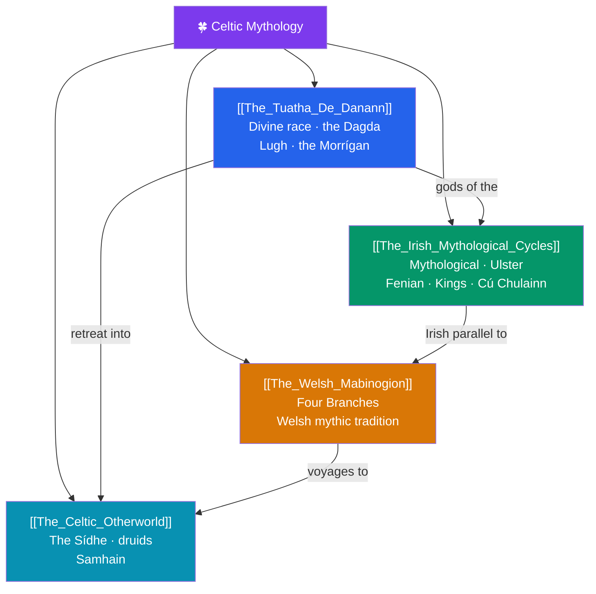

# 🍀 Celtic Mythology — Map of Content

> [!abstract] What This Section Covers
> Celtic mythology reaches us mainly through medieval Irish and Welsh manuscripts written by Christian scribes, preserving an older pagan world of divine races, otherworldly islands, and heroic saga. This section opens with **The Tuatha Dé Danann**, Ireland's supernatural race — the good-god Dagda, the many-skilled Lugh, and the war-goddess Morrígan. **The Irish Mythological Cycles** organizes the vast Irish corpus into its four traditional cycles (Mythological, Ulster, Fenian, and Kings), foregrounding the Ulster hero Cú Chulainn. **The Welsh Mabinogion** turns to the Four Branches and the distinct mythic tradition of Wales, while **The Celtic Otherworld** explores the recurring themes that bind the whole tradition: the fairy-mounds of the Sídhe, the druids, and the festival of Samhain when the boundary between worlds thins. Together they recover a mythology transmitted orally for centuries before its medieval writing-down.

## Concept Map

## Learning Path

1. [[The_Tuatha_De_Danann]] — Ireland's divine race and its chief figures: the Dagda, Lugh, Nuada, and the Morrígan.
2. [[The_Irish_Mythological_Cycles]] — The four-fold organization of Irish tradition and the *Táin Bó Cúailnge* with Cú Chulainn.
3. [[The_Welsh_Mabinogion]] — The Four Branches and the distinct Welsh mythological voice (Pwyll, Branwen, Math).
4. [[The_Celtic_Otherworld]] — The Sídhe, druidic religion, and Samhain as the tradition's unifying themes.

## All Notes at a Glance

| Note | Difficulty | What You'll Learn |
|------|------------|-------------------|
| [[The_Tuatha_De_Danann]] | Beginner → Intermediate | The Dagda, Lugh, Nuada, Brigid, the Morrígan, the Battles of Mag Tuired, the Fir Bolg and Fomorians |
| [[The_Irish_Mythological_Cycles]] | Intermediate | Mythological/Ulster/Fenian/Kings cycles, the *Táin*, Cú Chulainn, Fionn mac Cumhaill, medieval manuscripts |
| [[The_Welsh_Mabinogion]] | Intermediate | The Four Branches, Pwyll, Rhiannon, Branwen, Math, the *White Book* and *Red Book* |
| [[The_Celtic_Otherworld]] | Intermediate | The Sídhe and fairy-mounds, Tír na nÓg, druids, Samhain and the thinning veil |

## Key Questions This Section Answers

- Who were the Tuatha Dé Danann, and how did gods become fairy-folk of the Sídhe?
- How are the four Irish "cycles" a modern organizing scheme for a sprawling medieval corpus?
- How does the Welsh *Mabinogion* differ from the Irish tradition?
- What is the Celtic Otherworld, and how does Samhain connect to it?
- How much of "Celtic myth" is genuinely pagan, and how much is shaped by Christian scribes?

## Related Sections

- [[_MOC_Mythology_Master|↑ Mythology Master MOC]]
- [[_MOC_Norse_Myth|← Norse & Germanic]]
- [[_MOC_Hindu_Vedic_Myth|→ Hindu & Vedic]]
- Cross-vault: [[Christian_Legend_and_Hagiography]] (the Grail, Arthurian overlap), [[Urban_Legends_and_Modern_Folklore]]

#MOC #Mythology #CelticMyth
