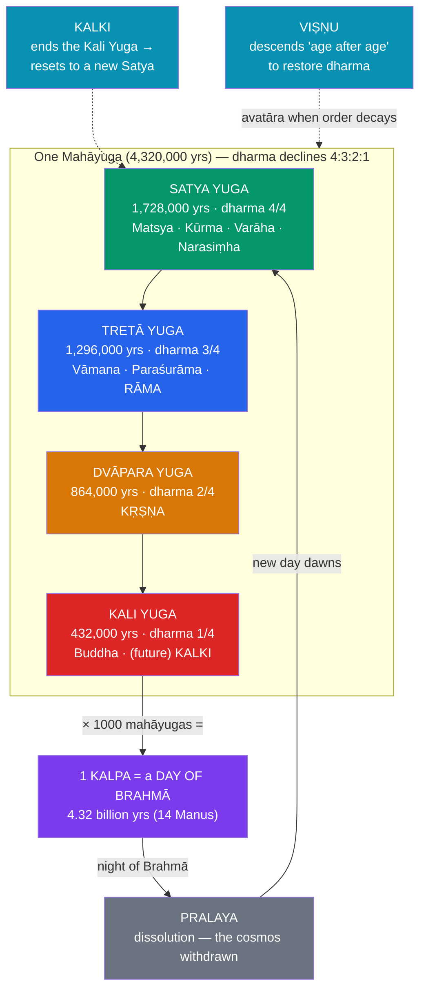

# 🌀 Avatars, Yugas, and Cosmic Cycles

> [!abstract] TL;DR
> Two great ideas give Hindu mythology its distinctive shape. The first is the **avatāra** ("descent"): when cosmic order (*dharma*) decays, **Viṣṇu** descends into the world in a saving form — most famously the **Daśāvatāra**, his ten classic descents: **Matsya** (fish), **Kūrma** (tortoise), **Varāha** (boar), **Narasiṃha** (man-lion), **Vāmana** (dwarf), **Paraśurāma**, **Rāma**, **Kṛṣṇa**, **Buddha**, and the still-future **Kalki**. The second is **cyclical time**: history moves not in a straight line toward an end but in immense repeating cycles. Each cosmic age (*mahāyuga*) is divided into four **yugas** — **Satya, Tretā, Dvāpara, Kali** — of declining virtue, in the ratio 4:3:2:1; a thousand such cycles make one **kalpa**, a "day of Brahmā," followed by a "night" of dissolution (**pralaya**). We now live in the degenerate **Kali Yuga**. This is the frame that unites the section: the avatāras (including [[The_Ramayana|Rāma]] and [[The_Mahabharata|Kṛṣṇa]]) are Viṣṇu's interventions *within* the turning wheel of the yugas, and the first descent, **Matsya**, is India's version of the worldwide **flood myth**.

## Intuition — analogy first

Western time is usually a **story**; Hindu time is a **season**.

A story has a beginning, a middle, and an ending that will not come again — creation, fall, redemption, last judgment. A season has none of these: winter is not the "end" of the year but a phase that clears the way for a spring identical in kind to the last. Hindu cosmology runs on the second model. The universe is not marching toward a final act; it is **breathing** — expanding into creation, holding through preservation, collapsing in dissolution, and expanding again, world without end. On this view the numbers become vast almost past imagining precisely because *no* single cycle is special: one "day of Brahmā" lasts **4.32 billion years**, and Brahmā's whole hundred-year life runs to hundreds of trillions — after which even he dissolves and the whole scheme restarts.

Two consequences follow, and they organise everything else. First, because dharma *decays* over each cycle (we are, right now, in the worst quarter, the **Kali Yuga**), the cosmos needs a **repair mechanism** — and that is the **avatāra**, Viṣṇu descending "age after age" to reset the balance. Second, because there is always a *next* cycle, even total destruction (**pralaya**) is not tragic but **regenerative**, the seed of the next creation — which is exactly why the flood that opens the avatāra list (**Matsya**) is a story of *rescue and reseeding*, not of final punishment. Compare the very different, more juridical flood-logic of other traditions in [[Creation_and_Flood_Myths]].

---

## The Wheel of Time and Viṣṇu's Descents

## Key Concepts

### The avatāra doctrine

**Avatāra** literally means "**descent**" (from *ava-tṝ*, "to cross down"). It is chiefly a **Vaiṣṇava** doctrine: **Viṣṇu**, the preserver of the [[The_Trimurti]], does not merely watch over the cosmos but periodically *enters* it in embodied form to rescue dharma from collapse. The doctrine's charter is Kṛṣṇa's declaration in the **Bhagavad Gītā** (4.7–8): "**Whenever dharma declines and adharma rises, I create myself... age after age I come into being to protect the good, destroy the wicked, and re-establish dharma.**" The avatāra thus knits together theology (Viṣṇu's saving role), the epics ([[The_Ramayana|Rāma]] and [[The_Mahabharata|Kṛṣṇa]] are avatāras), and cyclical time: each descent is timed to a stage of the decaying yuga.

### The Daśāvatāra — Viṣṇu's ten descents

The best-known list is the **Daśāvatāra**, the ten principal avatāras, which the tradition itself often reads as a movement from the aquatic to the fully human — a sequence some modern commentators note loosely echoes an evolutionary ascent (fish → amphibious tortoise → land mammal → man-beast → dwarf-man → full men):

| # | Avatāra | Form | Yuga | Core deed |
|---|---|---|---|---|
| 1 | **Matsya** | Fish | Satya | Saves Manu and the seeds/Vedas from the flood |
| 2 | **Kūrma** | Tortoise | Satya | Supports Mount Mandara for the *churning of the ocean* |
| 3 | **Varāha** | Boar | Satya | Lifts the drowned Earth (Bhūdevī) from the cosmic waters |
| 4 | **Narasiṃha** | Man-lion | Satya | Slays the demon Hiraṇyakaśipu, evading his "no man, no beast" boon |
| 5 | **Vāmana** | Dwarf | Tretā | Reclaims the three worlds from Bali in three strides (*Trivikrama*) |
| 6 | **Paraśurāma** | Axe-wielding brahmin | Tretā | Destroys the corrupt warrior-kings |
| 7 | **Rāma** | Prince of Ayodhyā | Tretā | Slays Rāvaṇa — the [[The_Ramayana]] |
| 8 | **Kṛṣṇa** | Cowherd-king & counsellor | Dvāpara | Guides the Pāṇḍavas; speaks the Gītā — the [[The_Mahabharata]] |
| 9 | **Buddha** | The Enlightened One | Kali | Variously read (see below) |
| 10 | **Kalki** | Rider on a white horse | end of Kali | *Future*: destroys the wicked and restarts the cycle |

Two of these carry special mythic weight. **Matsya** is the **flood-hero** (below). And the ninth, **Buddha**, is a striking piece of religious diplomacy: by absorbing the founder of a rival tradition *into* Viṣṇu, the Purāṇas both honour and neutralise Buddhism — some texts say Viṣṇu took this form to *teach* compassion, others (more polemically) to *delude* the wicked away from the Vedas. The list also varies: some traditions substitute **Balarāma** for Buddha, and Vaiṣṇava theology counts many more avatāras beyond the canonical ten (the *Bhāgavata Purāṇa* lists twenty-two or "innumerable").

### The four yugas — declining ages

Cyclical time subdivides each **mahāyuga** ("great age," also *caturyuga*) into **four yugas** of steadily **declining dharma**, conventionally imaged as the **bull of dharma** losing a leg each age — standing firm on four legs in the first, hobbling on one in the last:

| Yuga | Duration (human yrs) | Dharma remaining | Character |
|---|---|---|---|
| **Satya (Kṛta)** | 1,728,000 | 4/4 | Golden age; truth and virtue whole |
| **Tretā** | 1,296,000 | 3/4 | Virtue declines; sacrifice begins |
| **Dvāpara** | 864,000 | 2/4 | Disease, discord, halved righteousness |
| **Kali** | 432,000 | 1/4 | The dark age of strife and decay |

The durations fall in a clean **4:3:2:1 ratio**, summing to **4,320,000 years** per mahāyuga. We are held to be living in the **Kali Yuga**, traditionally reckoned to have begun in **3102 BCE**, at Kṛṣṇa's death shortly after the Mahābhārata war — a chronology that neatly makes the great epic the hinge between the Dvāpara and Kali ages.

### Kalpas, manvantaras, and the day of Brahmā

The scale then telescopes upward. **One thousand mahāyugas** make a single **kalpa** — a "**day of Brahmā**," about **4.32 billion years** — during which fourteen successive **Manus** (progenitors of humanity) rule in periods called **manvantaras**. A day of Brahmā is followed by a **night of Brahmā** of equal length, in which the cosmos is withdrawn. Brahmā himself lives a hundred such "years"; at the end of his life (a **mahākalpa**, hundreds of trillions of human years) comes the **great dissolution**, and even the creator passes away before the whole scheme begins anew. These are among the largest time-spans in any premodern cosmology.

### Pralaya — dissolution and renewal

**Pralaya** ("dissolution") is the counterpart of creation, and the tradition distinguishes several kinds — chiefly the **naimittika** ("occasional") pralaya at the close of each day of Brahmā, and the far greater **prākṛtika** or **mahāpralaya** at the end of his life, when the very elements (*prakṛti*) collapse back into their unmanifest source. Crucially, pralaya is **not annihilation but re-absorption**: Viṣṇu withdraws the cosmos into himself and sleeps on the serpent **Śeṣa** upon the causal ocean until, from the lotus of his navel, Brahmā emerges to create again. Destruction is a **rest between breaths**, and this regenerative logic is exactly why Hindu "end-of-the-world" imagery lacks the finality of a Western apocalypse.

### Matsya and the flood — a comparative window

The first avatāra, **Matsya**, is India's **flood myth**. A small fish begs the sage-king **Manu** (Vaivasvata Manu, also called Satyavrata) to protect it; it grows to enormous size, then warns him that a **great deluge** will soon dissolve the world. Manu builds a boat, gathers the **seeds of all living things**, the **seven sages** (*saptarṣi*), and the Vedas, and ties the vessel to the horn of the giant fish, who tows it through the flood to safety on a mountain peak — after which creation is reseeded. The parallels with the Mesopotamian **Utnapishtim/Ziusudra** and the biblical **Noah** are close enough that the comparative debate over **diffusion versus independent invention** applies directly (see [[Creation_and_Flood_Myths]] and [[The_Comparative_Method]]). But note the crucial *difference in meaning*: in the cyclical Hindu frame the flood is a **periodic dissolution** that *reseeds* the world, not a one-off divine punishment for human sin — the same event, a different cosmology.

## Examples Across Cultures

- **Matsya vs. the Near Eastern flood**: Manu's boat, the tow-rope to a divine rescuer, and the saving of seeds/sages line up with Utnapishtim (Gilgamesh) and Noah — a classic test case for the comparative method (see [[Creation_and_Flood_Myths]]).
- **Cyclical vs. linear time**: the yuga-and-kalpa scheme contrasts sharply with the linear "creation → apocalypse" time of the Abrahamic traditions, and rhymes instead with the Greek/Stoic **ekpyrōsis** (periodic conflagration and rebirth) and the Norse **Ragnarök**, after which a renewed world emerges.
- **Descending gods**: Viṣṇu's avatāras invite (careful) comparison with other traditions of gods taking earthly form — the Greek gods in disguise, or the Christian **Incarnation** — though the plurality and cyclical timing of avatāras make the logic quite distinct.
- **Ages of decline**: the four yugas of falling virtue parallel **Hesiod's** Golden, Silver, Bronze, and Iron Ages — a widespread mythic sense that the present is a fallen remnant of a better past.

## Common Pitfalls / Misconceptions

- **Reading pralaya as a final apocalypse.** It is *periodic re-absorption*, always followed by a new creation; there is no once-and-for-all "end of the world."
- **Treating the Daśāvatāra as a fixed canon.** Lists vary (Balarāma sometimes replaces Buddha), and Vaiṣṇava theology counts far more than ten avatāras.
- **Over-reading the "evolution" parallel.** The fish-to-man sequence is a genuine and often-noted feature, but the list is a *theological* ordering, not a Darwinian one; the resemblance is suggestive, not doctrinal.
- **Taking the yuga year-counts as history.** The 4.32-million-year mahāyuga and the 3102 BCE start of the Kali Yuga are *cosmological/mythic* reckonings, not datable events.
- **Assuming every Hindu avatāra belongs to Viṣṇu.** The full avatāra doctrine is chiefly **Vaiṣṇava**; Śaiva and Śākta traditions have their own logics of divine manifestation.
- **Confusing avatāra with reincarnation (*punarjanma*).** An avatāra is a *deliberate descent of a god* to save the world; ordinary rebirth is the karma-driven transmigration of a soul. They are not the same idea.

## Related Concepts

- [[_MOC_Hindu_Vedic_Myth|↑ Section MOC]] — the cyclical frame that ties the whole section together
- [[The_Trimurti]] — Viṣṇu's preserving function, of which the avatāras are the active expression
- [[The_Ramayana]] — Rāma, the seventh avatāra, in the Tretā Yuga
- [[The_Mahabharata]] — Kṛṣṇa, the eighth avatāra, at the turn into the Kali Yuga
- [[Creation_and_Flood_Myths]] — Matsya and the deluge in comparative perspective
- Cross-vault: [[The_Comparative_Method]] — diffusion vs. independent invention, applied to the flood and the "ages of decline"

## Review Questions

1. Explain the **avatāra** doctrine using Kṛṣṇa's statement in the Gītā, and show how it links Viṣṇu's preserving role to the *decline of dharma* across the yugas.
2. Lay out the four **yugas** with their 4:3:2:1 ratio and the "bull of dharma" image, then scale up to the **kalpa** and **pralaya**. Why does this structure make Hindu time *cyclical* rather than *linear*?
3. Compare **Matsya** with the Mesopotamian and biblical flood stories. What is preserved across the versions, and how does the *cyclical* frame change the flood's **meaning** in the Hindu telling?

## Sources

- Doniger, W. (trans.) (1975). *Hindu Myths: A Sourcebook Translated from the Sanskrit*. Penguin Classics
- Flood, G. (1996). *An Introduction to Hinduism*. Cambridge University Press
- Dimmitt, C., & van Buitenen, J. A. B. (eds.) (1978). *Classical Hindu Mythology: A Reader in the Sanskrit Purāṇas*. Temple University Press
- Zimmer, H. (1946). *Myths and Symbols in Indian Art and Civilization*. Princeton University Press (Bollingen)

#mythology #hindu-vedic-myth #avatara #yugas #cosmology
