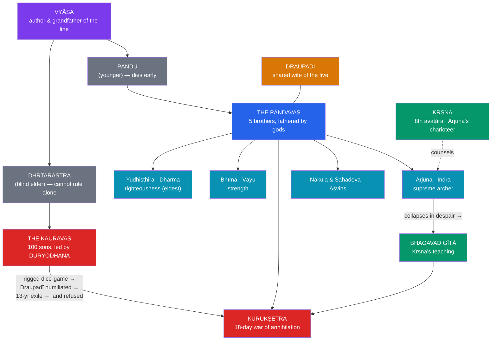

# ⚔️ The Mahabharata

> [!abstract] TL;DR
> The **Mahābhārata** is the longest poem ever composed — some **100,000 verses** in eighteen books (*parvans*), roughly ten times the *Iliad* and *Odyssey* combined — traditionally ascribed to the sage **Vyāsa**, who is also a character within it. At its core is a **dynastic succession struggle** in the Kuru clan: the five righteous **Pāṇḍavas** (led by **Yudhiṣṭhira**, with the mighty **Bhīma** and the great archer **Arjuna**) against their hundred cousins the **Kauravas** (led by the jealous **Duryodhana**). A rigged dice-game, the humiliation of their shared wife **Draupadī**, and a broken exile settlement make war inevitable, and the two houses annihilate each other over eighteen days at **Kurukṣetra**. **Kṛṣṇa** — the eighth avatāra of Viṣṇu — serves as Arjuna's charioteer and counsellor, and on the eve of battle delivers the **Bhagavad Gītā**: when Arjuna collapses in despair at the thought of killing his kin, Kṛṣṇa answers with a theology of **duty (*svadharma*)**, the imperishable **self (*ātman*)**, **karma yoga** (selfless action), and devotion. Where the [[The_Ramayana]] idealises dharma, the Mahābhārata **interrogates** it — every victory is won by a moral compromise, and "subtle is the path of dharma."

## Intuition — analogy first

If the Rāmāyaṇa is a portrait of dharma perfected, the Mahābhārata is a **stress test that runs dharma to destruction**.

Imagine a legal system so revered that everyone swears by it — and then engineer a case where every honest reading of the law leads to catastrophe. A rightful heir gambles away his kingdom, his brothers, and his wife in a game he was honour-bound to play; the elders who could stop the horror are bound by *their* oaths to defend the throne, whatever the throne does. Each character behaves according to some genuine duty, and the sum of all their dutifulness is a war that leaves almost everyone dead. The epic keeps forcing its heroes into positions where **no available action is clean** — where Yudhiṣṭhira, "king of dharma" himself, must tell a battlefield lie to win.

This is why the Mahābhārata reads less like a myth of triumph than like a **tragic depth-psychology of a whole civilisation**. Its five brothers behave almost like differentiated parts of a single self — righteousness, force, skill, and so on — and their great antagonist **Karṇa** is the noble, wounded shadow who is, unknown to them, their own eldest brother. Read through a Jungian lens (see [[Jungian_Archetypes_and_Myth]]), the war at Kurukṣetra is as much an *interior* reckoning — the confrontation with the shadow, the crisis before individuation — as a historical battle. The Gītā, spoken at the exact moment the hero freezes, is the myth turning to face that crisis directly.

---

## The House of Kuru and the Road to War

## Key Concepts

### Vyāsa and the scale of the epic

The Mahābhārata is ascribed to **Vyāsa** (Kṛṣṇa Dvaipāyana Vyāsa), who is simultaneously its narrator and the **biological grandfather** of both warring houses — a frame in which the author is woven into his own story. Composed and expanded over centuries (c. 400 BCE–400 CE), it is an **encyclopaedic** work that absorbed law (*dharmaśāstra*), philosophy, statecraft, and countless subtales; its own famous boast is that "**whatever is here may be found elsewhere; what is not here is found nowhere**." This capaciousness is its defining contrast with the tauter, more unified [[The_Ramayana]].

### The succession struggle: Pāṇḍavas vs Kauravas

The Kuru throne is contested because the elder prince **Dhṛtarāṣṭra** is born blind and so his younger brother **Pāṇḍu** reigns — but Pāṇḍu dies young, and his five sons, the **Pāṇḍavas**, are raised alongside Dhṛtarāṣṭra's hundred sons, the **Kauravas**. The Pāṇḍavas are fathered by gods (the epic's device for their heroic and, later, archetypal character): **Yudhiṣṭhira** by **Dharma** (righteousness), **Bhīma** by **Vāyu** (strength), **Arjuna** by **Indra** (martial skill), and the twins **Nakula** and **Sahadeva** by the **Aśvins**. All five share one wife, **Draupadī**. The eldest Kaurava, **Duryodhana**, consumed by envy, refuses to let the Pāṇḍavas hold their rightful share of the kingdom.

### The dice-game and the exile

Duryodhana's uncle **Śakuni** lures the honour-bound Yudhiṣṭhira into a **rigged game of dice**, in which the king stakes and loses his wealth, his kingdom, his brothers, himself, and finally **Draupadī**. Her attempted public disrobing (*vastraharaṇa*) in the Kaurava court — halted by a miracle of Kṛṣṇa's grace — is the epic's moral point of no return. The terms send the Pāṇḍavas into **thirteen years of exile** (twelve in the forest, one incognito); when they return, Duryodhana refuses to yield even five villages, and war becomes unavoidable.

### Kurukṣetra — the war of annihilation

The **eighteen-day war** on the field of **Kurukṣetra** draws in all the great warriors of the age — the grandsire **Bhīṣma**, the teacher **Droṇa**, the tragic **Karṇa** — most of them ranged, by prior oath, on the Kaurava side against their own sympathies. The Pāṇḍavas win, but at a **catastrophic cost**: nearly every warrior on both sides is dead, and the victory is hollowed out by the massacre of the Pāṇḍavas' sons in a night raid. The epic refuses to let triumph feel like triumph.

### Kṛṣṇa — god as charioteer

**Kṛṣṇa**, prince of the Yādavas and the **eighth avatāra of Viṣṇu** (see [[Avatars_Yugas_and_Cosmic_Cycles]]), is the pivot of the war. Offered a choice, Duryodhana takes Kṛṣṇa's vast army while Arjuna takes the unarmed Kṛṣṇa *himself* as charioteer and counsellor. Kṛṣṇa never lifts a weapon, yet he engineers the Pāṇḍava victory — often by advising the very moral compromises (the lie that breaks Droṇa, the killing of Karṇa while his chariot-wheel is stuck) that make the war's ethics so troubling. He is at once divine friend, cunning statesman, and the Lord who reveals the cosmos in the Gītā.

### The Bhagavad Gītā

Embedded in the sixth book, the **Bhagavad Gītā** ("Song of the Lord," 700 verses) is the epic's philosophical summit and one of Hinduism's most important scriptures. On the eve of battle, **Arjuna** looks across the field at his teachers, cousins, and elders and is paralysed — he throws down his bow, unwilling to win a kingdom by killing his own kin (the crisis called *Arjuna-viṣāda*). Kṛṣṇa's answer unfolds a synthesis:

- **Svadharma** — one must act according to one's own duty; for Arjuna, a *kṣatriya* (warrior), that duty is to fight a just war.
- **The imperishable self (*ātman*)** — the true self is never slain; only bodies die, so grief over "killing" mistakes the self for the body.
- **Karma yoga** — the discipline of **acting without attachment to the fruits** of action (*niṣkāma karma*): "You have a right to your actions, but never to their fruits."
- **The three paths** — *karma yoga* (action), *jñāna yoga* (knowledge), and *bhakti yoga* (loving devotion), converging on surrender to Kṛṣṇa.
- **The theophany** — in chapter 11 Kṛṣṇa grants Arjuna divine sight and reveals his terrifying universal form (*Viśvarūpa*), declaring himself "**Time (kāla), the destroyer of worlds**."

### Dharma in crisis — the epic's moral ambiguity

The Mahābhārata's greatness lies in refusing easy answers. Its "heroes" win only through **deception**: Bhīṣma is felled from behind a warrior he will not strike; Droṇa is disarmed by a deliberate half-truth about his son's death; Karṇa is shot while defenceless; Duryodhana is struck an illegal blow below the belt. Even **Yudhiṣṭhira**, the son of Dharma, must lie. The epic's recurring formula — **"subtle is the course of dharma" (*sūkṣmā gatir dharmasya*)** — signals that righteousness here is not a clear rulebook but a field of tragic, conflicting obligations.

| Figure | Fathered by / role | Archetypal register |
|---|---|---|
| **Yudhiṣṭhira** | Dharma; the eldest, becomes king | Righteousness / the ruler |
| **Bhīma** | Vāyu; the strongman | Raw force / the warrior-body |
| **Arjuna** | Indra; peerless archer, Gītā's hearer | Skill; the seeking ego at crisis |
| **Nakula & Sahadeva** | The Aśvins | Beauty and wisdom (the twins) |
| **Draupadī** | Fire-born; shared queen | The wronged feminine; the war's cause |
| **Karṇa** | Sūrya; secret eldest Pāṇḍava, fights *against* them | The noble **shadow** / tragic outsider |
| **Kṛṣṇa** | Viṣṇu's 8th avatāra; charioteer | The divine Self / guide |

## Primary Sources & Examples

- **The Critical Edition** (Bhandarkar Oriental Research Institute, 1919–66) — the scholarly reconstruction underlying modern study; the ongoing **Clay Sanskrit Library / University of Chicago** translations make it accessible in English.
- **The *Bhagavad Gītā*** — read on its own for millennia; foundational to Gandhi's *Anāsakti Yoga* and to modern Hindu thought, and famously quoted by **J. Robert Oppenheimer** ("Now I am become Death") at the first atomic test.
- **Peter Brook's *The Mahabharata*** (1985 stage cycle, 1989 film) and **B. R. Chopra's** Indian TV serial (1988–90) — landmark modern retellings.
- **Retold literary versions** — from **C. Rajagopalachari's** popular abridgement to novels such as **Chitra Banerjee Divakaruni's** *The Palace of Illusions* (Draupadī's viewpoint) — evidence of a living, re-interpreted tradition, like the Rāmāyaṇa's many tellings.
- **The frame tale** — the whole epic is recited at the snake-sacrifice of King Janamejaya, a Pāṇḍava descendant, layering narrators within narrators.

## Common Pitfalls / Misconceptions

- **Reading it as good-versus-evil.** The Pāṇḍavas are righteous *on balance*, but they win by repeated deceit, and several Kauravas (Bhīṣma, Karṇa) are deeply sympathetic. The epic is about **moral ambiguity**, not a clean moral victory.
- **Mistaking the Gītā for a call to literal war.** Its battlefield setting is also read allegorically (the field as the self, the war as inner struggle). Its core teaching — *acting without attachment to results* — is applied far beyond warfare.
- **Thinking Kṛṣṇa "fixes" everything.** Kṛṣṇa engineers victory partly through the very compromises that trouble the epic's ethics; he is a complex divine strategist, not a tidy deus ex machina.
- **Treating it as history or as a single-author novel.** It is a layered, accreted tradition; the "author" Vyāsa is himself a character, and many episodes are later insertions.
- **Underrating Draupadī and Karṇa.** Draupadī's humiliation is the war's moral trigger, and Karṇa — the secret eldest brother fighting his own kin — is arguably the epic's most tragic figure; both are central, not peripheral.

## Related Concepts

- [[_MOC_Hindu_Vedic_Myth|↑ Section MOC]] — the vast war-epic and its Gītā
- [[The_Ramayana]] — the companion epic: idealised dharma there, dharma in crisis here
- [[Avatars_Yugas_and_Cosmic_Cycles]] — Kṛṣṇa as Viṣṇu's eighth descent, and the war marking the turn into the **Kali Yuga**
- [[Jungian_Archetypes_and_Myth]] — the Pāṇḍavas as a differentiated psyche, Karṇa as the **shadow**, Arjuna's crisis as pre-individuation
- Cross-vault: [[_MOC_Comparative_Mythology|Comparative Mythology]] — kin-slaughter war epics and tragic heroism across traditions

## Review Questions

1. Explain how the **dice-game** and the humiliation of **Draupadī** function as the epic's moral turning point, and why Yudhiṣṭhira — "king of dharma" — is nonetheless implicated.
2. Summarise the **Bhagavad Gītā's** answer to Arjuna's crisis using the ideas of *svadharma*, the *ātman*, and *karma yoga* (*niṣkāma karma*). Why is the teaching delivered *before* the battle rather than after?
3. Using [[Jungian_Archetypes_and_Myth]], read the five Pāṇḍavas, Kṛṣṇa, and Karṇa as parts of a single psyche. What does this lens capture that a purely historical reading misses?

## Sources

- van Buitenen, J. A. B., & Fitzgerald, J. L. (trans.) (1973–). *The Mahābhārata* (multi-vol.). University of Chicago Press
- Doniger, W. (2009). *The Hindus: An Alternative History*. Penguin Press
- Hiltebeitel, A. (2001). *Rethinking the Mahābhārata: A Reader's Guide to the Education of the Dharma King*. University of Chicago Press
- Miller, B. S. (trans.) (1986). *The Bhagavad-Gita: Krishna's Counsel in Time of War*. Bantam

#mythology #hindu-vedic-myth #epic #mahabharata #bhagavad-gita
