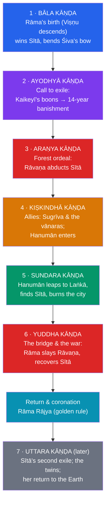

# 🏹 The Ramayana

> [!abstract] TL;DR
> The **Rāmāyaṇa** ("Rāma's journey") is the shorter of India's two great Sanskrit epics — roughly 24,000 verses in seven books (*kāṇḍas*), traditionally ascribed to the sage **Vālmīki** and revered as the **Ādikāvya**, the "first poem." It tells of **Rāma**, prince of Ayodhyā and the seventh **avatāra of Viṣṇu**, who is unjustly exiled to the forest for fourteen years accompanied by his devoted wife **Sītā** and loyal brother **Lakṣmaṇa**. When the ten-headed demon-king **Rāvaṇa** of Laṅkā abducts Sītā, Rāma allies with the monkey (*vānara*) armies — above all the boundlessly devoted **Hanumān** — builds a bridge to Laṅkā, slays Rāvaṇa, and recovers Sītā, returning to rule a golden age (*Rāma Rājya*). Beneath the adventure the epic is a sustained meditation on **dharma** (righteous duty), **ideal kingship**, and **devotion** (*bhakti*). It remains intensely alive: **Diwali** celebrates Rāma's homecoming, **Dussehra**/Rāmlīlā re-enacts Rāvaṇa's defeat, and retellings from Tulsīdās's Hindi *Rāmcaritmānas* to the Thai *Rāmakien* span all of South and Southeast Asia.

## Intuition — analogy first

The Rāmāyaṇa is, structurally, a near-textbook run of the monomyth — but its true subject is not the adventure; it is **the cost of being perfect**.

Most hero-tales ask *will the hero win?* The Rāmāyaṇa mostly answers *yes* — Rāma is an incarnate god and never really in doubt. Its animating question is instead *what does flawless duty demand, and what does it cost the one who pays it?* Rāma accepts a fourteen-year exile without a murmur because a *son's* dharma requires honouring his father's word; Sītā follows because a *wife's* dharma binds her to her husband; Bharata rules only as regent, enthroning Rāma's sandals, because a *brother's* dharma forbids usurping. The plot's engine is not desire but **obligation**, and its most painful moments come when *dharmas collide* — when doing right by the kingdom means doing wrong by Sītā.

So read it as a hero's journey whose "boon" is not treasure but a **model of conduct**: Rāma is *maryādā puruṣottama*, "the perfect man who observes all boundaries." The comparative point is sharp — the structure is the universal adventure of departure, ordeal, and return (see [[The_Heros_Journey]]), but the *content* is a specifically Indian catechism of duty. The dazzling monkey armies and flying demons are the sugar; **dharma** is the medicine.

---

## The Arc of Rāma's Journey (the Seven Kāṇḍas)

## Key Concepts

### Vālmīki and the Ādikāvya

Tradition credits the epic to **Vālmīki**, a sage said to have invented the **śloka** metre out of grief (*śoka*) on seeing a hunter kill one of a pair of mating cranes — making sorrow the very source of poetry. His work is honoured as the **Ādikāvya**, the first true *kāvya* (ornate poem), distinguishing it from the more sprawling, encyclopaedic [[The_Mahabharata]]. In its layered composition (roughly 5th c. BCE to the early centuries CE) the framing books (**Bāla** and **Uttara Kāṇḍas**) — which most explicitly identify Rāma as **Viṣṇu** — are generally later additions to an older heroic core.

### The story in brief

**Rāma**, eldest son of King **Daśaratha** of Ayodhyā, wins **Sītā** by stringing the great bow of Śiva. On the eve of his coronation, his stepmother **Kaikeyī** invokes two old boons to have her own son **Bharata** crowned instead and Rāma exiled for fourteen years. Rāma obeys without protest; Sītā and **Lakṣmaṇa** join him in the forest. There the demoness Śūrpaṇakhā (Rāvaṇa's sister) is spurned and mutilated by Lakṣmaṇa, and in revenge **Rāvaṇa** lures Rāma away with a golden deer and abducts Sītā to **Laṅkā**. Searching, Rāma allies with the exiled monkey-king **Sugrīva**; his minister **Hanumān** leaps the ocean, finds Sītā captive in the *aśoka* grove, and burns Laṅkā. The *vānara* host builds a causeway (**Rāma Setu**) to the island, and in a great war Rāma kills Rāvaṇa and recovers Sītā. They return to Ayodhyā for a joyous coronation and the ideal reign of **Rāma Rājya**.

### Rāma — ideal man and reluctant god

Rāma is the **seventh avatāra of Viṣṇu**, descended to rid the earth of Rāvaṇa (see [[Avatars_Yugas_and_Cosmic_Cycles]]) — yet for most of the poem he acts and suffers as a *man*, often unaware of his own divinity. This is deliberate: he is the **maryādā puruṣottama**, the exemplary human who upholds every boundary of dharma even when it wounds him. His unwavering obedience makes him a moral paragon; it also sets up the epic's most searching problem, when the duties of a *king* clash with those of a *husband*.

### Sītā — devotion and its trials

**Sītā**, daughter of King **Janaka** and found by him in a furrow (hence *Bhūmijā*, "earth-born"), is an incarnation of **Lakṣmī**. She embodies steadfast fidelity (*pativratā*) and quiet strength in captivity, refusing Rāvaṇa absolutely. But her story is also the epic's rawest moral wound: after the war Rāma requires her to prove her purity by ordeal (the **agni parīkṣā**, trial by fire), and in the later Uttara Kāṇḍa, bowing to public gossip, he **banishes her while pregnant**. She raises the twins **Lava** and **Kuśa**, and at last, vindicated, asks her mother the Earth to receive her — and vanishes into the ground. Modern readers and many traditional women's retellings read Sītā's trials as a pointed critique of the price a patriarchal ideal of kingship exacts from women.

### Hanumān and the flowering of bhakti

**Hanumān**, the *vānara* son of the wind-god **Vāyu**, is superhumanly strong, learned, and utterly devoted to Rāma. His book — the **Sundara Kāṇḍa**, the epic's most beloved — turns on his leap across the sea and his loyalty. Over time Hanumān became a major deity in his own right, the pattern of **bhakti** (loving devotion) and **sevā** (selfless service): the devotee who finds his whole self in service to the Lord. His cult is among the most popular in India today.

### Rāvaṇa — the learned demon

**Rāvaṇa**, the ten-headed **rākṣasa** king of Laṅkā, is no cartoon villain: he is a formidable scholar, a master of the Vedas and music, and a great devotee of **Śiva** who won near-invincibility through austerities. His tragic flaw is **hubris and unchecked desire** — the abduction of Sītā — which corrupts his gifts. His ambivalence (villain yet virtuoso, and in some South Indian and Sri Lankan traditions even a sympathetic or heroic figure) is a reminder that the epic's moral universe is richer than a simple good-versus-evil map.

### Dharma, kingship, and Rāma Rājya

The Rāmāyaṇa is Hinduism's great **poem of dharma**: it dramatises duty at every level — filial, marital, fraternal, and royal. Its political ideal, **Rāma Rājya**, a reign of perfect justice, prosperity, and harmony, became a lasting touchstone of Indian statecraft and was famously invoked by **Gandhi**. Yet the epic does not pretend dharma is simple: Rāma's killing of Vālī from ambush, and above all his treatment of Sītā, are staged as genuine dilemmas where competing duties cannot all be honoured.

| Character | Role | Significance |
|---|---|---|
| **Rāma** | Prince of Ayodhyā; 7th avatāra of Viṣṇu | The ideal man (*maryādā puruṣottama*) |
| **Sītā** | Rāma's wife; incarnation of Lakṣmī | Fidelity, and the epic's moral conscience |
| **Lakṣmaṇa** | Rāma's brother | Loyalty; shares the exile |
| **Bharata** | Rāma's brother | Rules as regent via Rāma's sandals — anti-usurpation |
| **Hanumān** | *Vānara*, son of Vāyu | The exemplar of *bhakti* and service |
| **Rāvaṇa** | Rākṣasa king of Laṅkā | Learned but hubristic antagonist |
| **Daśaratha / Kaikeyī** | Rāma's father / stepmother | The broken promise that sets exile in motion |

## Primary Sources & Examples

- **Vālmīki's Sanskrit *Rāmāyaṇa*** — the source text; note that the identification of Rāma with Viṣṇu is strongest in the framing books, suggesting an older heroic layer later theologised.
- **Tulsīdās, *Rāmcaritmānas*** (16th c., Awadhi/Hindi) — the devotional retelling that shapes most of North Indian popular Rāma piety and the Rāmlīlā stage.
- **Kampan, *Irāmāvatāram*** (12th c., Tamil) — the great South Indian retelling, differing markedly in tone and detail.
- **Southeast Asian versions** — the Thai **Rāmakien**, the Indonesian/Javanese **Kakawin Rāmāyaṇa** and its shadow-puppet (*wayang*) traditions, the Cambodian **Reamker** — evidence of the epic's vast diffusion.
- **A. K. Ramanujan, "Three Hundred Rāmāyaṇas"** — the classic essay on the epic's plurality; there is no single "the Rāmāyaṇa" but a living tradition of tellings.
- **Living festivals** — **Diwali** (Rāma's return to Ayodhyā), **Dussehra/Vijayadaśamī** (burning of Rāvaṇa effigies), and the annual **Rāmlīlā** pageants.

## Common Pitfalls / Misconceptions

- **Treating it as a fixed, single text.** The Rāmāyaṇa is a *tradition of retellings* across languages, religions (there are Jain and Buddhist versions), and centuries, often with sharply different values — not one canonical book.
- **Flattening Rāvaṇa into pure evil.** He is a learned, powerful, Śiva-devoted king whose *hubris* undoes him; several regional traditions treat him sympathetically.
- **Overlooking the moral difficulty of Sītā's ordeal.** The *agni parīkṣā* and her banishment are not incidental; they are the epic's deepest ethical problem and a focus of feminist and folk retellings.
- **Assuming the "monkeys" are comic relief.** The *vānaras*, and Hanumān above all, carry the epic's central theme of devotion; Hanumān is a major god.
- **Confusing it with the Mahābhārata.** The Rāmāyaṇa is shorter, more unified, and more idealising; the [[The_Mahabharata]] is vaster and morally murkier. See the contrast below.

## Related Concepts

- [[_MOC_Hindu_Vedic_Myth|↑ Section MOC]] — the dharma-epic of Rāma
- [[The_Mahabharata]] — the companion epic; where the Rāmāyaṇa idealises dharma, the Mahābhārata problematises it
- [[Avatars_Yugas_and_Cosmic_Cycles]] — Rāma as Viṣṇu's seventh descent, set in the **Tretā Yuga**
- [[The_Heros_Journey]] — the Rāmāyaṇa mapped onto the monomyth of departure, ordeal, and return
- Cross-vault: [[_MOC_Comparative_Mythology|Comparative Mythology]] — abduction-and-rescue and bride-quest patterns across epics

## Review Questions

1. The Rāmāyaṇa's plot is driven by **obligation** rather than desire. Illustrate this with the choices of Rāma, Sītā, and Bharata at the start of the exile.
2. Map the seven *kāṇḍas* onto the stages of [[The_Heros_Journey]]. Where does the epic fit the monomyth cleanly, and where does its theological content pull against the universal structure?
3. Why do many modern and traditional retellings dwell on **Sītā's trials**? What tension between the *king's* dharma and the *husband's* dharma do they expose?

## Sources

- Goldman, R. P., et al. (trans.) (1984–2017). *The Rāmāyaṇa of Vālmīki: An Epic of Ancient India* (7 vols.). Princeton University Press
- Ramanujan, A. K. (1991). "Three Hundred Rāmāyaṇas: Five Examples and Three Thoughts on Translation," in *Many Rāmāyaṇas*, ed. P. Richman. University of California Press
- Doniger, W. (2009). *The Hindus: An Alternative History*. Penguin Press
- Pollock, S. (2007). *The Rāmāyaṇa of Vālmīki, Vol. 2: Ayodhyākāṇḍa* (introduction). Princeton University Press

#mythology #hindu-vedic-myth #epic #ramayana #dharma
