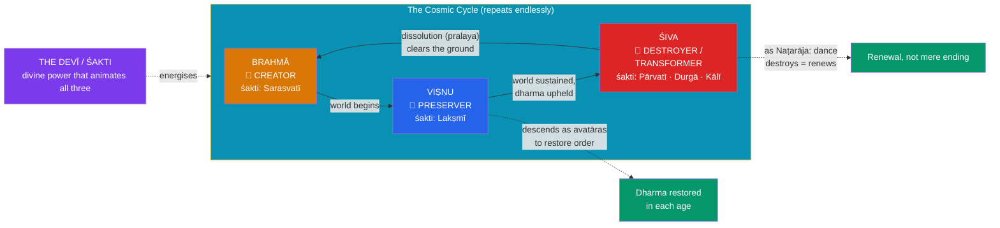

# 🔱 The Trimurti

> [!abstract] TL;DR
> The **Trimūrti** ("three forms") is classical Hinduism's image of the divine as a **functional triad** governing the cosmic cycle: **Brahmā** the *creator*, **Viṣṇu** the *preserver*, and **Śiva** the *destroyer/transformer*. Each is paired with a goddess (*devī*) who is his active power (*śakti*): **Sarasvatī** (knowledge) with Brahmā, **Lakṣmī** (fortune) with Viṣṇu, and **Pārvatī** — with her fierce forms **Durgā** and **Kālī** — with Śiva. Crucially, the Trimūrti is a **later synthesis**, a Purāṇic-era (roughly Gupta period, 4th–6th c. CE) schema that harmonised previously distinct cults; it never described how Hindus actually worship. In practice each major sect elevates *its* god to the supreme absolute (*Brahman*) and subordinates the other two: **Vaiṣṇavas** make Viṣṇu supreme, **Śaivas** make Śiva supreme, and **Śāktas** make the Goddess supreme. Brahmā, oddly, is barely worshipped at all. The triad is thus best read as a theological *diagram* of cosmic function rather than a lived pantheon — a Hindu instance of the recurring mythic **triad**.

## Intuition — analogy first

Think of the Trimūrti as **three shifts running one factory that never closes**.

A continuously operating plant needs someone to *build and start up* a production line, someone to *run and maintain* it while it operates, and someone to *shut it down and clear the floor* so the next line can be built. These are not three rival owners; they are three **phases of a single process**, and the process is *cyclical* — teardown is simply the precondition for the next build. Hindu cosmology is emphatically **cyclical**, not linear (see [[Avatars_Yugas_and_Cosmic_Cycles]]), so it needs exactly this three-phase engine: **Brahmā** starts the universe up, **Viṣṇu** keeps it running and rescues it when it wobbles, and **Śiva** dissolves it so it can begin again.

But the analogy has a twist that is the key to understanding the Trimūrti sociologically. In a real factory the three shifts are equal. In lived Hinduism they are *not*: a Vaiṣṇava sees Viṣṇu as the *owner* who merely delegates the other two shifts, while a Śaiva says the same of Śiva. The neat, balanced triad is a **map drawn from above** to reconcile communities who each, on the ground, insist their god runs the whole factory. Comparative mythologists recognise the pattern immediately — the pull toward organising divinity into **threes** (see [[The_Comparative_Method]]).

---

## The Cosmic Cycle as a Three-Phase Engine

## Key Concepts

### Brahmā — the creator who is not worshipped

**Brahmā** (masculine; not to be confused with the neuter absolute **Brahman** or the priestly **brāhmaṇa**) is the four-headed creator, often depicted emerging on a lotus from **Viṣṇu's navel**, or born from the golden cosmic egg (**Hiraṇyagarbha**); he grows out of the Vedic **Prajāpati**. His four faces recite the four Vedas; his consort is **Sarasvatī**; his mount (*vāhana*) is the *haṃsa* (goose/swan). Remarkably, despite his exalted role, Brahmā has **almost no active cult** — famously only a handful of temples (most notably **Puṣkar** in Rajasthan). Various myths *explain* this absence (a curse for pride or for lusting after his own creation), but structurally the reason is clear: **creation is a one-time, completed act each cycle**, so a god of it offers little to ongoing devotion, whereas a *preserver* and a *transformer* are perpetually relevant.

### Viṣṇu — the preserver

**Viṣṇu** is the sustainer of the cosmos and the guardian of **dharma**. When order decays he **descends** into the world as an **avatāra** (see [[Avatars_Yugas_and_Cosmic_Cycles]]). Between cycles he reclines in cosmic sleep (*yoganidrā*) on the coils of the serpent **Śeṣa (Ananta)** upon the ocean of milk. His emblems are the conch (*śaṅkha*), discus (*cakra*, the Sudarśana), mace (*gadā*), and lotus (*padma*); his mount is the eagle **Garuḍa**; his consort is **Lakṣmī**. His cult, **Vaiṣṇavism**, is the largest Hindu tradition, focused above all on his avatāras **Rāma** and **Kṛṣṇa**.

### Śiva — destroyer and transformer

**Śiva** (from the Vedic **Rudra**) is the most paradoxical member of the triad: simultaneously the **ascetic yogi** motionless on Mount Kailāsa and the ecstatic **Naṭarāja** whose *Tāṇḍava* dance destroys the universe; the terrifying lord of cremation grounds and the benevolent giver of boons. His "destruction" is better read as **transformation and renewal** — the dissolution (*pralaya*) that makes the next creation possible. He is worshipped chiefly in the aniconic **liṅga**; his marks are the third eye, the crescent moon and the **Ganges** in his matted hair, the trident (*triśūla*), and the drum (*ḍamaru*); his mount is the bull **Nandi**; his consort is **Pārvatī**. His cult is **Śaivism**.

### The Devī — Sarasvatī, Lakṣmī, and Pārvatī/Durgā/Kālī

In Hindu theology the god is inert without his **śakti** — the feminine *power* that makes him act. Each member of the triad is thus paired with a goddess:

- **Sarasvatī** — goddess of knowledge, speech, music, and the arts, consort of Brahmā.
- **Lakṣmī (Śrī)** — goddess of wealth, fortune, and beauty, consort of Viṣṇu (and herself incarnate as Sītā and Rādhā alongside his avatāras).
- **Pārvatī** — the mountain-daughter and consort of Śiva, mother of Gaṇeśa and Skanda; in her fierce aspects she becomes **Durgā**, the warrior who slays the buffalo-demon Mahiṣāsura, and **Kālī**, the black goddess of time and death who dances on Śiva's body.

For the **Śākta** tradition these are not mere consorts but faces of the one supreme **Mahādevī**, celebrated in the *Devī Māhātmya*: here the Goddess, not any of the three male gods, is the ultimate reality — a decisive corrective to reading the Trimūrti as an exhaustive account of Hindu divinity.

| Member | Function | Consort (*śakti*) | Mount (*vāhana*) | Emblems / marks | Sectarian cult |
|---|---|---|---|---|---|
| **Brahmā** | Creation | **Sarasvatī** | *Haṃsa* (goose) | Four heads, Vedas, water-pot | (almost none) |
| **Viṣṇu** | Preservation | **Lakṣmī** | **Garuḍa** (eagle) | Conch, discus, mace, lotus | **Vaiṣṇavism** |
| **Śiva** | Destruction / renewal | **Pārvatī / Durgā / Kālī** | **Nandi** (bull) | Trident, third eye, crescent, *liṅga* | **Śaivism** |

### The Trimūrti as a later synthesis

The unified, *balanced* Trimūrti is **not Vedic and not primordial**. In the Rigveda, Viṣṇu is minor and Śiva exists only as the germ **Rudra** (see [[Vedic_Deities_and_Cosmology]]); Brahmā develops from Prajāpati only in the later texts. The three-in-one formula crystallises in the **Purāṇas and epics**, reaching its familiar form around the **Gupta era**, as a way of **harmonising** rising sectarian cults into a single cosmological scheme. Its most compact expression is the god **Dattātreya** (an incarnation of all three) and the *Om*-symbolism that assigns the three sounds A-U-M to the three functions. But the schema was always something of a diplomat's compromise:

### Śaivism, Vaiṣṇavism, and Śāktism

In lived Hinduism the triad's *equality* dissolves. Each great tradition (*sampradāya*) treats its own deity as the supreme **Brahman** and demotes the others to created or subordinate beings:

- **Vaiṣṇavas** hold Viṣṇu supreme; Brahmā is born from *his* navel and Śiva is his agent of dissolution.
- **Śaivas** hold Śiva supreme; some texts even show him beheading Brahmā or humbling Viṣṇu (the *liṅgodbhava* myth, in which neither Brahmā nor Viṣṇu can find the ends of Śiva's infinite pillar of light).
- **Śāktas** hold the **Devī** supreme, the source from whom even the three gods derive their power.
- The **Smārta** tradition, following Śaṅkara, sidesteps the rivalry with **pañcāyatana pūjā**, worshipping five deities (Viṣṇu, Śiva, Devī, Sūrya, Gaṇeśa) as equal aspects of the formless absolute.

So the Trimūrti is best understood as a *theological abstraction* of cosmic **function**, layered over a devotional landscape in which one god is almost always, for the worshipper, the whole.

## Examples Across Cultures — the pull toward triads

The impulse to organise divinity or cosmic function into **threes** recurs widely, and the comparative method (see [[The_Comparative_Method]]) warns us to weigh the differences as carefully as the similarities:

- **Dumézil's trifunctional hypothesis**: the Indo-European *sovereignty–force–fecundity* triad (Varuṇa/Indra/Aśvins in Vedic terms). This is a triad of **social functions** and is only loosely echoed by the Trimūrti's **cosmic-process** functions — an instructive near-miss rather than a match.
- **The Christian Trinity**: Father, Son, and Holy Spirit. A superficial parallel that is metaphysically *opposite* — the Trinity asserts **one God in three consubstantial persons** (*homoousios*), whereas the Trimūrti is (in the abstract) **three distinct deities** as three functions, and in practice a hierarchy. Conflating the two is a classic comparative error.
- **Egyptian triads**: family groupings such as **Osiris–Isis–Horus** (father–mother–child) organise divinity by three, but by *kinship*, not cosmic function.
- **Greek "division of the cosmos"**: Zeus (sky), Poseidon (sea), Hades (underworld) split *domains* among brothers — again a triad, again a different logic.

The lesson is Lévi-Straussian: the *number three* is a favourite of the mythmaking mind, but each culture fills it with its own oppositions and mediations.

## Common Pitfalls / Misconceptions

- **"The Hindu Trinity."** The label imports Christian assumptions. The Trimūrti is neither one substance in three persons nor, in practice, three co-equal gods; it is a *functional schema* over a devotional hierarchy.
- **Assuming Hindus worship all three equally.** They generally do not. Most Hindus are Vaiṣṇava, Śaiva, or Śākta and treat *one* deity as supreme; **Brahmā is scarcely worshipped at all**.
- **Confusing Brahmā, Brahman, and brāhmaṇa.** *Brahmā* is the creator-god; *Brahman* is the impersonal absolute of the Upaniṣads; a *brāhmaṇa* is a priest/member of the priestly class. Three different words.
- **Reading Śiva as pure "evil destroyer."** Śiva's destruction is *transformative and regenerative* — the necessary clearing before renewal — and he is equally the great ascetic, healer, and boon-giver. He is not a Hindu Satan.
- **Treating the goddesses as mere consorts.** In Śākta theology the **Devī** is the supreme reality and the source of the gods' power (*śakti*), not an accessory to a male deity.
- **Backdating the triad into the Vedas.** The balanced Trimūrti is a Purāṇic synthesis; the Rigveda knows no such structure.

## Related Concepts

- [[_MOC_Hindu_Vedic_Myth|↑ Section MOC]] — the classical triad at the centre of this section
- [[Vedic_Deities_and_Cosmology]] — the older pantheon (Rudra, a minor Viṣṇu, Prajāpati) out of which the Trimūrti grew
- [[Avatars_Yugas_and_Cosmic_Cycles]] — Viṣṇu's preserving function in action, and the cyclical time the three-phase engine drives
- [[The_Comparative_Method]] — Dumézil's trifunctional hypothesis and the comparative study of divine **triads**
- Cross-vault: [[_MOC_Comparative_Mythology|Comparative Mythology]] — the wider debate over why triadic structures recur

## Review Questions

1. Why is **Brahmā**, though the creator, barely worshipped, while **Viṣṇu** and **Śiva** anchor the two largest Hindu traditions? Answer in terms of the *cyclical* cosmology.
2. Explain the sense in which the Trimūrti is a **later synthesis** rather than a lived pantheon, and how **Vaiṣṇavism**, **Śaivism**, and **Śāktism** each undercut the triad's supposed equality.
3. Compare the Trimūrti with the **Christian Trinity** and with **Dumézil's trifunctional triad**. Which is the more misleading parallel, and why?

## Sources

- Flood, G. (1996). *An Introduction to Hinduism*. Cambridge University Press
- Doniger, W. (2009). *The Hindus: An Alternative History*. Penguin Press
- Kramrisch, S. (1981). *The Presence of Śiva*. Princeton University Press
- Kinsley, D. (1988). *Hindu Goddesses: Visions of the Divine Feminine in the Hindu Religious Tradition*. University of California Press

#mythology #hindu-vedic-myth #trimurti #puranic #comparative
