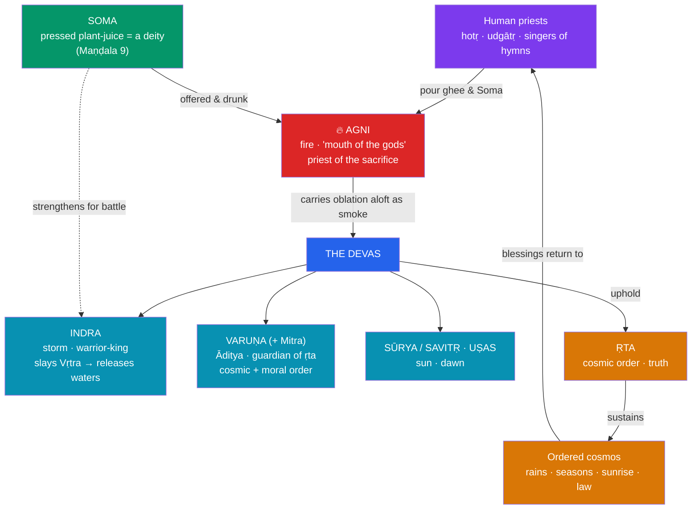

# 🔥 Vedic Deities and Cosmology

> [!abstract] TL;DR
> The **Rigveda** (c. 1500–1200 BCE) is the oldest layer of Indian religion — 1,028 hymns (*sūktas*) in ten books (*maṇḍalas*), composed by the Indo-Aryans and addressed to a pantheon of nature-linked **devas**. Its central figures are **Indra**, the *Soma*-drinking warrior-king who slays the drought-serpent **Vṛtra** to release the waters; **Agni**, the fire-god who as the "mouth of the gods" carries every offering skyward and so is the hinge of the sacrifice; and **Varuṇa**, the stern **Āditya** who guards ***ṛta***, the cosmic-and-moral order. Around them stand **Sūrya** (sun), **Uṣas** (dawn), **Soma** (a pressed ritual drink that is also a god), **Rudra**, and a minor **Viṣṇu**. Vedic religion centres not on temples or images but on the **yajña**, the fire-sacrifice that keeps the cosmos running. Over a millennium this sacrificial, henotheistic world receded: Indra and Varuṇa faded, *ṛta* matured into ***dharma***, and the later **Purāṇic Hinduism** of Viṣṇu, Śiva, and devotion (*bhakti*) rose in its place.

## Intuition — analogy first

Think of the Vedic gods less as a royal court and more as a **power grid that must be actively kept switched on**.

In later theistic religions the cosmos, once created, tends to run on its own; the worshipper's job is mainly moral and devotional. In the Vedic world the order of things is not a given but an **achievement that has to be renewed every dawn**. The sun must be coaxed back up, the monsoon rains must be released from the demon that hoards them, the boundary between truth and falsehood must be re-secured. The **sacrifice** is the utility company that does this work: the priest pours butter and *Soma* into the fire, **Agni** conducts the offering up to the gods like a current along a wire, the gods are strengthened, and in return they **uphold ṛta** — the seasons, the rains, the daily sunrise, the moral law. Gods and humans are locked in a reciprocal circuit (*do ut des*, "I give so that you may give").

This is why Vedic religion has almost no mythology of *ends* and a vast mythology of *maintenance*. And it is why the comparative mythologist reaches straight for the Rigveda: its gods preserve the clearest surviving snapshot of **Proto-Indo-European** religion, cousins to the Greek, Roman, Norse, and Iranian pantheons. See [[The_Comparative_Method]].

---

## How the Vedic Cosmos Runs: The Circuit of Sacrifice

## Key Concepts

### The Rigveda and the Vedic layer

The **Veda** ("knowledge") is a body of *śruti* ("that which is heard," revealed) texts transmitted orally with extraordinary fidelity for millennia. Four collections (*saṃhitās*) developed — the **Rigveda** (hymns of praise), **Sāmaveda** (melodies), **Yajurveda** (sacrificial formulae), and **Atharvaveda** (spells and domestic rites) — each later extended by prose **Brāhmaṇas** (ritual manuals), **Āraṇyakas**, and the philosophical **Upaniṣads**. The **Rigveda** is the oldest and the mythological core: 1,028 hymns to some thirty-odd principal deities, its "family books" (Maṇḍalas 2–7) the most archaic, its late Maṇḍala 10 already turning speculative and cosmogonic.

Vedic worship of the gods is characteristically **henotheistic** (Max Müller's term, also *kathenotheism*): whichever deity a hymn addresses is, for the space of that hymn, exalted as supreme — Agni is called the greatest, then Indra is, then Varuṇa is — without any claim that the others do not exist. It is neither tidy polytheism nor monotheism, and it foreshadows the later Hindu intuition that many gods are faces of one reality.

### Indra — warrior-king of the gods

**Indra** receives more Rigvedic hymns than any other god (roughly a quarter of the collection). He is the archetypal **Indo-European storm-and-war god** — boisterous, *Soma*-drunk, wielding the **vajra** (thunderbolt) forged by Tvaṣṭṛ. His defining deed is the slaying of **Vṛtra**, the serpent-demon who coils around the mountains and withholds the cosmic waters; Indra smashes him and the pent-up rivers (and, by extension, the monsoon and fertility) burst free. The **Vṛtra-slaying** is a *creation-through-combat* myth — a **Chaoskampf** — comparable to the Norse Thor, the Hittite storm-god, and the Canaanite Baal against the sea. Indra is the divine warrior who guarantees the second, *martial* function in Dumézil's trifunctional scheme (see [[The_Comparative_Method]]).

### Agni — fire and the logic of sacrifice

**Agni** ("fire," cognate with Latin *ignis*) is the second most-invoked god and the true pivot of Vedic religion. He is the **fire on the altar**, but also the sun, lightning, and the digestive heat in living beings — the same power in three worlds. Because the sacrificial fire literally consumes the offering and sends its smoke skyward, Agni is the **mediator** between humans and gods: the **priest of the gods and the god of the priests**, the "mouth" through which the *devas* eat. No offering reaches heaven except through him. This makes Agni less a personality than a *function* — the channel that makes the whole reciprocal economy of the **yajña** possible.

### Varuṇa and ṛta — cosmic and moral order

**Varuṇa**, often paired with **Mitra** (Mitra-Varuṇa), is the chief of the **Ādityas** and the most ethically charged of the Vedic gods. He is the guardian of ***ṛta*** — the deep principle of *order*, *truth*, and *regularity* that makes the heavens turn, the rivers flow, and oaths bind. Varuṇa is an all-seeing sovereign who binds sinners and liars with his **nooses** (*pāśa*) and afflicts them with disease (dropsy); Rigvedic hymns to him carry a note of *guilt* and *plea for forgiveness* unusual in the collection. Where Indra embodies force, Varuṇa embodies the **magico-juridical sovereignty** of the first function. His ***ṛta*** is the direct ancestor of the later, all-important concept of ***dharma***.

### Sūrya, Soma, and the wider pantheon

- **Sūrya** the sun, and his aspects **Savitṛ** (the "impeller") and **Vivasvat**; **Uṣas**, the radiant dawn-goddess whom Müller made the flagship of his "solar mythology."
- **Soma**: simultaneously a plant, the pressed **ritual drink** (possibly entheogenic) offered and consumed at the sacrifice, and a **deity** — the entire ninth Maṇḍala (*Soma Pavamāna*) is devoted to it; later identified with the moon.
- **Rudra**, the fierce, ambivalent archer of storms and disease — the Vedic seed that grows into the classical **Śiva**.
- A *minor* **Viṣṇu**, notable mainly for the **Three Strides** (*Trivikrama*) that measure out the cosmos — a small role that will expand enormously.
- **Yama** (first mortal, lord of the dead), the healing twin **Aśvins**, **Vāyu** (wind), **Dyaus Pitṛ** ("Sky Father," cognate with **Zeus** and **Jupiter**), and the storm-band **Maruts**.

| Deity | Sphere | Signature myth / role | Later fate |
|---|---|---|---|
| **Indra** | Storm, war, kingship | Slays Vṛtra, frees the waters | Demoted to a lesser king of a lower heaven |
| **Agni** | Fire, sacrifice | Mediator; carries offerings to gods | Remains in ritual; loses mythic centrality |
| **Varuṇa** | Cosmic/moral order (*ṛta*) | Binds sinners; guards truth | Shrinks to a god of the ocean/waters |
| **Sūrya / Uṣas** | Sun / dawn | Daily renewal of light | Surya survives in worship and the Gāyatrī |
| **Soma** | Ritual drink / ecstasy | The oblation that is itself divine | Merges with the moon (*Candra*) |
| **Rudra** | Storms, disease, wildness | Feared archer, "the howler" | Grows into **Śiva** |
| **Viṣṇu** | Cosmic space | The Three Strides | Rises to supreme preserver-god |

### From Vedic to Purāṇic Hinduism

The religion of the Rigveda is not the Hinduism of today, and the difference is the single most important thing to grasp. Over roughly a thousand years several shifts compound:

1. **Ritual hypertrophy, then interiorisation.** The **Brāhmaṇas** turned the *yajña* into an intricate, all-powerful technology; the **Upaniṣads** then turned *inward*, reframing the true sacrifice as knowledge of the identity of the self (*ātman*) with the absolute (*brahman*), and foregrounding **karma** and **rebirth** — concepts nearly absent from the Rigveda.
2. **A changing of the guard.** The Vedic headliners — Indra, Varuṇa, Agni — recede into ritual formulae, while the once-minor **Viṣṇu** and the Vedic **Rudra** (as **Śiva**) ascend, and **Prajāpati**, the "lord of creatures," evolves toward the creator **Brahmā**.
3. **From sacrifice to devotion and image.** The fire-altar gives way to **temple worship**, *mūrti* (image) veneration, and personal **bhakti**. Cosmic order (*ṛta*) is fully absorbed into **dharma**, and the mythology of *maintenance* is joined by the vast Purāṇic mythology of **avatāras** and **cosmic cycles** (see [[Avatars_Yugas_and_Cosmic_Cycles]]) and the functional triad of the [[The_Trimurti]].

## Primary Sources & Examples

- **The Vṛtra myth** (esp. *Rigveda* 1.32, "Indra's heroic deeds"): the paradigmatic combat that releases the waters — a Chaoskampf read comparatively alongside Baal–Yam and Thor–Jörmungandr.
- **The Puruṣa Sūkta** (*RV* 10.90): the cosmic **Primal Man** (*Puruṣa*) is dismembered in a sacrifice, and from his body the world, the gods, and the four social classes (*varṇas*) emerge — a *creation-by-sacrifice* cosmogony and the earliest textual charter of the caste order.
- **The Nāsadīya Sūkta** (*RV* 10.129, the "Hymn of Creation"): a famously **skeptical** cosmogony — "then there was neither non-existence nor existence... who really knows, who can here declare it?" — that ends by wondering whether even the gods, born after creation, can know its origin.
- **Uṣas hymns** (*RV* Maṇḍala 6, etc.): the dawn-goddess whose recurring rescue by the sun Müller (over)read as the master-key "solar myth."
- **Comparative Indo-European parallels**: *Dyaus Pitṛ* ≈ Zeus/Jupiter (sky-father); the *Aśvins* ≈ the Greek Dioskouroi (divine twins); Varuṇa–Indra–Aśvins mapping onto the **trifunctional** sovereignty–force–fecundity triad.

## Common Pitfalls / Misconceptions

- **Projecting modern Hinduism backwards.** The Rigveda has *no* dominant Brahmā–Viṣṇu–Śiva triad, no temples, almost no image-worship, and only faint traces of karma and rebirth. Treating it as "early Hinduism" in the temple-and-*bhakti* sense is anachronistic; it is better read as a distinct, Indo-European sacrificial religion that Hinduism grew *out of*.
- **Calling it flat polytheism.** Vedic worship is **henotheistic**: the exaltation of each god in turn is a real feature, not sloppy inconsistency, and it anticipates the later "one reality, many faces" theology.
- **Confusing Soma the drink with Soma the moon.** In the Rigveda *Soma* is the pressed sacrificial plant/juice and its deity; the identification with the **moon** is a *later* development.
- **Mistaking Indra's later demotion for Vedic unimportance.** In classical myth Indra is a fallible, often-humbled king of a minor heaven — but in the Rigveda he is the supreme hero. The demotion is itself a marker of the Vedic-to-Purāṇic transition.
- **Reading Vedic gods as purely "nature symbols."** Müller's solar reductionism is discredited (see [[The_Comparative_Method]]); Varuṇa's ethical sovereignty and Agni's ritual function are not reducible to personified weather.

## Related Concepts

- [[_MOC_Hindu_Vedic_Myth|↑ Section MOC]] — the oldest layer, from which the rest of the section unfolds
- [[The_Trimurti]] — the classical creator–preserver–destroyer triad that *replaces* the Vedic pantheon at the centre
- [[Avatars_Yugas_and_Cosmic_Cycles]] — Purāṇic cyclical time and Viṣṇu's descents, the mature form of this cosmology
- [[The_Comparative_Method]] — Dumézil's trifunctional reconstruction and Müller's solar mythology both draw their key evidence from the Rigveda
- Cross-vault: [[_MOC_Comparative_Mythology|Comparative Mythology]] — the Indo-European family to which these gods belong

## Review Questions

1. Explain how the **yajña** creates a reciprocal "circuit" between humans and gods, and why **Agni** rather than Indra or Varuṇa is the indispensable node in it.
2. Contrast **Indra** and **Varuṇa** as, respectively, the *force* and the *sovereignty* poles of the pantheon. How does Varuṇa's ***ṛta*** relate to the later concept of ***dharma***?
3. Name three concrete ways the religion of the Rigveda differs from later Purāṇic/temple Hinduism, and identify what drove each shift.

## Sources

- Doniger, W. (trans.) (1981). *The Rig Veda: An Anthology*. Penguin Classics
- Jamison, S. W., & Brereton, J. P. (trans.) (2014). *The Rigveda: The Earliest Religious Poetry of India*. Oxford University Press
- Flood, G. (1996). *An Introduction to Hinduism*. Cambridge University Press
- Macdonell, A. A. (1897). *Vedic Mythology*. Trübner (Grundriss der indo-arischen Philologie)

#mythology #hindu-vedic-myth #vedic #rigveda #indo-european
