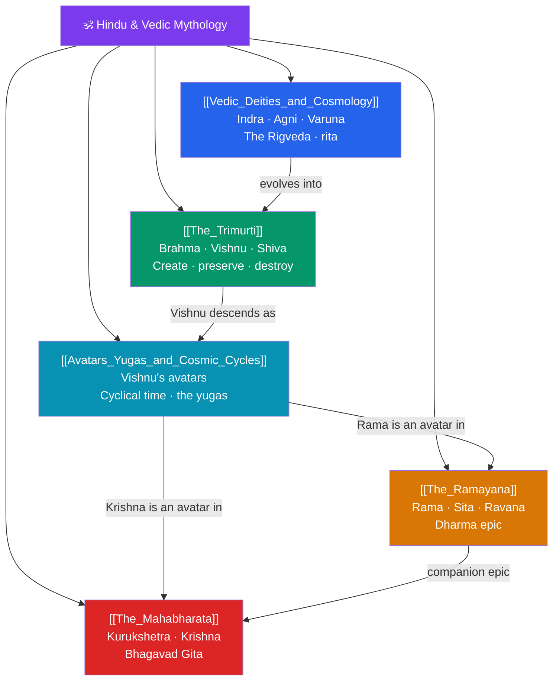

# 🕉️ Hindu & Vedic Mythology — Map of Content

> [!abstract] What This Section Covers
> The Indian tradition offers the world's longest continuous living mythology, spanning the ancient Vedic hymns to the epics still recited today. This section begins with **Vedic Deities and Cosmology** — the warrior Indra, fire-god Agni, and cosmic-order guardian Varuna of the *Rigveda* — then traces the shift to classical Hinduism's **Trimurti**, the functional triad of Brahma the creator, Vishnu the preserver, and Shiva the destroyer. Two great epics anchor the section: **The Ramayana**, the dharma-drama of Rama, Sita, and the demon-king Ravana; and **The Mahabharata**, the vast Kurukshetra war that frames the *Bhagavad Gita* and Krishna's counsel to Arjuna. Finally, **Avatars, Yugas, and Cosmic Cycles** ties the tradition together through Vishnu's descents and the immense cyclical time of the yugas. Together they reveal a mythology inseparable from the concepts of dharma, karma, and cyclical cosmic renewal.

## Concept Map

## Learning Path

1. [[Vedic_Deities_and_Cosmology]] — The oldest layer: Indra, Agni, Varuna, and the *Rigveda*'s cosmic order (*rita*).
2. [[The_Trimurti]] — The classical triad of Brahma, Vishnu, and Shiva and their cosmic functions.
3. [[Avatars_Yugas_and_Cosmic_Cycles]] — Vishnu's ten avatars and the vast cyclical time of the four yugas.
4. [[The_Ramayana]] — Valmiki's epic of Rama, Sita's abduction, Hanuman, and the war with Ravana.
5. [[The_Mahabharata]] — The Kurukshetra war, the Pandavas and Kauravas, and Krishna's *Bhagavad Gita*.

## All Notes at a Glance

| Note | Difficulty | What You'll Learn |
|------|------------|-------------------|
| [[Vedic_Deities_and_Cosmology]] | Beginner → Intermediate | Indra, Agni, Varuna, Soma, Ushas, the *Rigveda*, rita, Vedic sacrifice (yajna) |
| [[The_Trimurti]] | Beginner | Brahma the creator, Vishnu the preserver, Shiva the destroyer; Devi and the wider pantheon |
| [[The_Ramayana]] | Intermediate | Rama, Sita, Lakshmana, Hanuman, Ravana, dharma and ideal kingship, Valmiki |
| [[The_Mahabharata]] | Intermediate → Advanced | The Pandavas and Kauravas, Kurukshetra, Krishna, the *Bhagavad Gita*, dharma in crisis |
| [[Avatars_Yugas_and_Cosmic_Cycles]] | Intermediate | The Dashavatara, Satya/Treta/Dvapara/Kali yugas, kalpas, cyclical creation and dissolution |

## Key Questions This Section Answers

- How did the Vedic gods (Indra, Varuna) give way to the classical Trimurti?
- What do Brahma, Vishnu, and Shiva each represent in the cosmic cycle?
- How do the *Ramayana* and *Mahabharata* dramatize the concept of dharma?
- What is an avatar, and why does Vishnu descend into the world across the yugas?
- How does Hindu cyclical time differ from the linear time of Western traditions?

## Related Sections

- [[_MOC_Mythology_Master|↑ Mythology Master MOC]]
- [[_MOC_Celtic_Myth|← Celtic]]
- [[_MOC_East_Asian_Myth|→ East Asian]]
- Cross-vault: [[The_Heros_Journey]], [[The_Comparative_Method]] (shared Indo-European roots)

#MOC #Mythology #HinduVedicMyth
