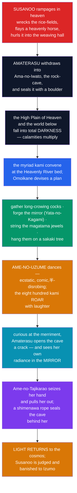

# ☀️ Amaterasu and the Kojiki

> [!abstract] TL;DR
> **Amaterasu-Ōmikami** (天照大御神), the **sun goddess**, is the pre-eminent kami of the Shinto pantheon and ruler of **Takamagahara**, the High Plain of Heaven. Born (with her brothers **Tsukuyomi**, the moon, and **Susanoo**, the storms) from the purification of Izanagi, she is the heart of two decisive myths. In the **heavenly rock-cave** myth, outraged by Susanoo's violence she **hides in a cave**, plunging the cosmos into darkness — until the myriad kami lure her out with a mirror and the raucous, comic dance of **Ame-no-Uzume**. And in the myth of **descent**, she sends her grandson **Ninigi** to rule the earthly realm with the **three sacred regalia**, so that the **Japanese imperial line claims unbroken descent from the sun goddess herself**. Both stories are preserved in Japan's oldest chronicles, the **Kojiki** (712 CE) and the **Nihon Shoki** (720 CE) — texts that turned myth into dynastic charter.

## Intuition — analogy first

Every ruling house wants an answer to the awkward question: *why you, and not someone else?* Some dynasties answer with conquest, some with a covenant, some with a bureaucratic "mandate" (see [[The_Chinese_Celestial_Bureaucracy]]). The Japanese answer is arguably the most audacious: **the emperor is the direct descendant of the sun**.

That single claim is what the Amaterasu cycle exists to establish, and it explains the shape of the myths. The **rock-cave** story dramatises that the world literally **cannot function without her light** — she is indispensable, cosmic, the source of order. The **descent of Ninigi** then hands that solar authority, sealed with sacred **regalia**, down to a specific bloodline. When the eighth-century court commissioned the **Kojiki** and **Nihon Shoki**, it was doing something a modern state does with a constitution: **writing the story that makes its authority feel inevitable**. Read this way, a sun-goddess hiding in a cave and a mirror on an altar are not quaint folklore but the load-bearing beams of a political order.

---

## How the Sun Returns — the Heavenly Rock Cave

## Key Concepts

### Amaterasu and her siblings — sun, moon, storm

When Izanagi purified himself after fleeing the underworld (see [[Japanese_Shinto_and_the_Kami]]), three "noble children" were born: **Amaterasu** from his **left eye**, **Tsukuyomi** (月読) from his **right eye**, and **Susanoo** (須佐之男) from his **nose**. Izanagi assigned each a domain — Amaterasu the **High Plain of Heaven** (Takamagahara) and the sun, Tsukuyomi the **night**, Susanoo the **seas**. Two features are notable:

- **Amaterasu is a *female* sun deity.** This inverts the more common pattern (across Indo-European and Near Eastern traditions) of a **male** sun and **female** moon — a favourite example for comparative mythologists.
- **The moon-god all but vanishes.** In the *Nihon Shoki*, Tsukuyomi kills the food-goddess **Ukemochi**, disgusting Amaterasu, who refuses ever to face him again — the etiology for why **sun and moon are never seen together**, day divided from night.

### Susanoo's rampage — the trigger

**Susanoo**, grieving for his mother Izanami and unwilling to govern the sea, ascends to heaven ostensibly to bid Amaterasu farewell. She suspects an invasion; they swear a trust-ordeal (*ukehi*), producing kami from his sword and her jewels. Claiming victory, Susanoo turns violent — he **breaks down the rice-paddy ridges**, **defiles the sacred hall**, and, most shockingly, **flays a heavenly piebald horse and hurls it through the roof of the weaving hall**, killing a weaving maiden. These are archetypal acts of **kegare** (pollution) and social transgression, and they drive Amaterasu into hiding.

### The heavenly rock-cave (*Ama-no-Iwato*)

Horrified and offended, **Amaterasu shuts herself in the heavenly rock-cave** (天岩戸, *Ama-no-Iwato*) and rolls a boulder across the entrance. The sun's withdrawal plunges **Takamagahara and the world below into darkness**, and myriad evils break loose — a mythic **eclipse / dying-and-returning-sun** motif. The eight hundred myriad kami gather at the bed of the Heavenly River, and the wise **Omoikane** designs a stratagem:

- long-crowing **cocks** are set to cry (heralding a false dawn);
- the smith and the jewel-maker forge the **mirror** (*Yata-no-Kagami*) and string the **magatama jewels**, hung with cloth on a **sakaki** tree;
- **Ame-no-Uzume** (天宇受売), goddess of mirth, overturns a tub, stamps on it in trance, and performs a wild, comic, partly disrobing **dance** that sends the assembled kami into thunderous **laughter**.

Puzzled that the kami are merry in the dark, Amaterasu opens the cave a crack to look. She sees a **radiant figure** in the mirror — her own reflection, which she takes for a rival deity — and edges out; the strong-armed **Ame-no-Tajikarao** seizes her and hauls her free, while a **shimenawa** rope is stretched across the cave to bar her return. **Light floods back** into the cosmos. Susanoo is then tried, fined, his beard and nails cut, and **banished** to Izumo — where he will slay the eight-headed serpent **Yamata-no-Orochi** and recover the sword **Kusanagi**.

### The imperial descent (*tenson kōrin*)

The myth's political payload is the **descent of the heavenly grandson** (*tenson kōrin*). Amaterasu resolves that her line should rule the **Central Land of Reed Plains** (earthly Japan). After the land is "pacified," she sends her grandson **Ninigi-no-Mikoto** down to Mount Takachiho, entrusting him with the **Three Sacred Treasures** — the imperial regalia that authenticate his authority:

| Regalia | Object | Virtue / meaning | Origin in myth |
|---|---|---|---|
| **Yata-no-Kagami** | the mirror | wisdom / the goddess herself | forged to lure Amaterasu from the cave |
| **Kusanagi-no-Tsurugi** | the "grass-cutting" sword | valour | drawn from the tail of Yamata-no-Orochi |
| **Yasakani-no-Magatama** | the comma-shaped jewel | benevolence | strung for the rock-cave rite |

Ninigi's great-grandson is **Jimmu** (神武天皇), the legendary **first emperor**. Thus the imperial house traces an **unbroken line to Amaterasu**, and the sun goddess is enshrined at the **Grand Shrine of Ise** (Ise Jingū), where the sacred mirror is said to reside. This descent doctrine became the ideological core of pre-war **State Shinto**; the Emperor **Shōwa (Hirohito)** formally renounced any claim to divinity in the 1946 *Ningen-sengen* ("Humanity Declaration").

### The Kojiki and the Nihon Shoki

Both myths survive because the early Yamato state had them **written down** as dynastic history. The two chronicles differ instructively:

| | **Kojiki** 古事記 (712) | **Nihon Shoki** 日本書紀 (720) |
|---|---|---|
| Meaning | "Records of Ancient Matters" | "Chronicles of Japan" |
| Compiler | Ō no Yasumaro, from the recitations of **Hieda no Are** | a court commission led by **Prince Toneri** |
| Language | hybrid Sino-Japanese (Japanese readings encoded in Chinese graphs) | formal **Classical Chinese** |
| Audience / aim | inward — the court's sacred genealogy | outward — a "proper" dynastic history in the East Asian mould |
| Distinctive feature | single continuous narrative | gives **multiple variant versions** ("*一書曰*, one book says…") |

Commissioned by **Emperor Tenmu** and completed under **Empress Genmei**, together they are called the **kiki** (記紀). Both begin with the age of the kami and descend, seamlessly, into the reigns of emperors — **fusing mythology and history so that the throne's legitimacy rests on the cosmos itself**.

## Primary Sources & Examples

- **Kojiki, Book 1** — the fullest narrative of the rock-cave and the descent of Ninigi; the source most cited for Shinto myth.
- **Nihon Shoki, Books 1–2** — the same myths in Classical Chinese, valuable for its **variant readings**, which let scholars see the mythology still in flux.
- **Ise Grand Shrine (Ise Jingū)** — the goddess's chief shrine, rebuilt every twenty years (*shikinen sengū*); traditional home of the sacred mirror.
- **Kagura and the Iwato dance** — Ame-no-Uzume's performance is regarded as the mythic origin of **kagura**, Shinto ceremonial dance still performed at shrines.

## Common Pitfalls / Misconceptions

- **"The sun god is male."** In Japan the sun is the **goddess Amaterasu**; the *moon* is the (male) Tsukuyomi. This inversion of the common pattern is a standard comparative talking-point, not a scribal error.
- **"The rock-cave story is just a nature allegory of a solar eclipse."** A solar/eclipse resonance is real, but the myth's *function* is political and ritual — it establishes Amaterasu's indispensability and models the festival (kagura) that recalls her.
- **"The Kojiki and Nihon Shoki are the same book."** They are **two separate chronicles**, eight years apart, differing in language, audience, and method — the *Nihon Shoki* notably preserving multiple conflicting versions.
- **"The regalia are just royal jewellery."** The **mirror, sword, and jewel** are the mythic tokens by which Amaterasu's authority passes to the imperial line; their meaning is **legitimating**, tying the throne directly to the cave myth and the serpent-slaying.
- **"Emperors were always worshipped as living gods."** The full *arahitogami* ("living kami") doctrine was intensified in the modern **State Shinto** era; it was explicitly renounced in **1946**.

## Related Concepts

- [[_MOC_East_Asian_Myth|↑ Section MOC]] — this note completes the Japanese pair in the section
- [[Japanese_Shinto_and_the_Kami]] — the immediate prequel: Izanagi's purification, from which Amaterasu, Tsukuyomi, and Susanoo are born
- [[The_Chinese_Celestial_Bureaucracy]] — an instructive contrast in dynastic legitimation: a delegated "mandate" and celestial office vs. literal solar descent
- [[Chinese_Creation_and_Pangu]] — neighbouring cosmogony, useful for comparing how each tradition grounds order
- Cross-vault: [[Functions_of_Myth]] — myth as **dynastic charter**, legitimising a ruling line; [[The_Comparative_Method]] — the female-sun / male-moon inversion as a comparative case

## Review Questions

1. Recount the heavenly rock-cave myth and explain its structure as a **dying-and-returning-sun** story. What roles do the **mirror** and **Ame-no-Uzume's dance** play, and why does Amaterasu ultimately emerge?
2. How does the myth of **Ninigi's descent** and the **three sacred regalia** legitimise the Japanese imperial line? Connect each regalium to its origin elsewhere in the Amaterasu cycle.
3. Compare the **Kojiki** and the **Nihon Shoki** along at least three dimensions (date, language, aim, method). Why did the eighth-century court want *both*, and what does the *Nihon Shoki*'s inclusion of variant versions tell us about the state of the mythology?

## Sources

- Ō no Yasumaro (712). *Kojiki* (trans. Donald L. Philippi, 1968; or Gustav Heldt, 2014). Princeton / Columbia University Press
- Aston, W. G. (trans., 1896). *Nihongi: Chronicles of Japan from the Earliest Times to A.D. 697*. Kegan Paul
- Littleton, C. Scott (2002). *Shinto: Origins, Rituals, Festivals, Spirits, Sacred Places*. Oxford University Press
- Breen, John & Teeuwen, Mark (2010). *A New History of Shinto*. Wiley-Blackwell

#mythology #east-asian #japanese-myth #shinto #imperial-myth
