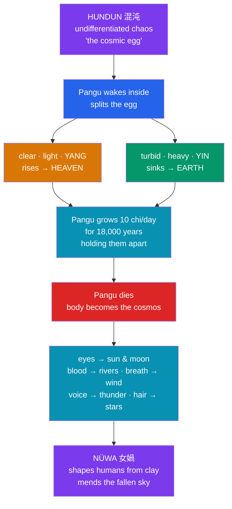

# 🥚 Chinese Creation and Pangu

> [!abstract] TL;DR
> Chinese cosmogony imagines creation less as a **making** than as a **separation** and a **repair**. In the classic account, the cosmos begins as **Hundun** (混沌), an undifferentiated chaos shaped like an egg. Inside it the giant **Pangu** (盤古) gestates, wakes, and splits the egg: the clear, light **yang** rises to form heaven, the turbid, heavy **yin** sinks to form earth, and Pangu grows between them for 18,000 years to hold them apart. When he dies, his body *becomes* the world — his eyes the sun and moon, his blood the rivers, his breath the wind. A second, older figure, the serpent-bodied goddess **Nüwa** (女媧), then fashions the first humans from **yellow clay** and later **mends the collapsed sky** with five-coloured stone. A striking feature is chronological: these narratives are attested **late** in writing (Pangu only from the 3rd century CE), so China's "creation myth" is a reconstructed patchwork, not a single canonical Genesis.

## Intuition — analogy first

Picture a **potter's wheel with a lump of wet clay** that has not yet been centred. At first it is a spinning, formless mass — no inside, no outside, no top, no bottom. Everything the pot will be is *present but undivided*. Creation, on this picture, is not the potter adding material from outside; it is the mass **resolving into structure** — the clay parting into wall and floor, rim and base.

Chinese cosmogony works exactly this way. There is no creator standing *outside* the universe speaking it into being. Instead the primal stuff — **Hundun**, chaos-as-egg — already contains everything, and cosmos happens when it **differentiates**: light from heavy, clear from turbid, heaven from earth, *yang* from *yin*. Pangu is not a maker but a **midwife-and-scaffold** who forces the separation and then dissolves into the very world he separated. This makes the Chinese account a mythology of **immanence** (the divine is the world) rather than **transcendence** (a god above the world) — a contrast worth holding against Near Eastern cosmogonies. See [[Creation_and_Flood_Myths]].

---

## How Creation Unfolds — from egg to world

## Key Concepts

### Hundun — chaos as the cosmic egg

**Hundun** (混沌 / 渾沌, "muddled, turbid") names the primordial state before differentiation. It is imagined as **egg-like** (*ru jizi* 如雞子, "like a hen's egg") — a sealed, churning wholeness with no distinctions. In the *Zhuangzi* (莊子, 4th–3rd c. BCE) Hundun appears as a faceless emperor of the centre whom well-meaning friends "improve" by boring the **seven apertures** of sense into him, one a day; on the seventh day he dies. The parable warns that imposing order (distinction) on primal wholeness is a kind of violence — a philosophical counter-melody to the Pangu story, where separation is precisely what *makes* the world.

### Pangu — separation, not fabrication

**Pangu** (盤古) is the giant who gestates inside the egg for 18,000 years, then breaks it. With an axe (in later, popularised tellings) or simply by his growing bulk, he drives **heaven** (the clear *yang* essence) up and **earth** (the turbid *yin* essence) down, then stands between them, growing daily, so they cannot re-fuse. His is a **cosmogony of exhaustion**: when the work is done and he dies, his body is transmuted into the features of the world.

| Part of Pangu | Becomes | Cosmic domain |
|---|---|---|
| Left eye / right eye | Sun / Moon | sky-lights |
| Breath | Wind and clouds | atmosphere |
| Voice | Thunder | weather |
| Blood | Rivers and seas | waters |
| Flesh | Soil and fields | land |
| Hair / beard | Stars and vegetation | growth |
| Bones and teeth | Metals and stones | minerals |
| Parasites on his body (one version) | Human beings | humanity |

That last line — humans as **fleas on the dying giant**, born of wind acting on his vermin — is one of two competing origins of humanity. It makes people an almost accidental by-product of the cosmos, and it is precisely the version that **Nüwa's** myth displaces with something more dignified.

### Nüwa — the potter of humankind and the mender of heaven

**Nüwa** (女媧), a **serpent- or dragon-bodied** goddess (often paired with **Fuxi** 伏羲, the two shown with intertwined tails), carries two great deeds:

- **Creating humans from clay.** Lonely in a finished but unpeopled world, Nüwa moulds figures from **yellow earth** (*huang tu* 黄土). Tiring of the slow work, she dips a **cord into the mud** and flicks the droplets outward; each becomes a person. The tale, recorded in Ying Shao's *Fengsu Tongyi* (風俗通義, c. 2nd c. CE), adds a class etiology: the carefully hand-made became the **noble and rich**, the cord-flung droplets the **common poor**.
- **Mending the sky.** When the water-god **Gonggong** (共工) rams **Mount Buzhou** (不周山), a pillar of heaven, the sky cracks and tilts, fire and flood pour through. Nüwa **smelts five-coloured stones** to patch the vault, cuts the **legs off a giant turtle (Ao 鰲)** to prop up the four corners, kills a black dragon to quell the flood, and dams the waters with reed ash. This repair myth appears in the *Huainanzi* (淮南子, 2nd c. BCE), which is in fact an **earlier** attestation of Nüwa than any text mentioning Pangu.

### The problem of late attestation

Unlike Mesopotamia (*Enūma Eliš*) or Israel (Genesis), early classical China left **no systematic cosmogony**. The Confucian canon is largely silent on origins. **Pangu is not attested until the 3rd century CE**, in the now-lost *Sanwu Liji* (三五曆紀) of **Xu Zheng** (徐整), preserved only in later quotation. The sinologist **Derk Bodde** famously stressed this scarcity and lateness, and some scholars argue the Pangu figure entered Han-Chinese lore from **southern, non-Han peoples** (or reflects contact-era borrowing), though this remains debated. The upshot: what we call "the Chinese creation myth" is a **scholarly composite** stitched from *Zhuangzi*, *Huainanzi*, the *Shanhaijing*, and post-Han fragments — never a single authoritative scripture.

## Examples Across Cultures

- **Cosmic-egg motif.** The world-from-an-egg image recurs widely — the Orphic egg in Greece, **Brahmāṇḍa** (the "egg of Brahma") in Indian cosmology, the *hiranyagarbha* golden womb of the *Rigveda*. Whether these reflect diffusion or independent invention is exactly the comparative question raised in [[Creation_and_Flood_Myths]].
- **Sacrificial body-cosmogony.** Pangu's body becoming the world parallels the Norse **Ymir**, whose flesh becomes earth and blood the sea, and the Vedic **Puruṣa**, dismembered so that his mouth becomes the priestly class and his limbs the social order. This "primal being carved into cosmos" pattern is a genuine cross-cultural type.
- **Clay-formed humanity.** Nüwa shaping people from earth echoes the Mesopotamian **Enki/Ninmah** and biblical **Adam** (*adamah*, "ground") — humans as literal earthlings.
- **Flood-and-repair.** Gonggong's shattering of the heavenly pillar and Nüwa's patching sit alongside the world's deluge myths as an account of cosmic near-collapse and restoration.

## Common Pitfalls / Misconceptions

- **"Pangu is ancient Chinese religion's oldest god."** He is one of the *latest*-attested major figures (3rd c. CE), long postdating the *Shijing*, *Zhuangzi*, and *Huainanzi*. Nüwa is the older textual presence.
- **"Chinese cosmogony has a creator like Genesis."** There is no transcendent maker speaking the world into being; creation is **differentiation of *qi*** (clear vs. turbid) plus Pangu's separation. Order emerges from within chaos, not by external fiat.
- **"Yin and yang are good vs. evil."** They are complementary cosmic phases — light/heavy, active/receptive, heaven/earth — not a moral dualism. Their *separation* is what makes a livable cosmos.
- **"There is one canonical version."** The details (axe or no axe; humans from parasites or from clay; the exact list of body-parts) vary by source and era. Treating any single retelling as *the* myth erases its composite, layered history.

## Related Concepts

- [[_MOC_East_Asian_Myth|↑ Section MOC]] — situates this note among the East Asian traditions
- [[The_Chinese_Celestial_Bureaucracy]] — what fills the *ordered* heaven once Pangu has separated it from earth
- [[Japanese_Shinto_and_the_Kami]] — a neighbouring cosmogony that is *also* about a primal pair generating the world, but through birth rather than separation
- [[Creation_and_Flood_Myths]] — the comparative frame for cosmic eggs, sacrificed primal beings, and deluge-repair motifs
- Cross-vault: [[The_Comparative_Method]] — diffusion vs. independent invention, the exact debate behind the cosmic-egg's global spread

## Review Questions

1. Explain why Chinese cosmogony is better described as a myth of **separation and repair** than of **fabrication**. Use Hundun, Pangu, and *yin/yang* in your answer.
2. Nüwa has two distinct roles — creating humans and mending the sky. What does each reveal about how the tradition imagined humanity's status and the fragility of the cosmic order? Why does the clay-human story matter as an alternative to the "parasites" origin?
3. What is meant by the **late attestation** of the Pangu myth, and why does it complicate the idea of a single "Chinese creation myth"? Name at least one earlier text that attests Nüwa.

## Sources

- Birrell, Anne (1993). *Chinese Mythology: An Introduction*. Johns Hopkins University Press
- Bodde, Derk (1961). "Myths of Ancient China." In S. N. Kramer (ed.), *Mythologies of the Ancient World*. Doubleday
- Yang, Lihui & An, Deming (2005). *Handbook of Chinese Mythology*. ABC-CLIO
- *Huainanzi* ("Lanming" chapter) and Ying Shao, *Fengsu Tongyi* — primary sources for Nüwa

#mythology #east-asian #chinese-myth #cosmogony #creation
