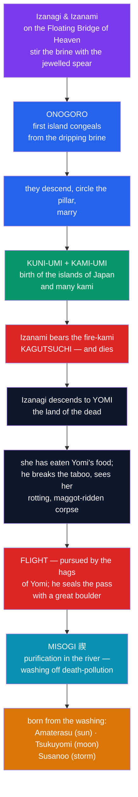

# ⛩️ Japanese Shinto and the Kami

> [!abstract] TL;DR
> **Shinto** (神道, "the way of the *kami*") is Japan's indigenous religion — founderless, scriptureless in the Western sense, and rooted in an **animist worldview** in which the sacred is **immanent in the world**. Its objects of reverence are the **kami** (神): innumerable spirits and powers dwelling in mountains, rivers, storms, trees, exceptional people, and ancestors — the *yaoyorozu no kami*, the "eight million kami." Shinto's foundational myth is the story of the creator pair **Izanagi** and **Izanami**, who stir the primal brine into the first island, marry, and birth the islands of Japan and a host of kami. When Izanami dies bearing the fire-kami, Izanagi follows her into **Yomi**, the polluted land of the dead — and his horrified **flight** from her rotting corpse, followed by his cleansing in a river (**misogi**), establishes the tradition's central axis: not sin versus virtue, but **purity versus pollution**, restored through **purification (*harae*)**.

## Intuition — analogy first

If Chinese Heaven is a **government office** (see [[The_Chinese_Celestial_Bureaucracy]]), Shinto is closer to a **haunted, living landscape** — think of the feeling of standing under an ancient, enormous tree, or beside a thundering waterfall, and sensing that the place *itself* is somehow **present, aware, and to be respected**. Shinto names that feeling. A *kami* is, at root, **whatever provokes awe** — the scholar **Motoori Norinaga** defined kami as anything "superior, extraordinary, and awe-inspiring," whether a god, a mountain, an emperor, a peach, or a fox.

Two consequences follow, both alien to a Western "god" concept. First, kami are **not omnipotent or perfectly good**; they can be gentle (*nigi-mitama*) or violent (*ara-mitama*), and a storm-kami is worshipped precisely because it is dangerous. Second, the divide that organises the religion is not **moral** but **hygienic-ritual**: the great problem is **kegare** (pollution — above all the pollution of death and decay), and the great remedy is **purification**. Hold that lens and the myth of Izanagi's flight from the underworld stops being a horror story and becomes a **charter for why humans must cleanse themselves**.

---

## How the World and Its Kami Come to Be

## Key Concepts

### What a *kami* is

**Kami** (神) resist translation as "god." They are **numinous presences** — in natural features (**Mount Fuji**, waterfalls, ancient trees, unusual rocks), in natural forces (wind, thunder, growth), in remarkable persons (emperors, heroes, later even the deified spirits of the dead), and in objects that inspire wonder. Tradition speaks of the **yaoyorozu no kami** (八百万の神), the "eight million" (i.e., countless) kami. Their defining trait is **awe**, not moral perfection: each kami has a gentle aspect (*nigi-mitama*) and a rough, violent aspect (*ara-mitama*), and ritual aims to soothe the latter and invite the former. This is a genuinely **animist** vision — the divine saturates the world rather than ruling it from outside.

### Shinto as a worldview, not a creed

**Shinto** has **no founder, no single sacred book, and no fixed doctrine or creed.** The very word — *Shintō*, "the way of the kami" — was coined largely to distinguish native practice from imported **Buddhism** (*Butsudō*, "the way of the Buddha"), and for most of history the two coexisted intimately (*shinbutsu-shūgō*, the amalgamation of kami and buddhas). Shinto is better understood as **orthopraxy** (right practice — festivals, offerings, purity) than **orthodoxy** (right belief). Its "texts" are the eighth-century chronicles (see [[Amaterasu_and_the_Kojiki]]), but these are mythic-historical records, not commandments.

### Izanagi and Izanami — creation by generation

The primal pair **Izanagi** (伊邪那岐, "he who invites") and **Izanami** (伊邪那美, "she who invites") are the last of seven generations of primordial kami. Standing on the **Floating Bridge of Heaven** (*Ame-no-ukihashi*), they thrust down the **jewelled spear** (*Ame-no-nuboko*) and stir the brine; the drops falling from its tip congeal into the island **Onogoro**. They descend, erect a pillar, and — after a false start when the *female* speaks first and produces a malformed child (the "leech-child," Hiruko) — correctly repeat the courtship with the male speaking first. They then give birth to the **islands of Japan** (*kuni-umi*, "land-birthing") and to a great host of **kami** (*kami-umi*). Note the contrast with [[Chinese_Creation_and_Pangu]]: creation here is **sexual generation**, not the splitting of a cosmic egg.

### Izanami's death, Yomi, and the flight

Creation turns to tragedy when Izanami bears the **fire-kami Kagutsuchi**; the birth burns her fatally, and she departs to **Yomi** (黄泉), the dark **land of the dead**. Grieving, Izanagi follows to retrieve her. She meets him but explains she has already **eaten the food of Yomi** (*yomotsu-hegui*) and may be bound there; she goes to negotiate with the underworld's powers, warning him **not to look at her**. Impatient, he breaks a tooth from his comb, lights it as a torch, and sees her — a **rotting corpse crawling with maggots** and inhabited by thunder-kami. Horrified, Izanagi **flees**, pursued by the **hags of Yomi** (*Yomotsu-shikome*) and by Izanami herself. He throws down peaches to drive back his pursuers and finally seals the sloping pass between worlds, **Yomotsu Hirasaka**, with a **great boulder**. Through it the estranged pair exchange the first divorce and the first bargain over mortality: Izanami vows to kill **1,000** people a day; Izanagi vows to have **1,500** born — so death enters the world, but life outruns it.

### Purity, pollution, and *harae*

Contact with Yomi has left Izanagi **defiled by death** (*kegare*). Emerging, he goes to a river mouth and performs **misogi** (禊) — cleansing his body in water — and from this washing the greatest kami are born: **Amaterasu** (the sun) from his left eye, **Tsukuyomi** (the moon) from his right, and **Susanoo** (the storm) from his nose. This episode is the mythic charter for Shinto's core preoccupation:

| Concept | Meaning | In the myth |
|---|---|---|
| **Kegare** (穢れ) | Pollution / impurity, esp. from death, decay, blood | Izanagi's defilement from Yomi |
| **Harae / Harai** (祓) | Purification generally (rites, wands, salt) | Ritual removal of impurity |
| **Misogi** (禊) | Purification specifically **by water** | Izanagi bathing in the river |
| **Tsumi** (罪) | Impurity/offence (ritual, not primarily moral "sin") | states requiring purification |

The point worth stressing: Shinto's fundamental categories are **pure vs. polluted**, not **righteous vs. wicked**. Death is not evil, but it is intensely **polluting** — which is why funerals are traditionally handled by Buddhism while Shinto governs birth, marriage, and renewal. Everyday practice preserves the logic: visitors to a shrine rinse hands and mouth at the **temizuya** basin before approaching.

### Shrines and the sacred landscape

Kami are approached at **shrines** (神社, *jinja*). A **torii** gate marks the threshold between ordinary and sacred space; a path leads to the **honden**, the inner sanctuary housing the *shintai* (*go-shintai*) — a mirror, sword, stone, or other object in which the kami's presence is invited to dwell. Often the true "shrine" is a **natural feature itself** — a mountain, a grove, a waterfall, a rope-girt rock — reflecting the animist conviction that the divine is **in the landscape**, not merely represented by it. Rope garlands (**shimenawa**) and paper streamers (**shide**) mark objects and places as sacred and purified.

## Examples Across Cultures

- **Descent to the underworld** — Izanagi's journey into Yomi to reclaim Izanami belongs to a global type. Compare the Sumerian goddess in [[The_Descent_of_Inanna]], who passes through seven gates into the land of the dead; and the Greek **Orpheus**, who descends for **Eurydice**.
- **The fatal backward look / forbidden gaze** — Izanagi's ruin comes from *looking* against instruction, exactly as **Orpheus** loses Eurydice by looking back and as **Lot's wife** is destroyed for looking at Sodom. The taboo on the gaze is a widespread narrative device.
- **Eating the food of the dead** — Izanami is bound to Yomi because she **ate its food**, precisely as **Persephone** is bound to the underworld by eating pomegranate seeds. The motif marks the underworld's food as a one-way threshold.
- **Death entering through a broken taboo** — the 1,000-versus-1,500 bargain is an etiology of mortality comparable to other myths where death originates from a single rupture between the living and the dead.

## Common Pitfalls / Misconceptions

- **"Kami just means 'gods' like Greek gods."** Kami are **numinous presences** — often nature itself — that are neither omnipotent nor necessarily benevolent. A dangerous storm or a fearsome rock can be kami precisely *because* it inspires awe.
- **"Shinto has a bible and a set of commandments."** It has **no founder, no creed, and no single scripture**; its emphasis is **practice and purity**, not doctrine. The *Kojiki* and *Nihon Shoki* are mythic chronicles, not law codes.
- **"Yomi is hell / kegare is sin."** Yomi is a **grim land of the dead**, not a place of moral punishment, and *kegare* is **ritual pollution**, not moral guilt. Death defiles without being wicked.
- **"Shinto and Buddhism were rival religions."** For most of Japanese history they were deeply **intertwined** (*shinbutsu-shūgō*); the sharp separation is largely a product of the modern **Meiji** period. Traditionally many Japanese are "born Shinto, buried Buddhist."

## Related Concepts

- [[_MOC_East_Asian_Myth|↑ Section MOC]] — situates Shinto beside the Chinese traditions
- [[Amaterasu_and_the_Kojiki]] — the direct sequel: the three noble kami born from Izanagi's purification, and the chronicles that record all this
- [[Chinese_Creation_and_Pangu]] — a contrasting cosmogony (separation of a cosmic egg vs. sexual generation of islands)
- [[The_Chinese_Celestial_Bureaucracy]] — the opposite pole: an ordered, bureaucratic heaven vs. an animist sacred landscape
- Cross-vault: [[The_Descent_of_Inanna]] — the descent-to-the-underworld motif, with the shared taboos of gazing and of eating the food of the dead

## Review Questions

1. Explain the concept of **kami** and why "god" is a misleading translation. How do the ideas of *nigi-mitama* / *ara-mitama* and *yaoyorozu no kami* refine the picture?
2. Trace how the Izanagi-and-Izanami myth functions as a **charter for purification**. Why does the tradition frame its central concern as **purity vs. pollution** rather than **good vs. evil**, and where does the *misogi* episode fit?
3. Identify three cross-cultural parallels to Izanagi's descent into Yomi (e.g., the gaze taboo, the food of the dead, the underworld journey) and name a specific comparable myth for each.

## Sources

- Ō no Yasumaro (712). *Kojiki* (trans. Gustav Heldt, 2014, or Donald Philippi, 1968). Columbia University Press
- Aston, W. G. (trans., 1896). *Nihongi: Chronicles of Japan* (Nihon Shoki). Kegan Paul
- Picken, Stuart D. B. (1994). *Essentials of Shinto: An Analytical Guide to Principal Teachings*. Greenwood
- Ono, Sokyo (1962). *Shinto: The Kami Way*. Tuttle

#mythology #east-asian #japanese-myth #shinto #animism
