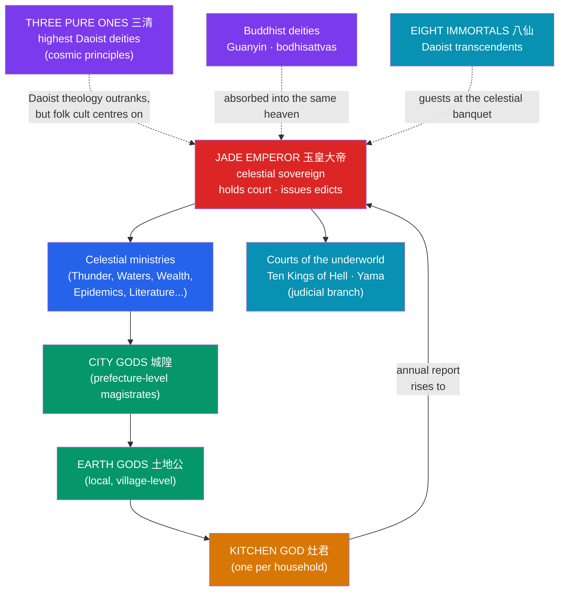

# 🏛️ The Chinese Celestial Bureaucracy

> [!abstract] TL;DR
> Chinese popular religion pictures **Heaven as an empire** — a vast, ranked **bureaucracy** that mirrors the earthly imperial state office for office. At its apex sits the **Jade Emperor** (玉皇大帝), a celestial sovereign who holds court, issues edicts, promotes and demotes gods, and reviews reports filed by divine officials. Below him a syncretic civil service blends **Daoist** transcendents, **Buddhist** bodhisattvas, and **local folk** deities — **City Gods**, **Earth Gods**, dragon kings, and the courts of the underworld. Ordinary households plug directly into this system through the **Kitchen God** (灶君), who watches the family all year and **ascends to report** their conduct to the Jade Emperor before New Year. The **Eight Immortals** (八仙) embody Daoist attainment, while the Ming novel *Journey to the West* (西遊記) — with its rebel monkey **Sun Wukong** — dramatises, and gently satirises, the whole ranked heaven.

## Intuition — analogy first

Imagine you are a subject of imperial China with a grievance — a drought, a lawsuit, a sick child. On earth you would **file a petition**: draft a document in the correct form, address it to the official of the right rank, and route it up a chain of magistrates, prefects, and ministries toward the emperor. Getting the paperwork and the hierarchy right *is* how things get done.

Now lift that entire apparatus into the sky. That is the Chinese Heaven. The gods are not a wild pantheon of temperamental Olympians; they are **officials holding posts**, with **jurisdictions, ranks, term limits, promotions, and audits**. A worshipper petitions a god the way a citizen petitions a magistrate — with memorials (burned as paper), gifts (offerings and "spirit money"), and correct protocol. The genius of the model is its **legibility**: heaven is intelligible because it is organised like the government everyone already knew. Where [[Chinese_Creation_and_Pangu]] tells how heaven was *separated* from earth, this note describes how that heaven was *staffed*.

---

## How the Celestial Court Is Organised

## Key Concepts

### The Jade Emperor and heaven-as-state

The **Jade Emperor** (玉皇大帝, *Yù Huáng Dàdì*) is the supreme ruler of Heaven in popular religion and much of religious Daoism. His cult rose to prominence under the **Song dynasty**, especially through the patronage of **Emperor Zhenzong** (r. 997–1022), who elevated him as a divine counterpart to the throne. He presides over a **celestial court** with the same furniture as the imperial one: audiences, memorials, seals, a calendar of rites, and a staff of divine bureaucrats who can be **rewarded, punished, promoted, or cashiered**. Note the theological subtlety: in high Daoist doctrine the **Three Pure Ones** (三清, the *Sanqing*) are cosmologically *higher*, personifications of the Dao itself — yet it is the *administrative* Jade Emperor, the CEO of heaven, on whom popular devotion fixes.

### A syncretic civil service

Chinese religion is famously **syncretic**, braiding three strands (*sanjiao*, "the three teachings") plus local cult:

| Strand | Contributes | Representative figures |
|---|---|---|
| **Daoism** | Immortals, cosmic deities, ritual masters | Three Pure Ones, Eight Immortals, Queen Mother of the West |
| **Buddhism** | Bodhisattvas, karmic courts of hell | **Guanyin** (觀音), Dizang (Kṣitigarbha), the Ten Kings |
| **Folk / local** | Territorial and functional gods | City Gods (城隍), Earth Gods (土地公), dragon kings, Mazu |
| **Confucian frame** | The *bureaucratic logic* and ancestor veneration | ranked offices, memorials, filial rites |

Crucially these are not kept in separate temples — the same shrine may hold a Daoist immortal, the Buddhist Guanyin, and a deified local hero, all understood as officials in one heaven. The **Confucian** contribution is less a set of gods than the **organising grammar**: the very idea that the divine world runs on merit, rank, and paperwork.

### City Gods, Earth Gods, and the chain of command

The bureaucracy is **territorial and tiered**, matching the imperial administrative map. The **City God** (城隍, *Chénghuáng*) is the spiritual **magistrate** of a walled city or prefecture, judging the dead of his district and reporting upward. Beneath him the **Earth God** (土地公, *Tǔdì Gōng*) is a humble, local official — the "village clerk" of the pantheon — responsible for a neighbourhood, field, or single household's plot. Many City Gods were **once real, upright officials** posthumously appointed to the post, exactly as an emperor might promote a loyal minister. The **underworld** forms a parallel judiciary: the **Ten Kings of Hell** and **Yama** (Yánluó 閻羅) run courts that try souls and assign rebirth or punishment — a divine ministry of justice.

### The Kitchen God's annual report

The clearest snapshot of the whole system is the **Kitchen God** (灶君 / 灶神, *Zào Jūn/Shén*), the deity of the hearth posted to **every family**. All year he silently observes the household's conduct. In the last days of the twelfth lunar month he **ascends to the Jade Emperor to submit an annual report** on the family's virtues and sins, which affects their fortune in the coming year. Families respond with a wonderfully human ritual: they smear his paper image's mouth with **sticky malt-sugar** — so he will either report only *sweet* things or be too gummed-up to speak at all — then burn the image to send him aloft, welcoming a fresh one at New Year. It is bureaucratic **performance review**, complete with attempted bribery of the auditor.

### The Eight Immortals

The **Eight Immortals** (八仙, *Bāxiān*) are a beloved band of Daoist **transcendents** who achieved immortality and now wander the world doing good and confounding the powerful. The canonical eight — among them **Lü Dongbin** (the swordsman-scholar), **Zhongli Quan**, **Zhang Guolao** (who rides a donkey backwards), **He Xiangu** (the sole woman), **Li Tieguai** ("Iron-crutch Li"), **Han Xiangzi**, **Cao Guojiu**, and **Lan Caihe** — each carries an emblem and represents a condition of life (age, youth, poverty, wealth, the feminine, the masculine). They famously attend the **Queen Mother of the West's** peach banquet and, in the tale "The Eight Immortals Cross the Sea," each uses his or her own magic power — the proverb *ba xian guo hai, ge xian shen tong* ("each shows their special talent").

### Sun Wukong and *Journey to the West*

The **Ming-dynasty novel** *Journey to the West* (西遊記, c. 1592, attributed to **Wu Cheng'en**) is the great literary portrait — and satire — of the celestial bureaucracy. The **Monkey King, Sun Wukong** (孫悟空), storms heaven demanding rank; the court tries to pacify him by appointing him **"Protector of the Horses"** (弼馬溫), a deliberately menial post, then, when he rebels, grants the empty grand title **"Great Sage Equal to Heaven"** (齊天大聖). His **"Havoc in Heaven"** — eating the immortality peaches, wrecking the banquet, defeating heaven's armies until the **Buddha** himself pins him under a mountain — mocks the pretensions of celestial officialdom while affirming its ultimate order. The pilgrimage that follows, escorting the monk **Xuanzang** (with Zhu Bajie and Sha Wujing) to fetch Buddhist scriptures under the guidance of the bodhisattva **Guanyin**, is itself a fusion of Daoist heaven and Buddhist quest — syncretism turned into a road novel.

## Primary Sources & Examples

- ***Journey to the West*** (Wu Cheng'en, Ming) — the "Havoc in Heaven" episodes are the richest dramatisation of the ranked pantheon and its foibles.
- **The Kitchen God rite** — still practised around Lunar New Year; the sugar-smearing "send-off" is documented ethnographically across Chinese communities.
- **City God temples (城隍廟)** — surviving temples (e.g., in Shanghai, Tainan) preserve the magistrate-and-court iconography, with the god flanked by clerks, ledgers, and judges of the dead.
- **Song-dynasty state cult** — imperial promotion of the Jade Emperor shows the two-way traffic: earthly emperors legitimised themselves by ranking the gods, and the gods were ranked like earthly officials.

## Common Pitfalls / Misconceptions

- **"The Jade Emperor is the Chinese 'supreme God' / creator."** He is a **sovereign administrator**, not a cosmic creator, and in Daoist theology he is *outranked* by the Three Pure Ones. He governs the world; he did not make it (that story belongs to [[Chinese_Creation_and_Pangu]]).
- **"Daoism, Buddhism, and folk religion are separate pantheons."** In lived practice they interpenetrate; a single temple and a single worshipper move freely among all three. The bureaucratic frame is what lets them coexist.
- **"The gods are worshipped out of pure reverence."** Worship is often **transactional and contractual** — petition, offering, and expected result — precisely because the gods are officials with duties. A god who fails to deliver can even be "demoted" in local esteem.
- **"*Journey to the West* is just a fantasy adventure."** It is also a pointed **satire of officialdom** and a document of religious syncretism; Sun Wukong's mock-titles lampoon real bureaucratic face-saving.

## Related Concepts

- [[_MOC_East_Asian_Myth|↑ Section MOC]] — places the ordered Chinese heaven beside the Japanese kami-world
- [[Chinese_Creation_and_Pangu]] — how the heaven that this bureaucracy fills was first separated from earth
- [[Japanese_Shinto_and_the_Kami]] — a deliberate contrast: a *non*-bureaucratic sacred landscape of nature-spirits, shaped in part by Chinese influence
- [[Amaterasu_and_the_Kojiki]] — another mythology used to legitimise a political order, via imperial descent rather than celestial office
- Cross-vault: [[Functions_of_Myth]] — myth as **social charter**, legitimising and modelling the political order

## Review Questions

1. In what concrete ways does the Chinese Heaven mirror the imperial state? Give at least three features (e.g., ranks, reports, promotions) and explain why this "bureaucratic" imagination made the divine world **legible** to worshippers.
2. The Kitchen God's annual report is a miniature of the whole system. Walk through the ritual and explain what it reveals about how Chinese religion understood the relationship between household, deity, and Heaven.
3. What does *Journey to the West* — through Sun Wukong's mock-offices and "Havoc in Heaven" — tell us about how the tradition viewed its own celestial bureaucracy? How does the novel also illustrate **syncretism**?

## Sources

- Yang, Lihui & An, Deming (2005). *Handbook of Chinese Mythology*. ABC-CLIO
- Wu Cheng'en (c. 1592). *Journey to the West* (trans. Anthony C. Yu, 2012). University of Chicago Press
- Feuchtwang, Stephan (2001). *Popular Religion in China: The Imperial Metaphor*. Curzon
- Teiser, Stephen F. (1996). "The Spirits of Chinese Religion." In D. S. Lopez (ed.), *Religions of China in Practice*. Princeton University Press

#mythology #east-asian #chinese-myth #daoism #folk-religion
