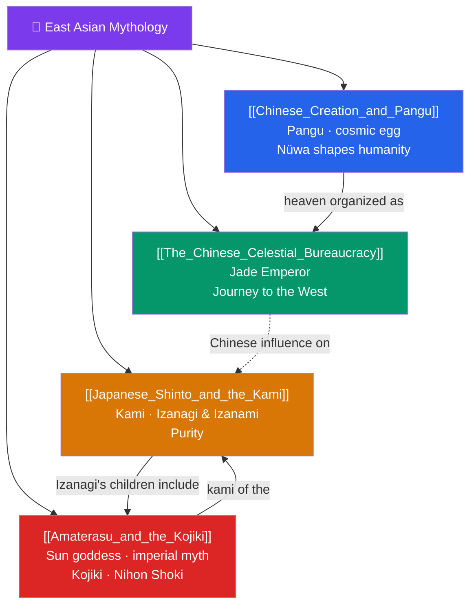

# 🐉 East Asian Mythology — Map of Content

> [!abstract] What This Section Covers
> East Asian mythology weaves together Chinese cosmological, Daoist, and folk traditions with the indigenous Shinto religion of Japan. This section begins with **Chinese Creation and Pangu**, the cosmic-egg cosmogony in which Pangu separates heaven and earth and Nüwa fashions humanity, then turns to **The Chinese Celestial Bureaucracy**, the distinctively ordered heaven ruled by the Jade Emperor and populated by figures familiar from *Journey to the West*. Crossing to Japan, **Japanese Shinto and the Kami** introduces the nature-spirits (*kami*), the creator pair Izanagi and Izanami, and the central value of ritual purity; and **Amaterasu and the Kojiki** focuses on the sun-goddess, the imperial descent myth, and the eighth-century chronicles (*Kojiki* and *Nihon Shoki*) that record them. Together they show two neighboring yet distinct mythic worlds — one imagining heaven as a vast bureaucracy, the other as a landscape alive with kami.

## Concept Map

## Learning Path

1. [[Chinese_Creation_and_Pangu]] — The cosmic egg, Pangu's separation of heaven and earth, and Nüwa's creation of humanity.
2. [[The_Chinese_Celestial_Bureaucracy]] — Heaven as an ordered court under the Jade Emperor, with figures from *Journey to the West*.
3. [[Japanese_Shinto_and_the_Kami]] — The nature of *kami*, the creator pair Izanagi and Izanami, and ritual purity.
4. [[Amaterasu_and_the_Kojiki]] — The sun-goddess, the cave myth, imperial descent, and Japan's earliest chronicles.

## All Notes at a Glance

| Note | Difficulty | What You'll Learn |
|------|------------|-------------------|
| [[Chinese_Creation_and_Pangu]] | Beginner | Cosmic egg, Pangu, the separation of yin and yang, Nüwa, the mending of heaven |
| [[The_Chinese_Celestial_Bureaucracy]] | Intermediate | The Jade Emperor, the ordered heavens, Sun Wukong and *Journey to the West*, Daoist and folk deities |
| [[Japanese_Shinto_and_the_Kami]] | Intermediate | Kami, Izanagi and Izanami, the creation of the islands, death and pollution, purification (*harae*) |
| [[Amaterasu_and_the_Kojiki]] | Intermediate | Amaterasu, Susanoo, Tsukuyomi, the heavenly cave, the imperial line, *Kojiki* and *Nihon Shoki* |

## Key Questions This Section Answers

- How does the Pangu cosmogony imagine creation as a separation rather than a making?
- Why is the Chinese heaven organized like an imperial bureaucracy?
- What is a *kami*, and how does Shinto differ from a god-centered mythology?
- How does the Amaterasu myth legitimize the Japanese imperial line?
- What do the *Kojiki* and *Nihon Shoki* tell us about how myth becomes state history?

## Related Sections

- [[_MOC_Mythology_Master|↑ Mythology Master MOC]]
- [[_MOC_Hindu_Vedic_Myth|← Hindu & Vedic]]
- [[_MOC_Mesoamerican_Myth|→ Mesoamerican]]
- Cross-vault: [[Creation_and_Flood_Myths]], [[Functions_of_Myth]] (myth legitimizing dynasty)

#MOC #Mythology #EastAsianMyth
