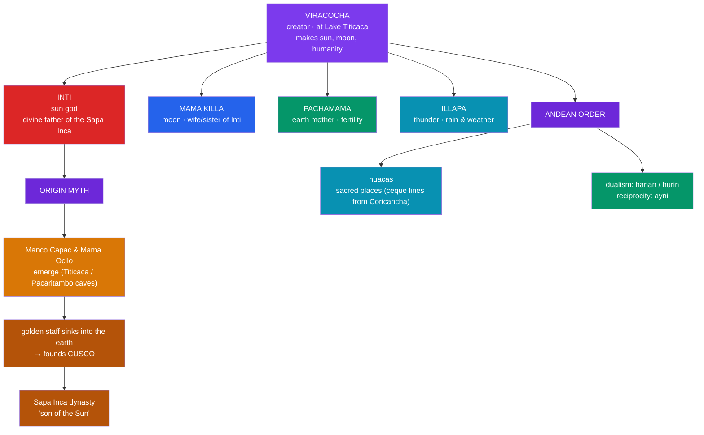

# 🏔️ Inca Mythology

> [!abstract] TL;DR
> The mythology of the **Inca** — the empire (*Tawantinsuyu*) centered on **Cusco** in the Andes — is built on a distant creator, a dynastic sun, and a living, reciprocal landscape. **Viracocha** (Wiraqocha) is the aloof **creator god** who shapes the world, sun, moon, and humanity at **Lake Titicaca**, then wanders teaching before departing across the Pacific. **Inti**, the **sun god**, is the divine **ancestor and patron of the Sapa Inca**, whose legitimacy rests on descent from him; his golden temple, the **Coricancha**, and the festival **Inti Raymi** anchor the state cult. **Pachamama** (earth mother) and **Mama Killa** (moon) round out the cosmos. The **origin myth of Manco Cápac** and Mama Ocllo — emerging from Lake Titicaca (or the caves of **Pacaritambo**) to found **Cusco** with a golden staff — charters the dynasty. The Andean world is organized by **huacas** (sacred places) and a pervasive **dualism** (*hanan/hurin*, upper/lower) and **reciprocity** (*ayni*). Because the Inca had **no writing**, every myth survives only through **post-conquest Spanish and mestizo chroniclers**.

## Intuition — analogy first

Picture the Andean cosmos not as a set of separate gods on a mountaintop but as a **kinship network you are already inside** — where the land, the ancestors, and the sun are **relatives you owe, and who owe you back**.

In many mythologies the sacred is *elsewhere* — up in a heaven, back in a golden age. Andean religion locates it **right here in the terrain**: a spring, a peak, a boulder, a mummy of an ancestor can each be a **huaca**, a charged sacred presence you greet, feed, and negotiate with. The governing verb is **reciprocity** (*ayni*): you make offerings to **Pachamama**, the earth mother, and she yields crops; you honor **Inti**, the sun, and he warms the fields and legitimizes your ruler. Nothing is given freely and nothing is owed freely — the universe runs on **balanced exchange**, mirrored socially in the **dual** organization of society into complementary upper and lower halves.

This is why the **Sapa Inca's** claim to be the **son of the Sun** is not decoration but constitutional law: it makes the emperor the chief node through which the human world keeps its accounts square with the divine. Grasp *reciprocity* and *dualism*, and the rest of Inca mythology — the wandering creator, the founding staff, the mountain-shrines — falls into place as expressions of one relational worldview.

---

## The Andean Cosmos and the Origin of Cusco

## Key Concepts

### Viracocha, the creator

**Viracocha** (Wiraqocha; fuller titles like *Con-Tici Viracocha Pachayachachic*, "ancient foundation, lord, instructor of the world") is the Andean **creator**. In the standard account he arises at **Lake Titicaca**, brings forth the **sun, moon, and stars**, and fashions a first humanity — in one version an earlier race that he destroys (by flood or by turning them to **stone**) before making the present peoples, whom he calls out of caves, springs, and hills across the land. He then travels northwest through the Andes as a wandering teacher-benefactor, sometimes unrecognized and abused, until he reaches the coast at **Manta (Ecuador)** and **departs westward across the ocean**. Like many "high gods," he is **remote** — cosmically supreme but less central to daily cult than Inti or the local huacas.

### Inti and the sacred emperor

**Inti**, the **sun**, is the deity of the **state** and the mythic **father of the ruling dynasty**. The **Sapa Inca** ("sole Inca," the emperor) claimed direct descent from Inti as *Intip Churin*, "Son of the Sun," and this descent was the foundation of his sacred authority. Inti's cult was lavish: his temple in Cusco, the **Coricancha** ("Golden Enclosure"), was sheathed in gold, and the great festival **Inti Raymi** at the winter solstice reaffirmed the sun's — and the emperor's — power over the agricultural year.

| Deity | Role | Note |
|---|---|---|
| **Viracocha** | creator, "foundation of the world" | remote high god; creates at Lake Titicaca |
| **Inti** | sun god | ancestor/patron of the Sapa Inca; Coricancha, Inti Raymi |
| **Mama Killa** | moon goddess | wife/sister of Inti; regulates calendar & festivals |
| **Pachamama** | earth mother | fertility of soil and crops; offerings (*despachos*) |
| **Illapa** | thunder/weather | rain, lightning, vital for farming |
| **Mama Cocha** | sea/water | patron of coastal and fishing peoples |

### Pachamama and the living landscape

**Pachamama** ("World/Earth Mother") is the fertility power of the **earth** itself, sustained by continual offerings and libations — a cult so deep-rooted it persists in Andean practice to this day. She exemplifies the Andean conviction that the sacred is **immanent in the terrain**. Related is **Mama Killa**, the **moon**, whose cycles governed the ritual calendar and who was honored beside Inti.

### The origin of Manco Cápac and Cusco

Inca dynastic myth explains the **founding of Cusco**. In the version favored by **Garcilaso de la Vega**, **Inti** takes pity on the primitive peoples and sends his children **Manco Cápac** and **Mama Ocllo** (brother-sister and husband-wife) out of **Lake Titicaca**, giving them a **golden staff** and instructing them to settle **where the staff sinks fully into the ground**. It sinks at the site of **Cusco**; there they found the city and civilization — **Manco** teaching men agriculture and governance, **Mama Ocllo** teaching women weaving.

A second tradition, recorded by chroniclers such as **Betanzos** and **Sarmiento de Gamboa**, has the founders emerge from the caves of **Pacaritambo** ("Inn of Origin") at **Tambo Toco**, the "house of three windows": **four Ayar brothers and four sisters** set out, and through a series of episodes (one brother, **Ayar Cachi**, sealed in a cave; others turning to **stone** and becoming huacas) only **Ayar Manco — Manco Cápac** — survives to establish Cusco. Both versions charter the dynasty by rooting it in a **divine origin place**.

### Huacas, dualism, and reciprocity

Three organizing ideas structure Andean religion:

- **Huacas** — sacred places, objects, or beings (springs, peaks, boulders, ancestor mummies, shrines). Around Cusco, huacas were arranged along the **ceque system**: some **41 sightlines radiating from the Coricancha**, ordering hundreds of shrines into a ritual and social calendar map.
- **Dualism** — the pervasive division into complementary halves, above all **hanan** (upper) and **hurin** (lower). Cusco itself and its ruling lineages were split into hanan/hurin moieties; complementary opposition, not hierarchy alone, structured society and cosmos.
- **Reciprocity (*ayni*)** — the ethic of balanced exchange between humans, and between humans and the divine: labor, offerings, and gifts flow both ways. Sacrifice (usually **llamas, maize beer *chicha*, and coca**; the rare and solemn child sacrifice **capacocha** at high mountain shrines) was the ritual form of keeping accounts with the gods.

### A mythology without native writing

The Inca kept records on **quipu** (knotted cords) for administration but had **no phonetic script**. Consequently **every Inca myth reaches us through post-conquest texts** written by Spanish and mestizo authors decades after 1532 — with all the distortions of translation, Christian framing, and political interest that implies. Comparing chroniclers (e.g., the differing Manco Cápac accounts above) is therefore essential Andean methodology.

## Primary Sources & Examples

- **Garcilaso de la Vega ("El Inca"), *Comentarios Reales de los Incas* (1609)** — a mestizo insider's account; source of the Lake Titicaca / golden-staff origin of Manco Cápac.
- **Cristóbal de Molina, *Relación de las fábulas y ritos de los Incas* (c. 1575)** and **Juan de Betanzos, *Suma y narración de los Incas* (1551)** — early chronicles of Viracocha, Inti, and the Pacaritambo origin.
- **Bernabé Cobo, *Historia del Nuevo Mundo* (1653)** — preserves the **ceque system** and the inventory of Cusco's **huacas**.
- **Guaman Poma de Ayala, *El primer nueva corónica y buen gobierno* (c. 1615)** — an indigenous illustrated chronicle of Andean religion and society.
- **Coricancha (Cusco)** and high-altitude **capacocha** burials (e.g., on Andean summits) — material evidence for the solar cult and mountain-shrine worship.

## Common Pitfalls / Misconceptions

- **"Inca myths are recorded in native Inca books."** The Inca had **no writing**; all narratives survive via **post-conquest Spanish/mestizo chroniclers**, whose versions differ and must be compared critically.
- **"Viracocha and Inti are the same god."** They are **distinct**: Viracocha is the remote **creator**; Inti is the **sun** and dynastic patron. Conflating them flattens the theology.
- **"Pachamama is a minor nature-spirit."** She is a **central** fertility power and the clearest expression of the Andean sacred **landscape** — still venerated today.
- **"The founding of Cusco has one canonical story."** There are (at least) **two major versions** — Lake Titicaca vs. the **Pacaritambo/Ayar** caves — reflecting different sources and political agendas.
- **"Andean dualism just means good vs. evil."** *Hanan/hurin* is **complementary** opposition (upper/lower halves that need each other), not a moral dualism of good against evil.

## Related Concepts

- [[The_Aztec_Cosmos_and_Five_Suns]] — a Mesoamerican cosmology likewise binding the **sun** to sacrifice and to the legitimacy of rulers
- [[Quetzalcoatl]] — compare a **creator who departs across the water**; Viracocha's westward departure echoes the pattern
- [[The_Maya_Popol_Vuh]] — another New World creation with a **flood/stone destruction** of an earlier humanity
- [[Andean_Civilizations_and_the_Inca]] — the historical *Tawantinsuyu*, Cusco, and the quipu record-keeping context
- [[Creation_and_Flood_Myths]] — Viracocha's destruction of a first race by flood/petrification among comparative deluge myths
- [[_MOC_Mesoamerican_Myth|↑ Section MOC]] — hub for Mesoamerican & Andean myth
- Cross-vault: [[_MOC_Comparative_Mythology|Comparative Mythology]] — remote "high gods" and sacred-kingship in comparative theory

## Review Questions

1. Distinguish **Viracocha** and **Inti** by role and by their relationship to the **Sapa Inca**. Why does the emperor's title "Son of the Sun" make Inti's cult a matter of **political legitimacy**?
2. Give the **two main versions** of the origin of **Manco Cápac** and the founding of **Cusco**. What does the existence of competing versions reveal about how we know Inca mythology at all?
3. Define **huaca**, **ayni**, and **hanan/hurin**, and explain how together they express an Andean worldview of a **sacred landscape governed by reciprocity and complementary dualism**.

## Sources

- Garcilaso de la Vega, El Inca. (1609/1966). *Royal Commentaries of the Incas* (H. Livermore, trans.). University of Texas Press
- Urton, G. (1999). *Inca Myths* (The Legendary Past). University of Texas Press / British Museum Press
- D'Altroy, T. N. (2014). *The Incas* (2nd ed.). Wiley-Blackwell
- MacCormack, S. (1991). *Religion in the Andes: Vision and Imagination in Early Colonial Peru*. Princeton University Press

#mythology #andean #inca #viracocha #pachamama
