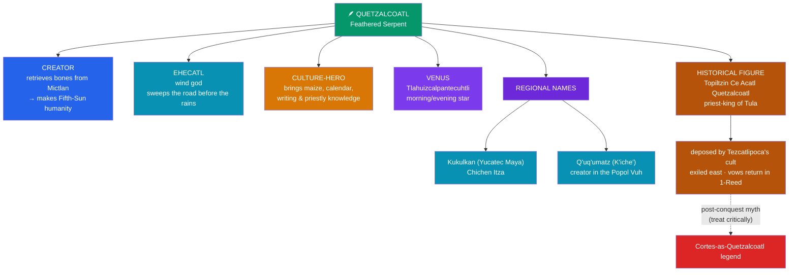

# 🪶 Quetzalcoatl

> [!abstract] TL;DR
> **Quetzalcoatl** — "Feathered Serpent" (Nahuatl *quetzal* bird + *cōātl* serpent), also read "Precious Twin" — is the most **pan-Mesoamerican** of deities, worshipped for over a millennium from **Teotihuacan** through the **Toltecs** to the **Aztecs**, and known to the Maya as **Kukulkan** (Yucatec) and **Q'uq'umatz** (K'iche'). He is a **creator** who descends to the underworld to retrieve the bones of humanity; the **wind god Ehécatl**; the **culture-hero** who brings **maize**, the calendar, and knowledge; and a **Venus** deity as morning/evening star. He is also entangled with a *historical* figure: the Toltec priest-king **Topiltzin Ce Ácatl Quetzalcoatl** of **Tula (Tollan)**, deposed by the cult of **Tezcatlipoca** and exiled eastward, vowing to return in a *1-Reed* year. The famous claim that **Moctezuma II mistook Cortés for the returning Quetzalcoatl** must be handled **critically** — it is largely a **post-conquest construction**, not reliable pre-contact belief.

## Intuition — analogy first

Quetzalcoatl is best understood not as one character but as a **brand carried across many franchises** — a recognizable name and emblem that different cultures and eras filled with their own content.

Consider how "Hercules" means one thing in Greek cult, another in Roman politics, another in a modern film: the **figure travels** while its meaning is re-authored locally. Quetzalcoatl works the same way. The **feathered serpent** emblem — a snake (earth, water, fertility) fused with the quetzal's iridescent feathers (sky, wind, the divine) — already encodes a union of **opposites**: earth and heaven, matter and spirit. That emblem appears carved at Teotihuacan centuries before the Aztecs, migrates into Maya cities as **Kukulkan**, and is later attached to a **real Toltec king** and then to a **god of wind and creation** in Tenochtitlan.

So when you meet "Quetzalcoatl," always ask **which Quetzalcoatl**: the cosmic creator, the wind that clears the road for the rain, the maize-giving culture-hero, the exiled priest-king, or the political symbol later weaponized in the story of the Conquest. The name is stable; the referent is not — and confusing the layers is the single most common error made about him.

---

## The Many Faces of the Feathered Serpent

## Key Concepts

### The emblem and its antiquity

The **feathered serpent** motif long predates the Aztecs. Monumental carvings adorn the **Temple of the Feathered Serpent** at **Teotihuacan** (c. 200 CE), and comparable imagery reaches back toward Olmec and Preclassic Maya art. The composite is symbolically dense: the **serpent** binds the deity to earth, water, and fertility; the **quetzal's** blue-green plumage binds it to sky, wind, and preciousness. The union of a ground-dwelling snake with a sky-bird makes Quetzalcoatl a natural **mediator between earth and heaven** — a theme echoed in his cosmic roles.

### Creator and wind god

In the Aztec **Fifth Sun** cosmogony (see [[The_Aztec_Cosmos_and_Five_Suns]]), Quetzalcoatl descends into **Mictlan**, the underworld, to recover the **bones** of the peoples of prior ages from **Mictlantecuhtli**, the death lord. He tricks his way out, spills his **own blood** on the ground bones, and thereby creates the *macehualtin* — the humans of the present age. Humanity thus literally owes its existence to the god's self-bleeding, reinforcing the ethic of sacrificial reciprocity.

As **Ehécatl** ("Wind"), Quetzalcoatl is the **breath and motion** of the world — the wind that **sweeps the road** before **Tláloc's** rains arrive. His wind-temples were built **round** (cylindrical) so the wind would meet no sharp corner, a distinctive architectural signature (e.g., at Tenochtitlan and Cempoala).

### Culture-hero: maize and knowledge

Quetzalcoatl is the great **giver of civilization**. In one widely told myth he **discovers maize** hidden inside the **Mountain of Sustenance (Tonacatépetl)**: transforming into a black **ant**, he follows the ants to the grain and brings it to humanity, establishing agriculture. He is credited with the **calendar**, the **arts**, **writing**, and the **priesthood** — the patron of learned, non-violent worship, sometimes contrasted with the blood-hungry cult of his rival **Tezcatlipoca**.

### Regional identities: Kukulkan and Q'uq'umatz

The feathered serpent is genuinely **pan-Mesoamerican**:

| Culture | Name | Notable locus |
|---|---|---|
| **Aztec / Nahua** | Quetzalcoatl / Ehécatl | Tenochtitlan; Cholula (great pilgrimage temple) |
| **Yucatec Maya** | **Kukulkan** | **Chichén Itzá** (the "Castillo"/Temple of Kukulkan) |
| **K'iche' Maya** | **Q'uq'umatz (Gucumatz)** | a **creator** in the *Popol Vuh* (see [[The_Maya_Popol_Vuh]]) |
| **Teotihuacan** | (unnamed feathered serpent) | Temple of the Feathered Serpent |

The equinox light-and-shadow "descending serpent" on the balustrade of Chichén Itzá's pyramid is the best-known survival of the Kukulkan cult.

### The historical Topiltzin-Quetzalcoatl of Tula

Mesoamerican sources also remember a **man**: **Ce Ácatl Topiltzin Quetzalcoatl**, a semi-legendary **priest-king of the Toltecs** at **Tula (Tollan)**, conventionally placed around the 10th century, who took the god's name as a title. In the classic legend, the trickster-sorcerer god **Tezcatlipoca** engineers his downfall — intoxicating him with **pulque** so that he violates his priestly vows (in some versions, a transgression with his sister). Shamed, Topiltzin **abdicates and journeys east** to the coast, where he either **immolates himself** and rises as the planet **Venus** (the "Dawn Lord," *Tlahuizcalpantecuhtli*), or **sails away on a raft of serpents**, promising to **return** in a year bearing his calendar name **Ce Ácatl ("1-Reed")**. Historians such as H. B. Nicholson stress that the **god and the king are fused** in the sources, making the "historical" core hard to isolate.

### The Cortés legend — read critically

The popular story runs: because **Ce Ácatl (1-Reed)** in the 52-year calendar round fell in **1519**, and because Quetzalcoatl was said to return from the east, **Moctezuma II** supposedly took **Hernán Cortés** for the returning god and surrendered his empire in awe.

Modern scholarship treats this with strong skepticism:

- The clearest sources for it (notably parts of the *Florentine Codex*) are **post-conquest**, compiled decades later under **Franciscan** supervision and shaped by both Spanish and Nahua elite interests.
- **Camilla Townsend** ("Burying the White Gods," 2003) argues the "mistaken-for-a-god" tale is a **retrospective rationalization** — it explained a shattering defeat, flattered the victors, and fit a European providential narrative.
- **Matthew Restall** (*Seven Myths of the Spanish Conquest*, 2003) classes it among the **"myths"** of the Conquest, noting there is little reliable *pre-contact* evidence that Nahuas expected a returning **white** god or equated Europeans with Quetzalcoatl.

The honest summary: the **exile-and-return** motif is genuinely Mesoamerican, but the specific claim that it **caused** Moctezuma to yield to Cortés is a **later literary and political construction**, not a securely documented pre-Columbian belief.

## Primary Sources & Examples

- **Florentine Codex** (Sahagún) — the fullest Nahua account of Topiltzin-Quetzalcoatl at Tula and his exile; also a key (and problematic) source for the Cortés story.
- **Anales de Cuauhtitlan** (in the *Codex Chimalpopoca*) — the detailed Toltec-era legend of Ce Ácatl Topiltzin Quetzalcoatl.
- **Popol Vuh** — where **Q'uq'umatz**, the Feathered Serpent, is a co-creator of the world (see [[The_Maya_Popol_Vuh]]).
- **Temple of Kukulkan, Chichén Itzá** and the **Temple of the Feathered Serpent, Teotihuacan** — material evidence for the cult across regions and centuries.

## Common Pitfalls / Misconceptions

- **Collapsing the layers.** The cosmic **god**, the historical **king**, and the political **symbol** are distinct; treating them as one flat character produces most misreadings.
- **"Aztecs believed Cortés was Quetzalcoatl, and that's why they lost."** This is a **post-conquest narrative**, not reliable pre-contact belief; present it critically rather than as fact.
- **"Quetzalcoatl was a peaceful god opposed to all sacrifice."** He is associated with priestly, learned worship and even *opposes* mass human sacrifice in some tellings — but he still creates humanity by shedding **his own blood**, so he is embedded in the sacrificial economy, not outside it.
- **"Kukulkan and Quetzalcoatl are unrelated coincidences."** They are the **same feathered-serpent complex** under different languages; the shared iconography and mythic roles show real cultural continuity/diffusion.
- **"He was originally a white/European figure."** The "white god" gloss is a **colonial-era** overlay; the pre-contact deity is a feathered serpent, not a fair-skinned man.

## Related Concepts

- [[The_Aztec_Cosmos_and_Five_Suns]] — Quetzalcoatl as White Tezcatlipoca, ruler of the Second Sun, and creator of Fifth-Sun humanity
- [[The_Maya_Popol_Vuh]] — the feathered serpent as **Q'uq'umatz**, a Maya creator god
- [[Inca_Mythology]] — compare **Viracocha**, another creator who departs across the water promising future significance
- [[Mesoamerican_Civilizations]] — Teotihuacan, Toltec Tula, and the historical setting of the cult
- [[Creation_and_Flood_Myths]] — Quetzalcoatl's retrieval of bones from Mictlan as a re-creation of humanity
- [[_MOC_Mesoamerican_Myth|↑ Section MOC]] — hub for Mesoamerican & Andean myth
- Cross-vault: [[_MOC_Comparative_Mythology|Comparative Mythology]] — the "culture-hero" and "dying-and-returning" patterns in comparative theory

## Review Questions

1. Distinguish the **four roles** of Quetzalcoatl as a *deity* (creator, wind god, culture-hero, Venus). How does the composite **feathered-serpent** emblem visually encode his function as a mediator between earth and sky?
2. Summarize the legend of **Topiltzin Ce Ácatl Quetzalcoatl** of Tula. Why do historians say the "historical" king is difficult to separate from the god?
3. State the popular claim that **Moctezuma mistook Cortés for Quetzalcoatl**, then give **two specific reasons** (with scholars) that modern historians regard it as a post-conquest construction rather than pre-contact fact.

## Sources

- Nicholson, H. B. (2001). *Topiltzin Quetzalcoatl: The Once and Future Lord of the Toltecs*. University Press of Colorado
- Townsend, C. (2003). "Burying the White Gods: New Perspectives on the Conquest of Mexico." *American Historical Review*, 108(3), 659–687
- Restall, M. (2003). *Seven Myths of the Spanish Conquest*. Oxford University Press
- Miller, M., & Taube, K. (1993). *The Gods and Symbols of Ancient Mexico and the Maya*. Thames & Hudson

#mythology #mesoamerican #quetzalcoatl #culture-hero #conquest
