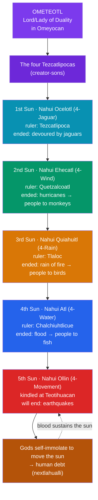

# ☀️ The Aztec Cosmos and the Five Suns

> [!abstract] TL;DR
> Aztec (Mexica) cosmology is **cyclical, not linear**: the present world is the **fifth** in a series of creations, each a "**Sun**" (*Tonatiuh* — a world-age) ruled by a different god and destroyed by a different cataclysm. Behind all creation stands **Ometeotl**, the dual male–female generative principle dwelling in **Omeyocan**; its four sons — the four **Tezcatlipocas**, among them **Quetzalcoatl** and the sorcerer **Tezcatlipoca** — set the ages in motion and take turns ruling and toppling them. The four prior suns fell to jaguars, wind, fiery rain, and flood; humanity was remade each time. Our age, the **Fifth Sun** (*Nahui Ollin*, "4-Movement"), was kindled at **Teotihuacan** when the gods immolated themselves to move the newborn sun, and it is destined to end in earthquakes. Because the gods *died to make the sun move*, humans owe a **debt** repaid through *nextlahualli* — offerings and **human sacrifice** that feed the sun the *chalchihuatl* ("precious water," blood) it needs to keep rising. Sacrifice, in this frame, is **cosmic maintenance**, not gratuitous cruelty.

## Intuition — analogy first

Think of the Aztec universe less like a building that was constructed once and more like a **fire that must be constantly fed**.

A campfire does not stay lit because it was lit well; it stays lit because someone keeps feeding it fuel. Let the fuel run out and the fire dies — not as punishment, but as physics. Aztec cosmology treats the **sun** exactly this way. The Fifth Sun is not a permanent fixture switched on at creation; it is a burning thing that will **stop moving and go dark** unless it is continually nourished. The fuel it burns is *tonalli* and *chalchihuatl* — the vital heat and blood of living beings.

This reframes the most infamous feature of Aztec religion. Human sacrifice was not, in its own cultural logic, blood-lust; it was the **upkeep bill on existence itself** — the same obligation the gods first paid with their own bodies at Teotihuacan. Miss the payment and the sun stalls, the age ends, and humanity joins the four vanished races before it. Understanding the Five Suns means understanding a universe that is *owed*, and a people who saw themselves as the ones responsible for keeping the lights on. See [[Creation_and_Flood_Myths]] for how catastrophic destruction-and-remaking recurs worldwide.

---

## How the Cycle of Suns Works

## Key Concepts

### Ometeotl and the dual origin

At the top of the cosmos the Aztecs placed a **generative duality** rather than a single creator. **Ometeotl** ("Two-God" / "God of Duality") is the fused pair **Ometecuhtli** (Lord of Duality) and **Omecihuatl** (Lady of Duality), dwelling in the topmost heaven, **Omeyocan** ("Place of Duality"). From this principle come the four sons who organize the world. (Scholars debate how far "Ometeotl" was a discrete, worshipped deity versus a theological abstraction emphasized by later interpreters such as Miguel León-Portilla; James Maffie, for instance, reads Aztec metaphysics as a single dynamic force, *teotl*, rather than a personal high god. The **dual, complementary structure** of the cosmos, however, is not in doubt.)

The four sons are the four **Tezcatlipocas**, color-coded to the world-directions:

| Tezcatlipoca | Direction / color | Also known as | Domain |
|---|---|---|---|
| **Black** Tezcatlipoca | North / black | Tezcatlipoca proper | night, sorcery, fate, kingship |
| **Red** Tezcatlipoca | East / red | Xipe Totec / Camaxtli | renewal, war, the flayed earth |
| **Blue** Tezcatlipoca | South / blue | **Huitzilopochtli** | sun, war, the Mexica patron |
| **White** Tezcatlipoca | West / white | **Quetzalcoatl** | wind, life, creation, learning |

### The four fallen Suns

Each prior age is named for the **day-sign** on which it was destroyed, and each ended in a distinct catastrophe with humanity transformed rather than simply killed:

- **First Sun — Nahui Ocelotl (4-Jaguar):** ruled by **Tezcatlipoca**; its people were **devoured by jaguars**.
- **Second Sun — Nahui Ehécatl (4-Wind):** ruled by **Quetzalcoatl**; swept away by **hurricanes**, survivors turned into **monkeys**.
- **Third Sun — Nahui Quiáhuitl (4-Rain):** ruled by **Tláloc**, the rain god; destroyed by a **rain of fire**, people turned into **turkeys/birds**.
- **Fourth Sun — Nahui Atl (4-Water):** ruled by **Chalchiuhtlicue**, the water goddess; ended in a **great flood**, people turned into **fish** — a deluge motif with wide parallels (see [[Creation_and_Flood_Myths]]).

The rivalry that topples each age is often the ongoing struggle between **Tezcatlipoca** and **Quetzalcoatl**, whose alternating dominance drives the cosmic cycle.

### The Fifth Sun and the sacrifice at Teotihuacan

The present age, **Nahui Ollin ("4-Movement")**, was created at the ruined city of **Teotihuacan**, which the Aztecs regarded as the sacred site "where the gods were born." In the *Florentine Codex* account, the gods gather in darkness and ask who will become the new sun. The wealthy, proud **Tecuciztécatl** hesitates at the fire; the humble, diseased **Nanáhuatzin** hurls himself into the flames and rises as the **Sun (Tonatiuh)**. Tecuciztécatl follows and becomes the **Moon**, dimmed when a god flings a rabbit into his face (hence the "rabbit in the moon").

But the newborn sun **will not move**. Only when the assembled gods **sacrifice themselves** — offering their own blood, with **Ehécatl-Quetzalcoatl** administering the deaths and then raising a wind — does the sun begin its journey across the sky. This is the mythic charter for everything that follows: **the sun moves because the gods died for it.**

### Human sacrifice as cosmic reciprocity

Because the gods paid with their lives, humanity inherits an ongoing **debt** (*nextlahualli*, "payment/restitution"). The sun is nourished by *tonalli* (vital heat/soul-force) and *chalchíhuatl* ("precious water," blood). Feeding it is what keeps the Fifth Sun in motion and staves off the earthquake-doom of *4-Movement*. Within this logic:

- Sacrifice is framed as **maintenance and reciprocity**, embedded in the calendar and the state cult (especially the cult of **Huitzilopochtli** at the **Templo Mayor** of Tenochtitlan).
- The **xochiyáoyotl** ("flower wars") supplied captives, tying warfare, empire, and cosmic upkeep together.
- Modern scholarship treats reported **scales** with caution: Spanish and allied sources had strong incentives to exaggerate, though archaeology (e.g., the *tzompantli* skull rack near the Templo Mayor) confirms the practice was real and significant.

The point for a comparative reading is that Aztec sacrifice is intelligible only inside its **cosmology of debt** — not as an aberration but as the ritual expression of a universe believed to require constant renewal.

## Primary Sources & Examples

- **Leyenda de los Soles** (part of the *Codex Chimalpopoca*, 1558) — the fullest indigenous-language narrative of the five ages and their destructions.
- **Florentine Codex** (Bernardino de Sahagún, *Historia general de las cosas de Nueva España*, c. 1577) — Book 3 and Book 7 give the Teotihuacan sun-creation and the self-sacrifice of the gods.
- **Historia de los Mexicanos por sus pinturas** (c. 1531) — an early prose synthesis of the cosmogony and the four Tezcatlipocas.
- **The Sun Stone ("Aztec Calendar Stone")** — a monumental relief whose central *Ollin* glyph is widely read as encoding the Fifth Sun surrounded by the four prior ages: mythology carved in basalt.

## Common Pitfalls / Misconceptions

- **"The Aztecs believed in a single creation."** No — the defining feature is **cyclicity**: repeated creations and destructions, with the present world explicitly *fifth* and *provisional*.
- **"Human sacrifice was senseless cruelty."** Within Aztec thought it was **cosmic reciprocity** — repaying the gods who died to move the sun. Judging it well or ill is one thing; understanding its internal logic is another.
- **"Ometeotl was a supreme personal God like Yahweh."** The **dual generative principle** is central, but whether it was a worshipped deity or a theological abstraction is genuinely debated; don't monotheize the Aztec pantheon.
- **"Quetzalcoatl and Huitzilopochtli are minor figures here."** Both are among the four **Tezcatlipocas**; Huitzilopochtli is the Mexica solar-war patron of the state cult, and Quetzalcoatl officiates the very sacrifice that starts the Fifth Sun.
- **"The reported numbers of victims are simple fact."** Treat conquest-era **body counts** critically; the practice is archaeologically confirmed, but its scale was a rhetorical weapon.

## Related Concepts

- [[Quetzalcoatl]] — the White Tezcatlipoca who rules the Second Sun and moves the Fifth; explored in full as a pan-Mesoamerican deity
- [[The_Maya_Popol_Vuh]] — a parallel Mesoamerican cosmogony of **successive failed creations** before humanity succeeds
- [[Inca_Mythology]] — the Andean counterpart, likewise binding cosmology to the legitimacy of sacred rulers
- [[Creation_and_Flood_Myths]] — the Fourth Sun's flood set beside deluge cosmogonies worldwide
- [[Mesoamerican_Civilizations]] — the Mexica/Teotihuacan historical context in which this cosmology took shape
- [[_MOC_Mesoamerican_Myth|↑ Section MOC]] — hub for Mesoamerican & Andean myth
- Cross-vault: [[_MOC_Comparative_Mythology|Comparative Mythology]] — the diffusion vs. independent-invention frame for cyclical-catastrophe motifs

## Review Questions

1. Name the five Suns, their ruling deity, and their mode of destruction. What does the naming of each age after a **day-sign** tell you about how the Aztecs fused cosmology with the calendar?
2. Explain the myth of the sun's creation at **Teotihuacan**. How does the detail that the sun *would not move until the gods sacrificed themselves* function as the charter for human sacrifice?
3. A visitor calls Aztec sacrifice "meaningless slaughter." Using the concepts of *nextlahualli* (debt) and *chalchíhuatl* (precious blood), reconstruct the **internal cosmological logic** that made it meaningful to the Mexica — and note one reason to be cautious about conquest-era descriptions of it.

## Sources

- Sahagún, B. de. (c. 1577/1950–82). *Florentine Codex: General History of the Things of New Spain* (Anderson & Dibble, trans.). School of American Research
- Bierhorst, J. (trans.). (1992). *History and Mythology of the Aztecs: The Codex Chimalpopoca*. University of Arizona Press
- Miller, M., & Taube, K. (1993). *The Gods and Symbols of Ancient Mexico and the Maya*. Thames & Hudson
- Carrasco, D. (1999). *City of Sacrifice: The Aztec Empire and the Role of Violence in Civilization*. Beacon Press

#mythology #mesoamerican #aztec #cosmology #five-suns
