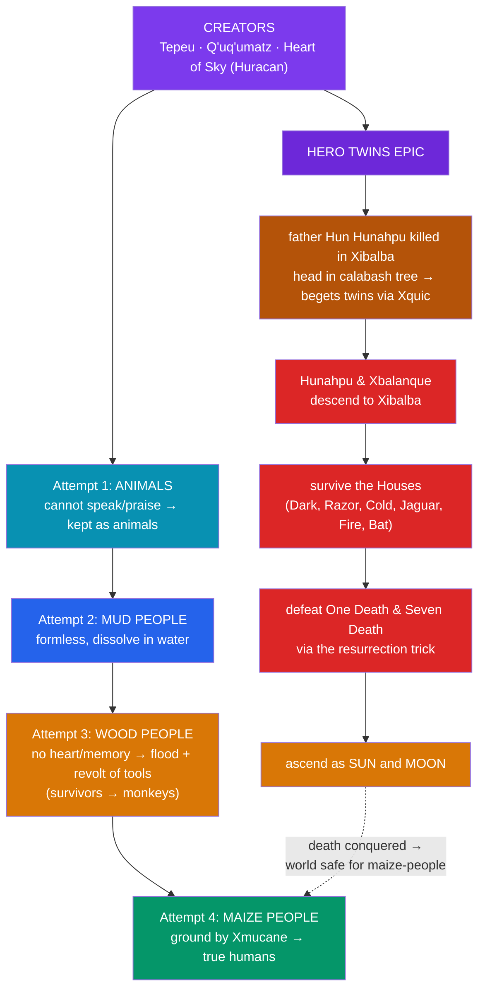

# 🌽 The Maya Popol Vuh

> [!abstract] TL;DR
> The **Popol Vuh** ("Book of the Mat/Council," i.e. **Book of the Community**) is the sacred narrative of the **K'iche' Maya** of highland Guatemala — the most complete surviving Mesoamerican creation epic. Its **cosmogony** proceeds by **trial and error**: the creators (**Tepeu**, the Feathered Serpent **Q'uq'umatz**, and **Heart of Sky / Huracán**) attempt humanity from **mud** (dissolves), then **wood** (soulless, destroyed in a flood and revolt of its own tools), and finally succeed by shaping people from **maize** dough — humans are literally made of corn. Woven through it is the epic of the **Hero Twins**, **Hunahpú** and **Xbalanqué**, master ballplayers who descend into the underworld **Xibalba**, survive its houses of torment, outwit and defeat the death-lords **One Death** and **Seven Death**, avenge their father, and ascend to become the **sun and moon**. It is a New World counterpart to the great descent-and-return epics — compare the Greek **katabasis** in [[The_Greek_Underworld]].

## Intuition — analogy first

Read the Popol Vuh's creation story as a **god running quality-control on a product line** — iterating prototypes until one passes the test.

The single requirement the makers keep specifying is not strength or beauty but the ability to **speak, remember, and give thanks** — to *name the gods and keep the calendar*. A creature that cannot do this is a **failed prototype**, no matter how lifelike. The **mud** version fails: it cannot hold shape or speak, and crumbles. The **wooden** version looks human and multiplies, but it has **no heart and no memory** — it forgets its makers — so it is scrapped in a catastrophe, its own pots, grinding stones, and dogs rising up to punish it. Only the **maize** version has the inner substance to worship and remember, so the line goes into production.

This tells you what the K'iche' thought a *human* fundamentally is: not a body but a **grateful, remembering mind** made from the staple crop that sustains it. And it explains why the Hero Twins' story matters so much — their victory over the powers of **death** in Xibalba is the deeper condition that makes a world safe enough for maize-people to live and worship in at all. The epic braids **cosmology** and **heroic descent** into a single argument about what life is for.

---

## The Structure of the Epic

## Key Concepts

### The text and its survival

The *Popol Vuh* comes from the **K'iche' Maya**, whose kingdom centered on highland **Guatemala**. The surviving text was set down in **K'iche' using the Latin alphabet** around the **mid-16th century**, evidently based on older **hieroglyphic** books and oral tradition. That manuscript is lost, but around **1701–1703** the Dominican friar **Francisco Ximénez**, parish priest of **Chichicastenango**, transcribed the K'iche' and added a Spanish translation in a **parallel-column** manuscript — the source from which all modern editions descend. The title evokes the woven **mat** (*pop*) of communal authority: the "Book of the Council/Community."

### Creation by trial and error

The makers — **Tepeu** and **Q'uq'umatz** (the Feathered Serpent; see [[Quetzalcoatl]]), directed by **Heart of Sky**, whose triple aspect is **Huracán** — raise the earth from the primordial sea and populate it, but keep failing to make a being that will **speak and give thanks**:

| Attempt | Material | Why it fails |
|---|---|---|
| **Animals** | (already living) | cannot **speak** or name the gods; assigned to be food and forest-dwellers |
| **Mud person** | earth/clay | **formless**, cannot hold shape or think; dissolves in water |
| **Wood people** | carved wood (and reeds) | look human and reproduce but have **no heart, no memory**; forget their makers |
| **Maize people** | **white and yellow maize** dough | **succeed** — true humans, able to worship and remember |

The **wooden people** are destroyed in a great deluge and a grotesque **revolt of the domestic order**: their **grinding stones, cooking pots, and dogs** turn on them for the abuse they suffered — a flood-plus-uprising motif worth comparing with other cataclysmic re-creations (see [[Creation_and_Flood_Myths]]). Survivors are said to have become **monkeys**. Finally the grandmother goddess **Xmucane** grinds maize, and from the dough the first true humans are formed — so perceptive that the gods **cloud their vision** so they will not rival their makers.

### The Hero Twins and Xibalba

Interlaced with creation is the **Hero Twins** saga. Their father **Hun Hunahpú** and uncle **Vucub Hunahpú** were noisy ballplayers summoned down to **Xibalba** ("Place of Fright"), the **underworld**, by its lords **Hun-Camé (One Death)** and **Vucub-Camé (Seven Death)**, who defeated and killed them. Hun Hunahpú's severed **head**, hung in a calabash tree, **spits into the hand** of **Xquic (Blood Moon)**, a Xibalban lord's daughter; she conceives and flees to the surface, where she bears **Hunahpú** and **Xbalanqué**.

Grown, the twins are again summoned to Xibalba and must survive a gauntlet of deadly **Houses**:

- **Dark House**, **Razor House**, **Cold House**, **Jaguar House**, **Fire House**, and the **Bat House**, where a killer bat **decapitates Hunahpú** — whose head is used as the ball in the game before the twins cleverly restore him.

By cunning, the twins pass every trial. They then stage a **death-and-resurrection performance**: they let themselves be killed, ground up, and thrown in a river, only to return in disguise as wandering **miracle-workers** who "kill" and revive things for entertainment. Fascinated, **One Death and Seven Death demand to be sacrificed and revived too** — and the twins kill them **without bringing them back**, breaking the power of Xibalba forever. Victorious, Hunahpú and Xbalanqué **ascend into the sky to become the Sun and the Moon**.

### Comparative: descent and return

The twins' journey belongs to the worldwide pattern of **katabasis** — a descent into the land of the dead and a triumphant return. It invites direct comparison with the Greek underworld journeys of **Orpheus**, **Heracles**, and **Odysseus** (see [[The_Greek_Underworld]]): in each, a hero enters death's realm, contends with its rulers, and returns bearing a boon or a transformation. The K'iche' distinctive is that victory over death is won through **cunning and the ballgame** rather than force, and that the reward is **cosmic** — the very sun and moon that light the world of the maize-people.

## Primary Sources & Examples

- **The Ximénez manuscript** (c. 1701–03, Newberry Library, Chicago) — the parallel K'iche'–Spanish text preserving the epic; the basis of all modern editions.
- **Dennis Tedlock's** *Popol Vuh: The Definitive Edition* (1985/1996) — a leading English translation informed by living K'iche' *ajq'ijab'* (daykeepers).
- **Allen J. Christenson's** literal and poetic translations (2003–04) — widely used scholarly editions.
- **Classic Maya art** — vase paintings and the **San Bartolo** murals depict Hero-Twin and maize-god scenes, showing the epic's roots centuries before the alphabetic text.

## Common Pitfalls / Misconceptions

- **"The Popol Vuh is an ancient book the Spanish found intact."** The surviving text is a **colonial-era alphabetic transcription** (16th c.), preserved via Ximénez's c. 1700 copy — though it draws on far older hieroglyphic and oral sources.
- **"It's just a local Guatemalan folktale."** It is the **primary window** into Maya cosmology; Hero-Twin and maize-god imagery on Classic-period (pre-900 CE) art shows the mythology is **deeply ancient**, not a late invention.
- **"Xibalba is 'hell' and the lords are devils."** Xibalba is an **underworld of trial and disease**, not a place of moral punishment; mapping it onto Christian hell distorts it.
- **"Humans made of maize is a poetic flourish."** It is a **literal cosmological claim** tying human substance to the staple crop and the ethic of gratitude to the gods.
- **"The Hero Twins win by strength."** Their weapon is **trickery** — the staged resurrection that fools the death-lords — a hallmark of Mesoamerican heroism.

## Related Concepts

- [[The_Aztec_Cosmos_and_Five_Suns]] — a parallel Mesoamerican cosmogony of **successive failed creations** before humanity succeeds
- [[Quetzalcoatl]] — the Feathered Serpent as **Q'uq'umatz**, a creator in the Popol Vuh
- [[Inca_Mythology]] — the Andean creation and origin narratives for comparison
- [[The_Greek_Underworld]] — comparative **katabasis**: descent, contest with death's rulers, and return
- [[Creation_and_Flood_Myths]] — the destruction of the wooden people set beside deluge cosmogonies
- [[_MOC_Mesoamerican_Myth|↑ Section MOC]] — hub for Mesoamerican & Andean myth
- Cross-vault: [[_MOC_Comparative_Mythology|Comparative Mythology]] — the hero's descent and trickster patterns in comparative theory

## Review Questions

1. List the **four creation attempts** in order and explain the single criterion by which each is judged. What does the success of the **maize** people reveal about the K'iche' definition of a human being?
2. Trace the **Hero Twins'** path through Xibalba: how were their father and uncle defeated, how were the twins conceived, and by what **trick** do they finally destroy One Death and Seven Death?
3. The twins' journey is a classic **katabasis**. Comparing it with a Greek underworld descent (see [[The_Greek_Underworld]]), identify **one strong similarity and one meaningful difference** in how the hero overcomes death.

## Sources

- Tedlock, D. (trans.). (1996). *Popol Vuh: The Definitive Edition of the Mayan Book of the Dawn of Life* (rev. ed.). Simon & Schuster
- Christenson, A. J. (trans.). (2003). *Popol Vuh: The Sacred Book of the Maya*. O Books
- Coe, M. D., & Houston, S. (2015). *The Maya* (9th ed.). Thames & Hudson
- Sharer, R. J., & Traxler, L. P. (2006). *The Ancient Maya* (6th ed.). Stanford University Press

#mythology #mesoamerican #maya #popol-vuh #hero-twins
