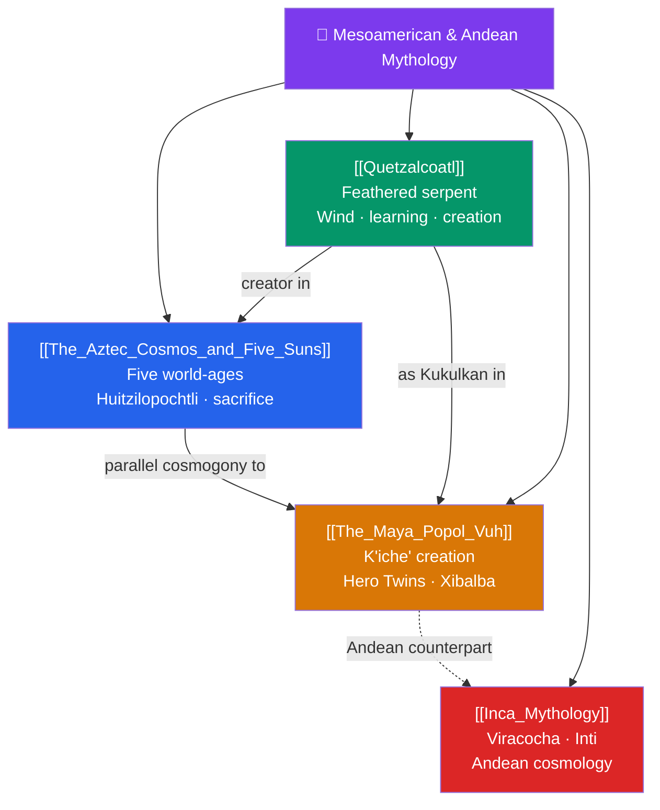

# 🐍 Mesoamerican & Andean Mythology — Map of Content

> [!abstract] What This Section Covers
> The mythologies of the pre-Columbian Americas center on cyclical creation and destruction, sacred kingship, and a cosmos requiring human reciprocity with the gods. This section opens with **The Aztec Cosmos and the Five Suns**, the doctrine of successive world-ages each ended in catastrophe, and the solar war-god Huitzilopochtli whose cult demanded sacrifice to keep the sun moving. **Quetzalcoatl**, the feathered serpent, receives its own note as a pan-Mesoamerican deity of wind, learning, and creation spanning Teotihuacan, the Maya (as Kukulkan), and the Aztecs. **The Maya Popol Vuh** treats the K'iche' Maya sacred book — its account of creation, the Hero Twins, and their triumph over the lords of the underworld Xibalba. Finally, **Inca Mythology** crosses to the Andes with the creator Viracocha, the sun-god Inti, and a distinctive Andean cosmology. Together they recover sophisticated New World mythic systems too often flattened in popular memory.

## Concept Map

## Learning Path

1. [[The_Aztec_Cosmos_and_Five_Suns]] — The cycle of creations and destructions, and Huitzilopochtli's demand for sacrifice.
2. [[Quetzalcoatl]] — The feathered serpent across cultures: creator, culture-hero, and wind-god.
3. [[The_Maya_Popol_Vuh]] — The K'iche' Maya creation, the Hero Twins Hunahpu and Xbalanque, and Xibalba.
4. [[Inca_Mythology]] — The Andean world: Viracocha the creator, Inti the sun, and Cusco's sacred cosmos.

## All Notes at a Glance

| Note | Difficulty | What You'll Learn |
|------|------------|-------------------|
| [[The_Aztec_Cosmos_and_Five_Suns]] | Intermediate | The five suns, Tezcatlipoca, Huitzilopochtli, the calendar, human sacrifice and cosmic maintenance |
| [[Quetzalcoatl]] | Beginner → Intermediate | The feathered serpent, Kukulkan, culture-hero myths, the historical vs mythic Quetzalcoatl |
| [[The_Maya_Popol_Vuh]] | Intermediate | The K'iche' *Popol Vuh*, the creation of humans from maize, the Hero Twins, the ballgame, Xibalba |
| [[Inca_Mythology]] | Intermediate | Viracocha, Inti, Mama Killa, Pachamama, the origin of the Inca, Andean *huacas* |

## Key Questions This Section Answers

- Why did Aztec cosmology hold that the world had already been created and destroyed several times?
- Who (or what) was Quetzalcoatl, and why does he appear across so many Mesoamerican cultures?
- What does the *Popol Vuh* teach about Maya ideas of creation and the underworld?
- How did Inca mythology tie the sun-god Inti to the legitimacy of the emperor?
- How much of these mythologies survived the Spanish conquest, and through what sources?

## Related Sections

- [[_MOC_Mythology_Master|↑ Mythology Master MOC]]
- [[_MOC_East_Asian_Myth|← East Asian]]
- [[_MOC_African_Myth|→ African]]
- Cross-vault: [[Creation_and_Flood_Myths]], [[Functions_of_Myth]] (myth and ritual sacrifice)

#MOC #Mythology #MesoamericanMyth
