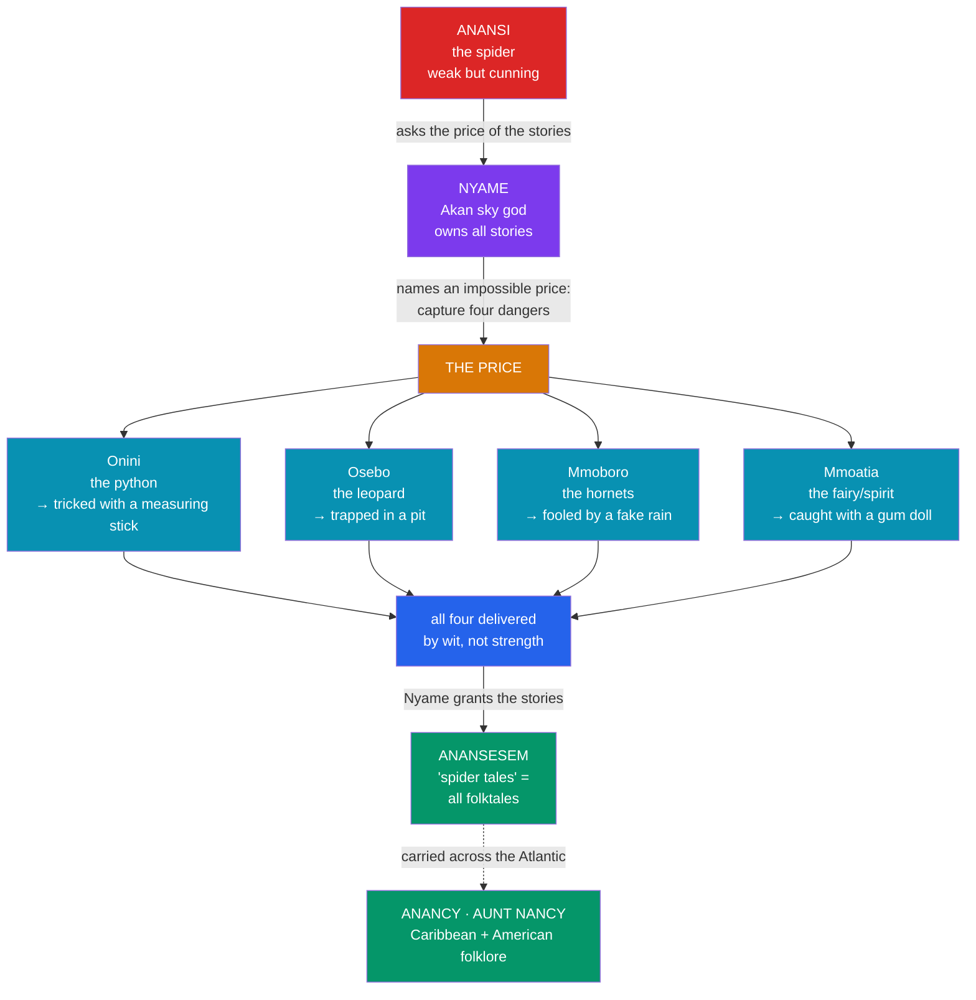

# 🕷️ Anansi the Trickster

> [!abstract] TL;DR
> **Anansi** (also **Ananse** or **Kwaku Anansi**) is the **spider trickster** of the **Akan** peoples of Ghana and Côte d'Ivoire (especially the **Ashanti**). Small, weak, and greedy, he wins by **cunning** what he could never win by strength — most famously in the founding tale of how he purchased *all the world's stories* from the sky god **Nyame** by capturing four dangerous creatures with wit alone, so that folktales themselves are called **Anansesem** ("Anansi stories" / "spider tales"). Anansi is a classic **trickster** figure: at once **culture-hero** (bringing stories, sometimes wisdom or the sun) and **subversive fool** (his schemes routinely backfire and expose his greed). Because trickster tales are portable, oral, and morally flexible, Anansi **survived the transatlantic slave trade**, resurfacing across the Caribbean and the Americas as **Anancy** (Jamaica), **Aunt Nancy / Aunt Nancy stories** (the U.S. South and Gullah country), and influencing figures like **Br'er Rabbit**. He is one of the clearest documented cases in world folklore of a myth traveling with a people across an ocean.

## Intuition — analogy first

Anansi is the mythic ancestor of every **underdog who wins by working the system rather than fighting it**.

Picture the smallest kid in the schoolyard who cannot out-muscle anyone, so he out-*talks* them — flattering the strong into a trap, turning two bullies against each other, always angling for the last cookie. That is Anansi. He has no thunderbolt like **Shango** (see [[The_Yoruba_Orishas]]) and no army. His only weapons are **speech, flattery, misdirection, and nerve**. This is exactly why he became the hero of the powerless: for enslaved and colonized communities, a story in which the weakest creature outwits the strongest — even the sky god himself — is not merely entertainment but a coded lesson in **survival, resistance, and the power of the tongue**.

But Anansi is no saintly hero. The same cleverness that wins the world's stories also makes him a **glutton and a cheat** whose plots often collapse and humiliate him. That doubleness — benefactor *and* buffoon, culture-bringer *and* cautionary example — is the signature of the **trickster** everywhere, from Eshu at the Yoruba crossroads to Loki, Coyote, and Hermes. See [[Jungian_Archetypes_and_Myth]].

---

## How Anansi Won the World's Stories

## Key Concepts

### Anansi and the Akan world

**Anansi** is the trickster of the **Akan** peoples (Ashanti, Fante, and others) of what is now **Ghana** and neighboring Côte d'Ivoire; his name means "spider" (*ananse*), and he is often addressed as **Kwaku Anansi** ("Kwaku" marks a Wednesday-born male in Akan day-naming). He is imagined as a spider who sometimes acts and speaks as a man, moving between animal and human worlds. Above him stands the Akan sky god **Nyame** (also **Onyame** / **Onyankopon**), a supreme creator-deity comparable in his remoteness to Olodumare among the Yoruba (see [[The_Yoruba_Orishas]]) — again the recurring African pattern of a **withdrawn high god** above busier lesser powers.

### The theft — or purchase — of the stories

The defining Anansi myth is an **origin story for storytelling itself**. In the classic Ashanti version (recorded by R. S. Rattray in the 1930s), all tales originally belonged to the sky god **Nyame**. Anansi asks to buy them; Nyame sets a price no one has ever paid — deliver four dangerous beings:

| Target | What it is | How Anansi outwits it |
|---|---|---|
| **Onini** | The python | Tricks it into being measured against a pole "to settle an argument," then binds it |
| **Osebo** | The leopard | Lures it into a covered pit, then offers "help" that ensnares it |
| **Mmoboro** | The hornets/swarm | Pours water and cries that it is raining, luring them into a gourd for shelter |
| **Mmoatia** | The forest fairy/spirit | Sets a doll smeared with sticky gum (a "tar-baby" motif) that the spirit strikes and adheres to |

Having delivered all four by cunning, Anansi wins the stories, and Nyame decrees they shall forever be called **Anansesem** — "Anansi stories." The tale is a **charter myth**: it explains why an entire genre bears the spider's name and roots the authority of oral narration in a mythic transaction.

### The trickster as culture-hero and subversive

Anansi embodies the paradox at the heart of the **trickster** type. On one side he is a **culture-hero** and benefactor: he brings humanity its stories, and in some tales wisdom, agriculture, or the sun. On the other he is **subversive and self-defeating** — greedy, lazy, and deceitful, forever scheming for more food or status, with plots that frequently rebound on him (one widespread tale explains why wisdom is scattered through the whole world: Anansi tried to hoard it all in a pot, failed, and spilled it). This moral ambivalence is precisely what gives trickster tales their **teaching function** — they entertain while modeling both the rewards of cleverness and the ruin of greed. The trickster's role as a **boundary-crosser and mediator of opposites** (strong/weak, order/chaos, human/animal) is a cross-cultural constant analyzed in [[Jungian_Archetypes_and_Myth]] and paralleled by **Eshu** in [[The_Yoruba_Orishas]].

### Anansesem — the tales as performed genre

**Anansesem** ("spider tales") are not a fixed text but a **living oral genre**, performed in the evening with audience participation, call-and-response, interspersed songs (*mmoguo*), and formulaic openings and closings that mark the tale as fiction ("we do not really mean, we do not really mean, that what we are about to say is true"). This framing — myth as **performance**, renewable and improvised rather than canonical — is exactly the mode of transmission examined in [[Oral_Tradition_and_the_Griot]]. It also explains the tales' **portability**: a story held in performance and memory, not in a book, travels wherever its tellers go.

### Diffusion across the Atlantic

Because Anansi tales lived in memory and performance, they **crossed the ocean with the people who told them** during the transatlantic slave trade, which drew heavily on the Akan and neighboring peoples of the "Gold Coast." In the Americas the spider trickster reappears, adapted to new conditions:

- **Anancy / Anansi** in **Jamaica** and the wider Anglophone Caribbean, where "Anancy stories" remain a cornerstone of folk narrative.
- **Aunt Nancy** (an English folk-etymology of "Anansi") in the **U.S. South**, the Sea Islands, and **Gullah/Geechee** communities.
- A shaping influence on **Br'er Rabbit** and other African-American trickster figures collected in the Uncle Remus tales, where the small clever animal defeating the strong carries clear echoes of Anansi (and the **tar-baby** motif descends directly from the gum-doll trap).

This is one of folklore's best-documented cases of **diffusion**: a specific, named figure and his tale-types tracked from a West African source into a diaspora, driven by forced migration rather than trade or conquest — a folkloric counterpart to the survival of the Orishas covered in [[The_Yoruba_Orishas]]. See [[_MOC_African_Myth]].

## Examples Across Cultures

- **"How the Sky-God's Stories Came to Be Called Anansi's"** — the four-captures charter myth above (Rattray, *Akan-Ashanti Folk-Tales*), the canonical Anansi narrative.
- **"Anansi and the Pot of Wisdom"** — Anansi tries to hoard all the world's wisdom in a pot, cannot climb a tree while clutching it, and (on his son's advice) spills it, scattering wisdom everywhere — an etiological tale about why no one is wise about everything.
- **The tar-baby motif** — the sticky gum-doll trap (Mmoatia) reappears across West Africa and, via the diaspora, in the African-American **Br'er Rabbit and the Tar-Baby**, a textbook diffusion of a single motif.
- **Anancy in the Caribbean** — Jamaican Anancy stories, where the spider negotiates colonial and postcolonial hardship, keeping the "weak outwits strong" theme as coded resistance.

## Common Pitfalls / Misconceptions

- **Mistaking the trickster for a villain (or a hero).** Anansi is neither straightforwardly good nor evil; his moral ambivalence is the *point*. Flattening him into a simple hero or a mere cheat misses how trickster tales teach.
- **Assuming Anansi is a god to be worshipped.** He is chiefly a **folkloric / mythic character**, not a cult deity receiving sacrifice like an Orisha; his sphere is narrative, not ritual worship.
- **Reading the diaspora versions as "corruptions."** Anancy and Aunt Nancy are **creative adaptations** to new worlds, not degraded copies — the tradition's flexibility is what let it survive.
- **Treating Anansi as "the" African trickster.** Africa's traditions are vast and varied; Anansi is Akan/West African. Other regions have their own tricksters (the hare, the tortoise, the Yoruba Eshu), and no single figure represents the continent (see [[Bantu_and_Southern_African_Myth]]).
- **Overstating deliberate "theft."** In the core Ashanti telling Anansi *pays a price* Nyame sets; framing it purely as theft misreads the transactional logic of the charter myth.

## Related Concepts

- [[_MOC_African_Myth|↑ Section MOC]] — Anansi as a case study in mythic diffusion
- [[The_Yoruba_Orishas]] — a parallel West African tradition and a parallel Atlantic survival; **Eshu** as another trickster-mediator
- [[Oral_Tradition_and_the_Griot]] — the performed, memorized mode of transmission that made Anansesem portable
- [[Bantu_and_Southern_African_Myth]] — a reminder that African tricksters and traditions are many, not one
- [[Jungian_Archetypes_and_Myth]] — the cross-cultural **trickster** archetype (Loki, Coyote, Hermes, Eshu, Anansi)
- Cross-vault: [[The_Atlantic_Slave_Trade]] (History) — the forced migration that carried Anansi to the Americas

## Review Questions

1. Recount the four tasks Nyame sets Anansi and explain why this tale is best understood as a *charter myth* for storytelling itself. What does it claim about the origin and authority of oral narrative?
2. The trickster is simultaneously culture-hero and subversive fool. Using two Anansi tales, show how this ambivalence carries a teaching function. How does Anansi compare with Eshu in the Yoruba tradition?
3. What features of Anansi tales made them so portable that they survived the Middle Passage as Anancy and Aunt Nancy? Give one concrete motif (e.g., the tar-baby) whose diffusion can be traced from West Africa into African-American folklore.

## Sources

- Rattray, R. S. (1930). *Akan-Ashanti Folk-Tales*. Clarendon Press
- Pelton, R. D. (1980). *The Trickster in West Africa: A Study of Mythic Irony and Sacred Delight*. University of California Press
- Marshall, E. Z. (2012). *Anansi's Journey: A Story of Jamaican Cultural Resistance*. University of the West Indies Press
- Vecsey, C. (1981). "The Exception Who Proves the Rules: Ananse the Akan Trickster." *Journal of Religion in Africa*, 12(3), 161–177

#mythology #african-myth #akan #trickster #folklore
