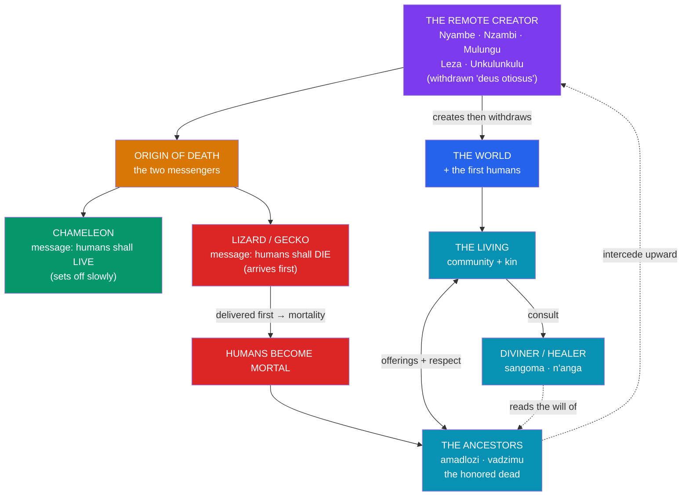

# 🦎 Bantu and Southern African Myth

> [!abstract] TL;DR
> The **Bantu-speaking peoples** — some 500 languages spread by the **Bantu migrations** (c. 1000 BCE–1000 CE) across the southern half of Africa, from Cameroon to the Cape — share broad family resemblances rather than a single mythology. Most traditions feature a **remote creator god** known by cognate or regional names: **Nyambe / Nzambi** (Central Africa), **Mulungu** (East/Central Africa), **Leza** (Zambia region), and the Zulu **Unkulunkulu** ("the very old/great one"), often a *deus otiosus* who made the world and then withdrew. A strikingly widespread narrative explains the **origin of death**: the creator sends a slow **chameleon** with a message of life and a faster **lizard (or gecko/hare)** with a message of death, and because the second messenger arrives first, humans became mortal. Across these societies the practical center of gravity is not the distant high god but **ancestor veneration** — the *amadlozi* (Zulu) or *vadzimu* (Shona) — the honored dead who remain active guardians and intermediaries. The overriding lesson is **diversity**: sub-Saharan Africa's traditions are too many and too varied to reduce to one system.

## Intuition — analogy first

Think of Bantu religion less as a **pantheon** and more as a **family firm run by the founders' late relatives**.

In the Yoruba system (see [[The_Yoruba_Orishas]]) you petition a crowded cabinet of specialist gods. Much of the Bantu-speaking world works differently. There *is* a supreme creator — **Unkulunkulu**, **Mulungu**, **Nzambi** — but like an aged founder who built the company and retired, he is honored, spoken of, and rarely bothered with day-to-day requests. The people you actually turn to are the **ancestors**: your own deceased parents and grandparents, who have "moved upstairs" but still watch the family business, reward respect, punish neglect, and carry your messages toward the divine. When cattle sicken or a marriage fails, you do not usually appeal to the remote creator; you ask a diviner whether an **ancestor** is displeased and what offering will set things right.

And the reason death entered this family firm in the first place is told, again and again across thousands of kilometers, as a **botched delivery** — a slow messenger with good news overtaken by a fast messenger with bad. That so many unrelated communities tell essentially the same **chameleon-and-lizard** story is one of the great puzzles of comparative African folklore. See [[_MOC_African_Myth]].

---

## The Shape of Bantu Cosmology

## Key Concepts

### The Bantu expansion and its family of traditions

"**Bantu**" is a **linguistic**, not a mythological, label: it names a family of roughly 500 related languages (the word *bantu* means "people," from the root *-ntu*, "person") carried across sub-Saharan Africa by the **Bantu migrations** over some two millennia. Because these peoples share deep linguistic ancestry and, in many cases, comparable social structures (cattle-keeping, patrilineal kinship, chieftaincy), their mythologies show **family resemblances** — cognate creator-god names, recurring death myths, a strong ancestor cult. But they are not one religion: Zulu, Shona, Kongo, Baganda, and Herero traditions differ substantially. Treating "Bantu myth" as monolithic is exactly the error the [[_MOC_African_Myth|section MOC]] warns against.

### The remote creator gods

Across the Bantu world the supreme being is typically a **transcendent creator** who withdrew after making the world — the same *deus otiosus* pattern seen in the Yoruba **Olodumare** (see [[The_Yoruba_Orishas]]) and the Akan **Nyame** (see [[Anansi_the_Trickster]]). Names vary by region:

| Creator name | Peoples / region | Notes |
|---|---|---|
| **Nzambi / Nyambe** | Kongo, and widely across Central Africa | *Nzambi a Mpungu* among the Kongo; among the most widespread Bantu creator names |
| **Mulungu** | Eastern/Central Africa (Yao, Nyamwezi, and others) | The word also came to mean "God" generally; associated with the sky |
| **Leza** | Zambia, Malawi (Tonga, Ila, and others) | A high god linked to rain and sky, sometimes withdrawn after human ingratitude |
| **Unkulunkulu** | Zulu (Southern Africa) | "The very great/old one"; first ancestor *and* creator, who emerged from reeds (*uhlanga*) |
| **Mwari / Nyadenga** | Shona (Zimbabwe) | High god approached through spirit media and the Matonjeni oracle |
| **Modimo** | Sotho-Tswana | Remote supreme being, approached chiefly via ancestors (*badimo*) |

The Zulu **Unkulunkulu** is a telling case: he is simultaneously the **creator** and the **first human/ancestor**, said to have "broken off" from a bed of reeds and then brought forth people, cattle, and the customs of life — blurring the line between high god and founding ancestor in a way characteristic of the region.

### The origin of death — the two messengers

One of Africa's most **widely distributed** myths explains why humans are mortal through a **failed message**. In the Zulu version, **Unkulunkulu** sends the **chameleon** to tell humankind they will not die; the chameleon dawdles (famously slow, easily distracted by eating). The creator then sends the swift **lizard** (or in other tellings a gecko, or a hare) with the opposite message — that people *will* die. The lizard arrives first, its word takes effect, and death becomes humanity's lot; by the time the chameleon delivers the message of life, it is too late. Cognate versions appear among the **Ngoni, Yao, Akamba, Ila, Bura**, and many others across a vast belt of the continent, with different pairs of animals but the same structural logic: **the good news travels too slowly**. To this day the chameleon is regarded with suspicion or ritual avoidance in parts of Southern Africa because of its role. The motif's near-universality within Africa is a live question of **diffusion versus independent invention** in comparative folklore.

### Ancestor veneration — the living heart of practice

If the creator is remote, the **ancestors** are immediate. Across Bantu societies the honored dead — Zulu **amadlozi** (or *amaThongo*), Shona **vadzimu**, Sotho-Tswana **badimo** — remain full members of the community, differing from the living only in that they have "crossed over." They **guard the lineage, enforce moral and social order, reward respect with health and fertility, and punish neglect with misfortune or illness**, and they serve as **intermediaries** conveying human needs toward the high god. Relations with them are maintained through **offerings, libations, praise-names, and animal sacrifice**, and their will is read by ritual specialists — the Zulu **sangoma** (diviner) and **inyanga** (herbalist), the Shona **n'anga**. Ancestor veneration is thus the **functional center** of much Bantu religion, oriented less toward cosmic myth than toward the ongoing, reciprocal relationship between the living and their dead. This is a different religious "shape" from the deity-centered Yoruba system, and it is transmitted, like all African myth, through **oral performance and praise-poetry** (see [[Oral_Tradition_and_the_Griot]]).

### The sheer diversity of sub-Saharan traditions

Beyond Bantu speakers, sub-Saharan Africa holds thousands of further traditions — the Dogon of Mali with their intricate Nommo cosmology, the San (Khoisan) with the trickster-creator **/Kaggen** (the mantis), the Khoikhoi high god **Tsui-//Goab**, and countless others. Any survey must **foreground this plurality** rather than smooth it into a single "African mythology." Shared *tendencies* — withdrawn creators, ancestor cults, animal tricksters, oral transmission — are real, but they are family resemblances across an immense and internally diverse continent, not a creed.

## Examples Across Cultures

- **Unkulunkulu and the reeds** (Zulu): the first being breaks off from *uhlanga*, the primordial bed of reeds, and originates people, cattle, fire, and marriage customs — creator and first ancestor fused in one figure.
- **The chameleon and the lizard** (Zulu, Ngoni, Yao, and beyond): the two-messenger origin of death, one of the continent's most widely attested myths, with local animal pairs (chameleon/lizard, chameleon/hare, dog/frog among others).
- **Nzambi a Mpungu** (Kongo): the supreme creator above a world of lesser spirits and ancestors; the Kongo cosmogram (*dikenga*) maps the cyclical passage between the world of the living and the world of the dead (*Ku Mpèmba*).
- **Leza and human ingratitude** (Ila/Tonga of Zambia): tales in which the high god withdraws to the sky after early humans prove troublesome, explaining the distance between god and world.
- **The Mwari cult** (Shona): a high god approached not directly but through spirit mediums and regional oracles, illustrating the intermediary logic of the whole system.

## Common Pitfalls / Misconceptions

- **"Ancestor veneration is ancestor *worship*."** Most scholars stress that the ancestors are **honored kin and intermediaries**, not gods; they are venerated and consulted, but the supreme being remains categorically above them. The distinction matters and was often blurred by missionaries.
- **Assuming a single "Bantu mythology."** "Bantu" is a language family, not a doctrine; Zulu, Kongo, Shona, and Baganda beliefs differ in content and emphasis. Family resemblance is not identity.
- **Reading the remote creator as evidence of "no real god."** A *deus otiosus* is a **theological choice** — a transcendent creator who governs through intermediaries — not an absence of belief in a supreme being.
- **Explaining the shared death-myth too quickly.** Whether the two-messenger story spread by **diffusion** or arose by **independent invention** is genuinely unsettled; asserting either as fact overstates the evidence (see [[The_Comparative_Method]]).
- **Treating these as extinct "primitive" beliefs.** Ancestor veneration and high-god traditions remain **living practice** for millions, often coexisting with Christianity and Islam in syncretic forms.

## Related Concepts

- [[_MOC_African_Myth|↑ Section MOC]] — this note carries the section's "diversity, not monolith" theme
- [[The_Yoruba_Orishas]] — contrast: an elaborate deity-centered pantheon vs. Bantu ancestor-centered practice; shared *deus otiosus* creator
- [[Anansi_the_Trickster]] — another withdrawn sky god (Nyame) and West African trickster tradition
- [[Oral_Tradition_and_the_Griot]] — the oral, performed mode by which these creator and death myths survive
- [[The_Comparative_Method]] — the diffusion-vs-independent-invention debate raised by the two-messenger myth
- Cross-vault: [[Creation_and_Flood_Myths]] — Bantu cosmogonies and origin-of-death myths within the global comparative frame

## Review Questions

1. What does it mean to call the Bantu creator gods (Nzambi, Mulungu, Unkulunkulu) *deus otiosus*, and how does that theological "shape" redirect everyday religious practice toward the ancestors?
2. Reconstruct the two-messenger origin-of-death myth and its typical animal pair. Why is its wide distribution across unrelated African peoples a classic test case for diffusion versus independent invention?
3. Explain why "Bantu mythology" is a misleading phrase if taken to mean a single system. What *are* the genuine shared tendencies across these traditions, and how do they differ from a unified creed?

## Sources

- Mbiti, J. S. (1969). *African Religions and Philosophy*. Heinemann
- Berglund, A.-I. (1976). *Zulu Thought-Patterns and Symbolism*. C. Hurst / Indiana University Press
- Werner, A. (1933). *Myths and Legends of the Bantu*. George G. Harrap
- Abrahamsson, H. (1951). *The Origin of Death: Studies in African Mythology*. Studia Ethnographica Upsaliensia

#mythology #african-myth #bantu #ancestors #creation
