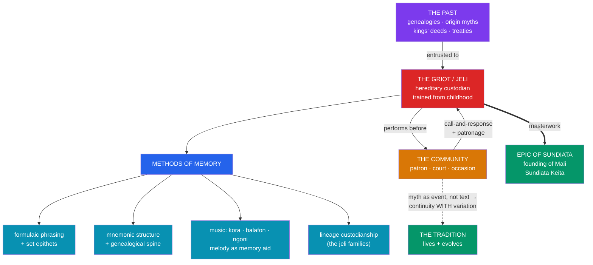

# 🪕 Oral Tradition and the Griot

> [!abstract] TL;DR
> Most African myth has been transmitted not through scripture but through **oral tradition** — spoken, sung, and performed, held in trained memory and renewed with each telling. In West Africa the master of this art is the **griot** (in Manding, **jeli** or *jali*; plural *jeliw*): a hereditary **oral historian, praise-singer, genealogist, musician, and diplomat** who serves as a community's **living archive**. The griot's supreme achievement is the **Epic of Sundiata** (*Sunjata*), the founding narrative of the thirteenth-century **Mali Empire** and its hero **Sundiata Keita**, still performed by *jeliw* who trace their lineage to Sundiata's own bard, **Balla Fasséké**. Oral tradition is not a degraded substitute for writing: it has its **own methods** — formulaic phrasing, mnemonic structure, melody and instrument (the **kora**, *balafon*, *ngoni*), and lineage-bound custodianship — that preserve remarkable continuity while allowing living **variation**. Understanding the griot reframes myth itself: not a fixed text to be read, but a **performance** to be enacted, and thus continually alive.

## Intuition — analogy first

A griot is what you get when a **library, a bard, a court historian, and a Wikipedia editor are combined in one person and made hereditary**.

In a society without writing, the danger is obvious: when an elder dies, does the community's entire memory — its genealogies, treaties, origin myths, and the deeds of its kings — die with them? The **griot** is the institutional answer. From childhood, a child born into a *jeli* family is trained to hold enormous quantities of narrative, praise-poetry, and genealogy in memory, and to **perform** it accurately on demand: at a naming, a wedding, a coronation, or a war council. The griot is the **searchable index** of the community's past, the one who can recite your ancestors back many generations and settle a dispute over who is owed what.

But unlike a book, this archive **speaks back**. A griot does not merely store the tradition; he **performs** it — tailoring it to the audience, the patron, and the occasion, improvising within fixed frames, drawing tears or courage from listeners with voice and **kora**. This is the deep insight of the section: African myth is not primarily a *thing on a page* but an *event in time*. It is precisely this performative, custodial quality that transmitted the Orishas (see [[The_Yoruba_Orishas]]) and carried Anansi across the sea (see [[Anansi_the_Trickster]]). See [[What_Is_Myth]].

---

## How Oral Tradition Preserves Myth

## Key Concepts

### The griot as living archive

The **griot** — French colonial term for the West African **jeli / jali** (Manding), *gewel* (Wolof), *gawlo* (Fula) — is a hereditary specialist in the **spoken and sung word**. Born into endogamous artisan-caste families (the *nyamakala* among the Manding), *jeliw* inherit and are trained in a portfolio of skills: **oral history and genealogy**, **praise-poetry** (naming and exalting patrons and their lineages), **music** on instruments such as the 21-string **kora**, the **balafon** (wooden xylophone), and the **ngoni** (lute), and roles as **spokesperson, mediator, and diplomat** attached to noble houses. The griot preserves what a literate society files in archives — treaties, royal lineages, the origins of clans, the deeds of ancestors — and is empowered to **recite and interpret** it authoritatively. To lose a griot without a successor was, as the Malian writer Amadou Hampâté Bâ famously put it, to see a library burn.

### The Epic of Sundiata

The crowning work of the Mande griot tradition is the **Epic of Sundiata** (*Sunjata Fasa*), the foundation legend of the **Mali Empire**. It recounts the life of **Sundiata Keita** (Mari Djata, r. c. 1235–1255): the prophesied but disabled child who cannot walk until, in a celebrated scene, he rises and bends an iron rod into a bow; his exile; the tyranny of the sorcerer-king **Soumaoro Kanté** of the Sosso; and Sundiata's return and victory at the **Battle of Kirina**, founding the empire and proclaiming the **Kurukan Fuga** (an oral charter of governance). Crucially, the epic is **not primarily a written text**: it is performed by griots, most famously in the version dictated by **Djeli Mamoudou Kouyaté** (D. T. Niane's 1960 rendering). The Kouyaté griots trace their office to **Balla Fasséké**, Sundiata's own *jeli* — so the epic is **transmitted by the very lineage it describes**, a self-authenticating chain of custody running back some eight centuries. It sits at the intersection of **myth, legend, and history**: a real medieval empire narrated with mythic apparatus (prophecies, sorcery, totemic animals). On the myth/legend/history distinction, see [[What_Is_Myth]].

### The methods and reliability of oral tradition

Oral tradition is often wrongly imagined as a lossy game of "telephone." In fact it deploys **specialized techniques** that grant it structure and resilience:

| Technique | How it preserves | Example |
|---|---|---|
| **Formulaic language** | Ready-made phrases and set **epithets** fill the meter and cue memory | Fixed praise-names (*jamu*) for lineages and heroes |
| **Genealogical spine** | Narratives hang on remembered lines of descent | Sundiata's ancestry recited before the deeds |
| **Music & rhythm** | Melody and instrument (kora, balafon) chunk and stabilize text | Sung passages are harder to misremember than prose |
| **Formal training** | Years of apprenticeship in caste lineages enforce fidelity | *Jeli* children learning under a master |
| **Occasion & audience** | Public performance invites correction by knowledgeable elders | Coronations, naming ceremonies |

The historian **Jan Vansina** (*Oral Tradition as History*, 1985) established the **source-critical evaluation** of such testimony — distinguishing eyewitness from transmitted accounts, tracing chains of transmission, and controlling for **feedback**, telescoping of genealogies, and patron bias. Oral tradition is therefore **reliable within limits**: strong on genealogy, formula, and structural continuity; weaker on precise chronology and prone to reshaping details to flatter present patrons. It is a genuine historical **source**, not a fairy tale — but one that must be read with its own critical apparatus.

### Myth as performance, not fixed text

The deepest lesson of the griot tradition is a **theoretical** one about the nature of myth. In a manuscript culture we imagine a myth as a *stable text* with an authoritative wording. In an oral-performance culture, the myth exists only in the **act of telling**: each performance is a unique realization, shaped by audience, patron, occasion, and the performer's art, yet held within **fixed frames** (formulas, episodes, genealogies) that keep it recognizably "the same" story. This yields **continuity with variation** — no two performances identical, none arbitrarily free. It reframes concepts developed elsewhere in this vault: the Yoruba **Ifá** corpus (see [[The_Yoruba_Orishas]]) and the Akan **Anansesem** (see [[Anansi_the_Trickster]]) are likewise *performed* bodies of tradition, not scriptures. Recognizing myth as **event rather than object** is essential to studying any predominantly oral culture — which is to say, most of human culture for most of history. See [[_MOC_African_Myth]].

## Primary Sources & Examples

- **The Epic of Sundiata** — as performed by **Djeli Mamoudou Kouyaté** and transcribed by D. T. Niane (1960); the touchstone example of a griot masterwork blending myth, legend, and imperial history.
- **The griot's genealogical recitation** — praise-poetry (*fasa*) reciting a patron's ancestry back many generations, demonstrating the archive-function of the office.
- **Instruments as mnemonic anchors** — the **kora**, **balafon**, and **ngoni**, whose melodic phrasing stabilizes long sung narratives and whose repertoire is itself inherited.
- **Vansina's Kuba case** (Central Africa) — his source-critical study of Kuba royal traditions, foundational for treating oral testimony as evaluable historical evidence.
- **Modern jeliya** — griot lineages such as the **Kouyaté**, **Diabaté**, and **Sissoko** families, whose contemporary musicians still carry the hereditary tradition into the recording era.

## Common Pitfalls / Misconceptions

- **"Oral = unreliable / primitive."** Oral tradition has rigorous mnemonic and custodial methods and is a legitimate historical source; dismissing it reflects a literate-culture bias, not the evidence.
- **"Oral = word-for-word fixed" (the opposite error).** Nor is it frozen. Its hallmark is **continuity with variation**: stable frames, variable realization. Expecting a single "correct" text misreads how it works.
- **Confusing the griot with a neutral bard.** Griots are **patron-bound** professionals; praise-singing and lineage flattery can shape the record. Source criticism (à la Vansina) exists precisely to control for this bias.
- **Reading Sundiata as pure fact or pure fable.** It is **both history and myth** — a real empire narrated through legendary apparatus; sorting the layers is the analytical task, not choosing one label.
- **Generalizing "the griot" to all of Africa.** The griot is a specifically **West African (Sahelian/Mande, Wolof, Fula)** institution. Other regions transmit myth through different specialists — diviners, praise-poets (*imbongi* among the Zulu), elders — so the mechanism, like the myths, is plural (see [[Bantu_and_Southern_African_Myth]]).

## Related Concepts

- [[_MOC_African_Myth|↑ Section MOC]] — this note supplies the section's account of *how* African myth is transmitted
- [[The_Yoruba_Orishas]] — Ifá as another memorized, performed corpus rather than scripture
- [[Anansi_the_Trickster]] — the Anansesem tales as living oral performance carried across the Atlantic
- [[Bantu_and_Southern_African_Myth]] — ancestor-praise and other, non-griot modes of oral transmission
- Cross-vault: [[What_Is_Myth]] — the myth vs. legend vs. history distinction the Sundiata epic straddles
- Cross-vault: [[West_African_Empires]] (History) — the Mali Empire and Sundiata Keita as historical context for the epic

## Review Questions

1. List the roles a West African griot (*jeli*) performs and explain the sense in which the griot is a community's "living archive." Why did Amadou Hampâté Bâ compare the death of a griot to a burning library?
2. The Epic of Sundiata is transmitted by the very lineage of griots it describes. How does that chain of custody bear on the epic's authority, and why does it sit between myth, legend, and history?
3. What specific techniques give oral tradition its reliability, and what are its characteristic weaknesses? How does the idea of "continuity with variation" reframe what a myth *is* in a performance culture?

## Sources

- Niane, D. T. (1965). *Sundiata: An Epic of Old Mali* (trans. G. D. Pickett). Longman
- Vansina, J. (1985). *Oral Tradition as History*. University of Wisconsin Press
- Hale, T. A. (1998). *Griots and Griottes: Masters of Words and Music*. Indiana University Press
- Conrad, D. C. (2004). *Sunjata: A West African Epic of the Mande Peoples*. Hackett

#mythology #african-myth #oral-tradition #griot #epic
