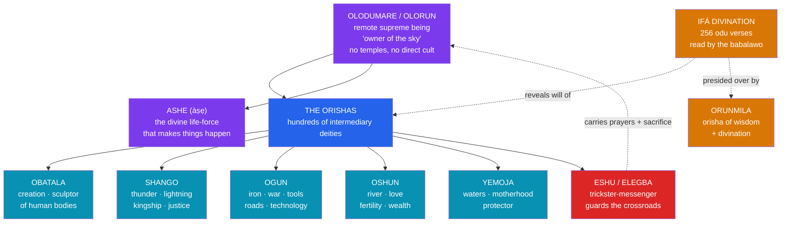

# 🌩️ The Yoruba Orishas

> [!abstract] TL;DR
> The **Yoruba** of present-day southwestern Nigeria, Benin, and Togo developed one of Africa's most elaborate and widely diffused religious systems. At its apex sits **Olodumare** (also called **Olorun**, "owner of the sky"), a remote, genderless **supreme being** who set creation in motion but stands aloof from daily affairs. Below Olodumare act the **Orishas** — hundreds of powerful intermediary deities who govern nature, human endeavor, and destiny: **Obatala** the sculptor who molds human bodies, **Shango** the thunder-king, **Ogun** the god of iron and war, **Oshun** the river of love and fertility, **Yemoja** the mother of waters, and **Eshu (Elegba)** the ambivalent trickster-messenger who guards the crossroads and carries messages between worlds. The system is transmitted and navigated through **Ifá divination**, an immense oral corpus of verses (*odu*) interpreted by a trained priest, the **babalawo** ("father of secrets"). Carried across the Atlantic by enslaved Yoruba people, the tradition survived and transformed into **Santería (Lucumí)** in Cuba, **Candomblé** in Brazil, and elements of **Vodou** in Haiti — making it one of the most consequential religious exports of the African diaspora.

## Intuition — analogy first

Think of the Yoruba cosmos not as a single throne but as a **vast civil service with an absentee head of state**.

**Olodumare** is like a founding monarch who wrote the constitution, delegated all executive power, and then withdrew from public life. Almost no temples are built to Olodumare and no sacrifices are addressed directly to this being, because a remote high god does not process individual petitions. Instead, everything is handled by an enormous roster of **ministers with portfolios** — the Orishas. If you need iron worked, a road cleared, or courage in battle, you appeal to **Ogun**; if you need love, wealth, or a child, to **Oshun**; if you seek justice or fear a tyrant's lightning, to **Shango**. Each has a personality, a color, a rhythm, favored foods, taboos, and a temperament that must be respected.

And critically, no message reaches this bureaucracy without passing through the **postmaster at the crossroads** — **Eshu**, who must be greeted first in every ritual because he alone carries offerings and prayers between the human world and the divine. This is a recurring shape in world myth: a distant sky-father (compare the Greek *Ouranos* or the Akan *Nyame* in [[Anansi_the_Trickster]]) whose withdrawal opens space for a crowded, vivid middle tier of gods who actually run the world. See [[_MOC_African_Myth]].

---

## How the Cosmos Is Organized

## Key Concepts

### Olodumare and the withdrawn sky

At the summit of Yoruba cosmology is **Olodumare**, also invoked as **Olorun** ("owner/lord of the sky") and **Olofin**. Olodumare is the source of **ashe** (*àṣẹ*) — the divine energy or life-force that animates the cosmos and grants power to prayer, ritual, and command. Crucially, Olodumare is a *deus otiosus* (an "idle god"): transcendent, essentially genderless, without images or a dedicated priesthood, and not petitioned directly. This withdrawal is not neglect but delegation — Olodumare governs *through* the Orishas, much as a remote flood- or sky-god pattern recurs across African and world mythology (compare **Unkulunkulu** and **Mulungu** in [[Bantu_and_Southern_African_Myth]]).

### The Orishas — deities with portfolios

The **Orishas** (*òrìṣà*) are the working deities of the pantheon — variously described as emanations of Olodumare, personified forces of nature, or deified ancestors and culture-heroes. Traditions count them in the hundreds (the phrase *irúnmọlẹ̀* evokes "four hundred and one" divinities), but a core group dominates worship. Each Orisha has a distinct domain, sacred color, drum rhythm, praise-poetry (*oríkì*), favored offerings, and prohibitions (*èèwọ̀*). Devotees are often "chosen" by a particular Orisha and undergo initiation to become that deity's priest or "child."

| Orisha | Domain | Emblems & Associations | Diaspora counterpart (Santería) |
|---|---|---|---|
| **Obatala** | Creation, purity, wisdom | White cloth, the sculptor who molds bodies; linked to those born with disabilities | Obatalá (syncretized with Our Lady of Mercy) |
| **Shango** | Thunder, lightning, kingship, justice | Double-headed axe (*oshe*), red-and-white; a deified king of Oyo | Changó (St. Barbara) |
| **Ogun** | Iron, war, tools, roads, technology | Machete, metal, the forge; patron of smiths, hunters, drivers | Ogún (St. Peter) |
| **Oshun** | Rivers, love, fertility, wealth, beauty | Fresh water, honey, brass, yellow/gold | Ochún (Our Lady of Charity) |
| **Yemoja** | Seas/waters, motherhood, protection | The ocean, blue-and-white; "mother of the fish/waters" | Yemayá (Our Lady of Regla) |
| **Eshu / Elegba** | Crossroads, messages, chance, gatekeeping | Laterite stone, the crossroads; must be honored first | Eleguá (the Holy Child of Atocha) |
| **Orunmila** | Wisdom, divination, destiny | Ifá corpus; witness to each person's fate | Orula/Orunla (St. Francis) |

### Eshu the trickster-messenger

**Eshu** (also **Elegba** / **Elegbara**) is the most **ambivalent and indispensable** Orisha. He is the divine **messenger** who carries sacrifices and prayers upward and divine responses downward; nothing works without him, so he is saluted first in every rite. He is the guardian of the **crossroads** and of thresholds, the enforcer of *ashe*, and a **trickster** who exposes pride, tests intentions, and provokes the disorder that reveals truth. A famous Yoruba tale has Eshu wear a cap that is **red on one side, black on the other** and walk a boundary between two farmers' fields; each sees a different color, and the two friends quarrel bitterly over what the passing stranger "really" wore — a parable about partial perspectives and the ease of manufactured conflict. Eshu is not "the devil," despite colonial-era mistranslations; he is the principle of mediation, contingency, and the productive chaos at every boundary. On the trickster as a cross-cultural type, see [[Jungian_Archetypes_and_Myth]] and compare [[Anansi_the_Trickster]].

### Ifá divination and the babalawo

The system is navigated through **Ifá**, a sophisticated **divination** practice presided over by the Orisha **Orunmila** (the witness to every person's chosen destiny). A trained priest, the **babalawo** ("father of secrets" — *bàbáláwo*), casts a divining chain (*òpèlè*) or manipulates sixteen sacred palm nuts (*ikin*) to generate one of **256 configurations** called **odu** (16 × 16). Each *odu* is attached to a vast body of memorized **verses** — myths, proverbs, precedents, and prescribed sacrifices (*ẹbọ*) — that the diviner recites and applies to the client's situation. Ifá is thus simultaneously a **divination technique, an ethical archive, and an oral literature** of enormous scale; UNESCO inscribed it on its list of Intangible Cultural Heritage in 2005/2008. It exemplifies how African myth lives inside a **performed, memorized corpus** rather than a fixed scripture — a theme developed in [[Oral_Tradition_and_the_Griot]].

### The Atlantic diaspora

Between the sixteenth and nineteenth centuries, the transatlantic slave trade forcibly transported large numbers of Yoruba (and related Fon/Ewe) people to the Americas, especially in the later period to Cuba and Brazil. There, under conditions of enslavement and forced Catholicization, devotees **syncretized** Orishas with Catholic saints to worship in disguise, giving rise to enduring **Afro-diasporic religions**:

- **Santería / Regla de Ocha / Lucumí** (Cuba) — Orishas paired with saints (Changó/St. Barbara, Ochún/Our Lady of Charity).
- **Candomblé** (Brazil) — *orixás* worshipped in *terreiros* (temples), organized in "nations" (Ketu, Jeje, Angola).
- **Vodou** (Haiti) and its *lwa* — drawing on Fon/Yoruba and Kongo sources; **Legba**, the gatekeeper, mirrors Eshu/Elegba.

This survival is a landmark case of **religious diffusion under duress** — myth carried in memory across the Middle Passage. See [[Anansi_the_Trickster]] for a parallel folkloric diffusion and [[_MOC_African_Myth]].

## Examples Across Cultures

- **The molding of humanity**: **Obatala** is commissioned to sculpt human bodies from clay; in one widespread narrative he drinks palm wine and works carelessly, producing people with disabilities — who are therefore held sacred to him. Olodumare alone breathes in the *ẹ̀mí* (life/soul).
- **The lowering of the earth**: In Yoruba cosmogony, Obatala (or in some versions **Oduduwa**) descends from the sky on a chain with a handful of earth, a five-toed hen that scatters it across the primordial waters, and a palm nut — founding the world at **Ile-Ife**, the sacred city where the Yoruba say creation began.
- **The deified king**: **Shango** is remembered as a historical *alaafin* (king) of the **Oyo Empire** whose reign ended when he was said to have ascended to heaven; he became the Orisha of thunder, his anger read in lightning strikes.
- **Eshu's two-colored cap**: the parable of the boundary-walking stranger (red/black) that turns friends into enemies — a Yoruba meditation on perspective, mediation, and the trickster's disruptive truth-telling.

## Common Pitfalls / Misconceptions

- **"African myth is one thing."** The Yoruba system is *one* tradition among thousands on the continent; its elaborate pantheon is not representative of, say, Bantu creator-god traditions (see [[Bantu_and_Southern_African_Myth]]). Avoid generalizing from Yoruba religion to "African mythology."
- **Treating Olodumare as a Zeus-like ruler.** Olodumare is a *withdrawn* high god without cult, images, or direct petition — closer to a transcendent source than an active king enthroned over squabbling gods.
- **Calling Eshu "the devil."** This is a colonial and missionary mistranslation. Eshu is an ambivalent trickster and essential mediator, not a personification of evil.
- **Assuming the diaspora religions are "watered-down" copies.** Santería, Candomblé, and Vodou are **living, creative reconfigurations**, not degraded survivals; syncretism with Catholic saints was a strategy of concealment and adaptation, not a loss of substance.
- **Reading Ifá as fortune-telling.** Ifá is a structured ethical and literary corpus prescribing conduct and sacrifice, closer to consulting a vast memorized case-law than to predicting the future.

## Related Concepts

- [[_MOC_African_Myth|↑ Section MOC]] — the Yoruba as one sampled tradition among Africa's thousands
- [[Anansi_the_Trickster]] — a second West African tradition, and a parallel case of Atlantic diffusion under the slave trade
- [[Oral_Tradition_and_the_Griot]] — Ifá as memorized, performed oral corpus rather than fixed scripture
- [[Bantu_and_Southern_African_Myth]] — contrast: withdrawn creator gods with far sparser pantheons
- [[Jungian_Archetypes_and_Myth]] — Eshu and the cross-cultural **trickster** archetype
- Cross-vault: [[The_Atlantic_Slave_Trade]] (History) — the forced migration that carried the Orishas across the ocean

## Review Questions

1. Explain why Olodumare receives almost no direct worship even though the Yoruba regard this being as supreme. How does the concept of *ashe* and the role of the Orishas resolve the apparent paradox?
2. Describe the function of the *babalawo* and the structure of Ifá divination (the *odu* and their verses). In what sense is Ifá a body of literature as much as a divination method?
3. Trace how the Orisha tradition survived the Middle Passage and name three diaspora religions it seeded. What does the role of Eshu/Elegba (or Legba) reveal about which features of the tradition proved most portable?

## Sources

- Bascom, W. (1969). *Ifa Divination: Communication Between Gods and Men in West Africa*. Indiana University Press
- Idowu, E. B. (1962). *Olódùmarè: God in Yoruba Belief*. Longmans
- Abimbola, W. (1976). *Ifá: An Exposition of Ifá Literary Corpus*. Oxford University Press
- Murphy, J. M. (1993). *Santería: African Spirits in America*. Beacon Press

#mythology #african-myth #yoruba #orisha #ifa
