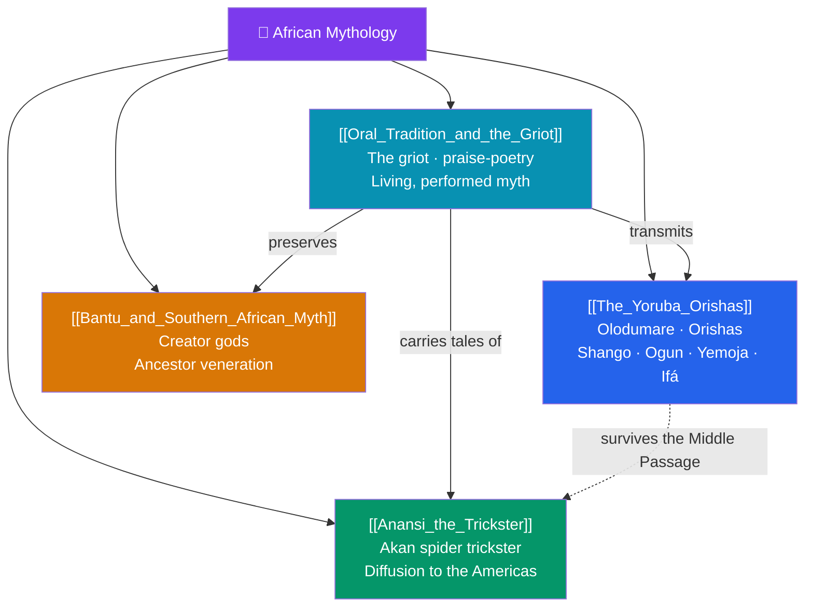

# 🥁 African Mythology — Map of Content

> [!abstract] What This Section Covers
> Africa holds thousands of distinct mythic traditions, most transmitted orally and many still living; this section samples widely while foregrounding transmission itself. **The Yoruba Orishas** introduces one of the continent's most influential systems — the supreme being Olodumare, the pantheon of Orishas such as Shango, Ogun, and Yemoja, and the Ifá divination corpus — a tradition that crossed the Atlantic into Santería, Candomblé, and Vodou. **Anansi the Trickster** traces the Akan spider trickster from West Africa through the slave trade into Caribbean and American folklore, a case study in mythic diffusion. **Bantu and Southern African Myth** surveys creator-god and ancestor-veneration traditions across the vast Bantu-speaking world. **Oral Tradition and the Griot** steps back to examine the mechanism of it all — the West African griot, praise-poetry, and myth as a living, performed, and continually renewed practice. Together they resist any single "African mythology" while revealing shared emphases on ancestors, the spoken word, and the divine diffused through the world.

## Concept Map

## Learning Path

1. [[Oral_Tradition_and_the_Griot]] — First, how African myth is transmitted: the griot, performance, and living tradition.
2. [[The_Yoruba_Orishas]] — Olodumare, the Orishas, Ifá divination, and the tradition's diaspora forms.
3. [[Anansi_the_Trickster]] — The Akan spider and his journey into Caribbean and African-American folklore.
4. [[Bantu_and_Southern_African_Myth]] — Creator gods and ancestor veneration across the Bantu-speaking world.

## All Notes at a Glance

| Note | Difficulty | What You'll Learn |
|------|------------|-------------------|
| [[The_Yoruba_Orishas]] | Beginner → Intermediate | Olodumare, Orishas (Shango, Ogun, Yemoja, Eshu), Ifá divination, Santería/Candomblé diaspora |
| [[Anansi_the_Trickster]] | Beginner | Anansi the Akan spider, trickster tale-types, diffusion via the transatlantic slave trade |
| [[Bantu_and_Southern_African_Myth]] | Intermediate | Bantu creator gods (Nzambi, Mulungu), ancestor veneration, the wide Bantu migration |
| [[Oral_Tradition_and_the_Griot]] | Beginner → Intermediate | The West African griot, praise-poetry, the *Epic of Sundiata*, myth as living performance |

## Key Questions This Section Answers

- Why is it misleading to speak of a single "African mythology"?
- How did the Yoruba Orisha tradition survive and transform across the Atlantic?
- What does the diffusion of Anansi tales reveal about how myth travels?
- What role do ancestors play in Bantu and Southern African religion?
- How does oral transmission by griots keep myth alive and evolving?

## Related Sections

- [[_MOC_Mythology_Master|↑ Mythology Master MOC]]
- [[_MOC_Mesoamerican_Myth|← Mesoamerican]]
- [[_MOC_Slavic_Baltic_Myth|→ Slavic & Baltic]]
- Cross-vault: [[What_Is_Myth]] (oral vs written myth), [[Urban_Legends_and_Modern_Folklore]] (living folklore)

#MOC #Mythology #AfricanMyth
