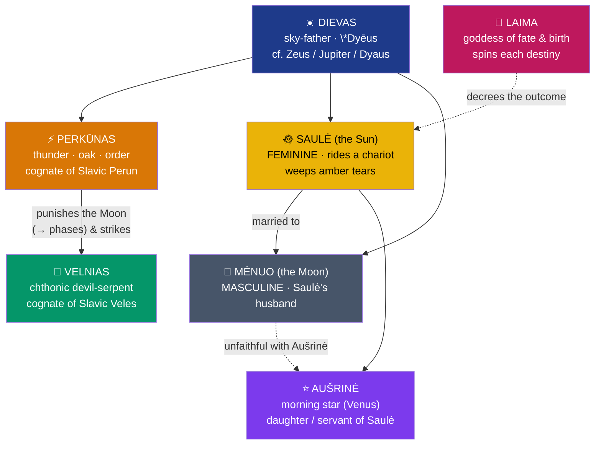

# 🌞 Baltic Mythology

> [!abstract] TL;DR
> The **Baltic** peoples — Lithuanians, Latvians, and the extinct Old Prussians — speak the most **archaic surviving Indo-European languages**, and their mythology is correspondingly **conservative**, often called a living fossil of Indo-European belief. Its high god is **Dievas**, the bright sky-father whose very name descends from Proto-Indo-European **\*Dyēus** (the source of Zeus and Jupiter). Beside him stands **Perkūnas**, the oak-and-thunder god — the exact cognate of Slavic **Perun** — who strikes the chthonic **Velnias**. The heavens hold a mythic family drama: the **sun-goddess Saulė** (feminine, unlike the Mediterranean sun-*gods*), the **moon-god Mėnuo**, the morning star **Aušrinė**, and their "celestial wedding." Human destiny is spun by **Laima**, goddess of fate. Uniquely, this tradition is preserved less in chronicles than in a vast body of **folk-songs — the Latvian *dainas* and Lithuanian *dainos*** — and it endured because **Lithuania was the last pagan state in Europe**, officially converting only in **1387**.

## Intuition — analogy first

Baltic mythology is the linguist's **coelacanth** — a living fossil.

When comparative linguists reconstruct Proto-Indo-European, they lean hard on **Lithuanian**, because it preserves ancient sounds and grammar that Latin and Greek eroded away thousands of years ago. A modern Lithuanian farmer's word for "god," *Dievas*, is startlingly close to the reconstructed **\*Dyēus** that also gave Sanskrit *Dyaus*, Greek *Zeus*, and Latin *Iuppiter* (from *Dyeu-pater*, "Sky-father"). The language, in effect, froze.

The **mythology** froze with it, for two reasons. First, the same conservatism that preserved the grammar preserved the imagery. Second — and decisively — **Christianity arrived astonishingly late**: while Kievan Rus' converted in 988 and most of Europe far earlier, pagan Lithuania held out until **1387**, and rural Latvia and Samogitia kept the old rites alive for centuries after. So where a Slavic mythologist works from demolition-rubble (see [[The_Slavic_Pantheon]]), the Baltic mythologist has a **coelacanth still swimming**: not a full theology, but a genuinely old body of folk-song and belief caught unusually close to its pagan source. The catch is that the songs give us **imagery, not doctrine** — vivid pictures of a sun that weeps and a thunderer who courts, but few systematic myths.

---

## The Celestial Family of the Baltic Sky

The diagram renders the **"celestial wedding"** (*dangaus vestuvės*) — the sky-drama that recurs through the *dainas*. The feminine **Sun**, Saulė, is wed to the masculine **Moon**, Mėnuo; the Moon strays after the morning star **Aušrinė**; and **Perkūnas** punishes his infidelity by splitting him, which the songs offer as a poetic **etiology of the lunar phases**. It is a **family melodrama in the heavens** — and a reminder that Baltic myth survives as lyric imagery rather than as a chronicled pantheon.

## Key Concepts

### Dievas and the Indo-European sky

**Dievas** (Latvian **Dievs**) is the high **sky-god**, and his name is the single most transparent Indo-European inheritance in the whole tradition: PIE **\*Dyēus ph₂tḗr**, "Sky-Father," the same root behind **Zeus**, **Jupiter** (*Dyeu-pater*), and Sanskrit **Dyaus Pitṛ**. In the folk-songs, however, Dievas is often a curiously **pastoral, farmerly figure** — riding down from his heavenly homestead on a horse to walk the rye-fields — rather than a remote thunder-wielding king. This mildness left the thunderous, sovereign functions largely to Perkūnas, and made *Dievs* an easy name to reuse for the **Christian God** after conversion.

### Perkūnas — the oak-god who strikes the serpent

**Perkūnas** (Latvian **Pērkons**) is the **thunder-god**, and the linchpin of Baltic–Slavic comparison: he is the exact cognate of Slavic **Perun**, both from PIE **\*Perkʷunos**, "the striker / oak-god." He is imagined driving a fiery chariot, hurling the thunderbolt, associated with the **oak**, and above all **chasing and striking the devil-serpent Velnias** — a duel that mirrors the Slavic Perun–Veles "Basic Myth" and the wider Indo-European **storm-god-versus-serpent** pattern (see [[The_Comparative_Method]]). Where Perun's cult was smashed in 988, Perkūnas was **still cursed by name and invoked in charms** into the early-modern period.

### Saulė, Mėnuo, and the sky-family

A defining feature of Baltic (and broader northern) belief is that the **Sun is female**: **Saulė** is a goddess who drives her chariot across the sky, sinks each evening into the western sea, and **weeps tears of amber** for her lost or wronged children. She is bound in a mythic household with the masculine **Moon, Mėnuo**, the **morning star Aušrinė** (the planet Venus, her daughter or handmaid who lights the fire and the way before her), and the **Sun's own daughters** (Saulės dukterys). Their loves, betrayals, and Perkūnas's interventions supply the great recurring narratives of the *dainas* — cosmology told as domestic lyric.

### Laima and the shaping of fate

**Laima** is the goddess of **fate, fortune, and childbirth** (her name gives Lithuanian *laimė*, "happiness/luck"). She attends every birth and **decrees the newborn's destiny** — a Baltic counterpart to the Norse Norns and the Greek Moirai. In Latvian tradition she is sometimes **tripled** with **Dēkla** and **Kārta**, three fate-sisters who spin, measure, and cut. Around this core cluster stand further powers: the earth-goddess **Žemyna** (Lithuanian *žemė*, "earth"), the hearth-fire goddess **Gabija**, the forest-and-hunt goddess **Medeina**, and — as Perkūnas's chthonic opposite — **Velnias**, a cunning, cattle-owning devil-figure whose name is cognate with Slavic **Veles**.

| Baltic figure | Domain | Cognate / parallel |
|---|---|---|
| **Dievas / Dievs** | sky-father | PIE **\*Dyēus** → Zeus, Jupiter, Dyaus |
| **Perkūnas / Pērkons** | thunder, oak | Slavic **Perun**; PIE **\*Perkʷunos** |
| **Saulė / Saule** | the Sun (feminine) | Norse **Sól**; Vedic **Sūryā** |
| **Mėnuo / Mēness** | the Moon (masculine) | Norse **Máni** |
| **Laima** | fate, childbirth | Norse **Norns**; Greek **Moirai** |
| **Velnias / Velns** | chthonic devil | Slavic **Veles** |

### The dainas — a mythology sung, not chronicled

Baltic mythology is preserved above all in **folk-songs**: the Latvian ***dainas*** and Lithuanian ***dainos***. These are typically short, **unrhymed quatrains** in a **trochaic** meter, densely metaphorical, addressing Saulė, Mēness, Pērkons, Laima, and Māra as familiar presences of daily and seasonal life. In the 19th–20th centuries the Latvian folklorist **Krišjānis Barons** collected and systematized the ***Latvju dainas***, assembling on the order of **hundreds of thousands** of song-texts — one of the great national archives of oral tradition, and the primary window onto pre-Christian Baltic thought.

## Primary Sources & Examples

- **The Latvian *dainas* (Krišjānis Barons, *Latvju dainas*, 1894–1915)** — the vast corpus of quatrains preserving Saule, Pērkons, Laima, and Māra; the richest Baltic source.
- **Lithuanian *dainos* and folklore** — songs and tales retaining the **celestial-wedding** cycle and Perkūnas's pursuit of Velnias.
- **Peter von Dusburg, *Chronicon terrae Prussiae* (c. 1326)** — a Teutonic chronicle describing Old **Prussian** religion, the sanctuary of **Romuva**, and the priest **Kriwe** (used cautiously; later writers such as **Simon Grunau** embroidered it heavily).
- **Wilhelm Mannhardt, *Letto-Preussische Götterlehre* (1936, posthumous)** — the critical compilation of source-testimonia that separates genuine record from Renaissance invention.
- **Comparative reconstruction** — *Dievas* ↔ *\*Dyēus*, *Perkūnas* ↔ *Perun* ↔ *\*Perkʷunos*, feminine *Saulė* ↔ Norse *Sól*; see [[The_Comparative_Method]] and [[The_Slavic_Pantheon]].

## Common Pitfalls / Misconceptions

- **Over-reading the *dainas* as systematic theology.** They are **lyric fragments**, not a scripture; scholars infer the myths *from* the imagery and must resist over-tidying a coherent pantheon out of song-metaphors.
- **Trusting the Renaissance "pantheons."** Much-cited god-lists (e.g. **Simon Grunau's** Prussian triad Patollo–Patrimpo–Perkuno) are **late, partly fabricated** literary constructions; the critical tradition of Mannhardt exists precisely to filter them.
- **Assuming the sun is male.** In Baltic (as in Norse and Germanic) belief the **Sun is a goddess, Saulė**, and the **Moon a god, Mėnuo** — the reverse of the familiar Greco-Roman scheme.
- **Uncritically adopting the "Goddess" reading.** **Marija Gimbutas's** work drew valuable attention to Baltic material but also advanced contested claims about a prehistoric matriarchal religion; use her ethnography, weigh her theory.
- **Forgetting how late — and how partial — conversion was.** 1387 marks the *official* baptism of Lithuania; **Samogitia** held out to 1413/1417, and folk practice persisted for centuries, which is why so much survived at all.

## Related Concepts

- [[_MOC_Slavic_Baltic_Myth|↑ Section MOC]] — the map of Slavic and Baltic mythology
- [[The_Slavic_Pantheon]] — the sister tradition; **Perkūnas ↔ Perun** and **Velnias ↔ Veles** are direct cognates
- [[Slavic_Folklore_and_Spirits]] — the neighboring folk-belief stratum, with which Baltic tradition shares much
- [[The_Comparative_Method]] — the Indo-European reconstruction that makes *Dievas* and *Perkūnas* legible
- Cross-vault: [[Odin_Thor_and_Loki]] — the Norse sky-family (Sól, Máni, Thor) parallel to Saulė, Mėnuo, and Perkūnas

## Review Questions

1. Why is Baltic mythology described as an Indo-European "living fossil," and what two facts — one linguistic, one historical — account for how much of it survived?
2. Trace the cognate pairs Dievas/Zeus and Perkūnas/Perun back to their Proto-Indo-European roots, and explain what these correspondences let scholars reconstruct that native Baltic sources alone could not.
3. Describe the "celestial wedding" of Saulė and Mėnuo and the role Perkūnas plays in it. What does this myth suggest about how Baltic belief encoded natural phenomena, and why must it be read as lyric rather than doctrine?

## Sources

- Gimbutas, M. (1963). *The Balts*. Thames & Hudson
- Greimas, A. J. (1992). *Of Gods and Men: Studies in Lithuanian Mythology* (trans. M. Newman). Indiana University Press
- Mannhardt, W. (1936). *Letto-Preussische Götterlehre*. Latvian Literary Society
- Vēlius, N. (1989). *The World Outlook of the Ancient Balts*. Mintis

#mythology #baltic-mythology #indo-european #perkunas #dainas
