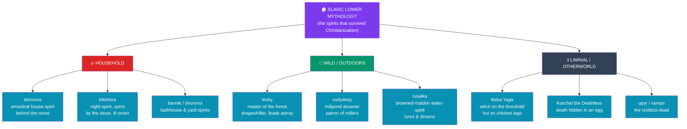

# 🏚️ Slavic Folklore and Spirits

> [!abstract] TL;DR
> Where the Slavic high gods were erased within a generation of Christianization, the **"lower mythology"** — the everyday spirits of house, forest, and water — survived for a **thousand years** in peasant belief. This note maps that rich stratum: **Baba Yaga**, the ambiguous forest-witch who flies in a mortar and lives in a hut on **chicken legs**; the **domovoi**, the ancestral house-spirit behind the stove; the **rusalka**, the water-maiden born of a drowned woman; the **leshy**, shapeshifting master of the forest; the **vodyanoy** of the millpond and the **kikimora** who fouls the household; and **Koschei the Deathless**, the villain whose death is hidden in an egg. Framing it all is **dvoeverie** ("double faith") — the long coexistence of Orthodox Christianity with pre-Christian folk practice, in which Perun's thunder passed to **St. Elijah** and Veles's cattle to **St. Blaise**. These figures are best known from **Afanasyev's** tale-collections and were analyzed structurally by **Vladimir Propp**.

## Intuition — analogy first

Think of a national religion as an **operating system** and folk belief as the **files the users kept**.

When Kievan Rus' "upgraded" to Christianity in 988, the state cult — Perun on his hill — was uninstalled overnight: the idols were pulled down, the temples burned. But the peasant household did not reboot. The spirit behind the stove who had to be fed, the drowned girl you dared not swim past on Trinity night, the witch at the edge of the forest who guarded the road to the dead — these were not *state* religion at all. They were the accumulated **local files** of a farming culture, and the new operating system simply ran on top of them.

The result was **dvoeverie**, "double faith": a peasant would cross herself in church on Sunday and still leave bread for the *domovoi* on Monday, seeing no contradiction. This is why, paradoxically, we know the **spirits far better than the gods** — the gods were an official target and were destroyed, while the spirits were beneath notice and were simply carried along, surfacing centuries later in the folktales collected by nineteenth-century ethnographers.

---

## The Layered World of Slavic Spirits

The diagram organizes the "lower mythology" by **domain** — the three zones a Slavic villager actually inhabited. Spirits were not worshipped like gods but **negotiated with**: fed, appeased, avoided, or outwitted. Their power was **local and immanent**, tied to a specific stove, pond, or stretch of forest, which is exactly why they slipped beneath the notice of the Church and endured.

## Key Concepts

### Baba Yaga — the witch on the threshold

**Baba Yaga** is the most vivid figure in Slavic folklore: an old woman with iron teeth and a **bony leg**, who flies in a **mortar** (steering with a **pestle** and sweeping away her tracks with a **broom**), and lives deep in the forest in a **hut that stands on chicken legs**, ringed by a fence of **bones topped with glowing skulls**. She is profoundly **ambiguous**: in different tales she is a cannibal ogress who threatens to roast the hero, and a **donor** who — once the hero speaks the right words — gives the magic gift, food, and directions. Structurally she guards the **boundary between the living world and the otherworld** (the forest, the "thrice-tenth kingdom"), and many scholars read her as a **degraded goddess of death and initiation**. She anchors classics like *Vasilisa the Beautiful* and *Marya Morevna*.

### The domovoi and the household spirits

The **domovoi** is the **house-spirit**, imagined as a small bearded old man — often an **ancestor of the family** — who lives behind or beneath the **stove**. Treated with respect (a bowl of milk, a kind word), he protects the home, tends the livestock, and warns of coming trouble; slighted, he sours the milk, tangles the horses' manes, and knocks in the night. When a family moved, they ritually **invited the domovoi to come along**, carrying coals from the old stove. His kin populate every corner of the homestead: the **dvorovoi** (yard), the **bannik** (the dangerous bathhouse), the **ovinnik** (threshing-barn), and the malevolent **kikimora**, a female night-spirit who spins by the stove, disturbs sleep, and portends misfortune.

### The rusalka, the leshy, and the vodyanoy

Out of doors, the villager shared the land with the **rusalka** — a **water-maiden**, typically the restless spirit of a **drowned woman** or an unbaptized girl, who haunts rivers and lakes and, especially during **Rusalka Week** after Trinity, may lure men to be tickled or drowned (older southern lore casts her as a benign **fertility spirit**; northern lore, as a dangerous corpse). The **leshy** is the **master of the forest**, a shapeshifter who can tower over the pines or shrink to a blade of grass, wears his clothes and shoes **backwards**, and leads travelers in circles. The **vodyanoy** rules **millponds and deep water**, drowning the careless and demanding respect from millers and fishermen. Each is a **genius loci** — the personified will of a place.

| Spirit | Domain | Disposition | How villagers responded |
|---|---|---|---|
| **Domovoi** | house / stove | protective if respected | offerings of food; invited when moving |
| **Kikimora** | house at night | mischievous, ill-omened | ritual cleansing, protective charms |
| **Rusalka** | rivers, lakes | dangerous (esp. Rusalka Week) | avoided swimming; wore wormwood |
| **Leshy** | forest | capricious, disorienting | offerings; clothes worn inside-out to break his spell |
| **Vodyanoy** | millponds, rivers | hostile, a drowner | millers left gifts; taboo on rescuing the drowning |

### Koschei the Deathless and the restless dead

**Koschei the Deathless** (*Koschei Bessmertnyi*) is the arch-villain of the wonder-tale — a gaunt sorcerer who abducts the hero's bride and **cannot be killed by any ordinary means**, because his **death is kept outside his body**: hidden in a needle, inside an egg, inside a duck, inside a hare, in an iron chest, buried under an oak on the island of **Buyan**. This **"external soul"** motif — the life-force stored elsewhere, so the monster falls only when the nested container is finally broken — was singled out by **J. G. Frazer** in *The Golden Bough* as a worldwide folktale pattern (see [[The_Comparative_Method]]). Slavic tradition also gives European folklore the **revenant dead**: the *upyr* / *vampir*, from which the word **"vampire"** itself descends.

### Dvoeverie — the double faith

**Dvoeverie** ("dual faith") names the centuries-long **coexistence and syncretism** of Christianity and pre-Christian folk belief among the Slavic peasantry. Rather than replacing the old cults, the Church often **overwrote** them: the attributes of **Perun** the thunderer passed to the fiery prophet **St. Elijah** (Ilya), who rides a chariot across the storm-clouds; **Veles**, cattle-god, was absorbed by **St. Blaise** (Vlas), protector of herds; **Mokosh** the spinner became **St. Paraskeva-Friday**. Scholars debate whether *dvoeverie* was true religious **dualism** or simply a **folk Christianity** with pagan texture — but either way it is the mechanism by which the spirits above survived into the modern era.

## Primary Sources & Examples

- **Alexander Afanasyev, *Narodnye russkie skazki* (Russian Fairy Tales, 1855–63)** — the foundational tale-collection preserving **Baba Yaga**, **Koschei**, and the whole cast; the Slavic parallel to the Brothers Grimm.
- **Vladimir Propp, *Morphology of the Folktale* (1928)** and ***The Historical Roots of the Wonder Tale* (1946)** — the structural analysis that reads **Baba Yaga** as *donor* and the hut as the gateway to the realm of the dead.
- **Vasilisa the Beautiful / Marya Morevna** — canonical tales in which the hero must **enter Baba Yaga's hut** and outwit **Koschei** by finding the hidden egg.
- **Ethnographic record of *dvoeverie*** — clerical sermons *against* paganism, and modern fieldwork on the **domovoi** and **rusalka** rites (Rusalka Week, Semik), documenting how the spirits outlived the gods.
- **Cross-cultural echoes** — the **external-soul** villain (Koschei) parallels the Egyptian and Norse "life-token" tales catalogued by Frazer; see [[The_Comparative_Method]].

## Common Pitfalls / Misconceptions

- **Flattening Baba Yaga into "a witch."** She is **structurally ambiguous** — donor *and* villain, helper *and* cannibal — and reducing her to a wicked hag loses the initiatory, threshold-guardian role that makes her distinctive.
- **Assuming the spirits are "pagan gods."** The **domovoi**, **rusalka**, and **leshy** were **never a pantheon**; they are local, immanent powers of the "lower mythology," negotiated with rather than worshipped.
- **Reading *dvoeverie* as neat two-layer dualism.** Many scholars argue peasants experienced a **single seamless folk Christianity**, not a conscious split between "the old gods" and "the new God."
- **Back-projecting Hollywood vampires.** The Slavic **upyr** is a revenant of local folk belief; the literary vampire (Stoker, etc.) is a much later, heavily romanticized construction.
- **Over-mining Afanasyev as raw paganism.** Nineteenth-century collectors **edited and combined** variants; a tale as printed is a literary artifact, not a pristine window onto pre-Christian religion.

## Related Concepts

- [[_MOC_Slavic_Baltic_Myth|↑ Section MOC]] — the map of Slavic and Baltic mythology
- [[The_Slavic_Pantheon]] — the high gods (Perun, Veles) whose cult was destroyed while these spirits lived on
- [[Baltic_Mythology]] — the neighboring tradition, which preserved *both* gods and folk-belief far later
- [[The_Comparative_Method]] — Propp's structuralism and Frazer's "external soul" motif applied here
- Cross-vault: [[Odin_Thor_and_Loki]] — the Norse *draugr* as a parallel to the Slavic restless dead

## Review Questions

1. Explain *dvoeverie* and use it to account for the paradox that we know the Slavic *spirits* better than the Slavic *gods*. Give two examples of a pagan power being overwritten by a Christian saint.
2. In what sense is Baba Yaga "ambiguous"? Describe how Propp's structural analysis assigns her a specific role in the wonder-tale rather than treating her simply as a villain.
3. Define the "external soul" motif using Koschei the Deathless, and explain why Frazer treated it as evidence for a cross-cultural folktale pattern.

## Sources

- Afanasyev, A. N. (1855–63). *Narodnye russkie skazki* [Russian Fairy Tales]. (Eng. trans. N. Guterman, 1945, Pantheon)
- Propp, V. (1928/1968). *Morphology of the Folktale* (2nd ed., trans. L. Scott). University of Texas Press
- Ivanits, L. J. (1989). *Russian Folk Belief*. M. E. Sharpe
- Warner, E. (2002). *Russian Myths*. British Museum Press

#mythology #slavic-mythology #folklore #baba-yaga #dvoeverie
