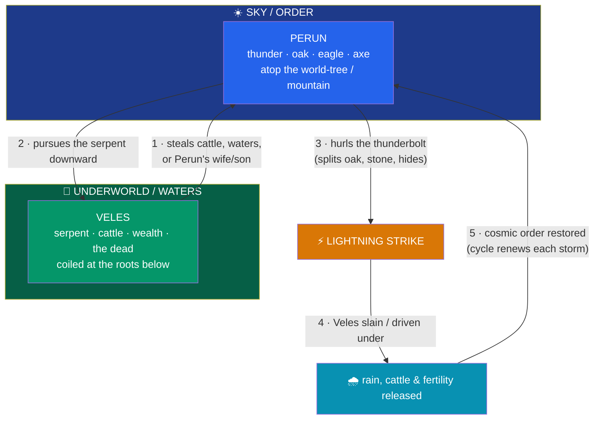

# ⚡ The Slavic Pantheon

> [!abstract] TL;DR
> Pre-Christian **Slavic religion** left **no native written sources**, so its "pantheon" is a scholarly reconstruction stitched from hostile Christian chronicles, foreign observers, folklore, place-names, and comparative linguistics. Its clearest figure is **Perun**, the thunder-and-sky god of the oak, the eagle, and the axe — the Slavic reflex of the Indo-European storm-god **\*Perkʷunos** (cf. Baltic **Perkūnas**, Norse **Thor**, Vedic **Indra**, Greek **Zeus**). His mythic opposite is **Veles** (Volos), god of cattle, wealth, the dead, and the watery underworld, cast as a **serpentine adversary**. From scattered clues the Soviet semioticians **Ivanov and Toporov** reconstructed a **"Basic Myth"** in which Perun, from the sky, pursues and strikes the serpent Veles below, releasing rain, cattle, and cosmic order — a Slavic version of the Indo-European **storm-god-versus-serpent** duel. Lesser attested gods include **Svarog** (smith/sky-fire), his son **Dazhbog** (the sun), the wind-god **Stribog**, and the sole goddess **Mokosh** (moisture, women's work). All of it must be handled with candor about how thin and late the evidence is.

## Intuition — analogy first

Reconstructing the Slavic pantheon is like trying to rebuild a demolished cathedral from **the rubble left by the crew that tore it down**.

The people who recorded Slavic gods were, almost without exception, the **Christian monks and foreign bishops who were replacing them**. When Prince Vladimir of Kiev accepted Christianity in 988, the *Primary Chronicle* tells us his own idol of Perun was dragged by horse-tail to the Dnieper and thrown in — and it is *that same chronicle*, written by hostile clergy generations later, that gives us most of our names. There is no Slavic *Edda*, no Slavic *Rigveda*, no priesthood that wrote down its own theology. We have the demolition report, not the building.

So the mythologist works exactly like the comparative linguist of [[The_Comparative_Method]]: because a Slavic word like *Perunŭ* lines up so precisely with Lithuanian *Perkūnas* and reconstructed Proto-Indo-European **\*Perkʷunos**, we can be confident a **thunder-god of the oak** stood at the center of Slavic belief — even though no Slav ever wrote a hymn to him that survives. What we can recover, we recover by triangulation; what we cannot, we should honestly leave blank rather than invent.

---

## The "Basic Myth": Storm-God versus Serpent

The diagram sketches the **"Basic Myth"** (*osnovnoy mif*) reconstructed by **Vyacheslav Ivanov** and **Vladimir Toporov** in their *Investigations in the Field of Slavic Antiquities* (1974). Using structural and comparative method, they proposed that a single narrative underlies scattered Slavic folk motifs: the sky-god **Perun** does battle with the chthonic serpent **Veles**, who has stolen cattle, water, or Perun's kin. Veles flees and hides — under a tree, a stone, in human or animal form — and Perun splits each hiding place with lightning until the serpent is struck down and the withheld waters (and fertility) are released. It is elegant, it maps neatly onto the wider Indo-European **chaoskampf**, and it should be flagged as a **reconstruction, not a recorded text** — persuasive to many scholars, over-tidy to skeptics.

## Key Concepts

### Perun — the thunder-god of the oak

**Perun** (Old East Slavic *Perunŭ*) is the best-attested Slavic deity and the head of the state cult that Prince **Vladimir the Great** installed on the hill above Kiev in **980**. The *Primary Chronicle* describes his idol with a **silver head and a golden moustache**. His domain is thunder, lightning, rain, war, and sovereign order; his sacred tree is the **oak**, his bird the **eagle**, his weapon an **axe** or thunder-hammer, and "thunderbolts" were explained by **"thunder-stones"** (prehistoric flint axes) found in fields. His name descends from Proto-Indo-European **\*Perkʷunos**, "the striker / the oak-god," making him a sibling of the storm-gods across the family.

| Tradition | Storm-god | Shared traits |
|---|---|---|
| **Slavic** | **Perun** | oak, axe, thunder-stones, eagle |
| **Baltic** | **Perkūnas** | oak, hammer, strikes the devil-serpent |
| **Norse** | **Thor** (Þórr) | hammer, fights the world-serpent |
| **Vedic** | **Indra** | vajra (thunderbolt), slays the serpent Vṛtra |
| **Greek** | **Zeus** | thunderbolt, oak oracle at Dodona |

### Veles — the serpent of the underworld

**Veles** (or **Volos**) is Perun's counterpart and cosmic adversary: god of **cattle** (Old East Slavic *skotii bog*, "cattle-god" — and *skot* also meant "wealth"), of **the dead and the underworld**, of **water, oaths, poetry, and magic**. Where Perun stands **on high** (his Kiev idol crowned the hilltop), Veles belonged **below** — his shrine is remembered in the lower **Podil** district by the river, fitting his chthonic, watery nature. Crucially, the **Rus'-Byzantine treaties** (10th c.) record oaths sworn by **both Perun and Volos**, confirming the pair as a real cultic dyad, not a modern invention. In the Basic Myth he is imagined as a **serpent or dragon** coiled at the roots of the world-tree.

### Svarog, Dazhbog, and the "sky-fire" line

**Svarog** appears in a Slavic interpolation into the chronicle of **John Malalas** (the *Hypatian Codex*), where he is glossed as a smith-and-fire god and equated with the Greek **Hephaestus**; his son **Dazhbog** ("giving-god") is equated with **Helios**, the sun. In the *Tale of Igor's Campaign* the Rus' are even called the **"grandsons of Dazhbog."** Related **Svarozhich** ("son of Svarog") names the sacred hearth-fire, worshipped by the West Slavs at Rethra. This gives a loose **sky-fire / solar** cluster, though the exact genealogies are chronicle-glosses, not living scripture.

### Mokosh and the wider roster

**Mokosh** is the **only goddess** in Vladimir's 980 list — patron of **women's work** (spinning and weaving), moisture, and fertility, plausibly linked to **"Damp Mother Earth"** (*Mati Syra Zemlya*) and later absorbed by **St. Paraskeva-Friday**. Vladimir's Kiev pantheon, per the *Primary Chronicle*, comprised six idols:

| God | Domain | Note |
|---|---|---|
| **Perun** | thunder, sovereignty, war | head of the cult; silver head, gold moustache |
| **Khors** | sun (solar disk) | likely **Iranian** loan (cf. Persian *xoršid*) |
| **Dazhbog** | sun, giving | "grandsons of Dazhbog" in the *Tale of Igor* |
| **Stribog** | wind | "Stribog's grandsons" = the winds in the *Tale of Igor* |
| **Simargl** | winged sacred beast | likely **Iranian** loan (cf. *Simurgh*) |
| **Mokosh** | moisture, women's work | the sole goddess of the six |

Among the **West Slavs**, foreign chroniclers record a partly different set: the four-headed war-god **Sventovit** at the great temple of **Arkona** on Rügen (destroyed by the Danes in **1168**, described by **Saxo Grammaticus**), plus **Triglav**, **Radegast**, and **Rugievit**. The famous dualist pair **Chernobog / Belobog** ("Black God / White God") rests on a *single* line in **Helmold of Bosau** and is treated cautiously.

## Primary Sources & Examples

- **The *Primary Chronicle* (*Povest' vremennykh let*, early 12th c.)** — records Vladimir's 980 pantheon and the 988 destruction of the Perun idol; our single richest East Slavic source, and a **Christian polemic**.
- **Rus'-Byzantine treaties (911, 944, 971)** — oaths sworn on **Perun and Volos**, the strongest evidence the two functioned as a real cultic pair.
- **The *Tale of Igor's Campaign* (*Slovo o polku Igoreve*)** — a literary epic naming **Dazhbog**, **Stribog**, and the prophetic bard **Boyan** as "grandson of Veles."
- **West Slavic evidence** — **Thietmar of Merseburg**, **Adam of Bremen**, **Helmold of Bosau**, and **Saxo Grammaticus** on the temples of Rügen and the Baltic-Slavic coast (**Sventovit**, **Svarozhich**).
- **Comparative reconstruction** — Perun/Perkūnas/Thor/Indra/Zeus as the Indo-European **\*Perkʷunos**; the storm-god-versus-serpent duel as a Slavic **chaoskampf** (see [[The_Comparative_Method]] and [[Baltic_Mythology]]).

## Common Pitfalls / Misconceptions

- **Treating the reconstruction as a recorded scripture.** The neat "pantheon," and especially the **Basic Myth**, are *inferences*. There is no Slavic Edda; be explicit that names come from demolition-era chronicles and later folklore.
- **Trusting the *Book of Veles*.** The so-called *Veles Book* (*Velesova kniga*), promoted since the 1950s as an ancient pagan chronicle, is a **20th-century forgery** and is worthless as a source.
- **Over-systematizing local cults.** "Slavic religion" was **regional and non-uniform**: the East Slavic (Kievan) gods, the West Slavic temple-gods of Rügen, and South Slavic beliefs need not have formed one tidy pantheon.
- **Reading Chernobog/Belobog as a settled dualism.** The Black-God/White-God pair rests on **one late line** in Helmold; the elaborate "Slavic Manichaeism" often built on it is largely modern romanticism.
- **Confusing high gods with living folklore.** The gods were suppressed fast; what actually survived among the peasantry were the **lower spirits** — see [[Slavic_Folklore_and_Spirits]].

## Related Concepts

- [[_MOC_Slavic_Baltic_Myth|↑ Section MOC]] — the map of Slavic and Baltic mythology
- [[Slavic_Folklore_and_Spirits]] — where the high gods faded and the "lower mythology" of spirits survived
- [[Baltic_Mythology]] — the closely cognate Baltic system; **Perkūnas** is Perun's twin, preserved far later
- [[The_Comparative_Method]] — the Indo-European reconstruction and *chaoskampf* framework this note leans on
- Cross-vault: [[Odin_Thor_and_Loki]] — Thor as the Norse reflex of the same **\*Perkʷunos** storm-god

## Review Questions

1. Why is the Slavic pantheon uniquely hard to reconstruct compared with Norse or Greek mythology, and what four kinds of evidence do scholars combine to attempt it?
2. State the Ivanov–Toporov "Basic Myth" of Perun and Veles, and explain how it fits the wider Indo-European storm-god-versus-serpent pattern. What is the strongest independent evidence that Perun and Veles were a real cultic pair?
3. Identify three deities from Vladimir's 980 Kiev pantheon, and explain what the Iranian-looking names Khors and Simargl suggest about outside influence on East Slavic religion.

## Sources

- Ivanov, V. V., & Toporov, V. N. (1974). *Issledovaniya v oblasti slavyanskikh drevnostey* [Investigations in the Field of Slavic Antiquities]. Nauka
- Gimbutas, M. (1971). *The Slavs*. Thames & Hudson
- Cross, S. H., & Sherbowitz-Wetzor, O. P. (trans.) (1953). *The Russian Primary Chronicle: Laurentian Text*. Medieval Academy of America
- Ivanits, L. J. (1989). *Russian Folk Belief*. M. E. Sharpe

#mythology #slavic-mythology #perun #veles #indo-european
