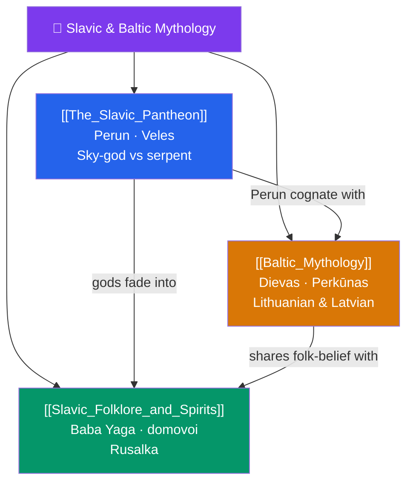

# 🐻 Slavic & Baltic Mythology — Map of Content

> [!abstract] What This Section Covers
> Slavic and Baltic mythology are among Europe's most poorly documented pre-Christian systems, reconstructed from fragmentary chronicles, folklore, and comparative linguistics. This section opens with **The Slavic Pantheon** — the thunder-god Perun, his serpentine adversary Veles, and the recurring Indo-European "chaoskampf" of sky-god against underworld-serpent. **Slavic Folklore and Spirits** turns to the rich lower mythology that survived Christianization in peasant belief: the ambiguous forest-witch Baba Yaga, the household *domovoi*, and the water-spirit *rusalka*. **Baltic Mythology** treats the closely related but distinct Lithuanian and Latvian traditions — the sky-god Dievas and the thunderer Perkūnas — preserved unusually late into the medieval period and rich in folk-song (*dainos*). Together they recover two conservative Indo-European branches whose myths must be pieced together from indirect evidence, illustrating both the promise and the limits of mythological reconstruction.

## Concept Map

## Learning Path

1. [[The_Slavic_Pantheon]] — The reconstructed high gods, centered on Perun and Veles and their cosmic conflict.
2. [[Slavic_Folklore_and_Spirits]] — The lower mythology that survived in folk belief: Baba Yaga, domovoi, rusalka.
3. [[Baltic_Mythology]] — The related Lithuanian and Latvian tradition, Dievas and Perkūnas, and the folk-songs that preserve it.

## All Notes at a Glance

| Note | Difficulty | What You'll Learn |
|------|------------|-------------------|
| [[The_Slavic_Pantheon]] | Intermediate | Perun, Veles, Svarog, Mokosh, the Kiev idols, the storm-god vs serpent myth, sparse sources |
| [[Slavic_Folklore_and_Spirits]] | Beginner → Intermediate | Baba Yaga, domovoi, rusalka, leshy, vampires, dual faith (*dvoeverie*) after Christianization |
| [[Baltic_Mythology]] | Intermediate | Dievas, Perkūnas, Saulė, Laima, Lithuanian and Latvian traditions, the *dainos* folk-songs |

## Key Questions This Section Answers

- Why is so little firmly known about pre-Christian Slavic religion, and how is it reconstructed?
- What is the Perun–Veles conflict, and how does it fit the wider Indo-European storm-god vs serpent pattern?
- How did folk spirits like Baba Yaga and the rusalka survive Christianization?
- Why did Baltic paganism persist so much later than elsewhere in Europe?
- What can folk-songs and comparative linguistics recover that chronicles cannot?

## Related Sections

- [[_MOC_Mythology_Master|↑ Mythology Master MOC]]
- [[_MOC_African_Myth|← African]]
- [[_MOC_Abrahamic_Myth|→ Abrahamic Narratives & Folklore]]
- Cross-vault: [[The_Comparative_Method]] (Indo-European reconstruction), [[Odin_Thor_and_Loki]] (storm-god parallels)

#MOC #Mythology #SlavicBalticMyth
