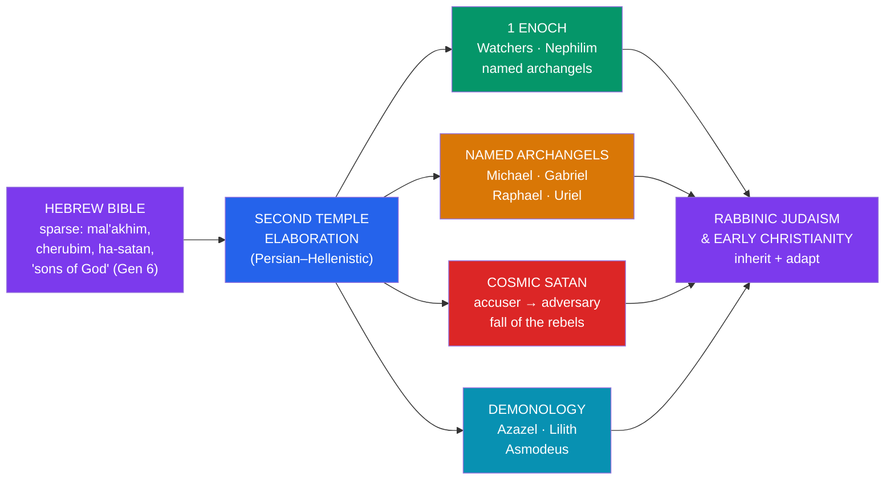

# 👼 Angels, Demons, and Apocrypha

> [!abstract] TL;DR
> The elaborate later imagery of **angels and demons** — ranked hierarchies, named **archangels** (Michael, Gabriel, Raphael), a rebel **Satan**, a "fall of the angels" — is **mostly absent from the earliest Hebrew Bible**, which speaks sparely of *mal'akhim* (messengers), cherubim, seraphim, and an "accuser" in the divine council. This machinery **developed rapidly in the Second Temple period** (roughly 5th c. BCE–1st c. CE), much of it in **extra-canonical literature** — the **Apocrypha** and **Pseudepigrapha**. The pivotal text is **1 Enoch**, whose *Book of the Watchers* expands Genesis 6's "sons of God" into **200 rebel angels** who descend, take human wives, beget the giant **Nephilim**, and teach forbidden arts — led by **Shemihazah** and **Asael/Azazel**. Alongside grew named archangels, a cosmic **Satan**, and demons such as **Lilith** and **Asmodeus**. These traditions were inherited and adapted by **rabbinic Judaism** and **early Christianity**; the New Testament even quotes 1 Enoch (Jude 14–15).

> [!note] On the word "myth"
> This note studies **narrative development and transmission** using the tools of folklore and the academic study of religion. "Myth" means a sacred narrative, not a falsehood; describing how ideas about angels and demons grew over time is a historical description, offered with respect for the traditions that hold them sacred.

## Intuition — analogy first

Think of a **legal system** built on a short founding constitution. The original text mentions a few offices in passing; centuries of **commentary, case law, and administrative practice** then flesh out a whole bureaucracy the founders never spelled out. Later readers, encountering the developed system, naturally assume it was there "from the start."

Angelology and demonology work similarly. The Hebrew Bible offers **terse, scattered references** — a messenger here, an "accuser" there, mysterious "sons of God." Communities living with these texts across the **Persian and Hellenistic centuries** filled the gaps, producing named archangels, ranked choirs, and a coherent demonic order. Much of this happened not in scripture but in a flourishing body of **extra-canonical writing**, and the traffic ran both ways between **Judaism** and the **early Church**. To trace where "the devil" and "the seven archangels" come from is to watch a tradition **grow its own detail** over time.

---

## From Sparse Scripture to Developed System

## Key Concepts

### From messengers to a celestial hierarchy

In the Hebrew Bible an angel is a **mal'akh** — literally a **"messenger."** The text also knows **cherubim** (guardians of Eden, throne-bearers) and **seraphim** ("burning ones," the six-winged beings of **Isaiah 6**), the **"host of heaven"** (*tzeva'ot*), and the enigmatic **"angel of YHWH."** But there is **no ranked system and almost no names**.

Names arrive in the **Second Temple** literature. **Michael** and **Gabriel** are named in **Daniel** (8:16; 10:13; 12:1); **Raphael** appears in **Tobit**; **Uriel** in **1 Enoch** and **2 Esdras**. **1 Enoch 20** lists **seven** holy angels (Uriel, Raphael, Raguel, Michael, Sariel, Gabriel, Remiel), and **Tobit 12:15** speaks of the **"seven who stand before the Lord."**

Full **hierarchies** are later still and largely **Christian**: the treatise *Celestial Hierarchy*, attributed to **Pseudo-Dionysius the Areopagite** (c. 5th–6th c. CE), arranges **nine orders in three triads**:

| Triad | Orders |
|---|---|
| **First (highest)** | Seraphim · Cherubim · Thrones |
| **Second (middle)** | Dominions · Virtues · Powers |
| **Third (nearest to us)** | Principalities · Archangels · Angels |

This scheme, popularized in the West by **Gregory the Great** and **Thomas Aquinas**, is a systematization of scattered scriptural terms, not a biblical catalogue.

### The archangels and their roles

Across the developing tradition, the leading **archangels** acquired characteristic functions:

| Archangel | Meaning | Traditional role |
|---|---|---|
| **Michael** ("who is like God?") | Warrior-prince | Guardian of Israel; leads the heavenly host against the dragon (Dan 12; Rev 12; Jude 9) |
| **Gabriel** ("God is my strength") | Herald | Interpreter of visions (Daniel); announcer of births (Luke) |
| **Raphael** ("God heals") | Healer | Guide and healer in **Tobit**; binds the demon Asmodeus |
| **Uriel** ("God is my light") | Guide | Angelic interpreter in 1 Enoch and 2 Esdras |

### Satan and the "fall of the angels"

In the oldest layers, **"the satan"** (*ha-satan*, **"the accuser"**) is not a cosmic evil but a **member of the divine council** who tests and prosecutes — the challenger in **Job 1–2** and **Zechariah 3**. (In **1 Chronicles 21:1** "Satan" incites David's census, where the older **2 Samuel 24** had attributed it to YHWH — a telling shift.) Only in the **Second Temple** period does Satan harden into a **cosmic adversary**, the prince of evil.

The **"fall of the angels"** is stitched together from several passages:

- **Genesis 6:1–4** — the **"sons of God"** take human wives and beget the **Nephilim**; the seed of the Watcher myth.
- **Isaiah 14:12** — the taunt over **Helel ben Shachar** ("Day Star, son of Dawn"), rendered **"Lucifer"** in the Latin Vulgate; originally a mockery of the **king of Babylon**, later read as Satan's fall.
- **Ezekiel 28** — the lament over the **king of Tyre** in Eden, similarly reapplied.
- **Luke 10:18** ("I saw Satan fall like lightning") and **Revelation 12** (war in heaven; the dragon cast down) — the Christian crystallization.

The familiar story of a proud angel cast from heaven is thus a **synthesis** of texts read together over time, not a single scriptural narrative.

### Demons: Azazel, Lilith, and others

- **Azazel** — in **Leviticus 16** the scapegoat is sent "**to Azazel**" in the wilderness; whether a place or a demon is debated. In **1 Enoch**, **Asael/Azazel** becomes a leading Watcher who teaches metallurgy, weapons, and cosmetics, and is bound in the desert — a clear elaboration.
- **Lilith** — named once in **Isaiah 34:14** (*lilit*, a night-creature amid the ruins of Edom), with a background in Mesopotamian **lilitu** demons. Only in **later Jewish folklore** (notably the medieval *Alphabet of Ben Sira*) does she become **Adam's first wife** who refuses subordination; she features on protective **amulets** and Aramaic **incantation bowls**.
- **Others** — the **shedim** (Deut 32:17; Ps 106:37), the goat-like **se'irim**, and **Asmodeus** (*Ashmedai*), the demon of the **Book of Tobit** whom Raphael binds.

### Apocrypha and Pseudepigrapha

Two overlapping bodies of extra-canonical text drove this development, and the labels matter:

- **Apocrypha** — books in the **Greek Septuagint** and the **Catholic/Orthodox** Old Testament but **outside the Hebrew Bible / Protestant canon**: **Tobit, Judith, Wisdom of Solomon, Sirach (Ben Sira), Baruch, 1–2 Maccabees**, and additions to Daniel and Esther.
- **Pseudepigrapha** — writings **attributed to ancient figures** (Enoch, Moses, the patriarchs) and outside **all** the main canons: **1 Enoch, Jubilees, Testaments of the Twelve Patriarchs, 2 Baruch**, and more.

> [!info] Canon is not uniform
> **1 Enoch** and **Jubilees** are **canonical in the Ethiopian Orthodox Tewahedo** tradition, and Aramaic fragments of both were found among the **Dead Sea Scrolls**. "Canonical" and "extra-canonical" are relative to a **particular community**, not absolute.

**1 Enoch** — the single most influential source. Its **Book of the Watchers** (chs. 1–36) expands Genesis 6: **200 angels (Watchers)**, led by **Shemihazah** and **Asael**, descend on Mount Hermon, take wives, and beget the giant **Nephilim**, who ravage the earth; the Watchers teach **forbidden knowledge** (weapons, sorcery, astrology, cosmetics); the archangels **Michael, Gabriel, Raphael, Uriel** petition God, who sends the flood and binds the rebels. **Jude 14–15** in the New Testament **quotes 1 Enoch** directly.

**Jubilees** ("Little Genesis") retells Genesis–Exodus with a **364-day solar calendar**, heavy **angelic mediation**, and a chief evil spirit named **Mastema** — another window onto how demonology was being systematized.

> [!info] The question of Persian influence
> Scholars **debate** how much the sharpened Second Temple picture of a cosmic Satan and an army of demons owes to **Zoroastrian dualism** encountered under Persian rule. It is a live, unsettled question — plausible influence, not a proven pedigree.

## Primary Sources & Examples

- **1 Enoch, *Book of the Watchers*** — the foundational elaboration of Genesis 6; source of the Watchers/Nephilim tradition and of named archangels.
- **Book of Tobit** — narrative home of **Raphael** and the demon **Asmodeus**; an example of angelology and demonology in story form.
- **Daniel 8–12** — the earliest **named** archangels (Michael, Gabriel) in the Hebrew Bible.
- **Pseudo-Dionysius, *Celestial Hierarchy*** — the classic nine-order ranking that shaped later Christian and artistic imagination.
- **Alphabet of Ben Sira** — the medieval text that crystallized the **Lilith-as-Adam's-first-wife** folklore.

## Common Pitfalls / Misconceptions

- **"The Bible describes a rebel Lucifer falling from heaven."** The developed story is a **synthesis** of Isaiah 14, Ezekiel 28, Genesis 6, Luke 10, and Revelation 12 read together; **"Lucifer"** is a **Latin translation** of "Day Star" in a taunt against a Babylonian king.
- **"Satan is evil incarnate from the start."** In the oldest texts *ha-satan* is a **title** ("the accuser") for a functionary of the divine council; the cosmic adversary is a **later development**.
- **"Apocrypha and Pseudepigrapha are the same thing, and both are 'fake.'"** They are **different categories** (canon-relative vs. attributed authorship), and "extra-canonical" is not a value judgment — some are **canonical elsewhere** (e.g., 1 Enoch in Ethiopia).
- **"Lilith is in Genesis."** She is **not**; the "first wife" story is **medieval folklore**, built on a single obscure word in Isaiah 34 and Mesopotamian demon-lore.
- **"Persian dualism obviously caused all this."** Influence is **debated**, not demonstrated; internal Jewish development and Hellenistic currents are also in play.

## Related Concepts

- [[Mythic_Motifs_in_the_Hebrew_Bible]] — the Genesis 6 "sons of God" and the serpent that this literature elaborates
- [[Islamic_Cosmology_and_the_Jinn]] — a parallel unseen world of angels (from light) and morally-accountable spirits, with **Iblis's** refusal echoing "fall" motifs
- [[Christian_Legend_and_Hagiography]] — how the Church's later legend continued the same gap-filling impulse
- [[_MOC_Abrahamic_Myth|↑ Section MOC]] — the map of this section
- Cross-vault: [[The_Comparative_Method]] — diffusion vs. development, and the question of Persian influence
- Cross-vault: [[Creation_and_Flood_Myths]] — the flood that, in 1 Enoch, is God's response to the Watchers

## Review Questions

1. Trace the figure of "the satan" from **ha-satan** in Job to the **cosmic adversary** of the New Testament. What does the shift from 2 Samuel 24 to 1 Chronicles 21:1 illustrate about this development?
2. Summarize the *Book of the Watchers* in 1 Enoch. Which two verses of Genesis does it expand, and what New Testament book quotes it?
3. Distinguish **Apocrypha** from **Pseudepigrapha**, and explain why calling a text "extra-canonical" depends on *which community* you ask. Give one example of a book canonical in one tradition but not another.

## Sources

- Reed, A. Y. (2005). *Fallen Angels and the History of Judaism and Christianity: The Reception of Enochic Literature*. Cambridge University Press
- Nickelsburg, G. W. E. (2001). *1 Enoch 1: A Commentary*. Fortress Press
- Kelly, H. A. (2006). *Satan: A Biography*. Cambridge University Press
- Charlesworth, J. H. (ed.) (1983–85). *The Old Testament Pseudepigrapha* (2 vols.). Doubleday

#mythology #abrahamic #angelology #demonology #second-temple
