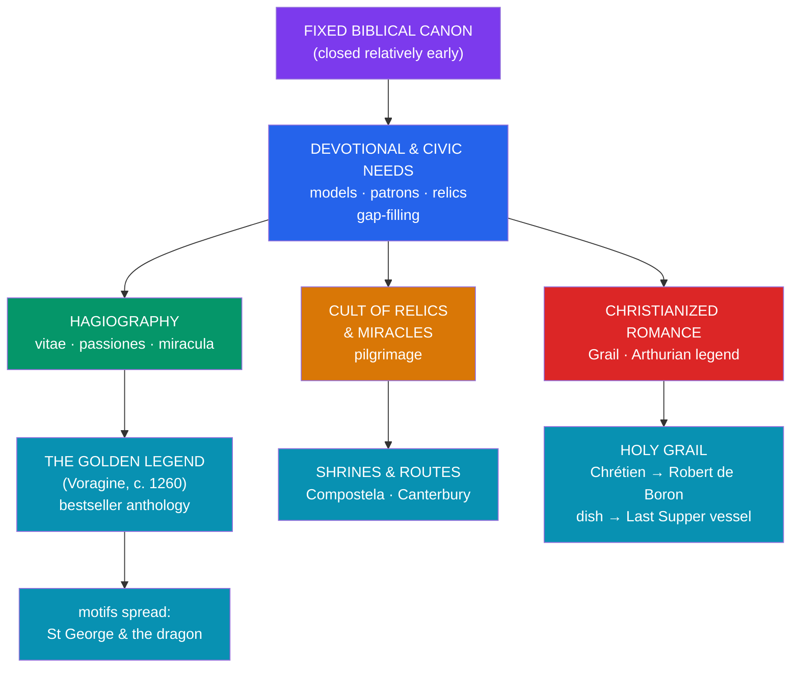

# ⚜️ Christian Legend and Hagiography

> [!abstract] TL;DR
> Alongside the fixed **biblical canon**, Christianity generated an enormous body of **extra-biblical legend and folklore** — the proper study of the folklorist and the historian of religion. Its backbone is **hagiography**, the writing of **saints' lives** (*vitae*), martyr accounts (*passiones*), and miracle collections (*miracula*), whose great medieval anthology is Jacobus de Voragine's **Golden Legend** (*Legenda Aurea*, c. 1260). Around the saints grew the cults of **relics** and **miracles** and the practice of **pilgrimage**. Legend also colonized **secular romance**: the **Holy Grail**, absent from scripture, appears first in **Chrétien de Troyes** (c. 1180s) as a mysterious dish and is then **Christianized** by **Robert de Boron** into the vessel of the Last Supper, fusing **Arthurian** romance with Eucharistic symbolism. Motifs like **St George and the dragon** show the same process — a historical martyr acquiring a dragon-slaying legend centuries later. The scholarly interest is in **how legend accretes** around a faith over time.

> [!note] On "legend," "myth," and respect
> Folklorists use **"legend"** (a traditional narrative told as set in real history) and **"myth"** (a sacred foundational narrative) as **neutral technical terms**, with **no implication of falsity**. Distinguishing canonical scripture from later devotional legend is a **historical** exercise; it takes no stance on the truth of Christianity or the sanctity of its saints, and it is offered with respect for a living tradition.

## Intuition — analogy first

Consider how a **beloved historical founder** accumulates stories. A few documented facts survive; then, generation by generation, admirers add **anecdotes, wonders, and symbols** that express what the figure *means* to them — until the popular image far outgrows the record. Nobody "lied"; a community **grew a narrative** to carry its devotion, identity, and hopes.

Christian **hagiography and legend** are this process at civilizational scale. The **canon** of scripture closed relatively early, but the *storytelling did not stop*. Communities needed **local heroes** (a city's patron saint), **models of holiness**, **tangible contact** with the sacred (relics), and **narrative answers** to gaps the Bible left. Over centuries these needs produced saints' lives, miracle tales, and even the reworking of **secular romance** into sacred quest — the Grail. Studying this material with the folklorist's tools (tracing motifs, sources, and dates) reveals **how a faith elaborates itself** in narrative long after its scriptures are set.

---

## How Legend Accreted Around the Faith

## Key Concepts

### Hagiography: the genre of saints' lives

**Hagiography** (Greek *hagios*, "holy" + *graphia*, "writing") is the literature of the **saints**, and folklorists treat it as a distinct genre with recurring conventions. Its main forms:

| Form | Latin term | Content |
|---|---|---|
| **Life** | *vita* | Biography of a saint, often heavy with miracles and edifying pattern |
| **Passion** | *passio* / *acta* | Account of a **martyr's** trial and death |
| **Miracles** | *miracula* | Collected wonders, often at a shrine |
| **Translation** | *translatio* | Narrative of moving a saint's **relics** |

Its **functions** were practical and social: to provide **models of holiness** for imitation, to anchor **local and civic identity** around a patron saint, to serve the **liturgical calendar** of feast days, and to promote **pilgrimage**. Early **martyr acts** range from the sober and probably historical (the *Passion of Perpetua and Felicity*, early 3rd c.; the *Martyrdom of Polycarp*) to the highly **legendary** lives composed long after their subjects.

### The *Golden Legend*

The genre's most influential monument is the **Golden Legend** (**Legenda Aurea**), compiled around **1260** by the Dominican **Jacobus de Voragine** (later Archbishop of Genoa). Arranged by the **liturgical year**, it retells the lives of saints and the great feasts in vivid, memorable form. It became **one of the most copied and printed books of the later Middle Ages** — a **bestseller** that shaped sermons, popular piety, and the **iconography** of Western art. Modern historians note that Voragine wrote to **edify** rather than to verify: his fanciful **etymologies** and freely-embellished wonders make the *Golden Legend* a prime specimen of **legend as devotional literature** rather than critical biography.

### Relics, miracles, and pilgrimage

Devotion to the saints was intensely **material**. The **cult of relics** — bones, garments, objects associated with saints, and instruments of the Passion — treated these as points of **contact with the holy**, credited with **miracles** of healing and protection and housed in ornate **reliquaries**. Their movement (*translatio*) and the wonders reported at their shrines drew **pilgrims** along great routes to **Santiago de Compostela**, **Canterbury**, **Rome**, and **Jerusalem**. Theologically the practice was framed as **veneration** (*dulia*), honoring the saint, **not worship** (*latria*), which is due to God alone — a distinction often blurred in popular practice and a target of later reform.

### The Holy Grail and the Christianization of Arthurian legend

The **Holy Grail** is a textbook case of legend **grafting onto** older story and then being **Christianized**:

- It appears first in **Chrétien de Troyes'** unfinished **Perceval, *Le Conte du Graal*** (c. 1181–90), where *"un graal"* is simply a mysterious, radiant **serving dish** carried in a procession — **not** yet the cup of Christ.
- **Robert de Boron**, in **Joseph d'Arimathie** (c. 1200), **reinterprets** it as the vessel of the **Last Supper**, in which **Joseph of Arimathea** caught Christ's blood — the decisive **Christianization**.
- The great **Vulgate Cycle** (**Lancelot-Grail**, 13th c.) and its **Queste del Saint Graal** make the Grail a mystical, Eucharistic goal achieved only by the perfectly pure knight, **Galahad**; **Wolfram von Eschenbach's** *Parzival* reimagines the Grail as a **stone**.

Scholars read this as **Christian romance absorbing pre-Christian Celtic motifs** — wondrous **cauldrons of plenty** and otherworld vessels — and refunctioning them within **sacramental symbolism**, later attached to **Glastonbury** and the Joseph of Arimathea foundation legends of Britain. The Grail is **legend, not scripture**; it stands **nowhere in the Bible**.

### Medieval motifs: St George and the dragon

The **dragon-slaying** legend of **St George** shows accretion at work. George was very likely a **historical martyr** (traditionally died c. 303, during the **Diocletianic persecution**), venerated for centuries with **no dragon** in sight. The famous story — George rescuing a **princess** from a dragon that terrorizes a city, slaying it, and leading the townsfolk to **conversion** — is a **much later medieval accretion**, spread across the West especially by the **Golden Legend**. Its shape echoes an ancient, cross-cultural **dragon-slayer** motif (compare **Perseus and Andromeda**, the archangel **Michael**, and many others), Christianized as a parable of faith defeating evil. Related legendary growths include **Veronica's veil**, **St Christopher** carrying the Christ-child, the **Harrowing of Hell**, and the infancy traditions of the **Protoevangelium of James** (which names Mary's parents, **Joachim and Anna**).

## Primary Sources & Examples

- **Jacobus de Voragine, *Golden Legend* (Legenda Aurea, c. 1260)** — the master anthology of saints' lives and the vehicle for countless legendary motifs.
- **Passion of Perpetua and Felicity (early 3rd c.)** — an early, comparatively historical martyr account, useful for contrast with later legend.
- **Chrétien de Troyes, *Perceval* (c. 1181–90)** — the Grail's **first** appearance, as a mysterious dish rather than Christ's cup.
- **Robert de Boron, *Joseph d'Arimathie* (c. 1200)** — the text that **Christianizes** the Grail into the Last Supper vessel.
- **The dragon legend of St George** — a historical martyr acquiring a folkloric dragon-slaying tale centuries later.

## Common Pitfalls / Misconceptions

- **"The Holy Grail is in the Bible."** It is **not**; the Grail is a **medieval literary invention** (Chrétien, then Robert de Boron), a Christianization of romance and Celtic vessel-motifs.
- **"St George really fought a dragon."** George was a **martyr**; the **dragon** is a **later legendary accretion**, popularized by the *Golden Legend* and modeled on an old cross-cultural dragon-slayer motif.
- **"Hagiography is straightforward biography."** It is an **edifying genre** with conventions; the *Golden Legend* aimed to **inspire devotion**, not to meet modern standards of historical verification.
- **"Veneration of saints and relics is worship."** Traditional theology distinguishes **veneration** (*dulia*) of saints from **worship** (*latria*) of God — a distinction central to how the tradition understands itself, however blurred in folk practice.
- **"Studying these as legend attacks the faith."** Tracing sources, dates, and motifs is **descriptive folklore**; it neither affirms nor denies the sanctity of the saints or the truth of Christianity.

## Related Concepts

- [[Angels_Demons_and_Apocrypha]] — an earlier instance of the same impulse: narrative growing beyond the sparse canon (the Watchers, named archangels)
- [[Islamic_Cosmology_and_the_Jinn]] — a parallel case of **folk elaboration** (the *ifrit*, the lamp-genie) accreting beside a fixed scripture
- [[Mythic_Motifs_in_the_Hebrew_Bible]] — the canonical base from which the whole Christian legendary tradition extends
- [[_MOC_Abrahamic_Myth|↑ Section MOC]] — the map of this section
- Cross-vault: [[The_Comparative_Method]] — the dragon-slayer and other recurring motifs across cultures, and the diffusion question
- Cross-vault: [[Creation_and_Flood_Myths]] — comparative motif-tracing applied to sacred narrative

## Review Questions

1. Define **hagiography** and name its principal forms (*vita*, *passio*, *miracula*, *translatio*). What social and liturgical functions did saints' lives serve, and why is the *Golden Legend* a good example of the genre's aims?
2. Trace the **Holy Grail** from Chrétien de Troyes to Robert de Boron. At what point, and how, does it become a **Christian** object, and why is it accurate to call the Grail "legend, not scripture"?
3. Explain how the **St George and the dragon** story illustrates legendary **accretion**. What older, cross-cultural motif does it draw on, and how does that support the folklorist's approach?

## Sources

- Jacobus de Voragine (c. 1260/1993). *The Golden Legend: Readings on the Saints* (trans. W. G. Ryan). Princeton University Press
- Delehaye, H. (1907/1962). *The Legends of the Saints*. Fordham University Press
- Barber, R. (2004). *The Holy Grail: Imagination and Belief*. Harvard University Press
- Brown, P. (1981). *The Cult of the Saints: Its Rise and Function in Latin Christianity*. University of Chicago Press

#mythology #abrahamic #christianity #hagiography #medieval-legend
