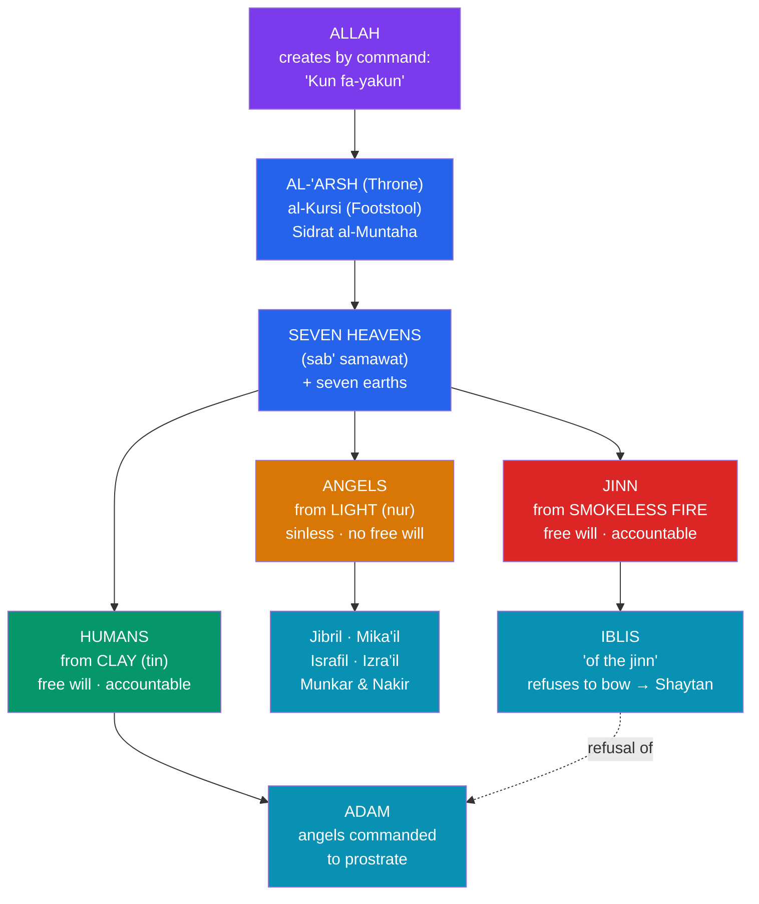

# 🕌 Islamic Cosmology and the Jinn

> [!abstract] TL;DR
> Islamic cosmology describes a layered creation ordered by **God (Allah)**, who creates by the command **"Kun fa-yakun"** ("Be, and it is"): **seven heavens**, the **Throne** (*al-'Arsh*) and **Footstool** (*al-Kursi*), and populations of unseen beings. A widely-cited **hadith** teaches that **angels were created from light** (*nur*), **jinn from smokeless fire**, and humans from clay — angels being **sinless** and without independent will. The **jinn** are a distinct order: rational beings of **smokeless fire** with **free will**, morally accountable, capable of belief or unbelief (the Quran devotes **Surah 72, *al-Jinn***, to them), living largely within the **unseen** (*al-ghayb*). Their most famous member is **Iblis**, who — described as "**of the jinn**" — **refused to prostrate to Adam** when God commanded it, arguing "I am better than he; You created me from fire and him from clay"; his pride makes him **Shaytan**. The pop-culture "**genie**" of the lamp is a later **Western literary** development, distinct from this theological reality.

> [!note] Approach and respect
> This note treats Islamic scripture and belief with **academic neutrality and respect**, through comparative religion and folklore studies. "Myth" here means a foundational sacred narrative, **not** a claim of falsity. For over a billion Muslims the Quran is the literal word of God and the jinn are a real part of creation; nothing here adjudicates that truth. The aim is to describe **narrative and cosmological structure** and to distinguish tradition from later folklore.

## Intuition — analogy first

Picture a **shared narrative universe** with three related but overlapping "canons." The Hebrew Bible and later Jewish tradition sketched a world of angels and an adversary; the Quran, arriving in **7th-century Arabia**, presents its own account of the **same prophets** (Adam, Noah, Abraham, Moses, Jesus) and the **same drama of a prideful refusal in heaven** — but with a distinctive cast member the earlier traditions lacked as a *category*: the **jinn**.

Where Jewish and Christian sources speak of angels and demons, the Quran adds a **third kind of intelligent creature** occupying the same unseen world as humans: made of fire rather than light or clay, endowed like us with **free will and moral responsibility**. This single structural difference reorganizes the whole picture — most sharply in the story of **Iblis**, whose refusal to bow is explained precisely by his **fiery, jinn nature**. To understand the jinn is to understand how Islam frames the **unseen** (*al-ghayb*) and the choice that stands at the center of its cosmology.

---

## The Layered Cosmos and Its Inhabitants

## Key Concepts

### Creation and the structured heavens

In the Quran, **God (Allah)** creates effortlessly by command: **"When He decrees a matter, He only says to it, 'Be,' and it is"** (*Kun fa-yakun*, Q 2:117; 36:82). The cosmos is layered: God "created **seven heavens** and of the earth their like" (Q 65:12; cf. 67:3; 71:15). Above them stand the **Throne** (**al-'Arsh**), which God's bearers carry, and the vast **Footstool/Pedestal** (**al-Kursi**) of the celebrated *Ayat al-Kursi* (Q 2:255). At the boundary of the highest heaven is the **Lote Tree of the utmost limit** (**Sidrat al-Muntaha**, Q 53:14), reached in the Prophet's **Night Journey and Ascension** (*al-Isra' wa-l-Mi'raj*).

### Three creations: light, fire, clay

A foundational **hadith** (reported by Muslim on the authority of A'isha) distinguishes the three orders of intelligent creation by their **substance**:

| Being | Created from | Free will? | Nature |
|---|---|---|---|
| **Angels** (*mala'ika*) | **Light** (*nur*) | No — sinless by nature | Obedient servants who "do not disobey God in what He commands" (Q 66:6) |
| **Jinn** | **Smokeless fire** (*marij min nar*, Q 55:15; "scorching fire," 15:27) | **Yes** — morally accountable | Unseen, long-lived; can be believers or disbelievers |
| **Humans** (*ins*) | **Clay** (*tin* / *salsal*) | **Yes** — morally accountable | Made God's *khalifa* (steward) on earth |

### Angels in Islam

Islamic **angels** (*mala'ika*) are luminous, **sinless**, and act only as God commands, lacking the independent will to rebel. Belief in them is one of the **articles of faith**. Prominent named angels include:

- **Jibril** (Gabriel) — brings the **revelation** to the prophets.
- **Mika'il** (Michael) — associated with provision and mercy.
- **Israfil** — will sound the **trumpet** at the Resurrection.
- **'Izra'il / Malak al-Mawt** — the **angel of death**.
- **Munkar and Nakir** — question the dead in the grave.
- **Malik** (guardian of Hell) and **Ridwan** (guardian of Paradise); the **Kiraman Katibin**, the honorable recording scribes; and the **bearers of the Throne** (*Hamalat al-'Arsh*).

Because angels **cannot sin**, Islam locates the primordial disobedience not in an angel but in **Iblis**, a being **"of the jinn."**

### The jinn

The **jinn** are a central and distinctive feature of Islamic cosmology: rational, **free-willed** beings created from **smokeless fire**, ordinarily part of the **unseen** (*al-ghayb*) but sharing the world with humanity. The Quran states that God created **jinn and mankind only to worship Him** (Q 51:56), making the jinn **morally responsible** and subject to reward and punishment. **Surah 72 (*al-Jinn*)** recounts a group of jinn who overhear the Quran and **believe** — establishing that jinn, like people, can be **Muslim or not**, righteous or wicked. They are described as forming **communities**, living long lives, and being able to affect the physical world, though they remain generally **hidden** from human sight.

> [!info] Jinn are not "fallen angels"
> A common confusion collapses jinn into demons. In Islamic theology the jinn are a **separate creation** with their own moral spectrum; only the **disobedient** among them (the *shayatin*, devils) are evil. Angels, being of light and sinless, are a **different order** entirely.

### Iblis and the refusal to bow

The pivotal narrative — retold several times (Q 2:34; 7:11–18; 15:28–44; 17:61–65; 18:50; 38:71–85) — is God's command to the angels to **prostrate before Adam**. All comply **except Iblis**, whom the Quran explicitly identifies as **"of the jinn"** (18:50), and who refuses out of **pride**:

> His refusal is summed up in his own words (Q 7:12): "**I am better than him; You created me from fire and created him from clay.**"

For this arrogance Iblis is **expelled** from grace and becomes **Shaytan** (the adversary/tempter). He is granted **respite until the Day of Judgment** and vows to **mislead** humankind — the tempter who, in the Garden narrative, causes Adam and his wife to slip. His followers and progeny are the **shayatin** (devils). Thus Islam frames the origin of evil as a **free moral choice** by a fiery, willed being — coherent with its distinction between sinless angels and accountable jinn.

### From theological jinn to the folkloric "genie"

In **folk Islam**, the jinn generated a rich body of belief and practice — protective formulae, categories such as the **ifrit**, **marid**, **ghul**, and **si'lat**, and a large presence in the **Thousand and One Nights** (*Alf Layla wa-Layla*). The English word **"genie,"** however, is a **European overlay**: it entered via French **génie** — a rendering of Arabic *jinni* that punned on Latin *genius* — in **Antoine Galland's** early-18th-century translation of the *Nights*. The **wish-granting lamp-spirit** (as in the tale of Aladdin, itself an "orphan story" Galland added) is largely a **Western literary and, later, cinematic** creation.

> [!info] Tradition vs. entertainment
> For Muslims the jinn are a **genuine, if unseen, part of God's creation** attested in the Quran — not the comic, wish-granting figures of Western cartoons. The scholarly point is simply that the **"genie of the lamp" is folklore/pop-culture**, a distinct layer that should not be read back onto Islamic theology.

## Primary Sources & Examples

- **Surah 72 (*al-Jinn*)** — jinn overhear and believe in the Quran; the clearest scriptural statement of their moral agency.
- **Q 2:34; 7:11–18; 15:28–44; 38:71–85** — the repeated **Iblis** narrative: the command to prostrate and his fiery refusal.
- **Q 55:15 and 15:27** — the jinn's creation from **smokeless / scorching fire**; contrasted with humanity from clay.
- **Ayat al-Kursi (Q 2:255)** — the **Footstool** verse, a compact statement of God's cosmic sovereignty.
- ***The Thousand and One Nights*** — the literary reservoir through which jinn (and the Western "genie") reached global folklore.

## Common Pitfalls / Misconceptions

- **"Jinn are just genies who grant wishes."** The **wish-granting lamp genie** is a **Western literary** development from Galland's translation; the Quranic jinn are morally accountable beings of the unseen, not entertainers.
- **"Iblis is a fallen angel."** The Quran calls Iblis **"of the jinn"** (18:50); his ability to disobey follows from his **jinn nature**, since Islamic **angels cannot sin**.
- **"Jinn are inherently evil / all demons."** Jinn span the **full moral range** and can be believers; only the wicked ones are **shayatin** (devils).
- **"Islamic cosmology is unrelated to Jewish and Christian ideas."** The Quran engages the **same prophets** and the **same heavenly refusal**, presenting its own account; comparison is a standard scholarly exercise (see [[Angels_Demons_and_Apocrypha]]).
- **"Studying this as folklore denies the faith."** Distinguishing **theology** (Quran/hadith) from **later folk elaboration** (the *ifrit* of the *Nights*, the lamp-genie) is descriptive; it takes **no stance** on the truth of the tradition.

## Related Concepts

- [[Angels_Demons_and_Apocrypha]] — the Jewish/Christian angelology and "fall" motifs that Islam's account of Iblis parallels and reworks
- [[Mythic_Motifs_in_the_Hebrew_Bible]] — the Quran retells Adam, the Garden, and Noah, sharing prophets with the Hebrew Bible
- [[Christian_Legend_and_Hagiography]] — a parallel case of folk elaboration (saints, the Grail) growing beside a canonical scripture
- [[_MOC_Abrahamic_Myth|↑ Section MOC]] — the map of this section
- Cross-vault: [[The_Comparative_Method]] — comparing shared motifs across the three Abrahamic traditions
- Cross-vault: [[Creation_and_Flood_Myths]] — the creation and flood accounts that recur in the Quran

## Review Questions

1. Contrast the substances and moral status of **angels**, **jinn**, and **humans** in Islamic cosmology. Why does this scheme require the disobedient figure at Adam's creation to be a **jinn** rather than an angel?
2. Summarize the **Iblis** narrative and quote the reasoning he gives for refusing to prostrate. What does his fiery origin have to do with his argument?
3. Explain the relationship between the Quranic **jinn** and the pop-culture **"genie."** Where does the English word come from, and why is it inaccurate to equate the two?

## Sources

- El-Zein, A. (2009). *Islam, Arabs, and the Intelligent World of the Jinn*. Syracuse University Press
- Lange, C. (2016). *Paradise and Hell in Islamic Traditions*. Cambridge University Press
- Nasr, S. H. et al. (eds.) (2015). *The Study Quran*. HarperOne
- Marzolph, U. & van Leeuwen, R. (2004). *The Arabian Nights Encyclopedia*. ABC-CLIO

#mythology #abrahamic #islam #cosmology #jinn
