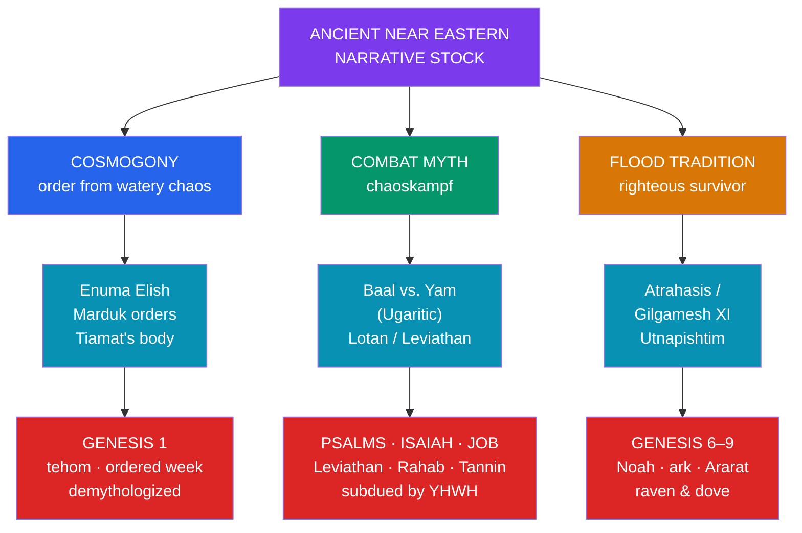

# 📜 Mythic Motifs in the Hebrew Bible

> [!abstract] TL;DR
> The opening chapters of **Genesis** share narrative **motifs** with the older literature of the **ancient Near East (ANE)**, and reading them side by side is a staple of academic biblical studies. Genesis carries **two creation accounts** — the ordered, seven-day **Priestly** cosmogony (Gen 1:1–2:4a) and the earthy, garden-centred **Yahwist** account (Gen 2:4b–3) — whose differences the **Documentary Hypothesis** attributes to distinct sources woven together. The **flood** of Noah (Gen 6–9) parallels the Mesopotamian deluge told of **Ziusudra**, **Atrahasis**, and **Utnapishtim** in *[[The_Epic_of_Gilgamesh|Gilgamesh]]* so closely — righteous survivor, warning, ark, mountain landing, bird scouts, post-flood sacrifice — that a historical relationship is widely accepted. Behind these lie the ANE **combat myth** (*chaoskampf*): elsewhere in the Bible God subdues the sea-dragons **Leviathan**, **Rahab**, and **Tannin**, echoing **Marduk vs. Tiamat** ([[Enuma_Elish]]) and **Baal vs. Yam**. Genesis 1 reads as a **"demythologized"** version — the primeval waters are inert, not a slain enemy.

> [!note] On the word "myth"
> Throughout this note "myth" is used in its **scholarly** sense — a culture's foundational sacred narrative — and carries **no claim of falsity**. Describing shared motifs and textual history is a literary-historical exercise, not a verdict on the religious truth of Judaism, Christianity, or Islam, for whom these are living scriptures.

## Intuition — analogy first

Imagine finding two **flood-survival stories** from neighbouring river cultures. Both feature one warned man, a great boat, a bird sent out to test the waters, and a sacrifice when the survivor lands. A folklorist would not conclude "both merely happened"; the shared *sequence of specific, arbitrary details* points to a **shared literary stream** — the same reasoning a linguist uses when *pater*, *pitṛ*, and *father* line up (see [[The_Comparative_Method]]).

That is exactly the situation in the ancient Near East. Israel emerged inside a **cultural neighbourhood** — Sumer, Babylon, Assyria, Ugarit, Egypt — that already possessed rich cosmogonies and a famous flood story. The scholarly reading of Genesis is not that Israel "copied," but that its authors **received a common stock of motifs and reworked them** to express a distinctive theology: one God, morally motivated, sovereign over a cosmos that in the neighbours' tellings had to be wrestled from chaos. The interest lies in the *transformations* as much as the parallels. See [[Creation_and_Flood_Myths]].

---

## The Ancient Near Eastern Background of Genesis

## Key Concepts

### Two creation accounts

Genesis opens with **two distinct cosmogonies** placed back to back, a fact recognized since antiquity and central to modern source criticism.

- **Genesis 1:1–2:4a** — the **Priestly (P)** account. God (**Elohim**) creates by **speech** ("Let there be…") over **six days**, ordering a cosmos out of a formless void (*tohu wa-bohu*) and the primeval deep (*tehom*), and rests on the seventh. Humanity — **male and female together** — is made last, in the divine **image** (*tselem*), and given dominion. The tone is liturgical, structured, transcendent.
- **Genesis 2:4b–3** — the **Yahwist (J)** account. **YHWH Elohim** forms the man (*'adam*) from the dust of the ground (*'adamah*), plants the garden of **Eden**, forms the animals, then the woman; the register is **anthropomorphic and earthy** (God molds, plants, walks). Here creation moves from dryness to a watered garden — the reverse ordering of P's watery start.

The differences in name for God, vocabulary, order of events, and theology are the classic evidence for **composite authorship**.

### The Garden of Eden

The **Eden** narrative (Gen 2–3) sets humanity in a divine garden with the **Tree of Life** and the **Tree of the Knowledge of Good and Evil**, four rivers (**Pishon, Gihon, Tigris, Euphrates**), a talking **serpent**, and expulsion guarded by **cherubim** and a flaming sword. Scholars compare this to Mesopotamian motifs: the paradisal land of **Dilmun** in *Enki and Ninhursag*; and above all the recurring ANE theme of **lost immortality** — in the **Adapa** myth a human misses the "food of life," and in *[[The_Epic_of_Gilgamesh|Gilgamesh]]* a serpent steals the plant of rejuvenation, leaving humanity mortal. The Eden story likewise pivots on humans coming *near* immortality (the Tree of Life) and being barred from it.

### The Flood and its Mesopotamian parallels

The flood of **Noah** (Gen 6–9) is the vault's clearest case of a shared ANE narrative. The Mesopotamian deluge survives in the Sumerian **Eridu Genesis** (hero **Ziusudra**), the Akkadian **Atrahasis Epic** (hero **Atrahasis**), and **Tablet XI** of the *Epic of Gilgamesh* (hero **Utnapishtim**), where Utnapishtim recounts the flood to Gilgamesh.

| Motif | Mesopotamian (Gilgamesh XI / Atrahasis) | Genesis 6–9 |
|---|---|---|
| **Cause** | Divine decision; in *Atrahasis*, human **noise/overpopulation** annoys the gods | Human **wickedness / violence** grieves God |
| **Warned hero** | Utnapishtim, warned by **Ea/Enki** | Noah, warned by **God** |
| **Vessel** | A great cube-like boat, sealed with pitch | An **ark** of gopher wood, sealed with pitch |
| **Cargo** | Family, craftsmen, animals, "seed of all living" | Family and **pairs of animals** |
| **Landing** | Mount **Nimush (Nisir)** | Mountains of **Ararat** |
| **Birds** | **Dove, swallow, raven** released to test the waters | **Raven, then dove** released |
| **Aftermath** | **Sacrifice**; gods "smell the sweet savour" and gather | **Sacrifice**; God smells "a pleasing odour" |
| **Resolution** | Utnapishtim granted immortality | **Covenant**, the rainbow, no second flood |

The **theological reframing** is the point of comparison: the polytheistic version turns on a quarrel among gods and their hunger for offerings, whereas Genesis makes the flood a **moral** act of a single God who then binds himself by **covenant**. See [[Creation_and_Flood_Myths]] for the wider deluge pattern.

### The combat myth (*chaoskampf*) — Leviathan and Rahab

The ANE **combat myth** — a storm/warrior deity defeating a **chaos-monster of the sea** — is well attested at Ugarit (**Baal** vs. **Yam** and the twisting serpent **Lotan**) and Babylon (**Marduk** vs. **Tiamat**, [[Enuma_Elish]]). The Hebrew Bible preserves clear echoes, chiefly in **poetry**:

- **Leviathan** (*Livyatan*) — the many-headed sea-dragon God crushes (**Psalm 74:13–14**), the fleeing serpent slain "on that day" (**Isaiah 27:1**), described at length in **Job 41**.
- **Rahab** — a chaos-sea figure God "cut to pieces" / "pierced" (**Isaiah 51:9**, **Job 26:12–13**, **Psalm 89:10**), also a poetic name for Egypt.
- **Tannin** — the sea-dragon(s) of **Genesis 1:21** and **Psalm 74:13**.

Strikingly, in **Genesis 1** the primeval waters (*tehom*, philologically related to the name **Tiamat**) are **not a foe**: God simply divides and orders them, and the *tanninim* are ordinary creatures God **makes**. Many scholars read Genesis 1 as a deliberate **"demythologizing"** of the combat motif — the same imagery, drained of the cosmic battle.

### The Documentary Hypothesis (in brief)

The observation that the Torah interweaves the divine names **YHWH** and **Elohim**, contains doublets (two creation accounts, blended flood strands), and shifts in style led to the **Documentary Hypothesis**, classically formulated by **Julius Wellhausen** (1878). It proposes four principal sources — **J** (Yahwist), **E** (Elohist), **P** (Priestly), **D** (Deuteronomist) — later edited together. This is a **scholarly hypothesis** about the text's compositional history; it has been refined, supplemented, and contested (by supplementary and fragmentary models), and many religious communities affirm traditional (e.g., **Mosaic**) authorship. It is mentioned here only to explain *why* Genesis reads as it does; the vault takes no position on it.

## Primary Sources & Examples

- **Genesis 1:1–2:4a** — the Priestly week of creation; compare the ordering of a watery cosmos in [[Enuma_Elish]].
- **Genesis 6–9** — the flood and covenant; the direct counterpart to *[[The_Epic_of_Gilgamesh|Gilgamesh]]* Tablet XI and the **Atrahasis Epic**.
- **Psalm 74:12–17 / Isaiah 27:1 / Job 41** — the surviving **Leviathan/Rahab** combat imagery, closest to the **Baal Cycle** of Ugarit.
- **Genesis 11:1–9 — the Tower of Babel** — an etiology of language diversity set in **Babylon** (*Bavel*), playing on the **ziggurat** temple-towers of Mesopotamia.

## Common Pitfalls / Misconceptions

- **"Parallel means Israel simply copied."** Scholars speak of a **shared cultural stock** and creative reworking, not plagiarism; the theological transformations (monotheism, moral flood, demythologized chaos) are as significant as the similarities.
- **"Genesis has one creation story."** It has **two**, side by side, with different order, vocabulary, and divine name — a starting observation of the whole discipline.
- **"Studying the motifs debunks the faith."** Comparative and source analysis describe *how the text took shape and relates to its neighbours*; it does not, and cannot, adjudicate the truth of the religion. Believers and critical scholars can share the same textual data.
- **"The Documentary Hypothesis is proven fact."** It is an influential **hypothesis**, refined and disputed; treating it as settled dogma (in either direction) misrepresents the state of scholarship.
- **"Tehom is just the name Tiamat."** The two are **philologically related** (common Semitic root), but Genesis 1 pointedly makes *tehom* a passive element, not a personified goddess — the relationship is one of allusion and contrast.

## Related Concepts

- [[Angels_Demons_and_Apocrypha]] — the same figures (the serpent, the "sons of God" of Gen 6) elaborated in later Jewish and Christian tradition
- [[Islamic_Cosmology_and_the_Jinn]] — the Quran retells Adam, Noah, and the flood, sharing prophets with the Hebrew Bible
- [[Christian_Legend_and_Hagiography]] — how narrative continued to accrete around scripture in a later tradition
- [[_MOC_Abrahamic_Myth|↑ Section MOC]] — the map of this section
- Cross-vault: [[Enuma_Elish]] — the Babylonian cosmogony and *chaoskampf* behind Genesis 1
- Cross-vault: [[The_Epic_of_Gilgamesh]] — Tablet XI's flood, the closest parallel to Noah
- Cross-vault: [[Creation_and_Flood_Myths]] — the comparative deluge and cosmogony pattern across cultures
- Cross-vault: [[The_Comparative_Method]] — the diffusion-vs-independent-invention framework applied here

## Review Questions

1. List four specific, "arbitrary" motifs shared between the Genesis flood and the Gilgamesh/Atrahasis flood. Why does this cluster of details (rather than the mere idea of a flood) suggest a historical relationship rather than coincidence?
2. Genesis 1 has been called a "demythologized" combat myth. Explain what *chaoskampf* is, give one biblical passage where it survives more openly, and describe how Genesis 1 transforms it.
3. What textual observations motivate the Documentary Hypothesis, and why is it important to describe it as a *hypothesis* rather than as a verdict on the scripture's religious authority?

## Sources

- Heidel, A. (1949). *The Gilgamesh Epic and Old Testament Parallels*. University of Chicago Press
- Wenham, G. J. (1987). *Genesis 1–15* (Word Biblical Commentary). Word Books
- Day, J. (1985). *God's Conflict with the Dragon and the Sea*. Cambridge University Press
- Smith, M. S. (2010). *The Priestly Vision of Genesis 1*. Fortress Press

#mythology #abrahamic #hebrew-bible #genesis #near-eastern
