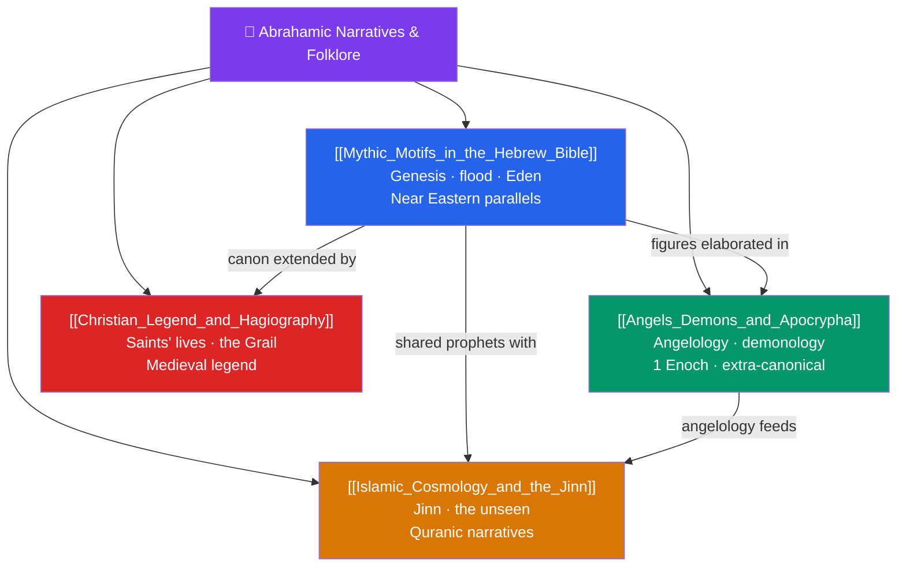

# 📜 Abrahamic Narratives & Folklore — Map of Content

> [!abstract] What This Section Covers
> This section approaches the Jewish, Christian, and Islamic traditions academically — as comparative religion and folklore studies — examining their narrative and legendary material with the same literary and historical lens applied elsewhere in the vault, and with respect for their status as living faiths for billions. **Mythic Motifs in the Hebrew Bible** reads Genesis, the flood, and the Garden against their ancient Near Eastern background, tracing parallels with Mesopotamian sources like the *Enuma Elish* and *Gilgamesh*. **Angels, Demons, and Apocrypha** surveys the development of angelology and demonology and the extra-canonical texts (such as *1 Enoch*) that shaped it. **Islamic Cosmology and the Jinn** treats Quranic and Islamic accounts of creation, the unseen world, and the *jinn*. **Christian Legend and Hagiography** examines the vast tradition of saints' lives, the Holy Grail, and medieval legend that grew alongside canonical scripture. Throughout, the focus is on narrative motifs, transmission, and comparison — not on adjudicating religious truth claims.

## Concept Map

## Learning Path

1. [[Mythic_Motifs_in_the_Hebrew_Bible]] — Genesis, the flood, and Eden read against their ancient Near Eastern context.
2. [[Angels_Demons_and_Apocrypha]] — The growth of angelology and demonology and the extra-canonical texts behind it.
3. [[Islamic_Cosmology_and_the_Jinn]] — Islamic accounts of creation, the unseen world, and the *jinn*.
4. [[Christian_Legend_and_Hagiography]] — Saints' lives, the Grail, and the medieval legendary tradition.

## All Notes at a Glance

| Note | Difficulty | What You'll Learn |
|------|------------|-------------------|
| [[Mythic_Motifs_in_the_Hebrew_Bible]] | Intermediate | Genesis creation, Eden, Cain and Abel, the flood, Babel; parallels with *Enuma Elish* and *Gilgamesh* |
| [[Angels_Demons_and_Apocrypha]] | Intermediate | Angelic hierarchies, the Watchers, *1 Enoch*, Lilith, apocrypha and pseudepigrapha, demonology |
| [[Islamic_Cosmology_and_the_Jinn]] | Intermediate | Quranic creation, the seven heavens, angels, Iblis, the jinn, folk Islam and the unseen (*al-ghayb*) |
| [[Christian_Legend_and_Hagiography]] | Intermediate | Saints' lives, the *Golden Legend*, relics, the Holy Grail, Arthurian and medieval Christian legend |

## Key Questions This Section Answers

- How do the Genesis creation and flood narratives relate to older Mesopotamian myths?
- Where did detailed ideas about angels and demons come from, given how little scripture says?
- What are the *jinn*, and how do they fit Islamic cosmology and folk belief?
- How did saints' legends and the Grail grow up alongside the biblical canon?
- What is the difference between studying these narratives as folklore and treating them as scripture?

## Related Sections

- [[_MOC_Mythology_Master|↑ Mythology Master MOC]]
- [[_MOC_Slavic_Baltic_Myth|← Slavic & Baltic]]
- [[_MOC_Modern_Myth|→ Modern Myth & Archetype]]
- Cross-vault: [[Enuma_Elish]], [[The_Epic_of_Gilgamesh]] (Near Eastern parallels), [[Creation_and_Flood_Myths]]

#MOC #Mythology #AbrahamicMyth
