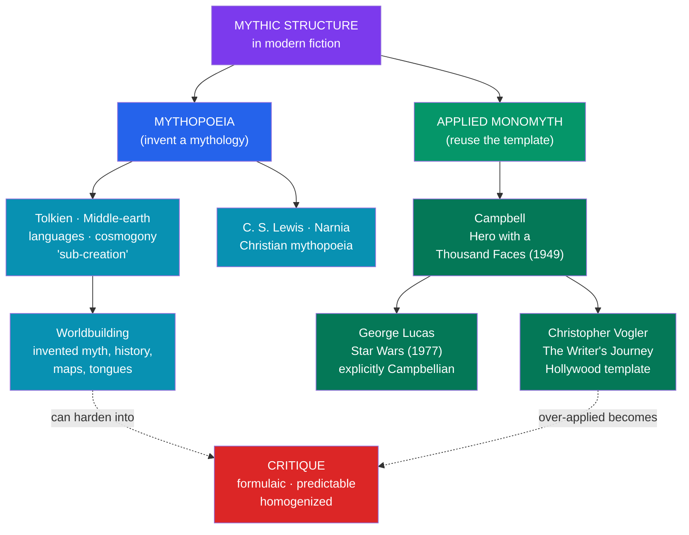

# 📖 Mythic Structure in Fiction

> [!abstract] TL;DR
> Modern authors and filmmakers do not merely echo myth by accident — many **consciously deploy** mythic structure. Two strands run through this. First, **mythopoeia** ("myth-making"): writers like **J.R.R. Tolkien** and **C.S. Lewis** set out to *create* mythologies — Tolkien built Middle-earth's languages, cosmogony (the *Ainulindalë*), and legendarium as a deliberate "**mythology for England**," arguing in "**On Fairy-stories**" that humans are **sub-creators** making secondary worlds. Second, the **applied monomyth**: **Joseph Campbell's** hero's journey became a working screenwriting template after **George Lucas** openly used it to shape **Star Wars**, and **Christopher Vogler** distilled it into *The Writer's Journey*, a Hollywood-standard structural guide. The result is a body of modern fiction — fantasy worldbuilding, blockbuster film — that is **archetypally engineered**. The recurring critique: the template, over-applied, breeds **formulaic, predictable, homogenized** storytelling. Myth here is not survival but **craft** — an ancient grammar reused to build resonant new stories.

## Intuition — analogy first

Think of the monomyth as a **chord progression** and myth's archetypes as a **scale**.

The I–V–vi–IV progression underlies a startling number of pop songs; countless hits share it, yet nobody mistakes them for one another. A skilled songwriter uses the progression not because they are unoriginal but because it *reliably moves listeners* — the structure is a proven vehicle for feeling, and the artistry lies in the melody, lyric, and texture laid over it. A hack uses the same progression and produces something that sounds like everything else.

Modern storytellers work the same way. The hero's journey and the stock archetypes (mentor, threshold guardian, shapeshifter, shadow) are a **known-good progression** for narrative emotion. Tolkien, Lucas, and Rowling lay rich, particular worlds over that structure and it sings; a formula-follower lays nothing distinctive over it and it clangs. The template is neither magic nor a flaw — it is a tool, and everything depends on what the author builds on top. See [[The_Heros_Journey]].

---

## Two Ways Modern Fiction Uses Myth

## Key Concepts

### Mythopoeia and sub-creation: Tolkien

**J.R.R. Tolkien** (1892–1973), a philologist by profession, did not adapt existing myths so much as **manufacture a new one**. Beginning with invented **languages** (Quenya and Sindarin), he reasoned that a language needs a world and a people to speak it, and built outward: a cosmogony (the **Ainulindalë**, in which the world is sung into being), a pantheon (the **Valar**), an entire legendarium (*The Silmarillion*), histories, genealogies, calendars, and maps. He described this in his 1939 lecture "**On Fairy-stories**" with the concept of **sub-creation**: God is the primary Creator; the human artist, made in that image, is a **sub-creator** who fashions a **Secondary World** that commands "**Secondary Belief**" — internally consistent enough that the reader's mind assents to it while inside. His poem "**Mythopoeia**," addressed to a skeptical C.S. Lewis, defends myth-making as a truth-bearing act, not lying. Tolkien half-jokingly hoped to supply a "**mythology for England**," which he felt had lost its native lore. *The Lord of the Rings* is thus not merely mythic-*flavored*; it is a consciously engineered modern mythology.

### C.S. Lewis and Christian mythopoeia

Tolkien's friend and fellow **Inkling C.S. Lewis** (1898–1963) took a different route. His conversion to Christianity was famously prompted by a late-night walk with Tolkien in which Tolkien argued that the dying-and-rising-god myths Lewis loved were "**true myth**" fulfilled in the Gospel. Lewis's *The Chronicles of Narnia* then uses invented myth as deliberate **allegory / supposition**: **Aslan** is an explicit Christ-figure (a willing sacrificial death and resurrection), and Narnia blends classical fauns and centaurs, Norse giants, and Christian redemption into a purpose-built mythic world. Where Tolkien resisted one-to-one allegory, Lewis embraced myth as a vehicle for religious meaning.

### The applied monomyth: Campbell to Lucas

**Joseph Campbell's** *The Hero with a Thousand Faces* (1949) described the **monomyth** — the universal hero's journey (see [[The_Heros_Journey]]). Its most consequential modern life was as a **screenwriting blueprint**. **George Lucas** has said he consciously used Campbell while writing **Star Wars** (1977), reshaping early drafts to fit the pattern: Luke Skywalker as the reluctant hero receiving the **call to adventure**, **Obi-Wan Kenobi** as the wise mentor and giver of the boon (the lightsaber, the Force), the crossing into the special world, the ordeal, and the return. Lucas and Campbell later became friends, and Campbell was interviewed at Skywalker Ranch for the influential PBS series *The Power of Myth* (1988). Star Wars became the proof-of-concept that ancient mythic structure could power the modern blockbuster.

### Vogler's *The Writer's Journey* and the Hollywood template

The pattern was formalized for the film industry by **Christopher Vogler**, a Disney story consultant whose seven-page 1985 memo, "**A Practical Guide to *The Hero with a Thousand Faces***," circulated through Hollywood and grew into the book *The Writer's Journey: Mythic Structure for Writers* (1992). Vogler streamlined Campbell's seventeen stages into a practical **twelve-stage** arc and mapped Jung-derived **archetypes** onto character roles:

| Vogler stage (abridged) | Campbell equivalent | Function |
|---|---|---|
| **Ordinary World** | (the world before the call) | Establish the hero's normal life |
| **Call to Adventure** | Call to Adventure | Disrupt the status quo |
| **Refusal of the Call** | Refusal | Show the cost / fear |
| **Meeting the Mentor** | Supernatural Aid | Give guidance and the boon |
| **Crossing the Threshold** | Crossing the First Threshold | Commit to the journey |
| **Tests, Allies, Enemies** | Road of Trials | Build the special world |
| **Approach / Ordeal** | Belly of the Whale, Supreme Ordeal | The central crisis, symbolic death |
| **Reward / The Road Back** | Ultimate Boon, Return | Claim the prize, begin return |
| **Resurrection · Return with the Elixir** | Master of Two Worlds | Final test, transformed homecoming |

Vogler's archetype set — **Hero, Mentor, Threshold Guardian, Herald, Shapeshifter, Shadow, Trickster** — became standard studio vocabulary. This is the machinery behind an enormous swath of modern film.

### Worldbuilding and the critique of formula

Mythopoeia matured into the modern craft of **worldbuilding** — the invention of coherent secondary worlds with their own myth, history, geography, religion, and languages (Le Guin's Earthsea, Martin's Westeros, Rowling's wizarding world, Jackson's *The Broken Earth*). The recurring **critique** is that the applied monomyth, wielded mechanically, produces **formulaic and predictable** stories — "Campbellian" as a pejorative for interchangeable chosen-one plots. Scholars also note that Campbell's template, drawn largely from male hero-myths, can marginalize other story shapes; **Maureen Murdock** proposed a distinct "**heroine's journey**" partly in response, and critics argue the monomyth flattens the genuine diversity of world narrative into one Western-inflected arc. The healthy view: the template is a **tool, not a law** — indispensable to some of the best modern fiction, deadening when it substitutes for imagination.

## Primary Sources & Examples

- **Tolkien, *The Lord of the Rings* / *The Silmarillion*** — the exemplar of conscious mythopoeia and sub-creation, complete with invented languages and cosmogony.
- **C.S. Lewis, *The Chronicles of Narnia*** — invented myth as Christian allegory; Aslan's death and resurrection as a deliberate dying-and-rising-god motif.
- **George Lucas, *Star Wars*** — the flagship case of a filmmaker openly using Campbell's monomyth to structure a blockbuster.
- **Christopher Vogler, *The Writer's Journey*** — the monomyth turned into a working Hollywood screenwriting manual, mapping archetypes to roles.
- **Ursula K. Le Guin, *A Wizard of Earthsea*; George R.R. Martin, *A Song of Ice and Fire*** — worldbuilding traditions that both use and deliberately subvert mythic structure.
- **The Matrix, Harry Potter, The Lion King** — widely cited textbook instances of the twelve-stage journey in popular film and fiction.

## Common Pitfalls / Misconceptions

- **"Mythic structure means the author is unoriginal."** Tolkien and Lucas used ancient structure *deliberately and artfully*; the originality lies in the world and characters built on the frame, not in avoiding the frame.
- **Confusing mythopoeia with mere reference.** Sprinkling gods' names into a novel is not mythopoeia. Tolkien's achievement is an internally coherent, self-standing **secondary world** commanding secondary belief.
- **Treating the monomyth as a mandatory recipe.** Campbell described a *descriptive* pattern; Vogler turned it into a *prescriptive* tool. Great stories routinely break, invert, or ignore it — the template is optional.
- **Assuming the journey is universal and neutral.** The monomyth is drawn largely from male, Western-inflected hero-myths; critiques (the "heroine's journey," non-Western narrative shapes) show it is one story-grammar among many.
- **Blaming the template for bad films.** Formula fatigue comes from *lazy* application, not from the structure itself; the same twelve stages underlie both masterpieces and clichés.

## Related Concepts

- [[_MOC_Modern_Myth|↑ Section MOC]] — the conscious use of mythic craft in modern storytelling
- [[The_Heros_Journey]] — the monomyth itself, here shown as a working narrative tool
- [[Superheroes_as_Modern_Myth]] — the same archetypes and journey deployed in comic-book form
- [[National_Myths_and_Symbols]] — invented mythologies operating on the political rather than literary plane
- [[Urban_Legends_and_Modern_Folklore]] — the anonymous, communal counterpart to authored mythopoeia
- Cross-vault: [[_MOC_Psychology_Master|Psychology]] — the Jungian archetypes Vogler mapped onto story roles

## Review Questions

1. Explain Tolkien's concept of **sub-creation** and **secondary belief**, and use Middle-earth to show why *The Lord of the Rings* counts as deliberate mythopoeia rather than mere fantasy.
2. Trace how Campbell's monomyth became a Hollywood template through Lucas and Vogler. What did Vogler change about Campbell's model to make it usable by screenwriters?
3. State the strongest version of the "formulaic monomyth" critique, including the objection that the pattern is not culturally universal. How would a defender of the template respond?

## Sources

- Tolkien, J. R. R. (1947). "On Fairy-stories." In *Essays Presented to Charles Williams*. Oxford University Press
- Campbell, J. (1949). *The Hero with a Thousand Faces*. Pantheon Books
- Vogler, C. (2007). *The Writer's Journey: Mythic Structure for Writers* (3rd ed.). Michael Wiese Productions
- Murdock, M. (1990). *The Heroine's Journey*. Shambhala

#mythology #modern-myth #monomyth #worldbuilding #narrative-theory
