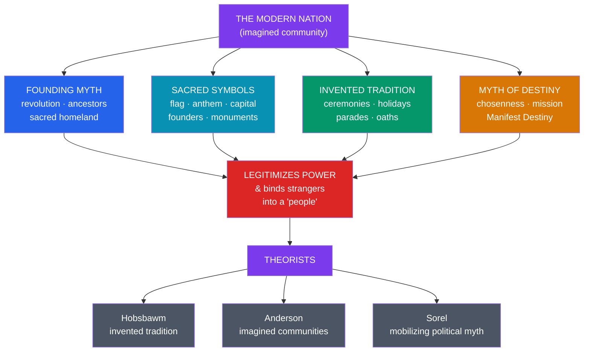

# 🏛️ National Myths and Symbols

> [!abstract] TL;DR
> Modern nations tell **myths about themselves** — sacred-feeling narratives of origin, chosenness, and destiny that bind strangers into a people and **legitimize power**. Three ideas anchor the study. **Eric Hobsbawm's** "**invented tradition**" shows that many "ancient" national customs (kilts and tartans, royal ceremonial, most flag rituals) were **recently manufactured** to instill values and continuity. **Benedict Anderson's** "**imagined communities**" explains the nation as a socially constructed fellowship: its members will never meet, yet they imagine a deep horizontal comradeship, made possible by print capitalism. **Georges Sorel** theorized the **political myth** as a mobilizing, non-rational image that drives collective action (his example, the general strike). Around these run the concrete machinery of national myth — **founding myths**, **flags, anthems, monuments, and rituals**, and myths of **origin and destiny** such as **Manifest Destiny**. The lesson that closes this vault: the structures identified in ancient myth — cosmogony, chosen people, sacred symbol, promised destiny — are **still actively produced today**, now in the service of the modern state.

## Intuition — analogy first

A nation is like a **corporate brand** that needs its consumers to feel like *family*.

A brand cannot survive on a logo alone; it manufactures an **origin story** ("founded in a garage by two visionaries"), sacred **symbols** (the logo, the jingle, the color), commemorative **rituals** (the annual keynote, the anniversary edition), and a sense of shared **destiny** ("we're changing the world") — all engineered to convert transactional customers into loyal believers who feel they *belong* to something.

The modern nation-state does exactly this, at civilizational scale and far higher stakes. It cannot rely on people knowing one another — a citizen will never meet 99.9999% of fellow nationals. So it manufactures a **founding myth** (the revolution, the pilgrims, the ancient homeland), **sacred symbols** (flag, anthem, capital, founding fathers), **rituals** (independence days, military parades, moments of silence), and a **destiny** ("manifest destiny," "the American dream," "a thousand-year Reich"). These are not lies exactly; they are **myths** in the technical sense — narratives that create the very community they claim to describe. The nation is real *because* enough people believe the story. See [[The_Comparative_Method]].

---

## How Nations Manufacture Myth

## Key Concepts

### The nation as an imagined community (Anderson)

The political scientist **Benedict Anderson** (1936–2015), in *Imagined Communities* (1983), defined the nation as "**an imagined political community — and imagined as both inherently limited and sovereign**." *Imagined* because its members "will never know most of their fellow-members... yet in the minds of each lives the image of their communion"; *limited* because every nation has borders beyond which lie other nations; *a community* because it is conceived as "a **deep, horizontal comradeship**" — a fraternity for which people will kill and die. Anderson argued this became thinkable only in the modern era, enabled by **print capitalism** (newspapers and novels created a shared standardized language and a sense of simultaneous, common experience) as older sacred and dynastic sources of legitimacy declined. Nationalism, in his phrase, has more in common with religion and kinship than with political ideology — which is why it commands mythic devotion.

### Invented tradition (Hobsbawm)

The Marxist historian **Eric Hobsbawm** (1917–2012), with **Terence Ranger**, edited *The Invention of Tradition* (1983), demonstrating that many customs assumed to be immemorial are in fact **recent deliberate constructions**. An "**invented tradition**" is "a set of practices... of a **ritual or symbolic nature** which seek to inculcate certain **values and norms** of behaviour by **repetition**, which automatically implies **continuity with the past**" — often a **largely fictitious** past. Case studies include the Scottish **kilt and clan tartans** (substantially an 18th–19th-century creation, not ancient Highland dress), the elaborate ceremonial of the **British monarchy** (much of it late-Victorian invention presented as timeless), and the mass production of **flags, anthems, and national holidays** across 19th-century Europe. The point is not that traditions are "fake" but that they are **manufactured for present political purposes** — to forge identity, legitimize authority, and instill loyalty — while claiming ancient roots.

### Founding myths, symbols, and ritual

Every nation curates a **founding myth** and a repertoire of sacred objects and acts:

| Element | Function | Examples |
|---|---|---|
| **Founding myth** | Origin, legitimacy, shared identity | American Revolution & Founding Fathers; Romulus & Remus and Rome; the *Mayflower* pilgrims; national liberation struggles |
| **Flag** | Portable sacred symbol; loyalty focus | Stars and Stripes; the tricolore; flag-desecration taboos |
| **Anthem** | Ritual synchrony; emotional bonding | *La Marseillaise*; standing, hand-on-heart |
| **Monument / shrine** | Sacred space; commemoration | Tomb of the Unknown Soldier; Lincoln Memorial; war cenotaphs |
| **Holiday / commemoration** | Repeated ritual renews the myth | Independence Day; Bastille Day; national remembrance days |
| **Founding heroes** | Personified ideals (secular saints) | Washington, Lincoln, Gandhi, Bolívar |

Sociologist **Robert Bellah** named the American version "**civil religion**" — a set of sacred symbols, beliefs, and rituals ("**one nation under God**," presidential invocations, the reverence for founding documents) that functions religiously without being a church. The founding documents themselves become **sacred scripture** (the Constitution enshrined and displayed like a relic).

### Myths of origin and destiny: Manifest Destiny

National myths reach forward as well as back, casting the nation as **chosen** for a special **destiny**. The United States' "**Manifest Destiny**" — the 1840s belief, named by journalist **John L. O'Sullivan** in 1845, that Americans were providentially destined to expand across the continent — supplied moral cover for westward expansion and dispossession of Native peoples. It is a modern instance of the ancient "**chosen people**" motif (Israel's covenant, Rome's divinely promised *imperium*, England's "elect nation"). Such destiny-myths recur worldwide: the Soviet myth of the inevitable proletarian future, imperial "civilizing missions," and expansionist myths of the *Volk*. They show the sacred-cosmological grammar of ancient myth — a people set apart and promised a future — repurposed to justify modern statecraft, sometimes benignly, sometimes catastrophically.

### Sorel and the mobilizing power of political myth

The French thinker **Georges Sorel** (1847–1922), in *Reflections on Violence* (1908), argued that mass political movements are driven not by rational programs but by **myth** — a powerful, emotionally charged **image of the future** that inspires action regardless of whether it is literally attainable. His example was the **general strike** of revolutionary syndicalism: a mobilizing vision whose function was to **energize and unify** the workers, not to be a testable prediction. Sorel's insight — that political myths work by moving people to act, bypassing rational assessment — proved double-edged: it illuminated the emotional engine of mass politics but was also drawn upon by 20th-century authoritarian movements that weaponized national and racial myths. Later theorists (Ernst Cassirer's *The Myth of the State*, and studies of totalitarian propaganda) traced how deliberately engineered political myth can override reason on a mass scale.

## Primary Sources & Examples

- **Scottish tartan and the kilt** — Hobsbawm and Trevor-Roper's classic case of an "ancient" tradition largely invented in the 18th–19th centuries.
- **The Tomb of the Unknown Soldier** — a modern sacred shrine (Paris, London, Washington) sacralizing the nation's war dead; ritual, not spontaneous.
- **Manifest Destiny** — a documented 1840s destiny-myth (O'Sullivan) legitimizing continental expansion; the "chosen people" motif in modern political form.
- **American civil religion** — Bellah's analysis of presidential rhetoric, national holidays, and the veneration of founding documents as a functional religion.
- **Romulus and Remus** — Rome's founding myth, showing that state-founding myths are ancient as well as modern; the pattern is continuous.
- **The general strike (Sorel)** — the textbook case of a mobilizing political myth valued for its motivating power, not its truth.

## Common Pitfalls / Misconceptions

- **"Invented tradition means the tradition is fake or worthless."** Hobsbawm's claim is about **origin and purpose**, not value. Invented traditions are socially real and powerful; the point is that they were manufactured recently for present ends, despite claiming ancient roots.
- **Thinking "imagined community" means the nation is imaginary.** Anderson means **constructed through shared imagination**, not illusory. The nation is entirely real in its effects — people live and die for it — but it is a cultural artifact, not a natural fact.
- **Reading political myth as simply "propaganda / lies."** Following Sorel, political myth works by supplying a mobilizing image and identity; reducing it to conscious deception misses why it grips people who are not being fooled.
- **Assuming national myth is a purely modern invention.** The *nation-state* framing is modern, but the underlying grammar — founding myth, chosen people, sacred destiny — is ancient (Rome, Israel). Modern politics **reuses** myth's oldest structures.
- **Treating destiny-myths as harmless self-flattery.** Myths of chosenness and destiny (Manifest Destiny, *Lebensraum*) have licensed conquest and atrocity; the sacralizing power of myth is precisely what makes political myth dangerous.

## Related Concepts

- [[_MOC_Modern_Myth|↑ Section MOC]] — this note closes the vault: myth as a living political force
- [[The_Comparative_Method]] — the theoretical frames of Section 1 applied to myths nations still make
- [[Superheroes_as_Modern_Myth]] — the national hero (Captain America) as a bridge between pop and political myth
- [[Mythic_Structure_in_Fiction]] — invented national mythologies as a form of collective worldbuilding
- [[Urban_Legends_and_Modern_Folklore]] — political rumor and folk narrative as the grassroots layer of national myth
- Cross-vault: [[Historical_Bias_and_Revisionism]] (History) — how founding myths distort and are contested in historiography

## Review Questions

1. Define Anderson's "imagined community" and Hobsbawm's "invented tradition," and show with one concrete example how each explains something about a national symbol or ritual.
2. Explain Sorel's concept of political myth. Why is his claim — that such myths work by mobilizing rather than by being true — both illuminating and dangerous?
3. Show how "Manifest Destiny" reuses the ancient "chosen people" motif, and use it to explain the closing argument of this vault: that ancient mythic structures remain actively productive today.

## Sources

- Anderson, B. (1983). *Imagined Communities: Reflections on the Origin and Spread of Nationalism*. Verso
- Hobsbawm, E., & Ranger, T. (Eds.) (1983). *The Invention of Tradition*. Cambridge University Press
- Sorel, G. (1908/1999). *Reflections on Violence* (J. Jennings, Ed.). Cambridge University Press
- Bellah, R. N. (1967). "Civil Religion in America." *Daedalus*, 96(1), 1–21

#mythology #modern-myth #political-myth #nationalism #invented-tradition
