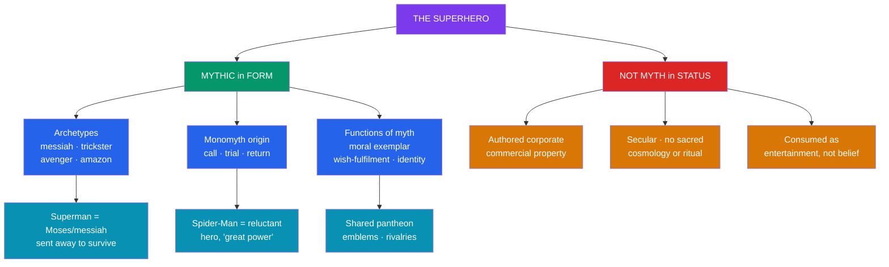

# 🦸 Superheroes as Modern Myth

> [!abstract] TL;DR
> The comic-book superhero is often read as a **modern mythology** — a shared pantheon of larger-than-life figures who embody a culture's values, fears, and ideals much as the Olympians or the Æsir once did. The reading rests on real parallels: superheroes are **archetypal** (the messiah, the trickster, the avenger, the amazon), their origin stories follow the **monomyth** and the pattern of the exceptional birth and the call to power, and they perform functions once held by gods and heroes — **moral exemplar, wish-fulfilment, and collective story**. Classic mythic readings include **Superman as a Moses / messiah figure** (an infant sent away in a vessel to escape doom, raised in a foreign land, becoming a savior) and **Batman, Wonder Woman, Thor, and Spider-Man** as recognizable heroic types. But the analogy has firm limits: superheroes are **authored corporate commercial property**, lack the **sacred, cosmological, and ritual** dimensions of true myth, and are consumed as entertainment, not belief. The honest verdict is that superheroes are a **functional, secular, popular mythology** — mythic in *form and role*, not in sacred *status*.

## Intuition — analogy first

Ask where a modern child first meets a **pantheon** — a whole interrelated family of super-powered beings, each with a domain, a symbol, a signature power, and running rivalries and alliances.

Not, for most, in Homer or the *Prose Edda*. It is on the screen and the comics page: a **sky-father** figure of near-limitless power and unbending virtue (**Superman**); a **god of thunder** who literally *is* the Norse Thor rebranded (**Thor**); a warrior-princess from a hidden matriarchal island of the gods (**Wonder Woman**); a shadowed avenger who works by night (**Batman**); a clever, wisecracking figure who suffers for his gifts (**Spider-Man**). They wear identifying emblems the way gods carry attributes, they recur in endless variant tellings, and they model who a culture thinks it should admire.

That structural resemblance — a shared cast of iconic figures embodying ideals, endlessly retold — is why so many readers call the superhero a modern myth. The intuition is powerful and largely fair. The discipline's job is to say *how far* it holds. See [[The_Heros_Journey]] and [[Jungian_Archetypes_and_Myth]].

---

## The Mythic Reading and Its Limits

## Key Concepts

### The superhero as pantheon and archetype

Read as a group, superheroes form a **pantheon** — a stable, interrelated cast whose members personify distinct ideals and powers, complete with symbols (the S-shield, the bat, the web), domains, and long-running alliances and feuds (the Justice League, the Avengers). Individually, they map onto ancient **archetypes** (see [[Jungian_Archetypes_and_Myth]]): the invulnerable, sun-bright **savior** (Superman); the vengeful **avenger of a wrong** (Batman); the **warrior-maiden / amazon** (Wonder Woman); the **trickster** who wins by wit and wisecrack (Spider-Man, Loki); the literal **thunder-god** (Thor). This is why the pantheon feels ancient even when the character was invented last decade — the *type* is old.

### Superman as Moses / messiah figure

The most-cited mythic reading is of **Superman**, created in 1938 by **Jerry Siegel and Joe Shuster**, two Jewish teenagers from Cleveland. His origin echoes **Moses**: an infant placed by desperate parents in a small vessel and sent away to escape the destruction of his world (Krypton / Pharaoh's decree), found and raised by a family not his own, growing up to become a deliverer of his adopted people. His Kryptonian name, **Kal-El**, carries the Hebrew *El* ("God"), and scholars read the parallel as partly deliberate. Layered on top is a **messianic / Christ** reading, made explicit in later films: a father in the heavens sends his only son to Earth to show humanity the way, a savior who dies and returns (the 1992–93 "**Death and Return of Superman**" arc). Superman thus fuses the **foundling-hero pattern** (Sargon, Moses, Karna, Oedipus, Cyrus — the "exposed royal infant") with messianic redemption.

### The monomyth in the origin story

Superhero **origin stories** are compact **hero's journeys** (see [[The_Heros_Journey]]). Peter Parker is an ordinary youth who receives a **supernatural boon** (the spider bite), refuses the **call** (using his powers selfishly), suffers a catalyzing loss (Uncle Ben's death, the "**with great power comes great responsibility**" lesson), and returns transformed to serve his community — Campbell's separation–initiation–return in miniature. Batman's origin is a **descent** born of trauma (his parents' murder), a self-imposed initiation, and a re-emergence as a symbol. The recurring beats — exceptional birth or accident, mentor, trial, sacrifice, and the double identity (the ordinary self and the empowered self, a modern echo of the god-in-disguise) — are why the monomyth template maps on so cleanly.

### Functions once held by gods and heroes

Under a functionalist lens (see [[Functions_of_Myth]]), superheroes do the cultural work myth once did:

| Function of myth | Ancient form | Superhero form |
|---|---|---|
| **Moral exemplar** | Heracles, the righteous king | Superman's incorruptible virtue; the hero's code against killing |
| **Wish-fulfilment / awe** | Gods' power over nature | Flight, super-strength, control of storms |
| **Explaining evil & suffering** | Titans, monsters, tricksters | Super-villains as personified chaos |
| **Identity & belonging** | Civic patron deities, founding heroes | National icons (Captain America), fandom communities |
| **Coping with the age's anxieties** | Plague, war, chaos gods | Atomic-age mutation (Hulk, X-Men), techno-fear (Iron Man) |

The comparison is strongest here: the superhero genre demonstrably *performs the social roles* of myth for a mass secular audience.

### Critical caveats: where the analogy breaks

Scholars such as comics theorist **Peter Coogan** and religion scholars caution against overstating the parallel. Genuine myth is typically **sacred** (believed, tied to the divine order), **cosmological** (it explains the origin and structure of the world), **anonymous and communal** (no single author, evolved orally), and **embedded in ritual**. Superheroes fail these tests: they are **authored** by identifiable creators, **owned** as commercial trademarks by corporations (DC, Marvel/Disney) and shaped by market forces, **secular** entertainment consumed *knowing* it is fiction, and lacking any binding **ritual or cult**. Umberto Eco's classic essay "**The Myth of Superman**" (1962) notes a further difference: to keep the property saleable, the hero exists in an **oneiric, iterative present** where consequential change is resisted, unlike the finished, fated arcs of true myth. The safest formulation: superheroes are **mythic in form and function but not in sacred status** — a *popular* or *secular* mythology.

## Examples Across Cultures

- **Superman (Moses / messiah)** — the foundling-savior pattern, explicitly Mosaic in origin and messianic in later retellings; the flagship case for the mythic reading.
- **Wonder Woman (amazon / goddess)** — created by **William Moulton Marston** drawing directly on Greek myth: an Amazon princess sculpted from clay and given life by the gods, blending Athena's wisdom and Aphrodite's beauty with Artemis's martial skill.
- **Thor (direct divine adaptation)** — Marvel's Thor *is* the Norse thunder-god (with Odin, Loki, and Asgard), an explicit modern re-telling of living mythological material.
- **Spider-Man (trickster / reluctant hero)** — the wisecracking, web-spinning underdog whose origin is a textbook monomyth of power, loss, and responsibility.
- **Captain America (national hero / civic myth)** — a deliberately patriotic embodiment of national ideals, linking the superhero to political myth (see [[National_Myths_and_Symbols]]).
- **The X-Men (myth for an anxiety)** — mutants as a metaphor for prejudice and difference, showing the genre encoding a specific age's social fears.

## Common Pitfalls / Misconceptions

- **"Superheroes literally are gods / this is a new religion."** They perform mythic *functions* but lack myth's sacred, cosmological, and ritual status; almost no one *believes* in or worships them. The claim is about form and social role, not belief.
- **Forcing every character onto Moses or Christ.** The Superman parallel is well grounded, but mechanically mapping every hero to a savior figure repeats the "parallelomania" error criticized in comparative method — weigh disanalogies too.
- **Ignoring authorship and commerce.** Unlike anonymous, communal myth, superheroes are authored, trademarked corporate property whose stories are shaped by sales; this is a structural, not incidental, difference.
- **Treating the monomyth as proof of depth.** That an origin story fits Campbell's template shows shared narrative architecture, not that the comic carries the sacred weight of scripture — the template is a storytelling tool (see [[Mythic_Structure_in_Fiction]]).
- **Assuming stasis is a flaw rather than a feature.** Eco's point is that commercial serialization *requires* an unchanging present, which is precisely what distinguishes the superhero from the fated arcs of classical myth.

## Related Concepts

- [[_MOC_Modern_Myth|↑ Section MOC]] — the authored, popular face of modern myth-making
- [[The_Heros_Journey]] — the monomyth template that superhero origin stories instantiate
- [[Jungian_Archetypes_and_Myth]] — the archetypes (savior, trickster, amazon) superheroes embody
- [[Mythic_Structure_in_Fiction]] — the broader craft of deploying mythic structure in modern narrative
- [[National_Myths_and_Symbols]] — the civic, national superhero (Captain America) as political myth
- [[Urban_Legends_and_Modern_Folklore]] — the folk (anonymous) face of modern myth, contrasted with the authored superhero
- Cross-vault: [[_MOC_Psychology_Master|Psychology]] — the archetypal and wish-fulfilment appeal of heroic figures

## Review Questions

1. Lay out the case that Superman is a Moses / messiah figure, citing specific features of his origin. Then state the strongest objection to reading him as genuine myth.
2. Using one hero, show how the origin story instantiates Campbell's separation–initiation–return. What does a good template fit prove, and what does it *not* prove?
3. List the criteria (sacredness, cosmology, anonymity, ritual) on which superheroes fail to be "true" myth, and explain why "functional / secular mythology" is the more defensible claim.

## Sources

- Coogan, P. (2006). *Superhero: The Secret Origin of a Genre*. MonkeyBrain Books
- Eco, U. (1972). "The Myth of Superman." *Diacritics*, 2(1), 14–22 (orig. 1962)
- Reynolds, R. (1992). *Super Heroes: A Modern Mythology*. University Press of Mississippi
- Kripal, J. J. (2011). *Mutants and Mystics: Science Fiction, Superhero Comics, and the Paranormal*. University of Chicago Press

#mythology #modern-myth #superheroes #archetype #popular-culture
