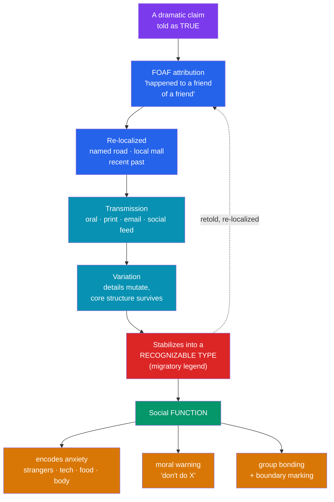

# 👻 Urban Legends and Modern Folklore

> [!abstract] TL;DR
> An **urban legend** (folklorists prefer **contemporary legend**) is a short, dramatic, migratory story told as *true* and set in the recent, everyday world — yet fictional or unverifiable. It travels by the **"friend of a friend"** (FOAF) formula, mutates as it spreads, and clusters into stable types across regions and decades. The American folklorist **Jan Harold Brunvand** popularized their study in *The Vanishing Hitchhiker* (1981), showing that these are not "mere rumors" but genuine **oral folklore** obeying the same laws of variation and transmission as ancient myth. Their power is functional: they **encode collective anxiety** (about strangers, technology, sex, food, the city) and deliver **moral warnings** ("don't pick up hitchhikers," "check the back seat"). In the internet age the genre has migrated online as **digital folklore** — **creepypasta**, the collaboratively authored **Slender Man**, and **memes** — proving that myth-making is a living, ongoing human activity rather than a relic of antiquity.

## Intuition — analogy first

Think of an urban legend as a **cover song with no original recording**.

Nobody can point to the "first" performance, yet everyone knows the tune. Each teller reproduces it from memory, drops a verse, adds a local riff, swaps the setting to their own town — and the result is unmistakably *the same song* despite never being identical twice. There is no authoritative "studio master," only an endless chain of live covers, each sincerely believed to be the real thing because someone the singer trusts swore it happened.

That is exactly how a legend lives. There is no author and no canonical text — only variants, each anchored to a **"friend of a friend"** who supposedly witnessed it. The story stays recognizable because its **core structure** (a warning, a shock, a twist) is stable, while its surface details (the road, the mall, the babysitter's town) are endlessly re-localized. This is the same machinery that produced ancient myth long before writing: oral transmission plus creative variation. The urban legend simply lets us watch the process happen in real time. See [[What_Is_Myth]].

---

## How a Legend Lives and Spreads

## Key Concepts

### Contemporary legend vs. myth, rumor, and hoax

Folklorists distinguish the **contemporary legend** carefully. Unlike a **myth** (sacred, set in a primordial time, concerning gods and origins), a legend is **secular** and set in the **recent, mundane world** and told as having *actually happened*. Unlike a one-off **rumor** (a specific unverified claim about a real named person or event), a legend is a **narrative with plot and structure** that recurs in many places over time. Unlike a deliberate **hoax**, a legend is transmitted in **good faith** — tellers genuinely believe, or half-believe, it is true. The scholarly term "**contemporary legend**" is now preferred over "urban legend" because many such tales are neither strictly urban nor strictly modern; the phenomenon is the *migratory legend*, a term the Norwegian folklorist **Reidar Christiansen** used for internationally distributed tale-types.

### Jan Harold Brunvand and *The Vanishing Hitchhiker*

The study of these tales was brought to a wide public by **Jan Harold Brunvand** (b. 1933), a University of Utah folklorist, whose *The Vanishing Hitchhiker: American Urban Legends and Their Meanings* (1981) named and legitimized the field. His central case, "**The Vanishing Hitchhiker**," is a young woman picked up on a lonely road who gives an address and then silently disappears from the moving car; the driver learns she died years earlier at that spot. Brunvand showed the story is documented across the world for over a century, endlessly re-localized — proof of oral folklore alive in modern America. He catalogued now-canonical types: **"The Hook"** (a hook-handed maniac and a couple parked on lovers' lane), **"The Kidney Heist,"** **"The Killer in the Backseat,"** and **"The Choking Doberman."** His guiding thesis: legends persist because they are **"too good to be false"** — psychologically and socially useful regardless of factual truth.

### The FOAF formula and the mechanics of belief

The signature of a legend is its **attribution structure**: the events always happened to a **"friend of a friend"** — close enough to be credible, distant enough to be uncheckable. The folklorist **Rodney Dale** coined the acronym **FOAF** for this ever-receding source. This device does real work: it **borrows the trust** of a personal relationship while insulating the story from verification, and it makes the teller a good-faith reporter rather than a liar. Combined with **re-localization** (setting the tale on a road the audience knows), the FOAF formula manufactures just enough plausibility for belief to survive retelling.

### Structure and social function

Like all folklore, legends do cultural work. Following the functionalist tradition (see [[Functions_of_Myth]]), scholars read them as:

| Function | What the legend does | Example type |
|---|---|---|
| **Anxiety encoding** | Gives shape to diffuse modern fears | "The Hook" (fear of predatory strangers, teen sexuality) |
| **Moral warning** | Punishes transgression, enforces caution | "The Vanishing Hitchhiker" (mortality, kindness to strangers) |
| **Cultural commentary** | Voices distrust of institutions/technology | "Kidney Heist," "spider in the beehive hairdo" (hygiene, the body) |
| **Boundary marking** | Defines the in-group's values by contrast | "Welfare/immigrant" legends (xenophobic ostension) |
| **Entertainment & bonding** | Shared thrill cements the telling group | Campfire and sleepover legends |

**Bill Ellis** and others study **ostension** — when people *act out* a legend in reality (e.g., contamination panics, the "razor blades in Halloween candy" scare prompting real hospital X-rays of candy despite almost no verified cases), showing legends can shape behavior even when factually empty.

### Digital folklore: myth-making in the internet age

The internet did not kill folklore; it supercharged it. The same processes — anonymous authorship, variation, communal transmission — now run at network speed:

- **Creepypasta** — short horror legends copied and pasted across forums (the term blends "copypasta" with "creepy"). Stories like "**Candle Cove**" and "**The Russian Sleep Experiment**" circulate as anonymous, endlessly re-posted texts.
- **Slender Man** — the paradigm case of **collaborative digital myth-making**. Invented by **Eric Knudsen** ("Victor Surge") in a 2009 Something Awful photo-editing thread, the faceless tall figure was rapidly elaborated by thousands of users into a shared mythology with its own lore, rules, and mythos (the "Mythos" wikis, the *Marble Hornets* video series). It demonstrates **open-source myth**: no single author, communal canon, rapid variation — folklore's ancient logic on new infrastructure.
- **Memes** — folklorist readings treat memes as **digital folklore**: variant-generating, anonymous, communally transmitted units of shared meaning, the direct heirs of the joke cycle and the chain letter.

The scholarly point is profound and closes this vault's argument: **the mythic and folkloric impulse is not a fossil of the pre-modern past but a permanent feature of human culture**, re-tooling itself for every new medium.

## Examples Across Cultures

- **"The Vanishing Hitchhiker"** — attested in the United States, Britain, Korea, Hawaii (where she is identified with the goddess **Pele**), and beyond; a genuinely international migratory legend.
- **"The Death Car"** — a luxury car sold impossibly cheap because someone died in it and the smell won't leave; Richard Dorson traced a real Michigan case that spawned the legend, illustrating the leap from event to type.
- **Poison and contamination legends** — "spider eggs in bubble gum," "rat in the fried chicken," the "**Kentucky Fried Rat**" — encode anxieties about mass-produced food and impersonal corporations across many Western countries.
- **"Bloody Mary"** — a ritual-summoning legend (chanting into a mirror) transmitted especially among children, blending legend with folk practice, and now cross-pollinating with creepypasta online.
- **Slender Man and creepypasta** — a genuinely 21st-century, global, digitally native mythology, showing folklore's core mechanics operating on the internet.

## Common Pitfalls / Misconceptions

- **"Urban legends are just lies / stupid people's beliefs."** The folkloric point is that **factual truth is beside the point**. Legends persist because they are meaningful and functional, and intelligent people transmit them in good faith. Debunking a legend does not explain why it exists.
- **Assuming they are strictly modern or urban.** Many "urban" legends have medieval or ancient analogues; the vanishing traveler and the poisoned gift are very old. "**Contemporary legend**" is the more accurate term.
- **Confusing legend with myth or rumor.** A legend is a *structured, recurring narrative told as true in the everyday world* — not sacred cosmology (myth) and not a single unverified claim (rumor).
- **Treating a single telling as "the" legend.** There is no canonical text; the legend *is* the sum of its variants. Studying only one version misses the point, exactly as it would for an oral epic.
- **Believing the internet ended folklore.** Digital media are simply the newest transmission channel; creepypasta and memes are folklore by every structural criterion.

## Related Concepts

- [[_MOC_Modern_Myth|↑ Section MOC]] — this note opens the case that myth is a living activity
- [[What_Is_Myth]] — the myth / legend / folktale distinctions this note applies to modern material
- [[Functions_of_Myth]] — the functionalist lens (anxiety, morality, bonding) used to read legends
- [[National_Myths_and_Symbols]] — political legends and rumor as folklore operating on the collective scale
- [[Superheroes_as_Modern_Myth]] — the other face of modern myth: authored popular mythology
- Cross-vault: [[_MOC_Psychology_Master|Psychology]] — the cognitive appeal and anxiety-encoding of contagious stories

## Review Questions

1. Define "contemporary legend" and distinguish it precisely from myth, rumor, and hoax. Why do folklorists prefer that term to "urban legend"?
2. Explain the FOAF formula and re-localization, and show how together they manufacture belief that survives retelling. Use one Brunvand legend as your example.
3. In what sense is Slender Man a genuine myth rather than a single author's fiction? What features of its creation and transmission make it folklore?

## Sources

- Brunvand, J. H. (1981). *The Vanishing Hitchhiker: American Urban Legends and Their Meanings*. W. W. Norton
- Brunvand, J. H. (2001). *Encyclopedia of Urban Legends*. ABC-CLIO
- Ellis, B. (2001). *Aliens, Ghosts, and Cults: Legends We Live*. University Press of Mississippi
- Blank, T. J. (Ed.) (2012). *Folk Culture in the Digital Age: The Emergent Dynamics of Human Interaction*. Utah State University Press

#mythology #modern-myth #folklore #urban-legend #digital-folklore
