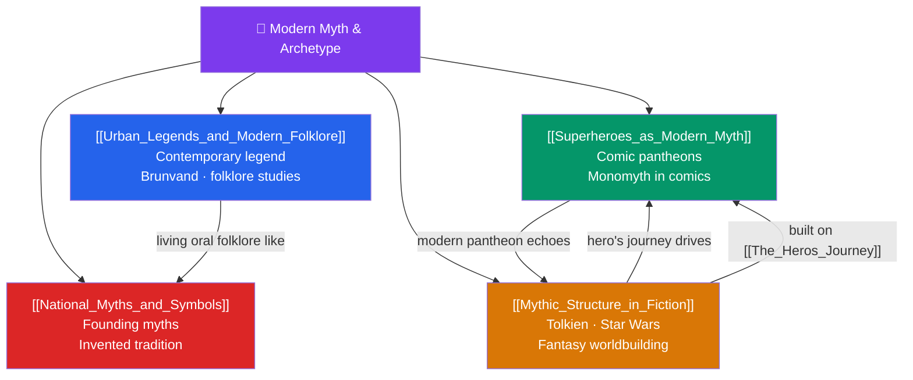

# 🦸 Modern Myth & Archetype — Map of Content

> [!abstract] What This Section Covers
> Myth-making did not end with antiquity; this closing section shows the mythic impulse alive in contemporary culture. **Urban Legends and Modern Folklore** examines the field of contemporary legend — the migratory, endlessly variant stories (from vanishing hitchhikers to internet lore) that folklorists like Jan Harold Brunvand study as living myth. **Superheroes as Modern Myth** reads comic-book pantheons and their recurring monomyth structure as a functional mythology for the modern age. **Mythic Structure in Fiction** analyzes how authors and filmmakers — Tolkien's *Middle-earth*, *Star Wars*, and the fantasy tradition — consciously deploy archetype and the hero's journey to craft resonant worlds. **National Myths and Symbols** turns to political mythology: founding myths, Hobsbawm's "invented tradition," and the symbolic narratives that bind nations. Together they close the loop with the theory of Section 1, demonstrating that the structures identified in ancient myth continue to organize meaning today.

## Concept Map

## Learning Path

1. [[Urban_Legends_and_Modern_Folklore]] — Contemporary legend as living myth: variation, transmission, and folklore studies.
2. [[Mythic_Structure_in_Fiction]] — How Tolkien, *Star Wars*, and fantasy consciously use archetype and the monomyth.
3. [[Superheroes_as_Modern_Myth]] — Comic-book pantheons and the hero's journey in modern popular culture.
4. [[National_Myths_and_Symbols]] — Founding myths, invented tradition, and the political power of symbols.

## All Notes at a Glance

| Note | Difficulty | What You'll Learn |
|------|------------|-------------------|
| [[Urban_Legends_and_Modern_Folklore]] | Beginner | Contemporary legend, Jan Harold Brunvand, migratory legends, internet folklore and creepypasta |
| [[Superheroes_as_Modern_Myth]] | Beginner → Intermediate | Comic pantheons, the monomyth in comics, origin stories, gods reimagined for a secular age |
| [[Mythic_Structure_in_Fiction]] | Intermediate | Tolkien's legendarium, *Star Wars* and Campbell, worldbuilding, archetype in narrative craft |
| [[National_Myths_and_Symbols]] | Intermediate | Founding myths, Hobsbawm's invented tradition, flags and monuments, political symbolism |

## Key Questions This Section Answers

- What makes an urban legend a genuine form of living folklore rather than mere rumor?
- In what sense are superheroes a functional mythology for a secular age?
- How consciously do authors like Tolkien and Lucas draw on ancient mythic structure?
- What work do national founding myths and symbols do for a modern state?
- How do the theoretical frameworks of Section 1 apply to myths still being made today?

## Related Sections

- [[_MOC_Mythology_Master|↑ Mythology Master MOC]]
- [[_MOC_Abrahamic_Myth|← Abrahamic Narratives & Folklore]]
- Cross-vault: [[The_Heros_Journey]] (monomyth in fiction), [[Jungian_Archetypes_and_Myth]], [[Functions_of_Myth]]

#MOC #Mythology #ModernMyth
