# ⚡ Mythology — Master Map of Content

> [!abstract] About This Vault
> A comparative world-mythology reference: **~58 notes planned across 14 sections**. It opens with the *theory* of myth — Campbell's monomyth, Jungian archetypes, and the comparative method — then tours the great traditions: Mesopotamian, Egyptian, Greek, Roman, Norse, Celtic, Hindu/Vedic, East Asian, Mesoamerican, African, Slavic/Baltic, the Abrahamic narratives, and finally *modern* myth and archetype (superheroes, urban legend, national myth). Each note treats its material academically — real deity names, primary texts, and cross-cultural motifs — through a comparative, literary, and historical lens, neutral across traditions. Cross-linked to [[_MOC_Psychology_Master]] (archetypes), [[_MOC_History_Master]] (ancient societies), and Literature. Start with the theory section, or jump straight to a pantheon.

> [!success] Vault complete
> All **14 sections** and **58 concept notes** are fully written — plus the master map and all 14 section maps. Every note is built from the `Technical_Concept` template with a Mermaid diagram, key myths, comparative notes, cross-links, and review questions. Completed 2026-07-30. See [[_Vault_Expansion_Roadmap]].

## Vault Architecture

```mermaid
graph TD
    Master["⚡ Mythology Master"]

    Master --> T["<b>THEORY</b>"]
    Master --> NE["<b>NEAR EAST &<br/>MEDITERRANEAN</b>"]
    Master --> EU["<b>EUROPE</b>"]
    Master --> AS["<b>ASIA</b>"]
    Master --> AA["<b>AMERICAS &<br/>AFRICA</b>"]
    Master --> MOD["<b>ABRAHAMIC &<br/>MODERN</b>"]

    T --> S01["01 · Comparative Mythology & Theory"]

    NE --> S02["02 · Mesopotamian"]
    NE --> S03["03 · Egyptian"]
    NE --> S04["04 · Greek"]
    NE --> S05["05 · Roman"]

    EU --> S06["06 · Norse & Germanic"]
    EU --> S07["07 · Celtic"]
    EU --> S12["12 · Slavic & Baltic"]

    AS --> S08["08 · Hindu & Vedic"]
    AS --> S09["09 · East Asian"]

    AA --> S10["10 · Mesoamerican"]
    AA --> S11["11 · African"]

    MOD --> S13["13 · Abrahamic Narratives"]
    MOD --> S14["14 · Modern Myth & Archetype"]

    style Master fill:#7c3aed,color:#fff
    style T fill:#2563eb,color:#fff
    style NE fill:#b45309,color:#fff
    style EU fill:#0891b2,color:#fff
    style AS fill:#059669,color:#fff
    style AA fill:#dc2626,color:#fff
    style MOD fill:#db2777,color:#fff
```

## Sections at a Glance

| # | Section | Notes | Entry Point | Region |
|---|---------|:-----:|-------------|--------|
| 01 | Comparative Mythology & Theory | 6 | [[_MOC_Comparative_Mythology]] | Theory |
| 02 | Mesopotamian | 4 | [[_MOC_Mesopotamian_Myth]] | Near East |
| 03 | Egyptian | 4 | [[_MOC_Egyptian_Myth]] | Near East |
| 04 | Greek | 5 | [[_MOC_Greek_Myth]] | Mediterranean |
| 05 | Roman | 3 | [[_MOC_Roman_Myth]] | Mediterranean |
| 06 | Norse & Germanic | 4 | [[_MOC_Norse_Myth]] | Europe |
| 07 | Celtic | 4 | [[_MOC_Celtic_Myth]] | Europe |
| 08 | Hindu & Vedic | 5 | [[_MOC_Hindu_Vedic_Myth]] | South Asia |
| 09 | East Asian | 4 | [[_MOC_East_Asian_Myth]] | East Asia |
| 10 | Mesoamerican | 4 | [[_MOC_Mesoamerican_Myth]] | Americas |
| 11 | African | 4 | [[_MOC_African_Myth]] | Africa |
| 12 | Slavic & Baltic | 3 | [[_MOC_Slavic_Baltic_Myth]] | Europe |
| 13 | Abrahamic Narratives & Folklore | 4 | [[_MOC_Abrahamic_Myth]] | Near East |
| 14 | Modern Myth & Archetype | 4 | [[_MOC_Modern_Myth]] | Global |

---

## Learning Paths

### Path 1 — Theory First (Comparative Lens)

> Best for: readers who want the analytical toolkit before the stories, so every pantheon reveals patterns.

[[_MOC_Comparative_Mythology]] → [[What_Is_Myth]] → [[The_Heros_Journey]] → [[Jungian_Archetypes_and_Myth]] → [[The_Comparative_Method]] → [[Creation_and_Flood_Myths]] → then any tradition below.

---

### Path 2 — The Classical Core

> Best for: the Western literary canon — the myths most referenced in art, literature, and language.

[[_MOC_Greek_Myth]] → [[The_Twelve_Olympians]] → [[Greek_Creation_and_the_Titanomachy]] → [[Greek_Heroes_and_Their_Quests]] → [[The_Trojan_War]] → [[_MOC_Roman_Myth]] → [[The_Founding_of_Rome]] → [[_MOC_Norse_Myth]] → [[Creation_and_Ragnarok]]

---

### Path 3 — World Tour (Global Traditions)

> Best for: seeing the sheer diversity — and the uncanny recurrences — across every continent.

[[_MOC_Mesopotamian_Myth]] → [[The_Epic_of_Gilgamesh]] → [[_MOC_Egyptian_Myth]] → [[_MOC_Hindu_Vedic_Myth]] → [[The_Trimurti]] → [[_MOC_East_Asian_Myth]] → [[_MOC_Mesoamerican_Myth]] → [[The_Maya_Popol_Vuh]] → [[_MOC_African_Myth]] → [[_MOC_Slavic_Baltic_Myth]]

---

### Path 4 — Myth in the Modern Mind

> Best for: readers from Psychology or storytelling who want myth's living legacy.

[[The_Heros_Journey]] → [[Jungian_Archetypes_and_Myth]] → [[_MOC_Modern_Myth]] → [[Superheroes_as_Modern_Myth]] → [[Mythic_Structure_in_Fiction]] → [[National_Myths_and_Symbols]]

---

## Cross-Vault Links

- **[[_MOC_Psychology_Master]]** — [[Jungian_Archetypes_and_Myth]] connects the collective unconscious to [[Cognitive_Biases]] and narrative cognition; myth as a map of the psyche.
- **[[_MOC_History_Master]]** — myth is how ancient societies encoded cosmology, law, and identity; read alongside [[_MOC_Mesopotamia_Egypt]] and [[_MOC_Classical_Antiquity]].
- **Literature & Storytelling** — [[The_Heros_Journey]] and [[Mythic_Structure_in_Fiction]] underpin modern narrative craft (Tolkien, Star Wars).

---

## Section MOC Index

- [[_MOC_Comparative_Mythology]] — The theory of myth: monomyth, archetypes, functions, and the comparative method.
- [[_MOC_Mesopotamian_Myth]] — The oldest myths: Enuma Elish, Gilgamesh, and Inanna's descent.
- [[_MOC_Egyptian_Myth]] — Ra and Osiris, creation, and the journey through the afterlife.
- [[_MOC_Greek_Myth]] — Olympians, Titans, heroes, Troy, and the underworld.
- [[_MOC_Roman_Myth]] — The Roman gods, the founding of Rome, and state religion.
- [[_MOC_Norse_Myth]] — Yggdrasil, the Æsir and Vanir, and Ragnarök.
- [[_MOC_Celtic_Myth]] — The Tuatha Dé Danann, the Irish cycles, and the Mabinogion.
- [[_MOC_Hindu_Vedic_Myth]] — Vedic gods, the Trimurti, and the great epics.
- [[_MOC_East_Asian_Myth]] — Chinese creation, the celestial bureaucracy, and Shinto kami.
- [[_MOC_Mesoamerican_Myth]] — The Five Suns, Quetzalcoatl, the Popol Vuh, and the Inca.
- [[_MOC_African_Myth]] — Yoruba Orishas, Anansi, and the living oral tradition.
- [[_MOC_Slavic_Baltic_Myth]] — Perun and Veles, Slavic folklore, and Baltic gods.
- [[_MOC_Abrahamic_Myth]] — Mythic motifs in scripture, angelology, jinn, and legend.
- [[_MOC_Modern_Myth]] — Urban legend, superheroes, fiction, and national myth.

#MOC #Mythology #MasterMOC
