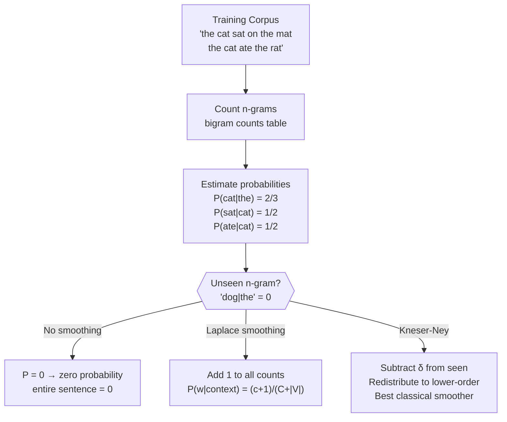

# 📊 Language Model Basics

> [!abstract] TL;DR
> A language model assigns a probability to every sequence of tokens. N-gram models approximate this with local context windows; neural models use full context. Perplexity measures how surprised the model is by held-out text — lower is better. Modern LLMs are just very large auto-regressive language models.

## Intuition — analogy FIRST

Imagine writing a text message and your phone predicts the next word. That prediction is a probability distribution: P("the") = 0.31, P("a") = 0.18, P("my") = 0.09, … The phone chooses the most probable word (or samples from the distribution). A language model is exactly this prediction engine, formalized mathematically. Every text completion, translation scorer, spell-checker, and large language model is built on this same foundation.

N-gram models are like having a very good memory for short phrases: "the cat sat on the ___" — you've seen "on the mat" a thousand times, so "mat" wins. The problem is you've never seen "antidisestablishmentarianism sat on the ___", and the model has no idea what to do.

## How It Works

**Chain Rule Decomposition**

$$P(w_1, w_2, \ldots, w_n) = \prod_{i=1}^{n} P(w_i \mid w_1, \ldots, w_{i-1})$$

The full conditional is intractable — it requires counting every unique prefix. N-gram models truncate the history:

**Bigram approximation** (Markov order 1):
$$P(w_i \mid w_1, \ldots, w_{i-1}) \approx P(w_i \mid w_{i-1}) = \frac{\text{count}(w_{i-1}, w_i)}{\text{count}(w_{i-1})}$$



## Key Concepts / Details

### Perplexity

Perplexity is the standard intrinsic metric for language models:

$$\text{PP}(W) = \exp\!\left(-\frac{1}{N} \sum_{i=1}^{N} \log P(w_i \mid w_1,\ldots,w_{i-1})\right)$$

- Equivalent to 2^{cross-entropy} (when using log base 2)
- Interpretation: the model is as uncertain as if choosing uniformly among PP words at each step
- Lower perplexity = better model (more confident, correct predictions)
- Depends heavily on vocabulary and test set — cannot compare across different tokenizations

**Penn Treebank perplexity benchmarks:**

| Model | Perplexity | Notes |
|-------|-----------|-------|
| Bigram | ~900 | Baseline, very sparse |
| Trigram + Kneser-Ney | ~140 | Best classical n-gram |
| LSTM (Zaremba 2014) | ~78 | Neural baseline |
| GPT-2 Large | ~35 | Transformer |
| GPT-3 (zero-shot) | ~20 | Large-scale |

### Smoothing Methods

| Method | Idea | Strength |
|--------|------|---------|
| Laplace (add-1) | Add 1 to all n-gram counts | Simple; over-smooths for large vocab |
| Add-k | Add k < 1 | Tunable; still crude |
| Backoff | If trigram unseen, fall back to bigram | Explicit hierarchy |
| Interpolation | Weighted sum of all n-gram orders | Better coverage |
| Kneser-Ney | Discount δ ≈ 0.75 from seen n-grams; distribute by continuation count | Best classical; handles absolute discount + interpolation |

**Kneser-Ney intuition**: "San Francisco" is common, but if you see "Francisco" alone, it almost always follows "San". KN uses the number of *unique contexts* a word appears in (not its raw count) for the lower-order distribution.

### Auto-Regressive Generation

Given a trained LM, generate by sampling one token at a time:

1. Encode prefix → get distribution P(w | prefix)
2. Sample w according to chosen strategy → append to prefix
3. Repeat until EOS or length limit

**Sampling strategies:**

| Strategy | Description | Effect |
|----------|-------------|--------|
| Greedy | argmax P(w\|prefix) | Repetitive, deterministic |
| Temperature τ | P'(w) ∝ P(w)^{1/τ} | τ < 1 → peaky; τ > 1 → flat |
| Top-k | Sample from top-k most probable | Controls tail mass |
| Nucleus (top-p) | Sample from smallest set with cumulative prob ≥ p | Adaptive; handles multi-modal distributions |
| Repetition penalty | Divide logits of already-generated tokens by penalty > 1 | Reduces loops |

### Applications of Language Models

- **Spell correction**: P(intended word | observed typo) via noisy channel model
- **Next-word prediction**: mobile keyboard autocomplete
- **Machine translation scoring**: rescore beam-search hypotheses with target-side LM
- **ASR rescoring**: rerank acoustic model hypotheses using text LM
- **Data filtering**: perplexity-based quality filtering (CC-Net, FineWeb use n-gram LMs to filter Common Crawl)

## Real-World Notes

- Kneser-Ney trigrams are still used in Google's keyboard and ASR systems alongside neural models
- Perplexity of GPT-4 on many benchmarks is near the entropy of human language (~15–20 bits)
- Temperature is the single most important generation hyperparameter — most production LLMs use τ ≈ 0.7–1.0
- N-gram LMs require O(V^n) storage — trigrams on large corpora already need hundreds of GB (SRILM, KenLM use efficient data structures)

## Common Pitfalls

1. **Comparing perplexity across different tokenizers/vocab sizes**: a byte-level model will always have higher perplexity than a word-level model on the same text — the unit size changes everything.
2. **Using add-1 smoothing in practice**: it over-smooths badly; always use Kneser-Ney for n-gram LMs.
3. **Greedy decoding for open-ended generation**: always produces repetitive, degenerate text; use top-p or temperature sampling.
4. **Low perplexity ≠ good downstream performance**: a model can memorize training distribution without generalizing.

## Code Demo

```python
import nltk
from nltk.lm import MLE, Laplace
from nltk.lm.preprocessing import padded_everygram_pipeline
from nltk.corpus import gutenberg
import numpy as np

nltk.download("gutenberg", quiet=True)
nltk.download("punkt_tab", quiet=True)

# Build a simple bigram model on Moby Dick
sents = gutenberg.sents("melville-moby_dick.txt")
train_data, vocab = padded_everygram_pipeline(2, sents)

lm = Laplace(2)               # bigram with Laplace smoothing
lm.fit(train_data, vocab)

# Score a sentence
test = ["the", "whale", "was", "white"]
log_prob = lm.logscore("white", ["whale", "was"])
print(f"log P('white' | 'whale was') = {log_prob:.4f}")

# Perplexity
test_data, _ = padded_everygram_pipeline(2, [test])
ppl = lm.perplexity(list(test_data))
print(f"Perplexity on test sentence: {ppl:.2f}")

# Temperature sampling demo (manual)
import torch, torch.nn.functional as F

logits = torch.tensor([2.0, 1.0, 0.5, 0.1])   # raw logits for 4 words
for tau in [0.5, 1.0, 2.0]:
    probs = F.softmax(logits / tau, dim=-1)
    print(f"τ={tau}: probs = {probs.numpy().round(3)}")
# τ=0.5: [0.862 0.117 0.019 0.002]  ← very peaked
# τ=1.0: [0.596 0.244 0.122 0.038]
# τ=2.0: [0.401 0.294 0.206 0.099]  ← flatter
```

## Related Concepts

- [[Tokenization]] — the tokenizer defines what counts as a "word" / token for the LM
- [[Word_Embeddings]] — neural LMs use embedding lookups as the first layer
- [[TF_IDF_Classical]] — TF-IDF is a different lens (retrieval), not sequential probability

## Review Questions

1. The chain rule decomposition is exact but intractable. What assumption does the bigram model make to make it tractable, and what does this assumption sacrifice?
2. You train a trigram model and encounter "the nebulous antidisestablishmentarianism crept" in the test set — all counts are zero. Walk through how Kneser-Ney handles this.
3. Why does lower temperature make generation more repetitive rather than just more confident?
4. Two language models are evaluated on the same test set: Model A has perplexity 45, Model B has perplexity 60. Which is better, and is this guaranteed to translate to better downstream task performance?
5. Explain why nucleus sampling (top-p) is often preferred over top-k sampling for open-domain text generation.

## Sources

- Jurafsky & Martin, *Speech and Language Processing* (3rd ed.) — Chapter 3
- Kneser & Ney (1995), *Improved Backing-Off for M-gram Language Modeling*
- Chen & Goodman (1999), *An Empirical Study of Smoothing Techniques for Language Modeling*
- Holtzman et al. (2020), *The Curious Case of Neural Text Degeneration* — nucleus sampling
- KenLM toolkit: https://kheafield.com/code/kenlm/

#nlp #nlp-fundamentals #beginner
