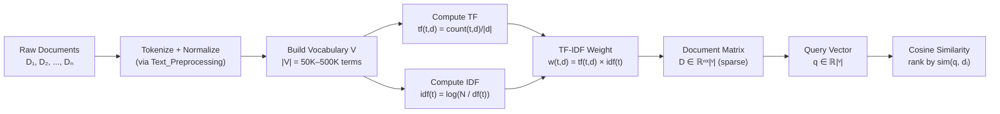

# 📋 TF-IDF and Classical IR

> [!abstract] TL;DR
> TF-IDF represents documents as sparse vectors where each dimension is a vocabulary word weighted by how distinctive it is. BM25 improves on TF-IDF for retrieval by saturating term frequency and normalizing for document length. Both remain competitive baselines and form the "sparse" leg of modern hybrid retrieval systems.

## Intuition — analogy FIRST

Imagine a library catalog card for each book. A naive approach counts every word: "the" appears 900 times, "quantum" appears 12 times. "The" is useless for finding this specific book — every book has it. "Quantum" is gold — only physics books have it. TF-IDF encodes exactly this intuition: a word's weight should increase with how often it appears *in this document* (TF) but decrease with how commonly it appears *across all documents* (IDF). The result is a fingerprint for the document's distinctive content.

## How It Works



## Key Concepts / Details

### Bag of Words (BoW)

The simplest document representation: count occurrences of each vocabulary word, ignore word order.

- Document vector ∈ ℝ|V|; almost entirely zeros (sparse)
- "The cat sat on the mat" → `{the: 2, cat: 1, sat: 1, on: 1, mat: 1}`
- Two documents with the same words but different orders get identical vectors
- Works surprisingly well for topic classification and retrieval

### TF-IDF Formulas

**Term Frequency (TF):** raw frequency normalized by document length
$$\text{tf}(t, d) = \frac{\text{count}(t \text{ in } d)}{|d|}$$

**Inverse Document Frequency (IDF):** log-inverse of document frequency
$$\text{idf}(t) = \log \frac{N}{\text{df}(t)}$$

where N = total documents, df(t) = number of documents containing term t.

- Rare term (df = 1): idf = log(N) — very high weight
- Common term (df = N/2): idf = log(2) ≈ 0.69 — low weight
- Ubiquitous term (df = N): idf = 0 — zero weight (stop word behavior)

**TF-IDF:** w(t, d) = tf(t, d) × idf(t)

### Cosine Similarity

For retrieval, rank documents by similarity to query vector q:

$$\text{sim}(d_1, d_2) = \frac{d_1 \cdot d_2}{\|d_1\| \cdot \|d_2\|}$$

Cosine similarity is length-invariant — a 10-word document and a 1000-word document on the same topic score similarly, provided IDF weights are applied.

### BM25 (Okapi BM25)

BM25 fixes two known weaknesses of TF-IDF for information retrieval:
1. **TF saturation**: in TF-IDF, mentioning a term 100× is 100× better than 1×. In practice, diminishing returns set in quickly.
2. **Document length normalization**: longer documents accumulate more term occurrences by chance.

$$\text{BM25}(t, d) = \text{idf}(t) \cdot \frac{\text{tf}(t, d) \cdot (k_1 + 1)}{\text{tf}(t, d) + k_1 \cdot \left(1 - b + b \cdot \frac{|d|}{\text{avgdl}}\right)}$$

- k₁ = 1.5 (TF saturation point); b = 0.75 (length normalization strength)
- k₁ → ∞: approaches raw TF (no saturation); k₁ = 0: binary BoW
- b = 0: no length normalization; b = 1: full normalization to average doc length
- **Used by**: Elasticsearch, Apache Lucene (default since 2015), Solr, OpenSearch

### Latent Semantic Analysis (LSA)

TF-IDF matrix → SVD → lower-dimensional dense representation:

$$M_{\text{TF-IDF}} \approx U_k \Sigma_k V_k^T$$

- k = 100–300 latent dimensions
- Captures synonymy (similar words → similar latent vectors) and polysemy to some extent
- Predecessor to topic models (LDA) and dense embeddings (Word2Vec)

### Retrieval Comparison

| Method | Representation | Semantic Matching | OOV Handling | Speed |
|--------|---------------|-------------------|--------------|-------|
| BoW | Sparse count | Exact match only | Fails (0 weight) | Very fast |
| TF-IDF | Sparse weighted | Exact + weighting | Fails | Fast |
| BM25 | Sparse weighted | Exact + saturation | Fails | Fast |
| LSA | Dense (SVD) | Soft synonymy | Via factorization | Medium |
| Dense Embeddings | Dense neural | Full semantics | Subword (FastText) | Slow (ANN index) |

## Real-World Notes

- BM25 is the default ranking function in Elasticsearch — most production search engines still use it
- Hybrid retrieval (BM25 + dense embeddings) is the current best practice for RAG systems; neither alone matches both
- TF-IDF + SVM is still a strong baseline for document classification, often within a few points of fine-tuned BERT on short texts
- IDF computed on a small corpus is unreliable — Wikipedia-scale IDF estimates are much more stable

## Common Pitfalls

1. **Not normalizing TF by document length**: raw counts heavily favor long documents in retrieval
2. **Using TF-IDF for retrieval instead of BM25**: BM25 almost always outperforms; use it by default
3. **Extremely large vocabularies**: including rare terms inflates the matrix; apply min_df and max_df cutoffs
4. **Stop word removal for modern models**: helpful for BoW/TF-IDF but harmful for Transformers that use "the" and "is" for grammatical parsing

## Code Demo

```python
from sklearn.feature_extraction.text import TfidfVectorizer
from sklearn.metrics.pairwise import cosine_similarity
import numpy as np

docs = [
    "the cat sat on the mat",
    "the dog sat on the log",
    "cats and dogs are common pets",
    "quantum mechanics describes subatomic behavior",
]
query = "where did the cat sit"

# TF-IDF
vectorizer = TfidfVectorizer()
doc_matrix = vectorizer.fit_transform(docs)         # shape: (4, vocab_size)
query_vec  = vectorizer.transform([query])

sims = cosine_similarity(query_vec, doc_matrix)[0]
ranking = np.argsort(sims)[::-1]
print("TF-IDF ranking:")
for rank, idx in enumerate(ranking):
    print(f"  {rank+1}. [{sims[idx]:.3f}] {docs[idx]}")

# BM25 via rank_bm25
from rank_bm25 import BM25Okapi

tokenized_docs   = [d.split() for d in docs]
tokenized_query  = query.split()
bm25 = BM25Okapi(tokenized_docs)
scores = bm25.get_scores(tokenized_query)
print("\nBM25 scores:", scores.round(3))

# TF-IDF feature inspection
feature_names = vectorizer.get_feature_names_out()
top_features  = np.argsort(doc_matrix[0].toarray()[0])[::-1][:5]
print("\nTop TF-IDF features for doc 0:",
      [feature_names[i] for i in top_features])
```

## Related Concepts

- [[Text_Preprocessing]] — tokenization and stop word decisions directly affect TF-IDF quality
- [[Word_Embeddings]] — dense alternative that captures synonymy TF-IDF misses
- [[Language_Model_Basics]] — language models assign probabilities; TF-IDF assigns retrieval weights

## Review Questions

1. Why does IDF assign zero weight to a term that appears in every document? Is this always desirable?
2. A document contains the word "neural" 50 times. How does TF-IDF treat this vs BM25 with k₁=1.5? Sketch the TF component curve for both.
3. Two documents have identical TF-IDF vectors. What does this imply about the documents?
4. You are building a search engine for a 10-document corpus. Is BM25 appropriate? What problem might arise with IDF at this scale?
5. Explain why hybrid retrieval (BM25 + dense embeddings) outperforms either alone on most real benchmarks.

## Sources

- Salton & Buckley (1988), *Term-weighting approaches in automatic text retrieval* — TF-IDF formalization
- Robertson et al. (1994), *Okapi at TREC-3* — BM25 original
- Robertson & Zaragoza (2009), *The Probabilistic Relevance Framework: BM25 and Beyond*
- Deerwester et al. (1990), *Indexing by Latent Semantic Analysis* — LSA
- scikit-learn TfidfVectorizer docs: https://scikit-learn.org/stable/modules/generated/sklearn.feature_extraction.text.TfidfVectorizer.html

#nlp #nlp-fundamentals #beginner
