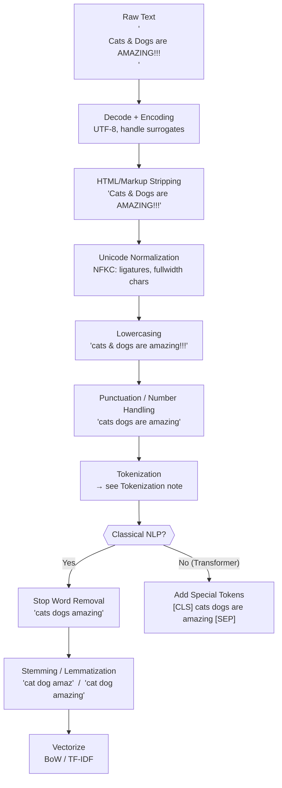

# 🧹 Text Preprocessing

> [!abstract] TL;DR
> Text preprocessing transforms raw noisy text into clean, normalized input suitable for downstream models. For classical NLP (TF-IDF, n-grams), a full pipeline — lowercasing, stop words, stemming/lemmatization — is essential. For modern Transformers, preprocessing is minimal (just quality filtering and tokenization), but data quality at scale is arguably the most important factor in model performance.

## Intuition — analogy FIRST

A chef does mise en place — washing, peeling, chopping — before cooking. The better the prep, the better the dish, regardless of cooking skill. Text preprocessing is mise en place for NLP. The difference: classical models are very sensitive to surface form variations ("Run" ≠ "run" ≠ "running"), while modern Transformers have learned enough statistical mass to handle variation — but they cannot learn from garbage data.

The central tension: **more aggressive preprocessing → smaller vocabulary, less noise → BUT potentially removes signal**. "NOT good" with stop word removal becomes "good" — dangerous for sentiment analysis. The right level of preprocessing depends entirely on the task and model family.

## How It Works



## Key Concepts / Details

### Lowercasing

Convert all text to lowercase. Simple but effective for vocabulary reduction.

- **When to skip**: named entity recognition ("Apple" company vs "apple" fruit), case-sensitive domains (bioinformatics gene names: TP53 vs tp53)
- All classical models: always lowercase
- BERT uncased: lowercase input; BERT cased: preserve case

### Stop Word Removal

Function words ("the", "is", "at", "which", "who") carry little content meaning and inflate vocabulary.

- **Classical NLP (TF-IDF, BoW)**: remove stop words — they get near-zero IDF anyway, so removal is redundant but speeds up processing
- **Modern Transformers**: do NOT remove — models use function words for grammatical parsing
- **Sentiment analysis**: negations ("not", "no", "never") are stop words in NLTK — removing them destroys sentiment signal

### Stemming vs Lemmatization

| | Stemming | Lemmatization |
|-|----------|---------------|
| Method | Heuristic suffix stripping (rule-based) | Morphological analysis via dictionary (WordNet) |
| Output | Word stem (may not be a real word) | Valid dictionary form (lemma) |
| Accuracy | Lower ("better" → "better", "studies" → "studi") | Higher ("better" → "good", "running" → "run") |
| Speed | Very fast (regex rules) | Slower (dictionary lookup) |
| POS aware | No | Yes ("meeting" → "meet" as verb, "meeting" as noun) |
| Best for | Information retrieval (fast, approximate) | QA, semantic tasks (accurate) |

**Porter Stemmer examples:**
- "running" → "run", "studies" → "studi", "generously" → "generous", "presumably" → "presum"

**spaCy Lemmatizer examples:**
- "running" → "run", "better" → "good", "geese" → "goose", "am" → "be"

### POS Tagging

Assigns grammatical role to each token: NN (noun), VBZ (verb present 3rd singular), JJ (adjective), RB (adverb)...

- Required for lemmatization (the right lemma depends on POS)
- Input to dependency parsing, named entity recognition, coreference resolution
- spaCy's tagger runs at ~25K sentences/sec on CPU

### Sentence Boundary Detection

Non-trivial: "Dr. Smith went to Washington D.C." has four periods, zero sentence boundaries.
- Punkt algorithm (NLTK) handles abbreviations
- spaCy uses a learned sentencizer

### Modern LLM Preprocessing: Data Quality at Scale

For training large models (GPT, LLaMA, BERT), preprocessing is aggressive at the *data curation* level but minimal at the *model input* level:

**Document-level quality filtering:**
1. **Language detection**: fastText langdetect at the document level — filter non-target languages
2. **Perplexity-based filtering**: score each document with a small n-gram LM (KenLM); discard documents with perplexity > threshold (captures garbage text, boilerplate, random characters)
3. **Length filtering**: remove documents shorter than 200 words (CC-Net threshold)
4. **Repetition filtering**: remove documents where top-10 n-grams account for >30% of text (copied/spammed content)

**Deduplication — essential and underrated:**
1. **URL-level**: deduplicate Common Crawl by canonical URL (catches exact duplicate pages)
2. **Document-level**: exact hash (SHA-256 on normalized text) — removes exact copies
3. **Near-deduplication (fuzzy)**: MinHash LSH — locality-sensitive hashing approximates Jaccard similarity; remove documents with Jaccard ≥ 0.8 against any seen document
   - MinHash: generate k=128 hash functions; min-hash of a document's shingled n-grams; compare across documents in candidate buckets
4. **Paragraph/sentence-level**: filter repeated passages across documents (C4, FineWeb)

**HTML and markup stripping**: `trafilatura`, `jusText`, `resiliparse` — more sophisticated than BeautifulSoup for web text.

**Encoding normalization**: NFKC Unicode normalization collapses ligatures (fi → fi), fullwidth characters (Ａ → A), and compatibility variants.

## Real-World Notes

- The quality of pretraining data explains more variance in LLM performance than model architecture choices of similar scale — see FineWeb, RefinedWeb, Dolma papers
- Deduplication alone improves downstream performance by 10–20% on benchmarks, by reducing memorization and increasing token diversity
- spaCy's `nlp.pipe()` batching is critical for throughput — processing documents one-by-one is 10-50x slower
- MinHash LSH (via `datasketch` library) is the standard industrial dedup tool — runs on petabyte Common Crawl dumps in hours on a cluster

## Common Pitfalls

1. **Removing stop words for Transformers**: "not good" → "good" is a catastrophic sentiment flip. Never strip stop words before feeding a neural model.
2. **Using Porter stemmer instead of lemmatizer for semantic tasks**: "studi" is not a valid word; downstream models trained on clean text cannot use it.
3. **Skipping deduplication in LLM training data**: models overfit to duplicated content, memorize it verbatim, and waste capacity.
4. **Encoding errors silently corrupting text**: always decode with `errors='replace'` or validate UTF-8 before processing at scale.
5. **Applying lowercasing to URLs and file paths**: destroys them.

## Code Demo

```python
import spacy
import re
from nltk.stem import PorterStemmer
from nltk.corpus import stopwords

nlp = spacy.load("en_core_web_sm")

def classical_preprocess(text: str) -> list[str]:
    """Full classical NLP pipeline: normalize → tokenize → stop words → lemmatize."""
    # 1. Lowercase + strip HTML
    text = re.sub(r"<[^>]+>", " ", text.lower())
    # 2. Normalize whitespace
    text = re.sub(r"\s+", " ", text).strip()
    # 3. spaCy pipeline
    doc = nlp(text)
    stop_words = set(stopwords.words("english"))
    tokens = [
        token.lemma_
        for token in doc
        if token.is_alpha                      # alphabetic only
        and token.text not in stop_words       # not a stop word
        and len(token.text) > 2               # min length
    ]
    return tokens

def modern_preprocess(text: str) -> str:
    """Minimal pipeline for Transformer input: strip markup, normalize unicode."""
    import unicodedata
    text = re.sub(r"<[^>]+>", " ", text)                   # strip HTML
    text = unicodedata.normalize("NFKC", text)              # Unicode normalize
    text = re.sub(r"\s+", " ", text).strip()
    return text

sample = "<p>The running cats and dogs ARE not amazingly fast!!!</p>"

print("Classical:", classical_preprocess(sample))
# ['run', 'cat', 'dog', 'amazingly', 'fast']  ← negation removed (pitfall!)

print("Modern:   ", modern_preprocess(sample))
# 'The running cats and dogs ARE not amazingly fast!!!'

# POS tags
doc = nlp("The cats are running fast")
for token in doc:
    print(f"{token.text:<12} POS={token.pos_:<6} LEMMA={token.lemma_}")
# The          POS=DET    LEMMA=the
# cats         POS=NOUN   LEMMA=cat
# are          POS=AUX    LEMMA=be
# running      POS=VERB   LEMMA=run
# fast         POS=ADV    LEMMA=fast
```

## Related Concepts

- [[Tokenization]] — the next pipeline stage after preprocessing
- [[TF_IDF_Classical]] — classical vectorization; benefits most from aggressive preprocessing
- [[Word_Embeddings]] — embeddings trained on clean, deduplicated corpora are higher quality
- [[Language_Model_Basics]] — n-gram LMs are used for perplexity-based quality filtering

## Review Questions

1. You are building a sentiment classifier using TF-IDF + logistic regression. Your colleague suggests removing all stop words to reduce dimensionality. What is the key risk, and how would you mitigate it?
2. Describe exactly how MinHash LSH detects near-duplicate documents without comparing every pair. What is the time complexity improvement?
3. "Studies" → "studi" (Porter) vs "studies" → "study" (lemmatizer). In an information retrieval system, which is better and why?
4. You scrape a million web pages and notice the LLM trained on them is generating repetitive boilerplate phrases. Which deduplication strategy would you apply first?
5. Why is NFKC normalization recommended over NFC for NLP preprocessing?

## Sources

- Bird et al., *Natural Language Processing with Python* (NLTK book) — Chapters 3–4
- Manning et al., *Introduction to Information Retrieval* — Chapter 2 (text preprocessing for IR)
- Wenzek et al. (2020), *CCNet: Extracting High Quality Monolingual Datasets from Web Crawl Data* — perplexity filtering
- Penedo et al. (2023), *The RefinedWeb Dataset for Falcon LLM* — deduplication at scale
- Soldaini et al. (2024), *Dolma: An Open Corpus of Three Trillion Tokens for Language Model Pretraining*

#nlp #nlp-fundamentals #beginner
