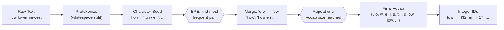

# 🔤 Tokenization

> [!abstract] TL;DR
> Tokenization converts raw text into a sequence of integer IDs that a model can consume. Modern models use subword tokenization (BPE or WordPiece) to balance vocabulary size against coverage, handling rare and unseen words without an explicit OOV token.

## Intuition — analogy FIRST

Think of a tokenizer as a shared codebook between you and a language model. Before you can send a message, you look up each word (or word-piece) in the codebook and write down its page number. The model only ever sees the page numbers — never the original text. Every design choice (character vs word vs subword) is really about how to design that codebook: too small and you lose expressiveness; too large and rare entries never get learned.

A word-level codebook of English needs ~170K entries (all unique words in Wikipedia) — and still fails on "ChatGPT" the day it's coined. A character-level codebook needs only ~100 entries but makes sequences absurdly long. Subword tokenization is the compromise: ~30K–100K entries, handles new words by falling back to smaller pieces.

## How It Works



**BPE merge trace on "low lower newest widest":**

| Step | Vocab / Pairs | Most Frequent | After Merge |
|------|--------------|---------------|-------------|
| Init | l·o·w, l·o·w·e·r, n·e·w·e·s·t, w·i·d·e·s·t | (e, s) | l·o·w, l·o·w·e·r, n·e·w·es·t, w·i·d·es·t |
| 2 | — | (es, t) | l·o·w, l·o·w·e·r, n·e·w·est, w·i·d·est |
| 3 | — | (l, o) | lo·w, lo·w·e·r, n·e·w·est, w·i·d·est |
| 4 | — | (lo, w) | low, low·e·r, n·e·w·est, w·i·d·est |

## Key Concepts / Details

### Why Not Word Tokenization?

- **OOV explosion**: any word not in training vocabulary becomes `<UNK>` — catastrophic for proper nouns, code, URLs, new terminology
- **Vocabulary explosion**: morphologically rich languages (Finnish, Turkish) generate millions of word forms from a small root set
- **No sharing**: "run", "runs", "running", "ran" share no representation despite obvious relatedness

### Subword Algorithms

**Byte Pair Encoding (BPE)**
- Initialize vocabulary with all characters (+ byte fallback for Unicode)
- Iteratively find the most frequent adjacent pair and merge it into a new token
- Stop when vocabulary reaches target size (GPT-2: 50,257; GPT-4: ~100K)
- Greedy, deterministic — same text always tokenizes the same way
- Used by: GPT family, RoBERTa, BART

**WordPiece**
- Same iterative merge strategy as BPE, but selects merges that maximize language model likelihood on a training corpus rather than raw frequency
- Continuation sub-tokens prefixed with `##`: "unhappy" → `["un", "##happy"]`
- Used by: BERT, DistilBERT, ELECTRA

**SentencePiece**
- Language-independent: treats the raw byte stream directly; whitespace encoded as `▁` (U+2581)
- Wraps either BPE or Unigram LM as the underlying algorithm
- No language-specific pretokenization needed — handles CJK, Arabic, etc. uniformly
- Used by: T5, XLNet, ALBERT, LLaMA

**Unigram Language Model Tokenizer**
- Starts with a large vocabulary and *prunes* it: remove the token whose removal least decreases corpus log-likelihood
- Probabilistic: can assign probabilities to multiple segmentations (useful for data augmentation)
- Used inside SentencePiece when `--model_type=unigram`

### Special Tokens

| Token | Used By | Purpose |
|-------|---------|---------|
| `[CLS]` | BERT | Classification head input |
| `[SEP]` | BERT | Segment boundary |
| `[PAD]` | BERT | Pad to equal length in batch |
| `[MASK]` | BERT | Masked language modeling |
| `<\|endoftext\|>` | GPT-2 | Document boundary |
| `<s>`, `</s>` | RoBERTa, T5 | Begin / end of sequence |
| `▁` | SentencePiece | Word-initial whitespace |

### Tokenizer Comparison

| Property | BPE | WordPiece | SentencePiece | Unigram LM |
|----------|-----|-----------|---------------|------------|
| Merge criterion | Frequency | LM likelihood | Either | LM likelihood |
| Continuation marker | None (space-prefix) | `##` prefix | `▁` prefix | `▁` prefix |
| Language agnostic | Needs pretokenizer | Needs pretokenizer | Yes | Yes |
| Deterministic | Yes | Yes | Yes | No (probabilistic) |
| OOV handling | Byte fallback | `[UNK]` | Byte fallback | Always segments |
| Representative model | GPT-2 | BERT | T5, LLaMA | ALBERT |

## Real-World Notes

- Vocabulary size is a hyperparameter: larger → fewer tokens per sentence (faster) but larger embedding table
- Multilingual tokenizers (mBERT: 110K WordPiece; XLM-R: 250K SentencePiece) must allocate capacity across 100+ languages — low-resource languages get undertokenized
- LLaMA tokenizes code more efficiently than GPT-3 because its BPE was trained on code-heavy data
- Tokenization is *not* reversible without the original text — "detokenization" requires the tokenizer's decode method

## Common Pitfalls

1. **Counting tokens != counting words**: `len(text.split())` ≠ `len(tokenizer(text)["input_ids"])`. Always use the tokenizer to estimate costs.
2. **Forgetting special tokens in length budget**: BERT's 512-token limit includes `[CLS]` + `[SEP]` — max passage length is 510.
3. **Mixing tokenizers across models**: using a GPT-2 tokenizer to preprocess data for BERT silently corrupts inputs.
4. **Off-by-one in span annotations**: character offsets from spaCy do not align with subword token offsets — use `return_offsets_mapping=True`.

## Code Demo

```python
from transformers import AutoTokenizer

sentence = "The biochemistry professor's pre-existing research is unparalleled."

# BERT — WordPiece
bert_tok = AutoTokenizer.from_pretrained("bert-base-uncased")
bert_out = bert_tok(sentence)
print("BERT tokens:", bert_tok.convert_ids_to_tokens(bert_out["input_ids"]))
# ['[CLS]', 'the', 'bio', '##chemistry', 'professor', "'", 's', 'pre', '-',
#  'existing', 'research', 'is', 'un', '##para', '##lleled', '.', '[SEP]']

# GPT-2 — BPE
gpt2_tok = AutoTokenizer.from_pretrained("gpt2")
gpt2_out = gpt2_tok(sentence)
print("GPT-2 tokens:", gpt2_tok.convert_ids_to_tokens(gpt2_out["input_ids"]))
# ['The', 'Ġbiochemistry', 'Ġprofessor', "'s", 'Ġpre', '-', 'existing',
#  'Ġresearch', 'Ġis', 'Ġunparalleled', '.']

# T5 — SentencePiece BPE
t5_tok = AutoTokenizer.from_pretrained("t5-small")
t5_out = t5_tok(sentence)
print("T5 tokens:", t5_tok.convert_ids_to_tokens(t5_out["input_ids"]))
# ['▁The', '▁bio', 'chemistry', '▁professor', "'", 's', '▁pre', '-', 'existing',
#  '▁research', '▁is', '▁un', 'para', 'lleled', '.', '</s>']

print(f"\nToken counts — BERT: {len(bert_out['input_ids'])}, "
      f"GPT-2: {len(gpt2_out['input_ids'])}, T5: {len(t5_out['input_ids'])}")
```

## Related Concepts

- [[Text_Preprocessing]] — preprocessing happens before tokenization in the pipeline
- [[Word_Embeddings]] — tokenizer output IDs are looked up in an embedding table
- [[Language_Model_Basics]] — tokenized sequences are what language models operate on

## Review Questions

1. Why does WordPiece use `##` continuation markers while BPE uses a space prefix — what does each choice reveal about the algorithm's design?
2. You are deploying a model for Turkish text. Turkish is agglutinative (words can have dozens of suffixes). Which tokenizer algorithm is most appropriate and why?
3. A BERT model has a 512-token limit. A document is 500 words. Is it guaranteed to fit? Explain.
4. What is the difference between the BPE merge criterion and the Unigram LM pruning criterion?
5. Your annotation tool provides character-level span offsets. How do you align these to WordPiece token indices?

## Sources

- Sennrich et al. (2016), *Neural Machine Translation of Rare Words with Subword Units* — original BPE paper
- Schuster & Nakamura (2012), *Japanese and Korean Voice Search* — WordPiece original
- Kudo & Richardson (2018), *SentencePiece: A simple and language independent subword tokenizer*
- Kudo (2018), *Subword Regularization: Improving Neural Network Translation Models with Multiple Subword Candidates* — Unigram LM
- HuggingFace Tokenizers docs: https://huggingface.co/docs/tokenizers

#nlp #nlp-fundamentals #beginner
