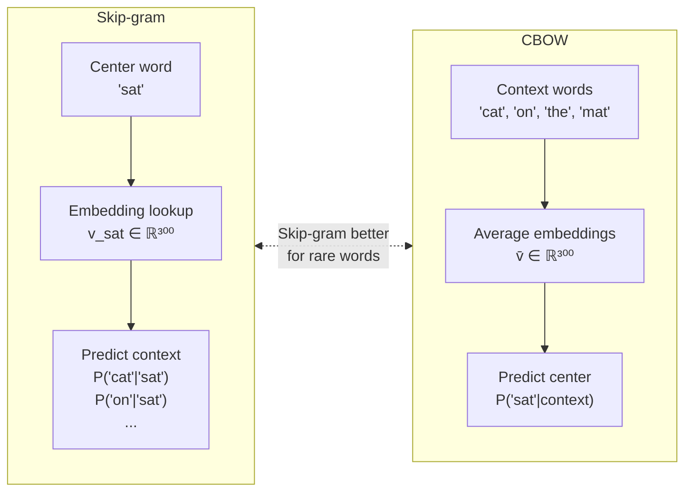

# 🧬 Word Embeddings

> [!abstract] TL;DR
> Word embeddings are dense, low-dimensional vectors (d ≈ 100–300) learned from large corpora. Words with similar meaning cluster together in vector space, enabling arithmetic: king − man + woman ≈ queen. Word2Vec, GloVe, and FastText are the three classical families. Their core limitation — one static vector per word — is resolved by contextual embeddings (ELMo, BERT) in later sections.

## Intuition — analogy FIRST

In TF-IDF, "dog" and "canine" are completely unrelated — different dimensions, zero overlap. A human knows they're synonyms. Word embeddings learn a map of semantic space from co-occurrence patterns: if "dog" and "canine" appear in the same kinds of sentences, their vectors end up close together. The map is geometric: direction and distance carry meaning. "Paris − France + Italy" lands near "Rome". The model never explicitly learns geography — it falls out of the distributional statistics.

The distributional hypothesis (Harris 1954): *words that occur in similar contexts have similar meanings.*

## How It Works

### Word2Vec — Two Architectures



**Skip-gram with Negative Sampling (SGNS) — the key training objective:**

$$J = \sum_{(w, u) \in D^+} \log \sigma(v_u^T v_w) + k \cdot \mathbb{E}_{v_{\text{neg}} \sim P_n} \left[\log \sigma(-v_u^T v_{\text{neg}})\right]$$

- D⁺: observed (word, context) pairs in the corpus
- k negative samples drawn from the unigram distribution P_n(w) ∝ freq(w)^{3/4}
- σ: sigmoid — push positive pairs together, push negative pairs apart
- No full softmax over vocabulary needed — scales to billions of words

**Key hyperparameters**: window size = 5, d = 300, negative samples k = 5–20, subsampling threshold = 10⁻⁵

### GloVe (Global Vectors)

Instead of local context windows, GloVe factors the entire word-word co-occurrence matrix X:

$$J = \sum_{i,j=1}^{|V|} f(X_{ij}) \left( w_i^T \tilde{w}_j + b_i + \tilde{b}_j - \log X_{ij} \right)^2$$

- f(x): weighting function — caps contribution of very frequent co-occurrences; f(x) = (x/x_max)^α, α = 0.75
- Two sets of vectors (w and w̃) — use their sum as the final embedding
- Captures global statistics Word2Vec misses with local windows
- Training is faster than Word2Vec on large corpora (parallelizable)

### FastText (Facebook Research, 2017)

Key insight: represent each word as the **sum of its character n-gram embeddings**:

$$v_{\text{word}} = \sum_{g \in \mathcal{G}(w)} z_g$$

where G(w) = set of character n-grams (typically n=3–6) in word w, plus the whole word itself.

Example: "where" → {`<wh`, `whe`, `her`, `ere`, `re>`, `<whe`, ..., `<where>`}

Benefits:
- **OOV handling**: any new word is decomposed into known n-grams
- **Morphology**: "running", "runner", "runs" share n-gram subvectors
- Especially strong for morphologically rich languages (German, Finnish, Turkish) and social media text

### Evaluation

**Intrinsic — Analogy Tasks (Google Analogy Dataset, 19,544 questions):**

$$\text{king} - \text{man} + \text{woman} \approx \text{queen}$$

Evaluated by: argmax cosine_sim(v_king − v_man + v_woman, v_?) excluding the query words.

**Intrinsic — Word Similarity:**
- SimLex-999: 999 human-annotated word pairs (strict similarity, not association)
- WordSim-353: 353 word pairs (conflates similarity and relatedness)
- Correlation of model cosine similarities with human judgments (Spearman ρ)

**Extrinsic**: downstream task performance (NER, POS tagging, sentiment) — more meaningful but harder to attribute.

### Embedding Comparison

| Property | Word2Vec (SG) | GloVe | FastText | ELMo | BERT |
|----------|--------------|-------|---------|------|------|
| Context used | Local window | Global co-occurrence | Local window | Full sentence (LSTM) | Full sentence (Transformer) |
| OOV handling | No | No | Yes (char n-grams) | Yes (char CNN) | Yes (subword) |
| Polysemy | No | No | No | Partial | Yes |
| Training speed | Fast | Fast | Fast | Slow | Very slow |
| Vector type | Static | Static | Static | Contextual | Contextual |
| Analogy performance | Strong | Strong | Moderate | — | — |
| Best use case | Lightweight deploy | Pretrained download | Morphological languages | NER, POS | Everything |

## Real-World Notes

- GloVe 840B (trained on 840B Common Crawl tokens, d=300) is a strong general-purpose download — often a solid baseline
- Word2Vec embeddings from 2013 are still used in lightweight production NLP systems where BERT inference cost is prohibitive
- FastText is the recommended choice whenever your text has significant OOV: social media, medical texts, code, multilingual corpora
- Facebook's fastText library provides pretrained vectors for 157 languages

## Common Pitfalls

1. **Polysemy blind spot**: "bank" (financial) and "bank" (river bank) get one vector — the average of their contexts. Contextual embeddings (BERT) fix this.
2. **Analogies work less well than advertised**: the king−man+woman=queen result is brittle; many analogy categories fail for rare words
3. **Bias encoded in embeddings**: Word2Vec trained on Google News encodes gender stereotypes ("doctor"≈"man", "nurse"≈"woman") — a known deployment concern
4. **Adding pretrained embeddings to small datasets**: fine-tuning them can overfit; freezing or using them only for initialization are common strategies

## Code Demo

```python
import gensim.downloader as api
import numpy as np

# Load pretrained GloVe vectors (will download ~66MB on first run)
model = api.load("glove-wiki-gigaword-100")  # 400K words, d=100

# Semantic similarity
print("Similarity(king, queen) =", model.similarity("king", "queen"))   # ~0.75
print("Similarity(king, banana) =", model.similarity("king", "banana")) # ~0.19

# Analogy: king - man + woman
result = model.most_similar(positive=["king", "woman"], negative=["man"], topn=3)
print("king - man + woman:", result)
# [('queen', 0.85), ('throne', 0.72), ('princess', 0.71)]

# Country-capital analogy
result = model.most_similar(positive=["paris", "italy"], negative=["france"], topn=1)
print("paris - france + italy:", result)  # [('rome', 0.79)]

# Train Word2Vec from scratch on custom corpus
from gensim.models import Word2Vec

sentences = [
    ["the", "cat", "sat", "on", "the", "mat"],
    ["the", "dog", "sat", "on", "the", "log"],
    ["cats", "and", "dogs", "are", "pets"],
]
w2v = Word2Vec(sentences, vector_size=50, window=3, min_count=1,
               sg=1,       # 1=Skip-gram, 0=CBOW
               negative=5, # negative samples
               epochs=100)
print("Vocab:", list(w2v.wv.key_to_index.keys()))
print("sim(cat, dog):", w2v.wv.similarity("cat", "dog"))
```

## Related Concepts

- [[Tokenization]] — the tokenizer's vocabulary determines which tokens get embeddings
- [[TF_IDF_Classical]] — the sparse alternative; word embeddings encode semantics TF-IDF misses
- [[Language_Model_Basics]] — neural LMs use an embedding lookup as their first layer

## Review Questions

1. Skip-gram and CBOW are both Word2Vec architectures. Which is better for rare words, and why does the training task difference cause this?
2. GloVe and Word2Vec both produce similar quality embeddings empirically. What is the fundamental algorithmic difference in how they use co-occurrence information?
3. FastText can generate a vector for "antidisestablishmentarianism" even if it never appeared in training. Explain exactly how.
4. You train a sentiment classifier using frozen GloVe embeddings and get 88% accuracy. A colleague trains the same architecture with fine-tuned embeddings and gets 86%. Explain why fine-tuning might hurt.
5. The embedding for "bank" in a Word2Vec model trained on financial news will differ from one trained on general news. Describe qualitatively how the nearest neighbors will differ.

## Sources

- Mikolov et al. (2013), *Efficient Estimation of Word Representations in Vector Space* — Word2Vec
- Mikolov et al. (2013), *Distributed Representations of Words and Phrases and their Compositionality* — negative sampling
- Pennington et al. (2014), *GloVe: Global Vectors for Word Representation*
- Bojanowski et al. (2017), *Enriching Word Vectors with Subword Information* — FastText
- Levy & Goldberg (2014), *Neural Word Embedding as Implicit Matrix Factorization* — connects Word2Vec and PMI factorization

#nlp #nlp-fundamentals #intermediate
