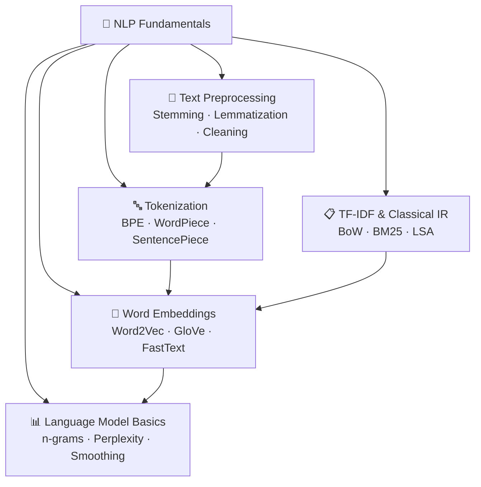

# 📝 NLP Fundamentals — Map of Content

> [!abstract] TL;DR
> NLP begins with the question: how do we turn raw text into numbers a model can process? This section covers the full text representation pipeline — tokenization (converting text to subword tokens), classical bag-of-words models (TF-IDF), n-gram language models, and dense word embeddings (Word2Vec, GloVe, FastText). These representations feed into every model in later sections. Understanding their trade-offs (sparse vs dense, static vs contextual) is essential for choosing the right approach.

## Section Overview

Text is discrete, variable-length, and symbolic. Neural networks require fixed-size numeric tensors. The entire field of NLP is built on the gap between these two facts. This section covers every layer of the bridge — from the lowest-level character splitting up to dense semantic vector spaces.

The journey goes:
1. **Clean the text** → [[Text_Preprocessing]] — normalize, detect language, remove noise
2. **Segment into tokens** → [[Tokenization]] — decide what the atomic units are
3. **Build sparse representations** → [[TF_IDF_Classical]] — count-based, interpretable, fast
4. **Model sequence probability** → [[Language_Model_Basics]] — n-grams, perplexity, generation
5. **Build dense representations** → [[Word_Embeddings]] — semantic geometry, analogies, OOV

## Section Map



## Notes in This Section

| File | Topic | Difficulty | Key Takeaway |
|------|-------|------------|--------------|
| [[Text_Preprocessing]] | Cleaning, normalization, deduplication | Beginner | Modern LLMs need minimal preprocessing — but data quality is everything |
| [[Tokenization]] | BPE, WordPiece, SentencePiece | Beginner | Subword tokenization balances vocabulary size against coverage |
| [[Language_Model_Basics]] | n-grams, perplexity, sampling | Beginner | A language model is just a probability distribution over sequences |
| [[TF_IDF_Classical]] | BoW, TF-IDF, BM25, cosine similarity | Beginner | Still the best baseline for retrieval in many production systems |
| [[Word_Embeddings]] | Word2Vec, GloVe, FastText | Intermediate | Dense vectors encode semantic relationships geometrically |

## Key Trade-offs

### Sparse vs Dense

| Dimension | Sparse (TF-IDF) | Dense (Word2Vec/GloVe) |
|-----------|----------------|----------------------|
| Interpretability | High — each dim is a word | Low — dims are latent |
| Semantic similarity | Only exact match | Generalizes across synonyms |
| Training data needed | None (unsupervised counting) | Large corpus |
| Storage | High (vocabulary-sized vectors) | Low (d=300) |
| OOV handling | Fails silently | FastText handles via char n-grams |

### Static vs Contextual

Static embeddings (Word2Vec, GloVe): one vector per word regardless of context.
Contextual embeddings (ELMo, BERT): vector depends on surrounding sentence — covered in Section 03.

## Prerequisites

No ML prerequisites. Helpful to know:
- Basic probability (joint probability, conditional probability)
- Linear algebra (dot product, matrix multiplication, SVD at high level)
- Python (NumPy, basic corpus iteration)

## Learning Path

```
Text_Preprocessing → Tokenization → Language_Model_Basics → TF_IDF_Classical → Word_Embeddings
```

Work through in this order. Each note is self-contained but concepts compound.

## Real-World Notes

- TF-IDF + BM25 still power Elasticsearch, Lucene, and most search engines in production
- GPT tokenizers (BPE at 50K vocab) and BERT tokenizers (WordPiece at 30K) are the two dominant families
- Word2Vec embeddings trained in 2013 are still used in lightweight production systems
- Preprocessing decisions made at dataset creation time are extremely hard to change later

## Common Pitfalls in This Section

1. **Conflating tokenization with preprocessing** — they are separate pipeline stages
2. **Assuming lower perplexity always wins** — evaluate downstream task performance
3. **Using TF-IDF without BM25 for retrieval** — BM25 is almost always better
4. **Static embeddings for polysemous words** — "bank" gets one vector for both meanings

## Cross-Section Connections

- Section 02 (Transformers): tokenizer output is the direct input to embedding layers
- Section 03 (BERT): WordPiece tokenizer; contextual embeddings replace static Word2Vec
- Section 05 (Information Retrieval): TF-IDF/BM25 form the sparse leg of hybrid retrieval
- Section 07 (LLM Internals): BPE tokenizer analysis, vocabulary design choices

## Sources

- Jurafsky & Martin, *Speech and Language Processing* (3rd ed.) — Chapters 2, 3, 6
- Mikolov et al. (2013), *Efficient Estimation of Word Representations in Vector Space*
- Sennrich et al. (2016), *Neural Machine Translation of Rare Words with Subword Units* (BPE)
- Robertson & Zaragoza (2009), *The Probabilistic Relevance Framework: BM25 and Beyond*

#MOC #nlp #nlp-fundamentals
