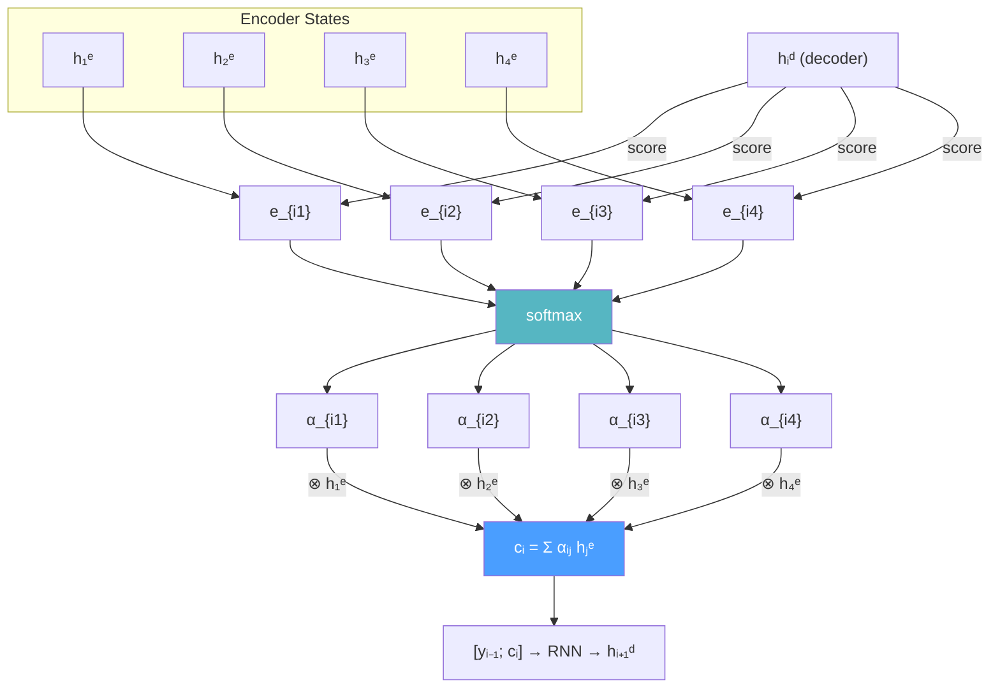

# 🎯 Attention Mechanism (Seq2Seq)

> [!abstract] TL;DR
> Attention solves the seq2seq bottleneck by letting the decoder dynamically query all encoder hidden states at each generation step rather than relying on a single fixed context vector. Bahdanau (2015) introduced additive attention with a small feedforward scoring network; Luong (2015) proposed multiplicative (dot-product) variants that are faster and generalize to the Transformer's scaled dot-product attention. Attention alignment visualizations provide interpretable evidence of what the model is "looking at" when producing each output token.

## Intuition — analogy FIRST

Imagine translating with a physical dictionary open on your desk. Instead of trying to memorize the entire French paragraph before translating, you translate one English word at a time and selectively look back at the French words most relevant to the current English word. "she" → look at French subject; "runs" → look at French verb. This selective, dynamic lookup is exactly what attention does. The "attention weights" αᵢⱼ tell you how much word j in the source the model "looks at" when generating word i in the target.

## How It Works

**Bahdanau attention (additive, 2015):**

1. **Alignment score:** eᵢⱼ = vₐᵀ tanh(Wₐhᵢᵈ + Uₐhⱼᵉ)
   - hᵢᵈ = decoder hidden state at step i
   - hⱼᵉ = encoder hidden state at position j
   - Wₐ, Uₐ, vₐ = learned parameters of a small FF alignment network
   - Computed for every (i, j) pair

2. **Attention weights:** αᵢⱼ = softmax(eᵢⱼ) over all source positions j
   - αᵢⱼ ≥ 0, ∑ⱼ αᵢⱼ = 1 (soft probability distribution over source)

3. **Context vector:** cᵢ = ∑ⱼ αᵢⱼ hⱼᵉ (weighted sum of all encoder states)

4. **Decoder input at step i:** concatenate [yᵢ₋₁; cᵢ] before RNN step
   - hᵢᵈ = RNN(hᵢ₋₁ᵈ, [yᵢ₋₁; cᵢ])



## Key Concepts / Details

**Luong attention (multiplicative, 2015):**

Three score functions proposed:
| Name | Score formula | Notes |
|------|--------------|-------|
| Dot | eᵢⱼ = hᵢᵈᵀhⱼᵉ | No parameters; requires same dimension |
| General | eᵢⱼ = hᵢᵈᵀ Wₐ hⱼᵉ | Wₐ is learned; allows different dims |
| Concat | eᵢⱼ = vᵀ tanh(Wₐ[hᵢᵈ; hⱼᵉ]) | Essentially same as Bahdanau |

**Luong vs Bahdanau timing:**
- Bahdanau: compute attention **before** the RNN step (attention informs hidden state)
- Luong: compute attention **after** the RNN step (hidden state attends to source)
- Luong's input feeding: concatenate cᵢ with hᵢᵈ → feed into next decoder step; improves performance by giving decoder awareness of past attention decisions

**Alignment visualization:**
- Plot matrix of αᵢⱼ values: rows = target positions, columns = source positions
- Strong diagonal indicates monotonic alignment (common in MT for similar word-order languages)
- Off-diagonal attention reveals reordering (e.g., English adjective-noun vs French noun-adjective)
- Interpretability benefit: humans can verify the model focuses on sensible source words

**Attention for reading comprehension:**
- Attend over document D to answer question Q
- Question hidden state attends to document positions
- P(answer start/end) derived from attention weights over document tokens
- Example: BiDAF (Bi-Directional Attention Flow) uses both D→Q and Q→D attention

**Self-attention (preview to Transformers):**
- Instead of attending from decoder to encoder, attend from each position in a sequence to all other positions in **the same** sequence
- eᵢⱼ = hᵢᵀhⱼ (within-sequence dot product)
- Captures long-range within-sequence dependencies without recurrence
- Core mechanism of the Transformer — parallelizable unlike RNN-based attention

**Global vs local attention (Luong et al.):**
- Global: attention over **all** source positions (standard)
- Local: attention over a window [pₜ - D, pₜ + D] around predicted alignment position pₜ
- Local is O(window) rather than O(source length) — useful for very long sequences

**Hard attention:**
- Sample a single source position rather than computing soft weighted sum
- Non-differentiable → must train with REINFORCE (high variance)
- Not standard; used in some visual attention models
- Soft attention is always preferred in NLP for end-to-end gradient flow

**Coverage mechanism:**
- φₜ = ∑ᵢ₌₀ᵗ⁻¹ αᵢ (accumulated attention over all previous steps)
- Add coverage penalty to attention score: eᵢⱼ ← eᵢⱼ + wc · φₜ[j]
- Discourages attending to already-heavily-attended source positions
- Reduces repetition; important for summarization

**PyTorch attention layer:**
```python
import torch
import torch.nn as nn
import torch.nn.functional as F

class BahdanauAttention(nn.Module):
    """Additive attention (Bahdanau 2015)."""
    def __init__(self, dec_hidden, enc_hidden):
        super().__init__()
        self.Wa = nn.Linear(dec_hidden, dec_hidden, bias=False)
        self.Ua = nn.Linear(enc_hidden, dec_hidden, bias=False)
        self.va = nn.Linear(dec_hidden, 1, bias=False)

    def forward(self, dec_hidden, enc_outputs):
        """
        dec_hidden:  (B, dec_H)
        enc_outputs: (B, T_src, enc_H)
        Returns: context (B, enc_H), weights (B, T_src)
        """
        # Expand decoder hidden to broadcast over source positions
        dec_h = self.Wa(dec_hidden).unsqueeze(1)     # (B, 1, dec_H)
        enc_h = self.Ua(enc_outputs)                  # (B, T, dec_H)
        scores = self.va(torch.tanh(dec_h + enc_h))   # (B, T, 1)
        weights = F.softmax(scores.squeeze(-1), dim=1) # (B, T)
        context = torch.bmm(weights.unsqueeze(1),
                            enc_outputs).squeeze(1)   # (B, enc_H)
        return context, weights

class LuongAttention(nn.Module):
    """General multiplicative attention (Luong 2015)."""
    def __init__(self, dec_hidden, enc_hidden):
        super().__init__()
        self.Wa = nn.Linear(enc_hidden, dec_hidden, bias=False)

    def forward(self, dec_hidden, enc_outputs):
        # dec_hidden: (B, H), enc_outputs: (B, T, enc_H)
        proj = self.Wa(enc_outputs)                   # (B, T, H)
        scores = torch.bmm(proj,
                           dec_hidden.unsqueeze(2)).squeeze(-1)  # (B, T)
        weights = F.softmax(scores, dim=1)            # (B, T)
        context = torch.bmm(weights.unsqueeze(1),
                            enc_outputs).squeeze(1)   # (B, enc_H)
        return context, weights
```

**Bahdanau vs Luong comparison:**

| Property | Bahdanau (Additive) | Luong (Multiplicative) |
|----------|--------------------|-----------------------|
| Score function | vᵀ tanh(Wh + Uh) | hᵈᵀ W hᵉ or dot product |
| Parameters | Wₐ, Uₐ, vₐ | Wₐ (or none for dot) |
| Attention timing | Before RNN step | After RNN step |
| Input feeding | Not standard | Standard (concat context with next input) |
| Computational cost | Slightly higher | Slightly lower |
| Origin | ICLR 2015 | EMNLP 2015 |
| Transformer connection | Conceptually similar to Q+K projection | Dot product → scaled dot-product attention |

## Real-World Notes

- In practice, the Bahdanau vs Luong gap is small (< 1 BLEU point on most benchmarks). Architecture choice rarely matters as much as data quality, regularization, and hyperparameter tuning.
- Attention visualizations are widely used in academic papers to demonstrate model interpretability — but be cautious: high attention weight on a token does not necessarily mean the token is causally important for the output.
- For very long documents (> 512 tokens), full attention becomes O(n²) in memory; local/sparse attention variants are needed.
- Scaled dot-product attention in Transformers is Luong's dot attention with a 1/√d scaling factor to prevent softmax saturation at high dimensions.

## Common Pitfalls

- **Not masking padding tokens in attention:** softmax over padded positions assigns nonzero attention to padding; mask those positions to -∞ before softmax.
- **Confusing attention weights with importance:** attention is an internal routing mechanism, not a direct measure of feature importance. Do not use raw attention weights for interpretability without caveats.
- **Forgetting input feeding in Luong attention:** without feeding the context vector back into the next decoder step, the decoder cannot track which source regions it has already used.
- **Using hard attention for NLP:** hard attention requires REINFORCE training, which is high-variance and difficult to stabilize; soft attention is almost always the right choice.
- **Global attention on very long sequences:** O(T_src × T_tgt) cost; for documents > 1000 tokens, consider local attention windows or sparse attention.

## Related Concepts

- [[Seq2Seq_Encoder_Decoder]] — the architecture that attention augments; the bottleneck problem attention solves
- [[Beam_Search_Decoding]] — how the decoder uses attention weights during beam search
- [[LSTM_GRU]] — the RNN that computes hᵢᵈ and hⱼᵉ in the attention equations
- [[_MOC_Sequence_Models]] — section overview
- Section 03: Transformers — self-attention is a scaled, multi-head generalization of this mechanism

## Review Questions

1. What problem does attention solve that simply increasing the size of the LSTM hidden state cannot solve?
2. Derive the Bahdanau attention context vector cᵢ step-by-step from the alignment score eᵢⱼ. Why is softmax applied over j (source positions) rather than i (target positions)?
3. What is the difference between Bahdanau's "additive" and Luong's "multiplicative" (general) attention? Which is more similar to the Transformer's attention?
4. Why does Luong's "input feeding" technique improve translation quality?
5. How does the coverage mechanism prevent repetition, and why is this particularly important for summarization?

## Sources

- Bahdanau, D., Cho, K. & Bengio, Y. (2015). *Neural Machine Translation by Jointly Learning to Align and Translate*. ICLR. https://arxiv.org/abs/1409.0473
- Luong, T., Pham, H. & Manning, C. (2015). *Effective Approaches to Attention-based Neural Machine Translation*. EMNLP. https://arxiv.org/abs/1508.04025
- See, A., Liu, P. J. & Manning, C. (2017). *Get To The Point: Summarization with Pointer-Generator Networks*. ACL. (Coverage mechanism.)
- Seo, M. et al. (2017). *Bidirectional Attention Flow for Machine Comprehension*. ICLR. (BiDAF — attention for reading comprehension.)
- Jain, S. & Wallace, B. (2019). *Attention is not Explanation*. NAACL. (Interpretability caveats.)

#nlp #sequence-models #intermediate
