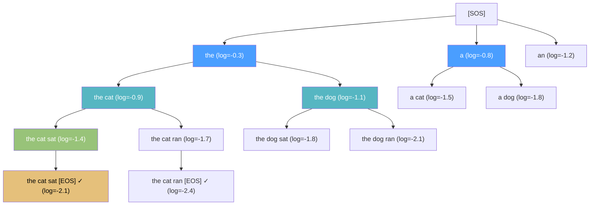

# 🔦 Beam Search and Decoding Strategies

> [!abstract] TL;DR
> At inference time, the decoder must convert a probability distribution over tokens into an actual output sequence. Greedy decoding is fast but suboptimal. Beam search maintains B candidate sequences simultaneously, achieving much better outputs at modest compute cost. For open-ended generation, sampling strategies (top-k, nucleus/top-p, temperature) produce more diverse and natural text than beam search. Length normalization, MBR decoding, and constrained decoding address specific failure modes.

## Intuition — analogy FIRST

Beam search is like a hiking group navigating a maze. Greedy decoding sends one hiker who always takes the locally best-looking corridor — often leads to dead ends. Beam search sends B hikers simultaneously, each taking a different path. When paths diverge, you keep only the B most promising ones measured by total path score so far, not just the last step. At the exit, you pick the hiker who accumulated the highest total score. More hikers (larger beam) → less likely to miss the best path, but exponentially more corridors to explore.

## How It Works

**Greedy decoding:**
- At each step t: ŷₜ = argmax P(yₜ | y<t, x)
- O(T × V) per sequence; V = vocabulary size
- Fast, deterministic, but makes irrecoverable local mistakes

**Beam search (beam size B):**

1. Initialize: B beams each starting with [SOS]
2. At each step, expand each of B beams with top-B vocabulary tokens → B² candidates
3. Score all B² candidates by **cumulative log-probability:**
   log P(y₁,...,yₜ) = ∑ᵢ₌₁ᵗ log P(yᵢ | y<i, x)
4. Keep top-B candidates → new set of B beams
5. A beam terminates when it generates [EOS] or reaches max_length
6. Final output: highest-scoring terminated beam



*Beam size B=2 at each level; only top-2 beams retained after each expansion.*

## Key Concepts / Details

**Length normalization:**
- Problem: longer sequences accumulate more log-probability terms → shorter sequences favored
- Fix: divide score by length with exponent α: score = log P(y) / |y|^α
- Typical α ∈ [0.6, 0.8]; α=0 gives raw score, α=1 gives plain average log-prob
- Google's production MT system uses α=0.6

**N-best list and reranking:**
- Keep top-N terminated beams (not just top-1)
- Rerank with a separate model: language model score, translation model score, length
- Minimum Bayes Risk (MBR) decoding selects the hypothesis with the lowest expected loss under the distribution of other hypotheses — often outperforms MAP (argmax) decoding for MT quality

**Minimum Bayes Risk (MBR) decoding:**
- Instead of picking ŷ* = argmax P(y|x), pick:
  ŷ_MBR = argmin_y ∑_y' P(y'|x) · L(y, y')
- L = loss function (e.g., 1 - BLEU, 1 - chrF)
- Expensive: need to evaluate all pairs of hypotheses; approximated with a sample
- Empirically outperforms beam search on MT and summarization

**Diverse beam search (DBS, Vijayakumar et al. 2018):**
- Standard beam search often returns very similar sequences (minor word-level variations)
- DBS adds a diversity penalty: discourage beams from producing the same tokens as other beams at the same step
- Groups beams into G groups; within-group = standard beam; between-group diversity reward

**Sampling strategies (for open-ended generation):**

| Method | Mechanism | Use case |
|--------|-----------|----------|
| Ancestral | Sample from full P(yₜ | y<t) | Baseline; often incoherent |
| Temperature | P_T(y) ∝ P(y)^(1/T) | T<1 → sharper (conservative); T>1 → flatter (diverse) |
| Top-k | Sample from top-k tokens only, renormalize | Creative writing; k=50 typical |
| Top-p (nucleus) | Smallest set of tokens summing to ≥ p probability mass | p=0.9 typical; adapts vocabulary size per step |
| Typical | Tokens near entropy center; removes high-prob "boring" and low-prob "random" tokens | Natural-sounding generation |

**Temperature scaling:**
- Divide logits by T before softmax: P_T(y) = softmax(logit(y) / T)
- T → 0: collapses to greedy argmax
- T = 1: unchanged distribution
- T → ∞: uniform distribution over vocabulary
- Applied before top-k/top-p filtering in practice

**Top-p (nucleus) sampling (Holtzman et al. 2020):**
- At each step, find the smallest vocabulary subset V* such that ∑_{y ∈ V*} P(y) ≥ p
- Sample uniformly from V* (after renormalization)
- Advantage over top-k: dynamically adjusts vocabulary size — if the model is confident (sharp distribution), sample from fewer tokens; if uncertain (flat distribution), sample from many

**Constrained decoding:**
- Force the output to contain specified tokens or phrases
- Prefix-constrained: force a specific token sequence at the start
- Lexically constrained (Hokamp & Liu 2017): force specific n-grams anywhere in the output
- Applications: controlled summarization, generating text with domain keywords, code generation with required API calls
- Implementation: modify beam search to track constraint satisfaction state

**Evaluation metrics for generated sequences:**
- BLEU: n-gram precision with brevity penalty; standard for MT but correlates poorly with human judgment for open-ended generation
- ROUGE: recall-focused n-gram overlap; standard for summarization
- BERTScore: cosine similarity between contextual BERT embeddings of hypothesis and reference; better correlation with human judgments
- BLEURT: learned regression model fine-tuned on human ratings; most correlated with human quality judgments

**Python beam search implementation:**
```python
import torch
import torch.nn.functional as F

def beam_search(model, src, beam_size=4, max_len=50,
                alpha=0.6, sos_id=1, eos_id=2):
    """
    Simple beam search for seq2seq model.
    model: has encode(src) and decode_step(y_prev, h, context) methods
    Returns: best sequence as list of token ids
    """
    device = src.device
    context = model.encode(src)                    # (1, H)
    h = context.clone()

    # Each beam: (log_prob, token_ids, hidden_state, done)
    beams = [(0.0, [sos_id], h, False)]
    completed = []

    for step in range(max_len):
        all_candidates = []
        for log_prob, seq, h_state, done in beams:
            if done:
                completed.append((log_prob, seq))
                continue
            y_prev = torch.tensor([seq[-1]], device=device)
            logits, h_new = model.decode_step(y_prev, h_state, context)
            log_probs = F.log_softmax(logits, dim=-1).squeeze()  # (V,)

            # Expand with top beam_size candidates
            topk_lp, topk_ids = log_probs.topk(beam_size)
            for lp, idx in zip(topk_lp.tolist(), topk_ids.tolist()):
                new_seq = seq + [idx]
                is_done = (idx == eos_id)
                all_candidates.append(
                    (log_prob + lp, new_seq, h_new, is_done))

        if not all_candidates:
            break

        # Length-normalize and keep top beam_size
        def length_norm_score(item):
            lp, seq, _, _ = item
            return lp / (len(seq) ** alpha)

        all_candidates.sort(key=length_norm_score, reverse=True)
        beams = all_candidates[:beam_size]

        # Early stopping if all beams are done
        if all(done for _, _, _, done in beams):
            completed.extend((lp, seq) for lp, seq, _, _ in beams)
            break

    if not completed:
        completed = [(lp, seq) for lp, seq, _, _ in beams]

    # Return best completed sequence
    completed.sort(key=lambda x: x[0] / (len(x[1]) ** alpha), reverse=True)
    return completed[0][1]
```

**Comparison of decoding strategies:**

| Strategy | Diversity | Quality | Speed | Best For |
|----------|-----------|---------|-------|----------|
| Greedy | None | Low | Very fast | Prototyping, hard constraints |
| Beam search (B=4) | Low | High | Moderate | MT, summarization, code |
| Ancestral sampling | High | Low | Fast | Not recommended |
| Top-k (k=50) | Moderate | Moderate | Fast | Creative writing with control |
| Nucleus p=0.9 | High | Good | Fast | Open-ended generation, dialogue |
| MBR | Low-medium | Highest | Slow | Production MT quality |
| Constrained beam | Controlled | High | Moderate | Controlled generation |

## Real-World Notes

- OpenAI's GPT models default to nucleus sampling (top-p=0.9, temperature=0.7) for chat. Beam search is rarely used for open-ended language generation — it produces repetitive, "safe" text.
- MT systems (e.g., DeepL, Google Translate) use beam search with beam size 4–8 and length normalization.
- Beam size beyond 10 rarely improves BLEU and can actually hurt by favoring pathological high-probability short sequences — an effect called the "beam search curse."
- For code generation (Copilot, CodeLlama), both beam search (for correctness) and sampling (for diversity of suggestions) are used at different stages.
- MBR decoding is gaining traction in MT competitions — it consistently outperforms MAP decoding when using quality metrics like COMET or chrF as the loss function.

## Common Pitfalls

- **No length normalization:** beam search will almost always prefer short sequences; α=0.6 is a safe default to add.
- **Top-k with fixed k on varied distributions:** k=50 is fine when the distribution is moderately flat; but when the model is very confident, k=50 still samples from low-probability tokens. Nucleus sampling adapts k automatically.
- **Temperature > 1 for factual tasks:** high temperature increases hallucination risk — only use T>1 for creative, non-factual generation.
- **Not filtering completed beams from active beams:** once a beam generates [EOS], it should be moved to the completed list; continuing to expand it wastes compute.
- **Forgetting to handle [EOS] in constrained decoding:** constrained decoding can prevent [EOS] generation if a required constraint is not yet satisfied, causing the decoder to loop to max_length.

## Related Concepts

- [[Seq2Seq_Encoder_Decoder]] — the model architecture from which decoding generates sequences
- [[Attention_Mechanism_Seq]] — attention weights are used at each decoder step during beam search
- [[_MOC_Sequence_Models]] — section overview
- Section 06: Text Generation — advanced decoding, contrastive decoding, and self-consistency

## Review Questions

1. Why does greedy decoding not find the globally optimal sequence, even for a perfectly trained model? Give a concrete example of a greedy failure.
2. What is the computational cost of beam search with beam size B, vocabulary size V, and output length T? How does this compare to greedy decoding?
3. Explain why length normalization is necessary. What happens without it when comparing a 5-word beam to a 20-word beam?
4. What is the difference between top-k and top-p (nucleus) sampling? Under what condition does top-k become problematic?
5. Why is MBR decoding theoretically better than MAP (argmax / beam search) decoding, and what makes it expensive in practice?

## Sources

- Sutskever, I., Vinyals, O. & Le, Q. V. (2014). *Sequence to Sequence Learning with Neural Networks*. NeurIPS. (Original beam search application to MT.)
- Wu, Y. et al. (2016). *Google's Neural Machine Translation System*. arXiv. (Length normalization α=0.6, beam size details.)
- Fan, A., Lewis, M. & Dauphin, Y. (2018). *Hierarchical Neural Story Generation*. ACL. (Top-k sampling.)
- Holtzman, A. et al. (2020). *The Curious Case of Neural Text Degeneration*. ICLR. https://arxiv.org/abs/1904.09751 (Nucleus/top-p sampling.)
- Eikema, B. & Aziz, W. (2020). *Is MAP Decoding All You Need? The Inadequacy of the Mode in Neural Machine Translation*. COLING. (MBR decoding analysis.)
- Vijayakumar, A. et al. (2018). *Diverse Beam Search*. AAAI.

#nlp #sequence-models #intermediate
