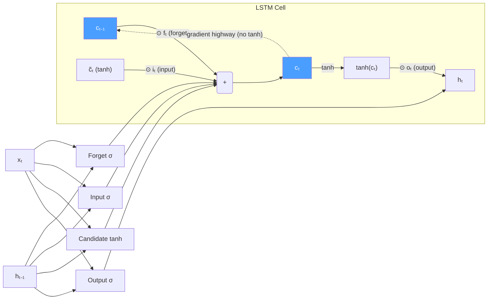

# 🔐 LSTM and GRU

> [!abstract] TL;DR
> LSTMs solve the vanishing gradient problem by introducing a **cell state** — a direct gradient highway across time steps — controlled by three learnable gates (forget, input, output). GRUs simplify this to two gates and no separate cell state, achieving comparable performance with fewer parameters. Both are the workhorse sequence encoders for any task where Transformer overhead is prohibitive.

## Intuition — analogy FIRST

Imagine the hidden state as a whiteboard that gets partially erased and rewritten at every step. In a vanilla RNN, the entire whiteboard is overwritten — old information is lost fast. LSTM gives you a second, protected whiteboard (the cell state) that is much harder to overwrite. Information can flow along it unchanged for hundreds of steps unless a gate explicitly decides to modify it. The gates are learned switches: "keep this fact," "add this new fact," "show this fact to the output."

GRU removes the second whiteboard entirely but makes the single whiteboard's update rule more expressive — a simpler design that usually performs within a few percent of LSTM.

## How It Works

**LSTM equations (Hochreiter & Schmidhuber 1997):**

| Gate/State | Equation | Role |
|-----------|----------|------|
| Forget gate | fₜ = σ(Wf[hₜ₋₁, xₜ] + bf) | What fraction of cₜ₋₁ to keep |
| Input gate | iₜ = σ(Wi[hₜ₋₁, xₜ] + bi) | How much candidate to add |
| Candidate cell | c̃ₜ = tanh(Wc[hₜ₋₁, xₜ] + bc) | Proposed new cell content |
| Cell update | cₜ = fₜ⊙cₜ₋₁ + iₜ⊙c̃ₜ | New long-term memory |
| Output gate | oₜ = σ(Wo[hₜ₋₁, xₜ] + bo) | What to expose to hidden state |
| Hidden state | hₜ = oₜ⊙tanh(cₜ) | Output / next-step input |

σ = sigmoid ∈ (0,1); ⊙ = element-wise multiplication; [hₜ₋₁, xₜ] = concatenation.

**Why gradients don't vanish:**
The cell update cₜ = fₜ⊙cₜ₋₁ + iₜ⊙c̃ₜ is a linear interpolation — no activation function applied directly to cₜ₋₁. Gradient ∂cₜ/∂cₜ₋₁ = fₜ ≈ 1 when the forget gate is open, giving a near-constant gradient highway. This is the key insight.



**GRU equations (Cho et al. 2014):**

| Gate/State | Equation | Role |
|-----------|----------|------|
| Reset gate | rₜ = σ(Wr[hₜ₋₁, xₜ]) | How much past hidden to use in candidate |
| Update gate | zₜ = σ(Wz[hₜ₋₁, xₜ]) | Interpolation between old and new hidden |
| Candidate | h̃ₜ = tanh(Wh[rₜ⊙hₜ₋₁, xₜ]) | Proposed new hidden state |
| Hidden state | hₜ = (1-zₜ)⊙hₜ₋₁ + zₜ⊙h̃ₜ | Output |

GRU merges cell state and hidden state; no separate cₜ. The update gate zₜ plays the role of both forget and input gates simultaneously.

## Key Concepts / Details

**Peephole connections (optional LSTM extension):**
- Gates additionally observe the previous cell state cₜ₋₁: fₜ = σ(Wf[hₜ₋₁, xₜ, cₜ₋₁] + bf)
- Useful for tasks requiring precise timing (e.g., speech recognition with exact duration)
- Rarely used in NLP — marginal improvement rarely justifies added parameters

**Dropout in RNNs:**
- Naive dropout (different mask each step) disrupts the recurrent signal — effectively random noise injection into the hidden state highway
- **Variational dropout (Gal & Ghahramani 2016):** use the **same** dropout mask at every time step within a sequence; apply separately to inputs, recurrent connections, and outputs
- **Zoneout (Krueger et al. 2017):** stochastically carry cell/hidden state forward unchanged rather than zeroing activations — a regularization method specific to LSTMs

**Layer normalization for LSTMs:**
- Apply LayerNorm to the pre-activation of each gate (before σ/tanh)
- Stabilizes training especially for deep stacked LSTMs
- More effective than batch normalization for variable-length sequences

**QRNN — Quasi-RNN (Bradbury et al. 2017):**
- Replace recurrent matrix multiplications with 1D convolutions across time
- Convolution is fully parallelizable; only a minimal pooling step is sequential
- ≈16× faster training than LSTM at comparable quality; important in production when Transformers are too large

**Stacked (multi-layer) LSTM:**
- hₜˡ (layer l output) becomes xₜˡ⁺¹ (layer l+1 input)
- Dropout applied between layers (not within recurrent connections)
- 2–4 layers typical; diminishing returns beyond 4

## Real-World Notes

- LSTMs remain competitive with small Transformers on short sequences (< 100 tokens) and are far faster at inference on edge devices.
- GRU is preferred when parameter budget is tight or training data is limited — fewer parameters reduces overfitting risk.
- In production seq2seq systems (e.g., Google Translate pre-2017), 8-layer stacked bidirectional LSTMs with 1024 hidden units were standard.
- `nn.LSTM` in PyTorch returns `(output, (h_n, c_n))` — forgetting to unpack the cell state `c_n` from the tuple is a common bug.

**PyTorch LSTM sentiment classification:**
```python
import torch
import torch.nn as nn

class LSTMClassifier(nn.Module):
    def __init__(self, vocab_size, embed_dim, hidden_dim, num_classes,
                 num_layers=2, dropout=0.3, bidirectional=True):
        super().__init__()
        self.embed = nn.Embedding(vocab_size, embed_dim, padding_idx=0)
        self.lstm = nn.LSTM(
            embed_dim, hidden_dim, num_layers=num_layers,
            batch_first=True, dropout=dropout,
            bidirectional=bidirectional
        )
        direction = 2 if bidirectional else 1
        self.classifier = nn.Linear(hidden_dim * direction, num_classes)
        self.dropout = nn.Dropout(dropout)

    def forward(self, x, lengths):
        emb = self.dropout(self.embed(x))          # (B, T, E)
        packed = nn.utils.rnn.pack_padded_sequence(
            emb, lengths.cpu(), batch_first=True, enforce_sorted=False)
        _, (h_n, _) = self.lstm(packed)            # h_n: (layers*dirs, B, H)
        # Take last layer, concatenate forward + backward
        h_fwd = h_n[-2]                            # (B, H)
        h_bwd = h_n[-1]                            # (B, H)
        h = torch.cat([h_fwd, h_bwd], dim=-1)      # (B, 2H)
        return self.classifier(self.dropout(h))    # (B, num_classes)
```

**LSTM vs GRU comparison:**

| Property | LSTM | GRU |
|----------|------|-----|
| Gates | 3 (forget, input, output) | 2 (reset, update) |
| States | hₜ + cₜ | hₜ only |
| Parameters (H=256, E=256) | ~1.05M | ~790K |
| Training speed | Slower | ~15–20% faster |
| Long-range dependencies | Excellent | Good |
| When to prefer | Long sequences, complex tasks | Limited data, inference speed |

## Common Pitfalls

- **Forgetting `pack_padded_sequence`:** without packing, LSTM processes padding tokens and contaminates the final hidden state with padding-step outputs.
- **Wrong hidden state for classification:** use `h_n[-1]` (last layer, last time step), not `output[:, -1, :]` when using pack/pad — the latter points to the padding token, not the last real token.
- **Applying dropout inside recurrent connections naively:** use `dropout` parameter in `nn.LSTM` only for inter-layer dropout, not intra-step; for variational dropout use custom implementations.
- **Confusing zₜ semantics in GRU:** zₜ=1 means "use the new candidate entirely, ignore the past"; zₜ=0 means "carry the past forward unchanged" — opposite of what some textbooks imply.
- **Not initializing h₀, c₀ to zeros:** PyTorch does this by default, but if you reuse hidden states across batches (stateful RNN), explicitly reset between independent sequences.

## Related Concepts

- [[RNN_Fundamentals]] — vanilla RNN and the vanishing gradient problem LSTMs solve
- [[Seq2Seq_Encoder_Decoder]] — LSTM as the encoder and decoder in seq2seq architectures
- [[_MOC_Sequence_Models]] — section overview

## Review Questions

1. Trace through one LSTM time step: given xₜ, hₜ₋₁, cₜ₋₁, explain what each gate computes and why the cell update equation provides a gradient highway.
2. What does the forget gate output of exactly 1.0 mean for the cell state? What about exactly 0.0?
3. GRU has no separate cell state — how does the update gate zₜ subsume both the forget and input gates of LSTM?
4. Why is applying the same dropout mask at every time step (variational dropout) better than applying a different mask at each step?
5. Under what conditions would you choose a GRU over an LSTM for a new project?

## Sources

- Hochreiter, S. & Schmidhuber, J. (1997). *Long Short-Term Memory*. Neural Computation, 9(8), 1735–1780.
- Cho, K. et al. (2014). *Learning Phrase Representations using RNN Encoder-Decoder for Statistical Machine Translation*. EMNLP. https://arxiv.org/abs/1406.1078
- Gal, Y. & Ghahramani, Z. (2016). *A Theoretically Grounded Application of Dropout in Recurrent Neural Networks*. NeurIPS.
- Bradbury, J. et al. (2017). *Quasi-Recurrent Neural Networks*. ICLR. https://arxiv.org/abs/1611.01576
- Greff, K. et al. (2017). *LSTM: A Search Space Odyssey*. IEEE TNNLS. (Comprehensive empirical comparison of LSTM variants.)

#nlp #sequence-models #intermediate
